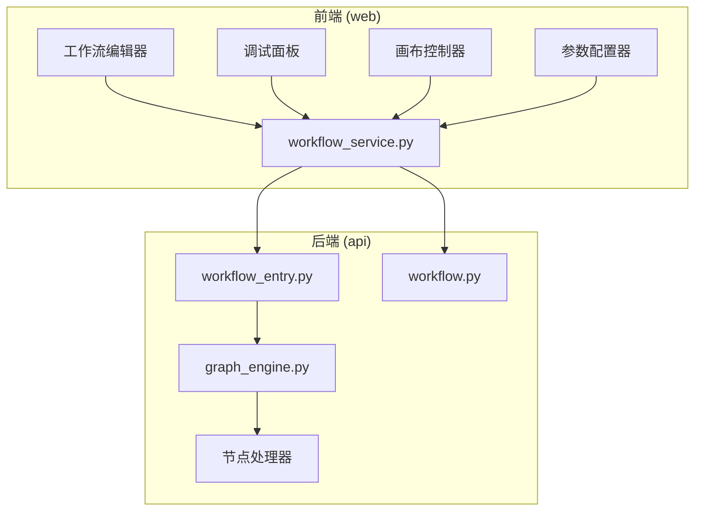
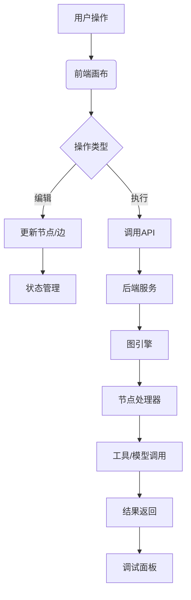
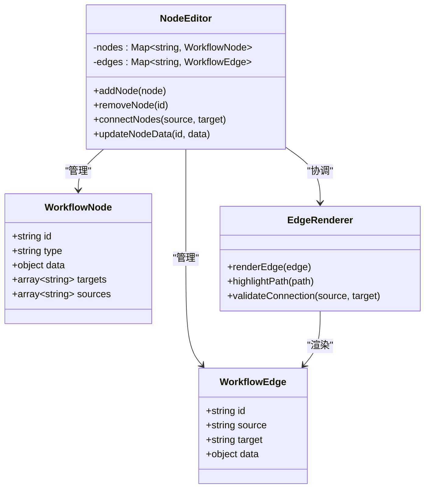
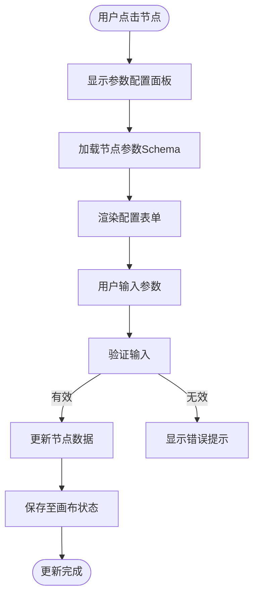
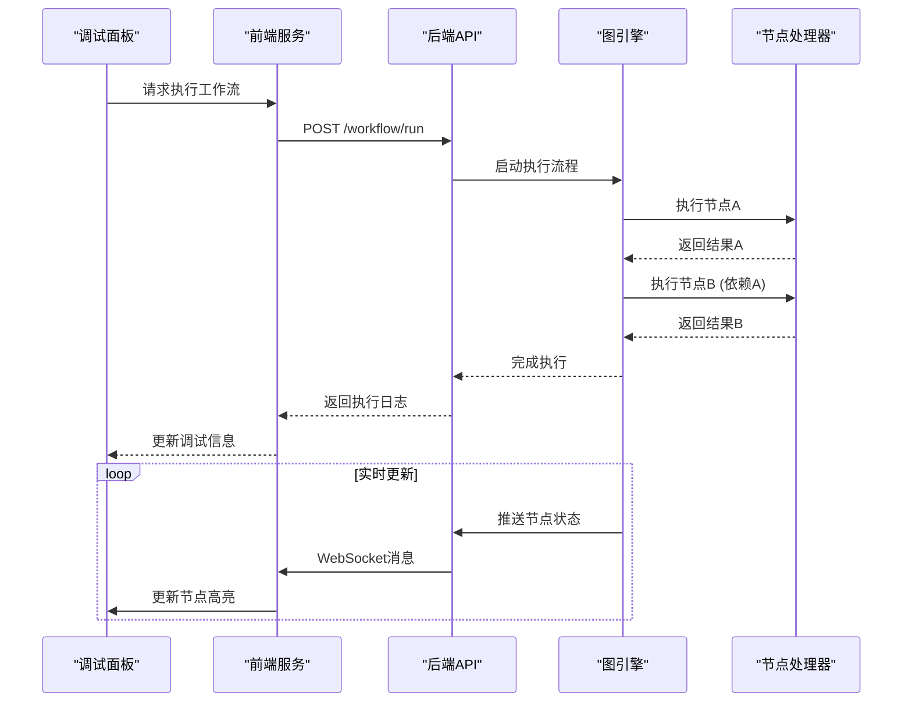
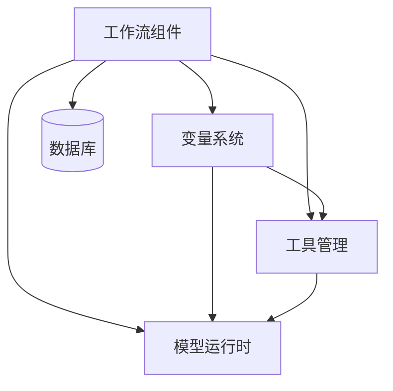

# 工作流组件

<cite>
**本文档引用文件**  
- [workflow_fields.py](file://api/fields/workflow_fields.py)
- [workflow.py](file://api/models/workflow.py)
- [workflow_service.py](file://api/services/workflow_service.py)
- [workflow_run_service.py](file://api/services/workflow_run_service.py)
- [workflow_app_service.py](file://api/services/workflow_app_service.py)
- [workflow_draft_variable_service.py](file://api/services/workflow_draft_variable_service.py)
- [workflow_entry.py](file://api/core/workflow/workflow_entry.py)
- [graph_engine.py](file://api/core/workflow/graph_engine.py)
- [nodes](file://api/core/workflow/nodes)
- [constants.py](file://api/core/workflow/constants.py)
- [enums.py](file://api/core/workflow/enums.py)
- [workflow_type_encoder.py](file://api/core/workflow/workflow_type_encoder.py)
- [variable_loader.py](file://api/core/workflow/variable_loader.py)
- [system_variable.py](file://api/core/workflow/system_variable.py)
- [conversation_variable_updater.py](file://api/core/workflow/conversation_variable_updater.py)
- [workflow_cycle_manager.py](file://api/core/workflow/workflow_cycle_manager.py)
- [use-workflow.ts](file://web/service/use-workflow.ts)
- [workflow.ts](file://web/service/workflow.ts)
- [types.ts](file://web/types/workflow.ts)
- [debug.ts](file://web/models/debug.ts)
- [app.ts](file://web/models/app.ts)
- [context.ts](file://web/utils/context.ts)
- [var.ts](file://web/utils/var.ts)
</cite>

## 目录
1. [引言](#引言)
2. [项目结构](#项目结构)
3. [核心组件](#核心组件)
4. [架构概览](#架构概览)
5. [详细组件分析](#详细组件分析)
6. [依赖分析](#依赖分析)
7. [性能考量](#性能考量)
8. [故障排除指南](#故障排除指南)
9. [结论](#结论)

## 引言
Dify 的工作流复合组件为构建可视化、可配置的 AI 应用流程提供了强大支持。本文档深入解析其节点编辑器、边渲染器、画布控制器、参数配置器和调试面板等核心复合组件的架构设计、状态管理、数据流模式及通信机制，旨在为开发者提供全面的技术参考。

## 项目结构
Dify 的工作流功能主要分布在 `api/core/workflow` 后端模块和 `web/service` 前端服务中。后端负责工作流的执行、状态管理和数据持久化，而前端则提供用户交互界面和实时调试能力。

**Diagram sources**
- [use-workflow.ts](file://web/service/use-workflow.ts)
- [workflow_service.py](file://api/services/workflow_service.py)
- [workflow_entry.py](file://api/core/workflow/workflow_entry.py)
- [graph_engine.py](file://api/core/workflow/graph_engine.py)

**Section sources**
- [use-workflow.ts](file://web/service/use-workflow.ts)
- [workflow_service.py](file://api/services/workflow_service.py)
- [workflow_entry.py](file://api/core/workflow/workflow_entry.py)

## 核心组件
工作流的核心组件包括节点编辑器（Node Editor）、边渲染器（Edge Renderer）、画布控制器（Canvas Controller）、参数配置器（Parameter Configurator）和调试面板（Debug Panel）。这些组件协同工作，实现复杂 AI 流程的可视化编排。

**Section sources**
- [workflow_fields.py](file://api/fields/workflow_fields.py)
- [types.ts](file://web/types/workflow.ts)
- [app.ts](file://web/models/app.ts)

## 架构概览
Dify 工作流采用前后端分离架构。前端通过 React 构建交互式画布，利用状态管理库（如 Zustand 或 Context API）维护画布状态。后端采用 Python Flask 框架，通过有向无环图（DAG）引擎解析和执行工作流。

**Diagram sources**
- [workflow_entry.py](file://api/core/workflow/workflow_entry.py)
- [graph_engine.py](file://api/core/workflow/graph_engine.py)
- [nodes](file://api/core/workflow/nodes)
- [debug.ts](file://web/models/debug.ts)

## 详细组件分析

### 节点编辑器与边渲染器分析
节点编辑器允许用户拖拽、放置和连接节点。边渲染器负责可视化节点间的依赖关系。它们共同构成了工作流的图形化界面。

#### 对象关系图

**Diagram sources**
- [workflow_fields.py](file://api/fields/workflow_fields.py)
- [types.ts](file://web/types/workflow.ts)
- [context.ts](file://web/utils/context.ts)

**Section sources**
- [workflow_fields.py](file://api/fields/workflow_fields.py)
- [types.ts](file://web/types/workflow.ts)

### 画布控制与参数配置器分析
画布控制器处理缩放、平移和选择等交互。参数配置器则提供表单界面，用于配置节点的具体参数。

#### 交互流程图

**Diagram sources**
- [var.ts](file://web/utils/var.ts)
- [workflow_fields.py](file://api/fields/workflow_fields.py)
- [types.ts](file://web/types/workflow.ts)

**Section sources**
- [var.ts](file://web/utils/var.ts)
- [workflow_fields.py](file://api/fields/workflow_fields.py)

### 调试面板分析
调试面板是工作流执行过程中的关键监控工具，它实时展示节点执行状态、输入输出和日志信息。

#### 执行序列图

**Diagram sources**
- [workflow_run_service.py](file://api/services/workflow_run_service.py)
- [workflow_entry.py](file://api/core/workflow/workflow_entry.py)
- [graph_engine.py](file://api/core/workflow/graph_engine.py)
- [debug.ts](file://web/models/debug.ts)

**Section sources**
- [workflow_run_service.py](file://api/services/workflow_run_service.py)
- [debug.ts](file://web/models/debug.ts)

## 依赖分析
工作流组件依赖于 Dify 的核心服务，包括模型运行时、工具管理、变量系统和持久化层。

**Diagram sources**
- [workflow_service.py](file://api/services/workflow_service.py)
- [workflow_entry.py](file://api/core/workflow/workflow_entry.py)
- [variable_loader.py](file://api/core/workflow/variable_loader.py)
- [nodes](file://api/core/workflow/nodes)

**Section sources**
- [workflow_service.py](file://api/services/workflow_service.py)
- [variable_loader.py](file://api/core/workflow/variable_loader.py)

## 性能考量
为确保工作流的高效运行，需关注以下性能优化点：
- **图形渲染优化**：对大型工作流采用虚拟滚动和懒加载技术。
- **状态批处理**：将频繁的画布状态更新合并为批次操作。
- **内存泄漏预防**：在组件卸载时及时清理事件监听器和定时器。
- **执行效率**：利用图引擎的并行执行能力，优化节点调度。

## 故障排除指南
- **节点连接失败**：检查节点类型是否兼容，确认边的源和目标是否有效。
- **参数配置不生效**：验证参数 Schema 定义，确保数据类型匹配。
- **执行卡住**：查看调试面板日志，检查是否有节点抛出异常或超时。
- **状态不同步**：确认前后端状态同步机制，检查 WebSocket 连接。

**Section sources**
- [errors.py](file://api/core/workflow/errors.py)
- [workflow_cycle_manager.py](file://api/core/workflow/workflow_cycle_manager.py)
- [debug.ts](file://web/models/debug.ts)

## 结论
Dify 的工作流复合组件通过精心设计的架构和清晰的通信机制，实现了高度可配置和可扩展的 AI 应用编排能力。理解其内部原理有助于开发者更高效地构建和调试复杂的工作流应用。