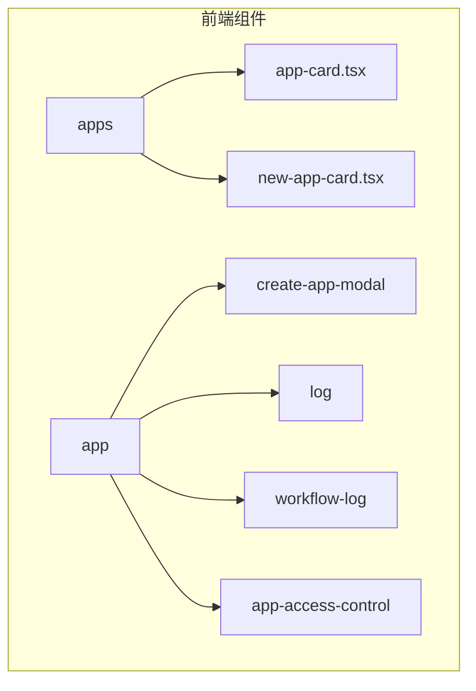
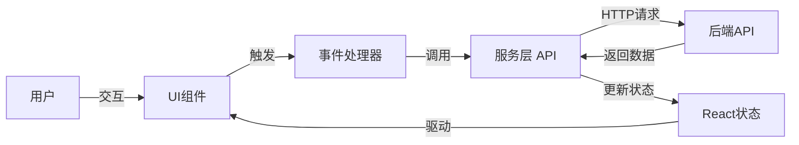
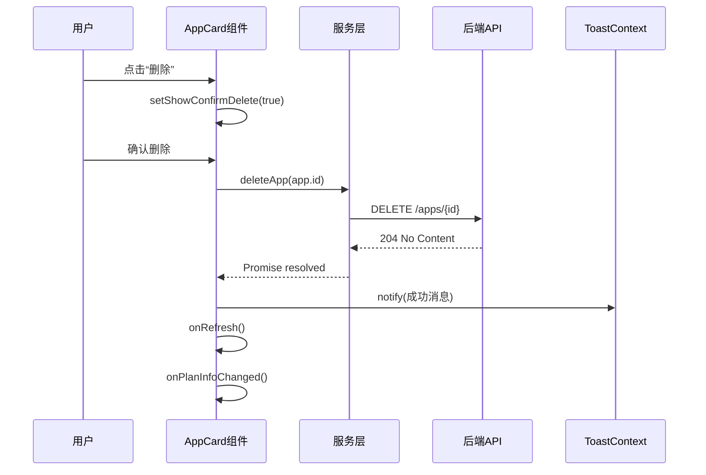
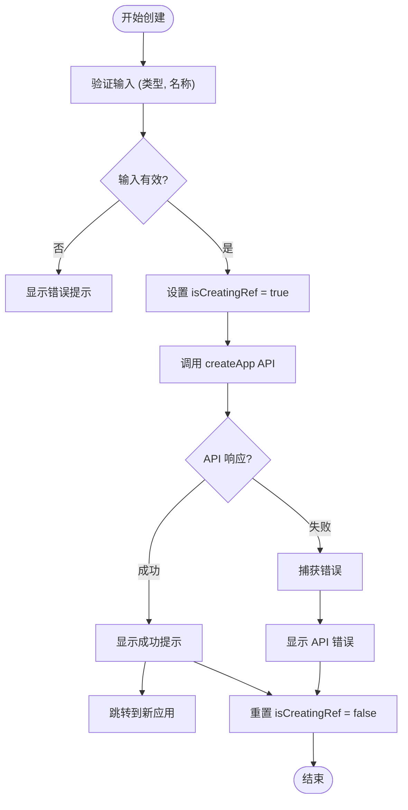
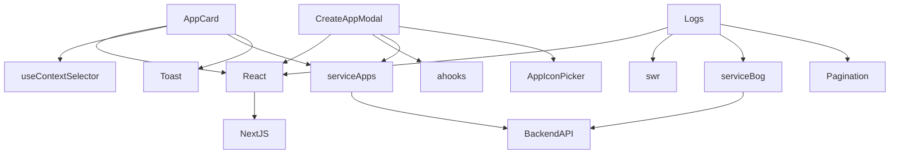

# 应用组件

<cite>
**本文档中引用的文件**  
- [app-card.tsx](file://web/app/components/apps/app-card.tsx)
- [create-app-modal/index.tsx](file://web/app/components/app/create-app-modal/index.tsx)
- [log/index.tsx](file://web/app/components/app/log/index.tsx)
- [workflow-log/index.tsx](file://web/app/components/app/workflow-log/index.tsx)
</cite>

## 目录
1. [简介](#简介)
2. [项目结构](#项目结构)
3. [核心组件](#核心组件)
4. [架构概述](#架构概述)
5. [详细组件分析](#详细组件分析)
6. [依赖分析](#依赖分析)
7. [性能考虑](#性能考虑)
8. [故障排除指南](#故障排除指南)
9. [结论](#结论)

## 简介
本文档旨在深入解析 Dify 应用中的复合组件，重点涵盖应用卡片、创建应用模态框、应用日志和工作流日志等关键 UI 组件。文档将详细阐述这些组件的架构设计、状态管理策略、数据流模式以及组件间的通信机制。同时，还将探讨其可配置性、可扩展性和插件化设计，并提供性能优化建议。

## 项目结构
Dify 项目的前端组件主要位于 `web/app/components` 目录下，采用模块化和功能划分的组织方式。核心应用相关组件被组织在 `apps`、`app` 等子目录中，遵循清晰的命名规范和职责分离原则。

**图源**
- [app-card.tsx](file://web/app/components/apps/app-card.tsx)
- [create-app-modal/index.tsx](file://web/app/components/app/create-app-modal/index.tsx)
- [log/index.tsx](file://web/app/components/app/log/index.tsx)
- [workflow-log/index.tsx](file://web/app/components/app/workflow-log/index.tsx)

**本节来源**
- [web/app/components](file://web/app/components)

## 核心组件
本文档的核心是分析 Dify 应用中的四个关键复合组件：应用卡片（App Card）、创建应用模态框（Create App Modal）、应用日志（App Logs）和工作流日志（Workflow Logs）。这些组件共同构成了用户管理、创建和监控应用的核心界面。

**本节来源**
- [app-card.tsx](file://web/app/components/apps/app-card.tsx#L1-L487)
- [create-app-modal/index.tsx](file://web/app/components/app/create-app-modal/index.tsx#L1-L374)
- [log/index.tsx](file://web/app/components/app/log/index.tsx#L1-L131)

## 架构概述
Dify 的前端应用采用 React 框架，结合 Next.js 进行服务端渲染和路由管理。复合组件的设计遵循了现代前端架构的最佳实践，包括：
- **组件化**：将 UI 拆分为独立、可复用的组件。
- **状态管理**：利用 React 的 `useState`、`useContext` 和 `useSWR` 进行本地和全局状态管理。
- **数据获取**：通过 `useSWR` 实现数据的高效获取、缓存和同步。
- **异步操作**：使用 `async/await` 处理 API 调用和用户交互。

**图源**
- [app-card.tsx](file://web/app/components/apps/app-card.tsx#L1-L487)
- [service/apps.ts](file://web/service/apps.ts)
- [service/log.ts](file://web/service/log.ts)

## 详细组件分析

### 应用卡片组件分析
`AppCard` 组件是应用列表中的核心展示单元，负责渲染单个应用的信息并提供一系列操作。

#### 架构设计与状态管理
该组件是一个典型的“容器组件”，它封装了自身的状态（如 `showEditModal`、`showDuplicateModal`）和业务逻辑。它通过 `useContext` 和自定义 Hook（如 `useAppContext`）与全局状态进行交互，并通过 `onRefresh` 回调函数与父组件通信，实现数据的同步更新。

#### 数据流与事件传播
数据流始于父组件传递的 `app` 对象。当用户点击“编辑”、“复制”或“删除”等操作时，组件内部的事件处理器（如 `onEdit`, `onCopy`, `onConfirmDelete`）会被触发。这些处理器会调用来自 `@/service/apps` 的 API 函数（如 `updateAppInfo`, `copyApp`, `deleteApp`）。操作成功后，通过 `notify` 显示 Toast 提示，并调用 `onRefresh` 回调通知父组件刷新列表。

**图源**
- [app-card.tsx](file://web/app/components/apps/app-card.tsx#L1-L487)

**本节来源**
- [app-card.tsx](file://web/app/components/apps/app-card.tsx#L1-L487)

### 创建应用模态框分析
`CreateAppModal` 组件提供了一个全屏的界面，用于创建新的应用。

#### 可配置性与插件化设计
该组件通过 `AppTypeCard` 子组件实现了应用类型的可配置选择。每个类型卡片都包含图标、标题和描述，其激活状态由 `appMode` 状态控制。这种设计易于扩展，只需添加新的 `AppTypeCard` 实例即可支持新的应用类型。`AppIconPicker` 组件则作为一个独立的插件化模块，负责处理应用图标的选取。

#### 错误处理方案
组件内置了完善的错误处理机制。在创建应用前，会进行前端验证（检查应用类型和名称是否为空）。创建过程中，`createApp` API 调用被包裹在 `try...catch` 块中。如果 API 调用失败，错误信息会通过 `notify` 显示给用户。此外，还通过 `isCreatingRef` 防止了重复提交。

**图源**
- [create-app-modal/index.tsx](file://web/app/components/app/create-app-modal/index.tsx#L1-L374)

**本节来源**
- [create-app-modal/index.tsx](file://web/app/components/app/create-app-modal/index.tsx#L1-L374)

### 应用日志组件分析
`Logs` 组件负责展示和管理特定应用的用户交互日志。

#### 数据流模式
该组件的数据流模式非常清晰。它首先根据 `appDetail.mode` 判断应用类型（聊天或补全），然后使用 `useSWR` Hook 根据当前的查询参数（`queryParams`）动态地发起数据请求。对于聊天应用，调用 `fetchChatConversations`；对于补全应用，则调用 `fetchCompletionConversations`。`debouncedQueryParams` 确保了在用户快速输入搜索关键词时不会频繁触发 API 调用。

#### 性能优化
- **防抖 (Debounce)**：`useDebounce` Hook 用于延迟查询参数的更新，避免了不必要的网络请求。
- **条件数据获取**：`useSWR` 的 key 是一个函数，只有当 `isChatMode` 为真时，才会返回有效的请求配置，从而阻止了无效请求的发送。
- **分页 (Pagination)**：通过 `currPage` 和 `limit` 状态实现了数据的分页加载，有效管理了大量日志数据。

**本节来源**
- [log/index.tsx](file://web/app/components/app/log/index.tsx#L1-L131)

## 依赖分析
这些复合组件依赖于多个外部库和内部模块：
- **UI 库**：`@remixicon/react` 提供图标，`ahooks` 提供 `useDebounceFn` 和 `useKeyPress` 等实用 Hook。
- **状态与数据**：`use-context-selector` 和 `swr` 是核心的状态和数据管理库。
- **内部服务**：`@/service/apps` 和 `@/service/log` 提供了与后端 API 通信的接口。
- **上下文**：`@/context/app-context` 和 `@/context/provider-context` 提供了全局的应用和提供商信息。

**图源**
- [package.json](file://package.json)
- [app-card.tsx](file://web/app/components/apps/app-card.tsx)
- [create-app-modal/index.tsx](file://web/app/components/app/create-app-modal/index.tsx)
- [log/index.tsx](file://web/app/components/app/log/index.tsx)

**本节来源**
- [package.json](file://package.json)
- [web/service](file://web/service)

## 性能考虑
为了确保应用的流畅性，这些组件采用了多种性能优化策略：
- **懒加载 (Lazy Loading)**：通过 `next/dynamic` 动态导入模态框组件（如 `EditAppModal`, `DuplicateAppModal`），减少了初始页面的加载体积。
- **代码分割 (Code Splitting)**：Next.js 的路由和动态导入机制天然支持代码分割，将不同功能的代码打包到不同的 chunk 中。
- **内存管理**：`useSWR` 内置了缓存机制，避免了重复的网络请求。同时，合理使用 `useCallback` 和 `useMemo` 可以防止不必要的组件重渲染。

## 故障排除指南
- **应用卡片操作无响应**：检查 `onRefresh` 回调是否正确传递，以及 API 服务是否正常运行。
- **创建应用模态框无法提交**：确认 `isAppsFull` 状态是否为真（达到配额限制），并检查网络请求是否被阻止。
- **日志列表为空或加载失败**：验证 `appDetail.id` 是否正确传递，检查 `useSWR` 的 key 是否生成了有效的请求配置，并确认后端日志服务是否可用。

**本节来源**
- [app-card.tsx](file://web/app/components/apps/app-card.tsx#L1-L487)
- [create-app-modal/index.tsx](file://web/app/components/app/create-app-modal/index.tsx#L1-L374)
- [log/index.tsx](file://web/app/components/app/log/index.tsx#L1-L131)

## 结论
Dify 的应用复合组件展现了高度的模块化和可维护性。通过清晰的架构设计、合理的状态管理、高效的数据流以及对性能的细致优化，这些组件为用户提供了一个强大且流畅的应用管理体验。其可扩展的设计也为未来功能的添加奠定了坚实的基础。