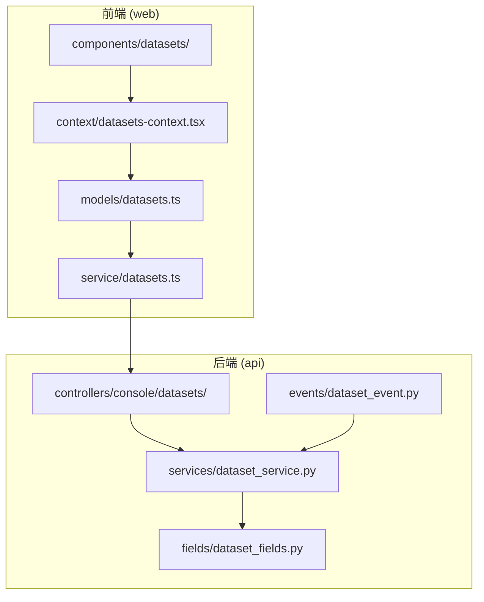
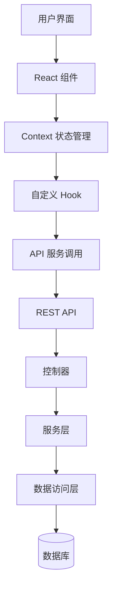
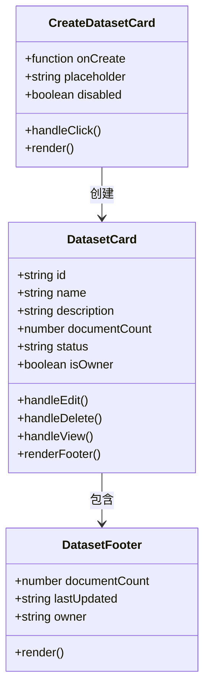
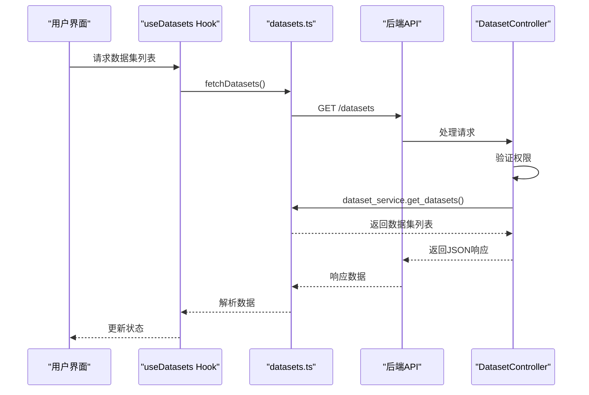
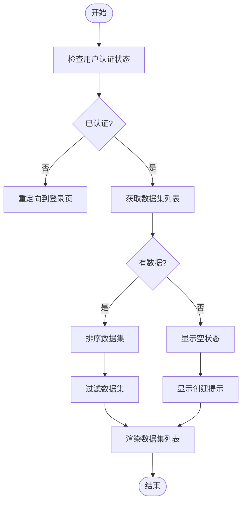
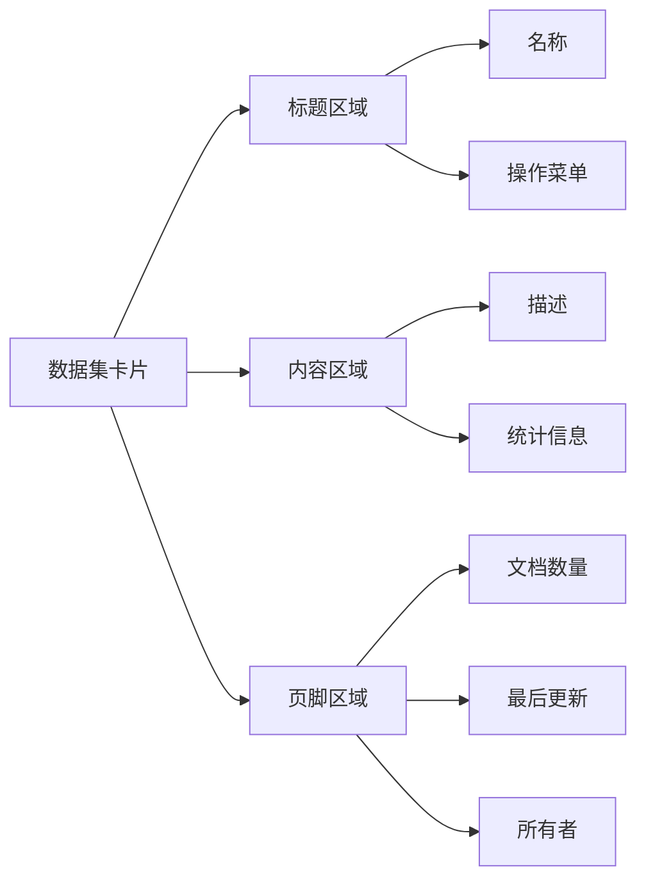
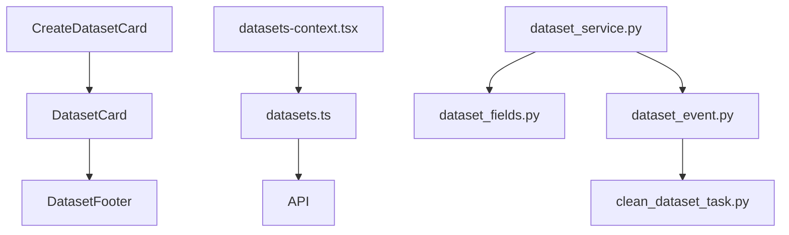

# 数据集组件

<cite>
**本文档引用的文件**  
- [datasets.ts](file://web/models/datasets.ts)
- [dataset-detail.ts](file://web/context/dataset-detail.ts)
- [datasets-context.tsx](file://web/context/datasets-context.tsx)
- [datasets.tsx](file://web/service/datasets.ts)
- [document-list-sorting.test.tsx](file://web/__tests__/document-list-sorting.test.tsx)
- [document-detail-navigation-fix.test.tsx](file://web/__tests__/document-detail-navigation-fix.test.tsx)
- [navigation.ts](file://web/utils/navigation.ts)
- [dataset_fields.py](file://api/fields/dataset_fields.py)
- [dataset_service.py](file://api/services/dataset_service.py)
- [dataset_event.py](file://api/events/dataset_event.py)
</cite>

## 目录
1. [简介](#简介)
2. [项目结构](#项目结构)
3. [核心组件](#核心组件)
4. [架构概述](#架构概述)
5. [详细组件分析](#详细组件分析)
6. [依赖分析](#依赖分析)
7. [性能考虑](#性能考虑)
8. [故障排除指南](#故障排除指南)
9. [结论](#结论)

## 简介
本文档详细介绍了 Dify 平台中数据集复合组件的设计与实现。重点涵盖数据集卡片、新建数据集卡片、数据集页脚等复合组件的架构设计、状态管理策略和数据流模式。文档还阐述了组件间的通信机制、事件传播方式以及错误处理方案，并探讨了组件的可配置性、可扩展性和插件化设计。通过实际代码示例展示关键复合组件的实现逻辑，包括交互行为和导航修复机制。最后提供性能优化建议，如列表虚拟滚动、数据缓存和异步加载策略。

## 项目结构
Dify 的数据集相关功能分布在前后端多个模块中，前端主要位于 `web` 目录下的 `models`、`context`、`service` 和 `components` 子目录，后端则集中在 `api/controllers/console/datasets` 和 `api/services` 目录下。整体结构体现了前后端分离的设计理念，前端负责 UI 展示和用户交互，后端提供 RESTful API 支持数据操作。

**图示来源**  
- [datasets.ts](file://web/models/datasets.ts)
- [datasets-context.tsx](file://web/context/datasets-context.tsx)
- [datasets.ts](file://web/service/datasets.ts)
- [dataset_service.py](file://api/services/dataset_service.py)
- [dataset_fields.py](file://api/fields/dataset_fields.py)
- [dataset_event.py](file://api/events/dataset_event.py)

**本节来源**  
- [datasets.ts](file://web/models/datasets.ts)
- [dataset_service.py](file://api/services/dataset_service.py)

## 核心组件
数据集复合组件主要包括数据集卡片（Dataset Card）、新建数据集卡片（Create Dataset Card）和数据集页脚（Dataset Footer）三大核心部分。这些组件共同构成了数据集管理界面的主要交互区域，支持用户浏览、创建、编辑和删除数据集。

**本节来源**  
- [datasets.ts](file://web/models/datasets.ts)
- [datasets-context.tsx](file://web/context/datasets-context.tsx)

## 架构概述
Dify 数据集组件采用分层架构设计，前端基于 React 框架构建，使用 Context API 进行状态管理，通过自定义 Hook 封装业务逻辑。后端采用 Python Flask 框架，遵循 MVC 模式组织代码。前后端通过 REST API 进行通信，数据格式为 JSON。事件系统用于解耦组件间通信，提高系统的可维护性和可测试性。

**图示来源**  
- [datasets-context.tsx](file://web/context/datasets-context.tsx)
- [datasets.ts](file://web/service/datasets.ts)
- [dataset_service.py](file://api/services/dataset_service.py)

## 详细组件分析
对数据集复合组件进行深入分析，涵盖其设计模式、状态管理机制和数据流控制。

### 数据集卡片分析
数据集卡片是展示单个数据集信息的核心 UI 组件，包含名称、描述、文档数量、状态等关键信息，并提供操作入口。

#### 对象导向组件

**图示来源**  
- [datasets.ts](file://web/models/datasets.ts)
- [dataset-detail.ts](file://web/context/dataset-detail.ts)

#### API/服务组件

**图示来源**  
- [datasets-context.tsx](file://web/context/datasets-context.tsx)
- [datasets.ts](file://web/service/datasets.ts)
- [dataset_service.py](file://api/services/dataset_service.py)

#### 复杂逻辑组件

**图示来源**  
- [datasets-context.tsx](file://web/context/datasets-context.tsx)
- [datasets.ts](file://web/service/datasets.ts)

**本节来源**  
- [datasets.ts](file://web/models/datasets.ts)
- [datasets-context.tsx](file://web/context/datasets-context.tsx)
- [datasets.ts](file://web/service/datasets.ts)

### 概念概述
数据集组件的设计遵循模块化和可复用原则，通过组合小型、单一职责的组件构建复杂的用户界面。这种设计提高了代码的可维护性和可测试性，同时也便于团队协作开发。

## 依赖分析
分析数据集组件之间的依赖关系及其与系统其他部分的交互。

**图示来源**  
- [datasets.ts](file://web/models/datasets.ts)
- [datasets-context.tsx](file://web/context/datasets-context.tsx)
- [dataset_service.py](file://api/services/dataset_service.py)
- [dataset_fields.py](file://api/fields/dataset_fields.py)
- [dataset_event.py](file://api/events/dataset_event.py)

**本节来源**  
- [dataset_service.py](file://api/services/dataset_service.py)
- [dataset_fields.py](file://api/fields/dataset_fields.py)
- [dataset_event.py](file://api/events/dataset_event.py)

## 性能考虑
为提升用户体验，数据集组件采用了多种性能优化策略。前端实现列表虚拟滚动以减少 DOM 节点数量，使用 React.memo 进行组件记忆化避免不必要的重渲染。数据缓存通过 SWR 或类似机制实现，减少重复 API 调用。关键数据采用异步加载，配合骨架屏提升感知性能。后端通过数据库索引优化查询性能，并对频繁访问的数据实施缓存策略。

## 故障排除指南
当数据集组件出现异常时，可按照以下步骤进行排查：首先检查网络请求是否正常，确认 API 返回数据格式正确；其次验证前端状态管理是否同步更新；然后检查权限配置是否正确；最后查看日志文件定位具体错误。常见问题包括数据未及时刷新、权限不足提示不明确、创建数据集失败等。

**本节来源**  
- [dataset_service.py](file://api/services/dataset_service.py)
- [datasets-context.tsx](file://web/context/datasets-context.tsx)

## 结论
Dify 数据集复合组件通过精心设计的架构和合理的技术选型，实现了高效、稳定且易于扩展的数据集管理功能。组件化设计提高了代码复用率和可维护性，分层架构确保了系统的清晰边界和良好解耦。未来可通过引入更智能的搜索排序算法、增强数据可视化能力等方式进一步提升用户体验。