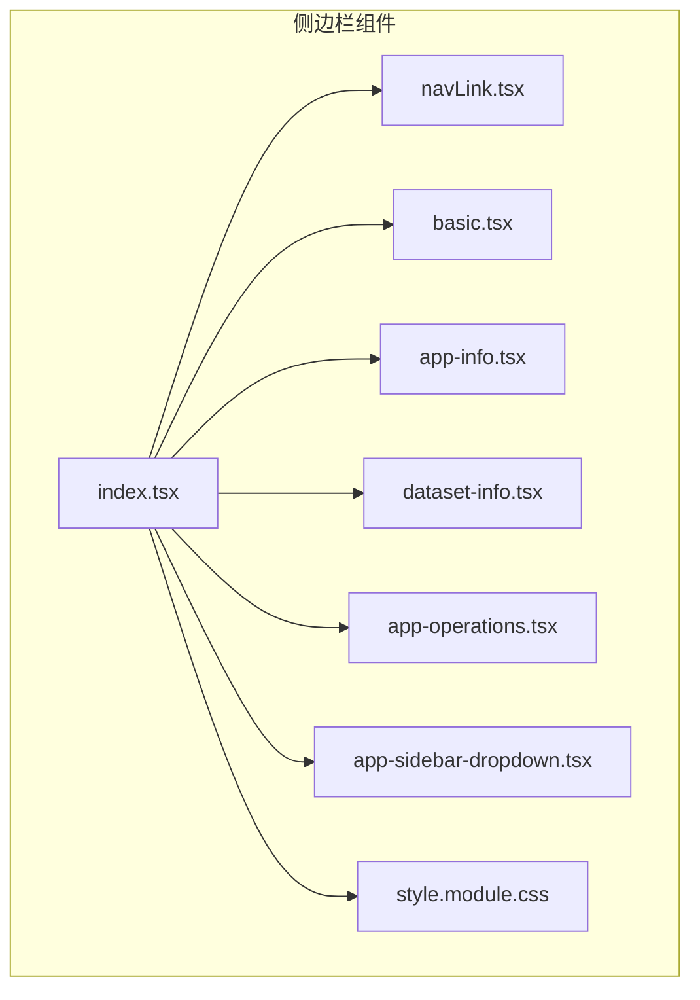
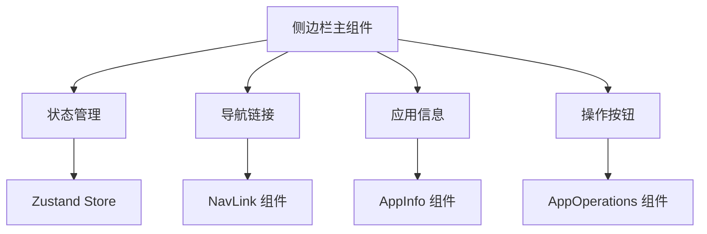
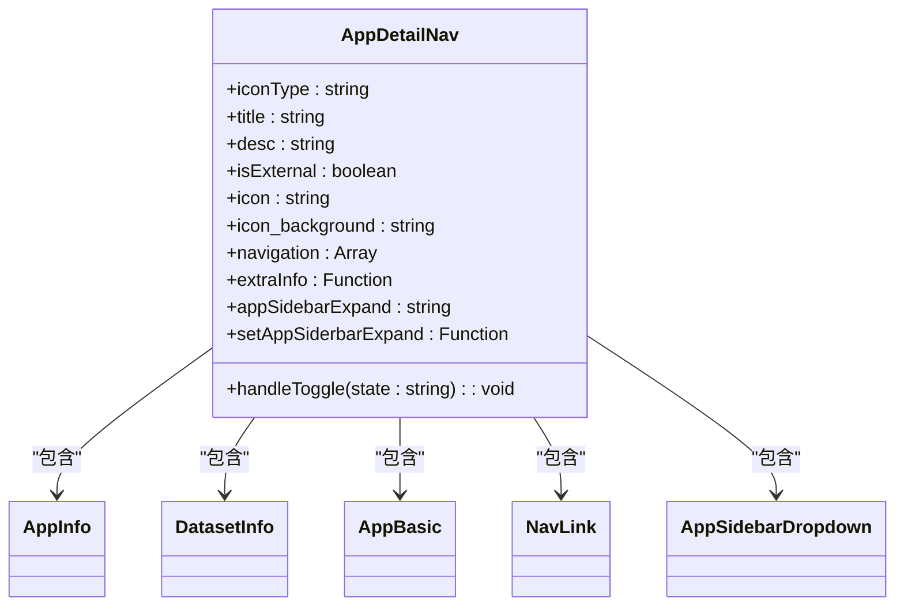
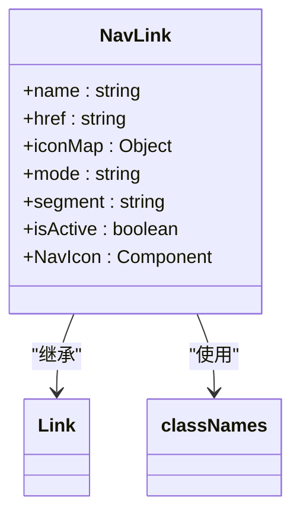
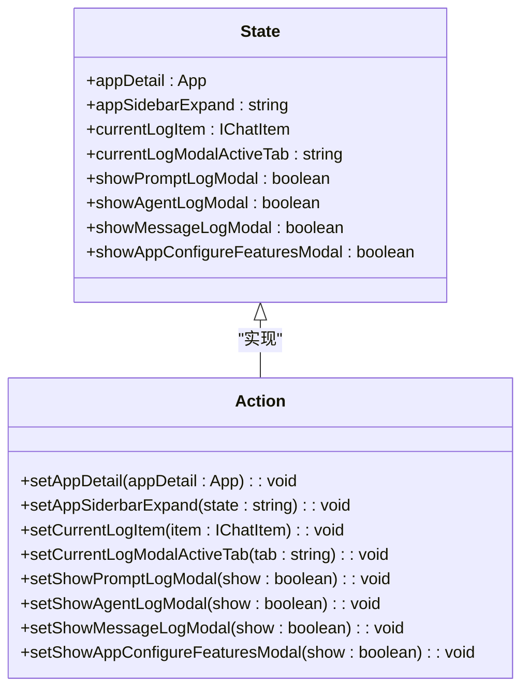
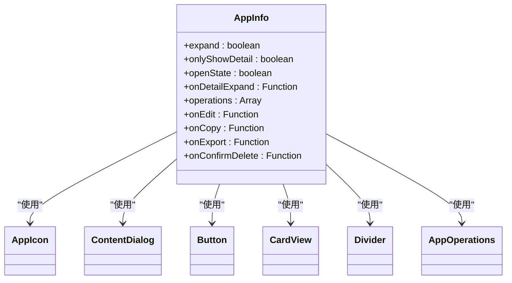
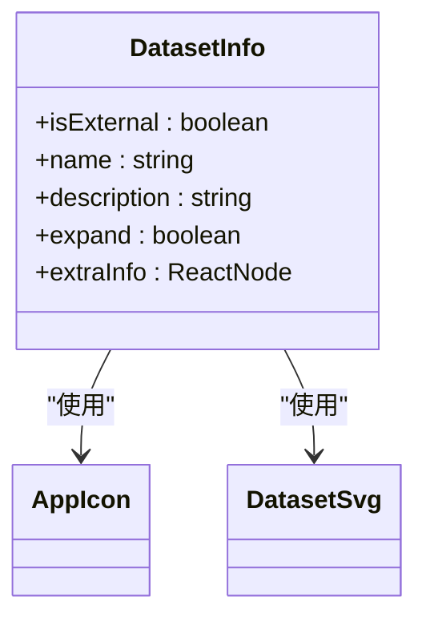
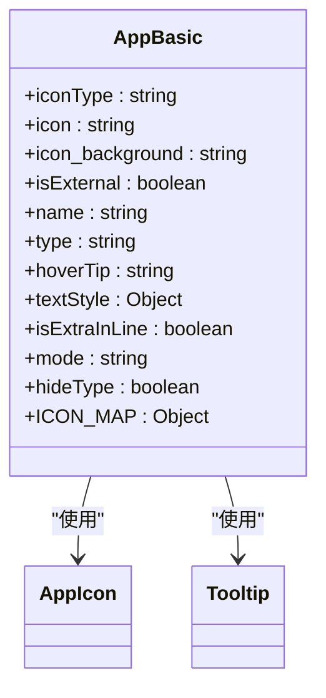
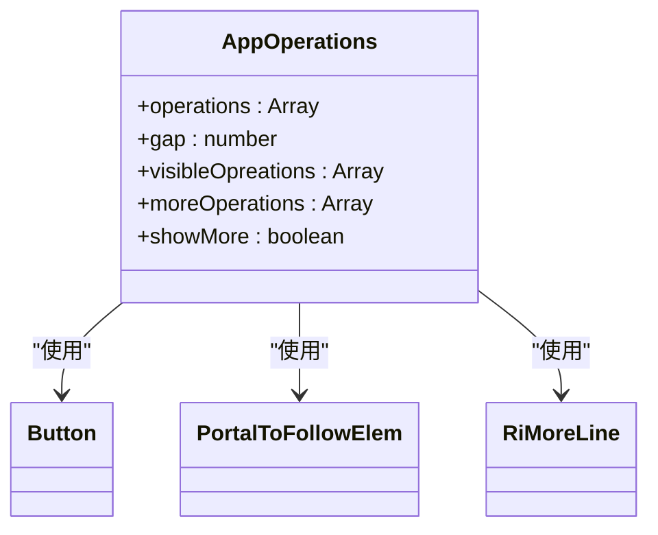
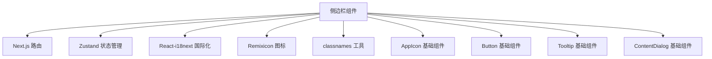

# 侧边栏组件

<cite>
**本文档中引用的文件**  
- [index.tsx](file://web/app/components/app-sidebar/index.tsx)
- [navLink.tsx](file://web/app/components/app-sidebar/navLink.tsx)
- [store.ts](file://web/app/components/app/store.ts)
- [basic.tsx](file://web/app/components/app-sidebar/basic.tsx)
- [app-info.tsx](file://web/app/components/app-sidebar/app-info.tsx)
- [dataset-info.tsx](file://web/app/components/app-sidebar/dataset-info.tsx)
- [app-operations.tsx](file://web/app/components/app-sidebar/app-operations.tsx)
</cite>

## 目录
1. [简介](#简介)
2. [项目结构](#项目结构)
3. [核心组件](#核心组件)
4. [架构概述](#架构概述)
5. [详细组件分析](#详细组件分析)
6. [依赖分析](#依赖分析)
7. [性能考虑](#性能考虑)
8. [故障排除指南](#故障排除指南)
9. [结论](#结论)

## 简介
Dify 侧边栏组件是应用界面的核心导航结构，提供应用列表、数据集导航和工作区切换功能。该组件支持多级菜单结构，具备状态管理、动态内容更新和实时集成能力。侧边栏通过响应式设计适配不同应用场景，如控制台和探索模式，并支持自定义主题、动画效果和拖拽排序功能。

## 项目结构
侧边栏组件位于 `web/app/components/app-sidebar` 目录下，包含多个子组件和状态管理文件。组件采用模块化设计，各功能分离清晰。

**图示来源**  
- [index.tsx](file://web/app/components/app-sidebar/index.tsx)
- [navLink.tsx](file://web/app/components/app-sidebar/navLink.tsx)

**本节来源**  
- [index.tsx](file://web/app/components/app-sidebar/index.tsx)

## 核心组件
侧边栏的核心功能由多个组件协同实现，包括主容器、导航链接、应用信息展示和操作按钮。状态管理通过 Zustand 实现，确保组件间的高效通信和状态同步。

**本节来源**  
- [index.tsx](file://web/app/components/app-sidebar/index.tsx)
- [store.ts](file://web/app/components/app/store.ts)

## 架构概述
侧边栏采用分层架构设计，包含展示层、逻辑层和状态管理层。组件通过 Next.js 的路由系统实现动态导航，利用事件订阅机制响应应用状态变化。

**图示来源**  
- [index.tsx](file://web/app/components/app-sidebar/index.tsx)
- [store.ts](file://web/app/components/app/store.ts)

## 详细组件分析

### 主侧边栏组件分析
`AppDetailNav` 组件是侧边栏的主容器，负责整体布局和状态控制。它根据屏幕尺寸和用户操作动态调整展开/折叠状态，并处理工作流画布的特殊显示模式。

**图示来源**  
- [index.tsx](file://web/app/components/app-sidebar/index.tsx)

**本节来源**  
- [index.tsx](file://web/app/components/app-sidebar/index.tsx)

### 导航链接组件分析
`NavLink` 组件实现侧边栏的导航功能，支持图标和文本的动态显示。在折叠模式下仅显示图标，在展开模式下同时显示图标和文本。

**图示来源**  
- [navLink.tsx](file://web/app/components/app-sidebar/navLink.tsx)

**本节来源**  
- [navLink.tsx](file://web/app/components/app-sidebar/navLink.tsx)

### 状态管理分析
侧边栏的状态管理通过 `zustand` 实现，`useStore` 提供了应用详情和侧边栏展开状态的全局管理。

**图示来源**  
- [store.ts](file://web/app/components/app/store.ts)

**本节来源**  
- [store.ts](file://web/app/components/app/store.ts)

### 应用信息组件分析
`AppInfo` 组件展示应用的详细信息，包括图标、名称、描述和操作按钮。支持编辑、复制、导出和删除等操作。

**图示来源**  
- [app-info.tsx](file://web/app/components/app-sidebar/app-info.tsx)

**本节来源**  
- [app-info.tsx](file://web/app/components/app-sidebar/app-info.tsx)

### 数据集信息组件分析
`DatasetInfo` 组件专门用于展示数据集相关信息，包括名称、类型和描述。支持外部数据集和本地文档的区分显示。

**图示来源**  
- [dataset-info.tsx](file://web/app/components/app-sidebar/dataset-info.tsx)

**本节来源**  
- [dataset-info.tsx](file://web/app/components/app-sidebar/dataset-info.tsx)

### 基础应用组件分析
`AppBasic` 组件提供应用的基本信息展示，支持多种图标类型，包括应用、API、数据集、Web应用和Notion集成。

**图示来源**  
- [basic.tsx](file://web/app/components/app-sidebar/basic.tsx)

**本节来源**  
- [basic.tsx](file://web/app/components/app-sidebar/basic.tsx)

### 操作按钮组件分析
`AppOperations` 组件管理应用的可执行操作，支持响应式布局，在空间不足时自动将操作项移至"更多"下拉菜单。

**图示来源**  
- [app-operations.tsx](file://web/app/components/app-sidebar/app-operations.tsx)

**本节来源**  
- [app-operations.tsx](file://web/app/components/app-sidebar/app-operations.tsx)

## 依赖分析
侧边栏组件依赖多个外部库和内部模块，形成清晰的依赖关系网络。

**图示来源**  
- [index.tsx](file://web/app/components/app-sidebar/index.tsx)
- [navLink.tsx](file://web/app/components/app-sidebar/navLink.tsx)
- [basic.tsx](file://web/app/components/app-sidebar/basic.tsx)

**本节来源**  
- [index.tsx](file://web/app/components/app-sidebar/index.tsx)
- [navLink.tsx](file://web/app/components/app-sidebar/navLink.tsx)
- [basic.tsx](file://web/app/components/app-sidebar/basic.tsx)

## 性能考虑
侧边栏组件通过多种方式优化性能：
- 使用 `React.memo` 避免不必要的重新渲染
- 采用动态导入（`dynamic import`）延迟加载模态框组件
- 利用 `useShallow` 优化 Zustand 状态订阅
- 实现响应式操作按钮布局，减少 DOM 操作

## 故障排除指南
### 常见问题及解决方案
- **侧边栏无法展开/折叠**：检查 `appSidebarExpand` 状态是否正确更新，确保 `localStorage` 写入权限
- **导航链接不响应**：验证路由路径是否正确，检查 `usePathname` 钩子的返回值
- **图标显示异常**：确认图标资源路径正确，检查 CSS 类名是否冲突
- **操作按钮不显示**：检查权限控制逻辑，确保用户具有相应操作权限

**本节来源**  
- [index.tsx](file://web/app/components/app-sidebar/index.tsx)
- [app-info.tsx](file://web/app/components/app-sidebar/app-info.tsx)

## 结论
Dify 侧边栏组件通过模块化设计和高效的状态管理，提供了灵活、可扩展的导航解决方案。组件支持多种应用场景和自定义选项，为用户提供一致且直观的界面体验。通过持续优化和功能扩展，侧边栏将成为 Dify 平台的核心交互枢纽。