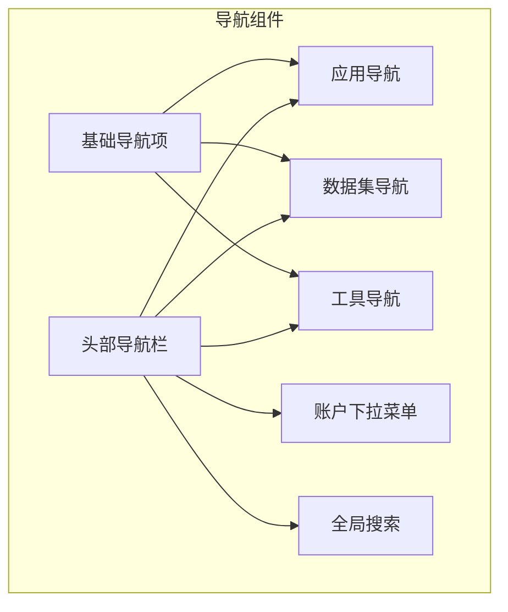
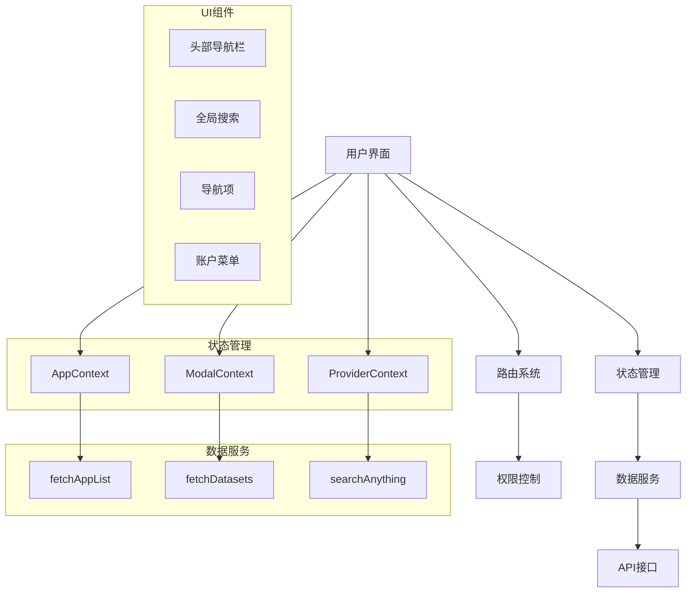
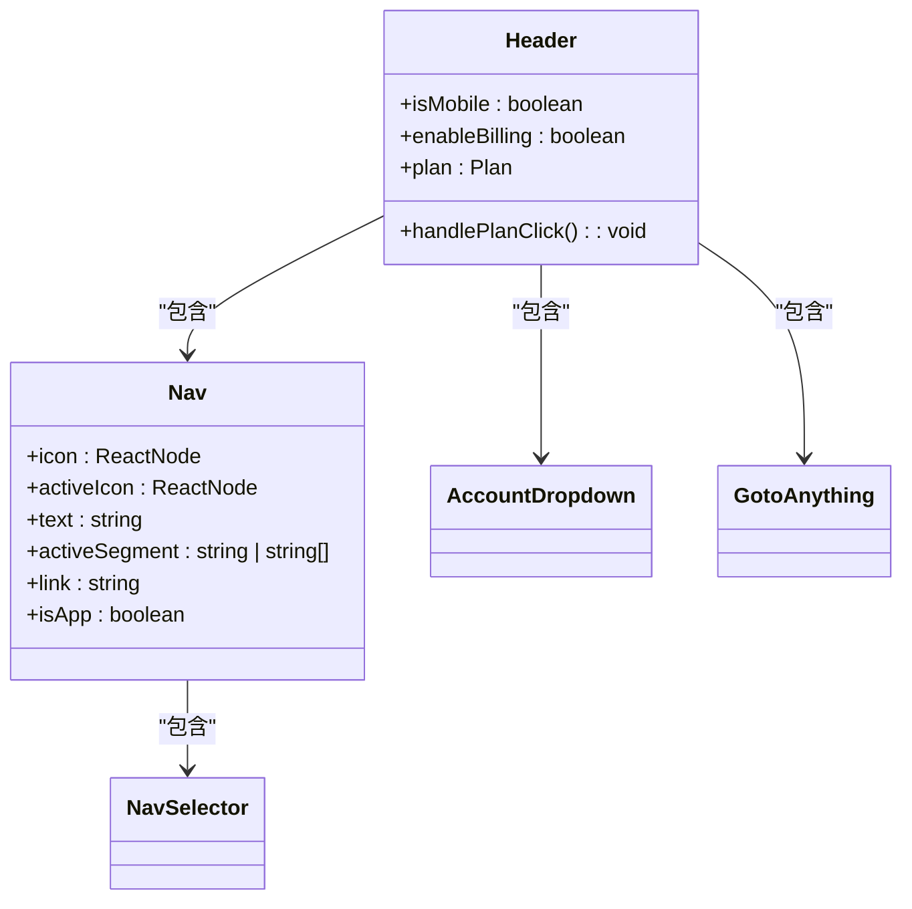
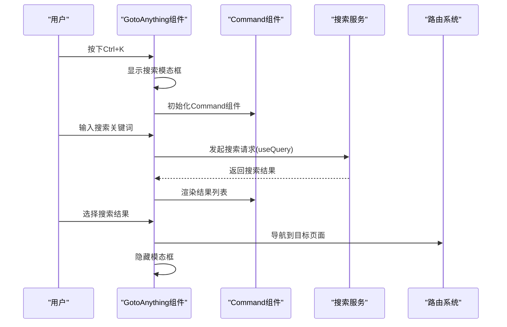
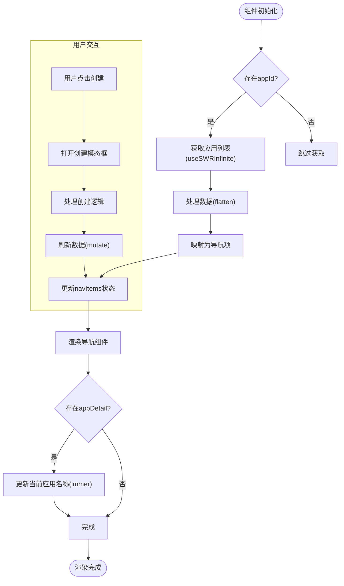
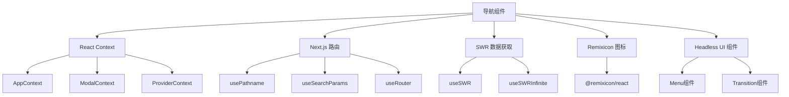

# 导航组件

<cite>
**本文档中引用的文件**  
- [header/index.tsx](file://web/app/components/header/index.tsx)
- [goto-anything/index.tsx](file://web/app/components/goto-anything/index.tsx)
- [header/nav/index.tsx](file://web/app/components/header/nav/index.tsx)
- [header/app-nav/index.tsx](file://web/app/components/header/app-nav/index.tsx)
- [header/dataset-nav/index.tsx](file://web/app/components/header/dataset-nav/index.tsx)
- [header/tools-nav/index.tsx](file://web/app/components/header/tools-nav/index.tsx)
- [header/account-dropdown/index.tsx](file://web/app/components/header/account-dropdown/index.tsx)
</cite>

## 目录
1. [简介](#简介)
2. [项目结构](#项目结构)
3. [核心组件](#核心组件)
4. [架构概述](#架构概述)
5. [详细组件分析](#详细组件分析)
6. [依赖分析](#依赖分析)
7. [性能考虑](#性能考虑)
8. [故障排除指南](#故障排除指南)
9. [结论](#结论)

## 简介
Dify的导航组件为用户提供了一套完整的界面导航系统，包含头部导航栏、全局搜索、快捷导航等功能。该系统支持响应式设计，在不同设备上提供一致的用户体验。导航组件实现了动态权限控制、状态管理以及与路由系统的深度集成，是Dify前端架构的核心组成部分。

## 项目结构
Dify的导航组件主要位于`web/app/components/header`和`web/app/components/goto-anything`目录下，采用模块化设计，各功能组件独立封装。

**Diagram sources**
- [header/index.tsx](file://web/app/components/header/index.tsx)
- [goto-anything/index.tsx](file://web/app/components/goto-anything/index.tsx)

**Section sources**
- [header/index.tsx](file://web/app/components/header/index.tsx)
- [goto-anything/index.tsx](file://web/app/components/goto-anything/index.tsx)

## 核心组件
Dify导航系统由多个核心组件构成，包括头部导航栏、全局搜索（Goto Anything）、各类导航项和账户下拉菜单。这些组件共同协作，为用户提供高效、直观的导航体验。

**Section sources**
- [header/index.tsx](file://web/app/components/header/index.tsx)
- [goto-anything/index.tsx](file://web/app/components/goto-anything/index.tsx)

## 架构概述
Dify导航组件采用分层架构设计，上层为UI组件，中层为状态管理，底层为数据服务。各组件通过React Context进行状态共享，确保导航状态的一致性。

**Diagram sources**
- [header/index.tsx](file://web/app/components/header/index.tsx)
- [goto-anything/index.tsx](file://web/app/components/goto-anything/index.tsx)

## 详细组件分析

### 头部导航栏分析
头部导航栏是Dify应用的主要导航入口，包含应用、数据集、工具等核心功能的导航链接，以及账户信息和全局搜索功能。

#### 对象导向组件：

**Diagram sources**
- [header/index.tsx](file://web/app/components/header/index.tsx)
- [header/nav/index.tsx](file://web/app/components/header/nav/index.tsx)

**Section sources**
- [header/index.tsx](file://web/app/components/header/index.tsx)
- [header/nav/index.tsx](file://web/app/components/header/nav/index.tsx)

### 全局搜索功能分析
全局搜索（Goto Anything）功能允许用户通过快捷键快速访问应用内的各种资源，是提升用户体验的重要特性。

#### API/服务组件：

**Diagram sources**
- [goto-anything/index.tsx](file://web/app/components/goto-anything/index.tsx)

**Section sources**
- [goto-anything/index.tsx](file://web/app/components/goto-anything/index.tsx)

### 应用导航分析
应用导航组件负责管理用户的应用列表，支持分页加载、创建新应用等操作，是Dify核心功能的重要入口。

#### 复杂逻辑组件：

**Diagram sources**
- [header/app-nav/index.tsx](file://web/app/components/header/app-nav/index.tsx)

**Section sources**
- [header/app-nav/index.tsx](file://web/app/components/header/app-nav/index.tsx)

## 依赖分析
导航组件依赖于多个上下文和外部库，这些依赖关系确保了组件的功能完整性和状态一致性。

**Diagram sources**
- [header/index.tsx](file://web/app/components/header/index.tsx)
- [header/app-nav/index.tsx](file://web/app/components/header/app-nav/index.tsx)
- [header/account-dropdown/index.tsx](file://web/app/components/header/account-dropdown/index.tsx)

**Section sources**
- [header/index.tsx](file://web/app/components/header/index.tsx)
- [header/app-nav/index.tsx](file://web/app/components/header/app-nav/index.tsx)
- [header/account-dropdown/index.tsx](file://web/app/components/header/account-dropdown/index.tsx)

## 性能考虑
Dify导航组件在性能方面采用了多种优化策略，包括数据懒加载、状态缓存和防抖搜索等，确保在大数据量下的流畅体验。

- **数据分页加载**：应用和数据集列表采用`useSWRInfinite`实现无限滚动分页，避免一次性加载大量数据
- **搜索防抖**：全局搜索使用`useDebounce`进行300ms防抖，减少不必要的API请求
- **状态缓存**：使用SWR的`staleTime`和`gcTime`配置，合理设置数据缓存时间
- **条件渲染**：根据用户权限和设备类型进行条件渲染，减少不必要的组件渲染
- **事件监听优化**：键盘快捷键使用`useKeyPress`进行优化，避免频繁的事件监听

## 故障排除指南
当导航组件出现问题时，可以参考以下常见问题的解决方案：

**Section sources**
- [header/index.tsx](file://web/app/components/header/index.tsx)
- [goto-anything/index.tsx](file://web/app/components/goto-anything/index.tsx)
- [header/app-nav/index.tsx](file://web/app/components/header/app-nav/index.tsx)

### 导航项不显示
- 检查用户权限是否符合显示条件
- 确认API服务是否正常返回数据
- 检查路由匹配逻辑是否正确

### 全局搜索无法打开
- 确认快捷键监听是否正常工作
- 检查模态框组件是否正确渲染
- 验证键盘事件是否被其他组件拦截

### 数据加载缓慢
- 检查网络请求是否超时
- 确认分页加载逻辑是否正常
- 验证数据缓存配置是否合理

### 响应式布局异常
- 检查断点检测逻辑是否正确
- 确认移动端和桌面端的样式类是否正确应用
- 验证条件渲染逻辑是否符合预期

## 结论
Dify的导航组件通过模块化设计和现代化的React技术栈，为用户提供了一套高效、直观的导航系统。组件采用分层架构，各功能模块职责清晰，通过Context进行状态管理，确保了导航状态的一致性。性能优化方面，采用了数据懒加载、搜索防抖等策略，保证了在大数据量下的流畅体验。整体设计充分考虑了可维护性和扩展性，为Dify的持续发展奠定了坚实的基础。