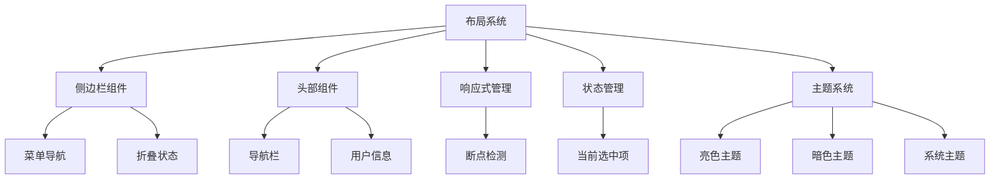
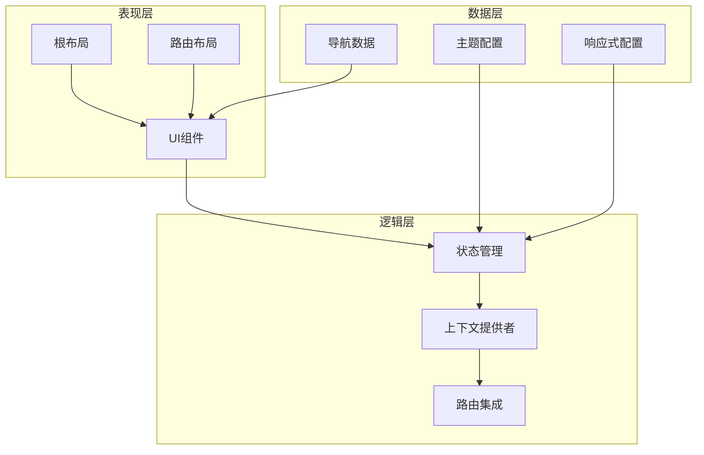
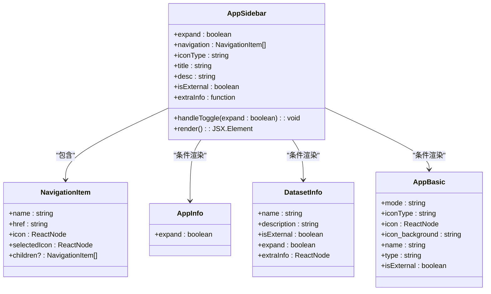
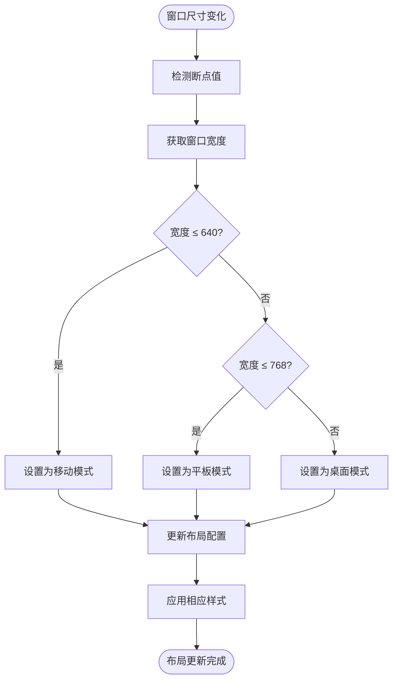
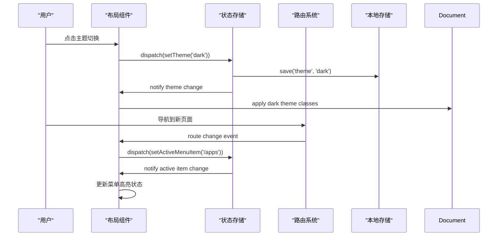
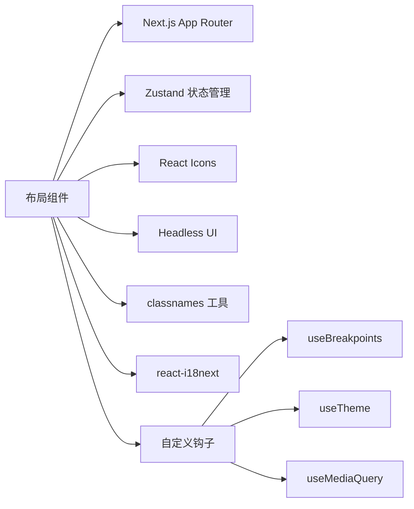

# 布局组件

<cite>
**本文档引用的文件**  
- [layout.tsx](file://web/app/layout.tsx)
- [app-sidebar/index.tsx](file://web/app/components/app-sidebar/index.tsx)
- [header-wrapper.tsx](file://web/app/components/header/header-wrapper.tsx)
- [use-breakpoints.ts](file://web/hooks/use-breakpoints.ts)
- [theme-selector.tsx](file://web/app/components/base/theme-selector.tsx)
- [account/(commonLayout)/layout.tsx](file://web/app/account/(commonLayout)/layout.tsx)
- [components/base/chat/chat-with-history/index.tsx](file://web/app/components/base/chat/chat-with-history/index.tsx)
- [workflow/store/workflow/layout-slice.ts](file://web/app/components/workflow/store/workflow/layout-slice.ts)
</cite>

## 目录
1. [简介](#简介)
2. [项目结构](#项目结构)
3. [核心组件](#核心组件)
4. [架构概述](#架构概述)
5. [详细组件分析](#详细组件分析)
6. [依赖分析](#依赖分析)
7. [性能考虑](#性能考虑)
8. [故障排除指南](#故障排除指南)
9. [结论](#结论)

## 简介
Dify的布局组件构成了应用的整体页面结构和导航体系，为用户提供一致且直观的交互体验。这些组件包括侧边栏、头部导航、主内容区和页脚等关键元素，共同构建了现代化的用户界面。布局系统采用响应式设计原则，能够适应从移动设备到桌面端的各种屏幕尺寸。通过集成状态管理机制，布局组件能够维护当前选中菜单项、折叠状态和主题切换等用户界面状态。此外，布局组件与路由系统紧密集成，支持不同页面间的平滑过渡动画，提升了整体用户体验。

## 项目结构
Dify的布局组件主要分布在`web/app/components`目录下，形成了清晰的组件化结构。核心布局组件包括侧边栏（app-sidebar）、头部（header）、主题选择器（theme-selector）等，这些组件通过模块化设计实现了高内聚低耦合。布局系统的实现采用了Next.js的App Router架构，利用布局文件（layout.tsx）在不同路由层级上应用共享的UI元素。这种分层布局结构允许在保持整体一致性的同时，为特定页面提供定制化的布局配置。响应式设计通过自定义的断点管理器（use-breakpoints）实现，确保在不同设备上都能提供最佳的用户体验。

**Diagram sources**
- [app-sidebar/index.tsx](file://web/app/components/app-sidebar/index.tsx)
- [header-wrapper.tsx](file://web/app/components/header/header-wrapper.tsx)
- [use-breakpoints.ts](file://web/hooks/use-breakpoints.ts)

**Section sources**
- [layout.tsx](file://web/app/layout.tsx)
- [app-sidebar/index.tsx](file://web/app/components/app-sidebar/index.tsx)
- [header-wrapper.tsx](file://web/app/components/header/header-wrapper.tsx)

## 核心组件
Dify的布局系统由多个核心组件构成，每个组件都承担着特定的职责。侧边栏组件（AppSidebar）负责提供主要的导航功能，包含多级菜单结构和动态图标显示。头部组件（HeaderWrapper）管理页面顶部的导航栏，处理不同页面的边框样式和隐藏逻辑。响应式管理组件（useBreakpoints）监控窗口尺寸变化，根据预设的断点值返回当前设备类型。主题系统组件（ThemeSelector）允许用户在亮色、暗色和系统主题之间切换，提供个性化的视觉体验。这些核心组件通过Context API和状态管理库协同工作，确保布局状态的一致性和可维护性。

**Section sources**
- [app-sidebar/index.tsx](file://web/app/components/app-sidebar/index.tsx)
- [header-wrapper.tsx](file://web/app/components/header/header-wrapper.tsx)
- [use-breakpoints.ts](file://web/hooks/use-breakpoints.ts)
- [theme-selector.tsx](file://web/app/components/base/theme-selector.tsx)

## 架构概述
Dify的布局架构采用分层设计模式，将UI结构与业务逻辑分离。在最外层，根布局文件（layout.tsx）定义了应用的整体框架，包含全局的样式和脚本初始化。在路由层级，特定的布局文件（如account/(commonLayout)/layout.tsx）为相关页面组提供共享的UI元素和上下文。组件层由可复用的UI组件构成，这些组件通过props接收配置，并通过事件回调与父组件通信。状态管理层使用Zustand等状态管理库集中管理布局相关的状态，如侧边栏展开状态、当前主题等。这种分层架构确保了代码的可维护性和可扩展性，同时支持灵活的布局定制。

**Diagram sources**
- [layout.tsx](file://web/app/layout.tsx)
- [account/(commonLayout)/layout.tsx](file://web/app/account/(commonLayout)/layout.tsx)
- [workflow/store/workflow/layout-slice.ts](file://web/app/components/workflow/store/workflow/layout-slice.ts)

## 详细组件分析

### 侧边栏组件分析
侧边栏组件是Dify导航系统的核心，提供了一致的页面导航体验。该组件支持动态展开/折叠功能，用户可以通过点击切换按钮来调整侧边栏的宽度。在展开状态下，侧边栏显示完整的菜单项和图标；在折叠状态下，仅显示图标以节省空间。组件通过监听窗口大小变化自动调整显示模式，在移动设备上默认采用折叠模式。多级菜单导航通过递归渲染实现，支持无限层级的嵌套结构。动态布局切换功能允许根据当前应用类型（如应用、数据集、工具）显示不同的侧边栏配置。

**Diagram sources**
- [app-sidebar/index.tsx](file://web/app/components/app-sidebar/index.tsx)

**Section sources**
- [app-sidebar/index.tsx](file://web/app/components/app-sidebar/index.tsx)

### 响应式布局分析
响应式布局系统是Dify适应不同设备的关键。系统通过useBreakpoints钩子监控窗口尺寸变化，定义了三个主要断点：移动设备（≤640px）、平板设备（≤768px）和桌面设备（>768px）。当窗口尺寸跨越断点时，布局组件会自动调整显示模式。例如，在移动设备上，侧边栏会自动折叠，并提供滑动展开功能。流式布局策略确保内容区域能够充分利用可用空间，避免水平滚动条的出现。断点设置不仅影响布局结构，还会影响组件的显示方式，如在小屏幕上隐藏次要信息，优先显示核心内容。

**Diagram sources**
- [use-breakpoints.ts](file://web/hooks/use-breakpoints.ts)
- [components/base/chat/chat-with-history/index.tsx](file://web/app/components/base/chat/chat-with-history/index.tsx)

**Section sources**
- [use-breakpoints.ts](file://web/hooks/use-breakpoints.ts)

### 状态管理分析
布局组件的状态管理采用集中式策略，通过Zustand等状态管理库维护全局布局状态。关键状态包括侧边栏展开状态、当前选中菜单项、主题模式等。状态变更通过明确的action函数触发，确保状态更新的可预测性。组件通过选择器（selector）订阅所需的状态片段，避免不必要的重新渲染。与路由系统的集成通过监听URL变化实现，当用户导航到不同页面时，自动更新当前选中菜单项。主题切换状态持久化存储在localStorage中，确保用户偏好在页面刷新后得以保留。

**Diagram sources**
- [theme-selector.tsx](file://web/app/components/base/theme-selector.tsx)
- [workflow/store/workflow/layout-slice.ts](file://web/app/components/workflow/store/workflow/layout-slice.ts)

**Section sources**
- [theme-selector.tsx](file://web/app/components/base/theme-selector.tsx)
- [workflow/store/workflow/layout-slice.ts](file://web/app/components/workflow/store/workflow/layout-slice.ts)

## 依赖分析
Dify的布局组件依赖于多个核心库和内部模块。UI组件库提供了基础的按钮、图标、输入框等元素，确保视觉一致性。Next.js的App Router架构为布局系统提供了路由集成能力，支持嵌套路由和共享布局。状态管理库（如Zustand）负责维护全局布局状态，实现组件间的高效通信。国际化库（react-i18next）支持多语言界面，确保布局文本的本地化。此外，布局组件还依赖于自定义的工具函数库，如classnames用于条件样式处理，以及自定义的媒体查询钩子用于响应式设计。

**Diagram sources**
- [layout.tsx](file://web/app/layout.tsx)
- [app-sidebar/index.tsx](file://web/app/components/app-sidebar/index.tsx)
- [header-wrapper.tsx](file://web/app/components/header/header-wrapper.tsx)

**Section sources**
- [layout.tsx](file://web/app/layout.tsx)
- [app-sidebar/index.tsx](file://web/app/components/app-sidebar/index.tsx)

## 性能考虑
Dify的布局系统在性能方面进行了多项优化。组件采用React.memo进行记忆化，避免不必要的重新渲染。虚拟滚动技术应用于长列表场景，确保即使在包含大量菜单项时也能保持流畅的滚动性能。懒加载策略用于非关键组件，减少初始加载时间。CSS变量和原子化CSS（通过Tailwind CSS）的使用减少了样式表的大小和复杂性。主题切换通过切换CSS类实现，避免了样式重新计算的开销。响应式断点检测采用防抖技术，防止频繁的窗口调整事件导致性能问题。

## 故障排除指南
在使用Dify布局组件时可能遇到的常见问题包括：侧边栏无法正确折叠、主题切换不生效、响应式布局在特定设备上显示异常等。对于侧边栏问题，应检查localStorage中的折叠状态是否正确保存，以及窗口大小变化事件是否被正确处理。主题切换问题通常与CSS类应用顺序或状态同步有关，需要确保主题状态在组件挂载时正确初始化。响应式布局问题可能源于断点值设置不当或媒体查询条件错误，应验证useBreakpoints钩子返回的值是否符合预期。调试时可使用浏览器开发者工具检查应用的CSS类和组件状态。

**Section sources**
- [app-sidebar/index.tsx](file://web/app/components/app-sidebar/index.tsx)
- [theme-selector.tsx](file://web/app/components/base/theme-selector.tsx)
- [use-breakpoints.ts](file://web/hooks/use-breakpoints.ts)

## 结论
Dify的布局组件系统通过精心设计的架构和实现，为应用提供了强大而灵活的界面基础。分层的组件结构、响应式的布局策略和集中的状态管理共同确保了用户体验的一致性和可维护性。系统支持多级菜单导航和动态布局切换，能够适应不同应用场景的需求。通过与路由系统的深度集成，布局组件能够智能地响应用户导航行为，提供直观的视觉反馈。未来可以进一步优化性能，如实现更精细的代码分割和预加载策略，同时增强可访问性支持，确保所有用户都能获得良好的使用体验。