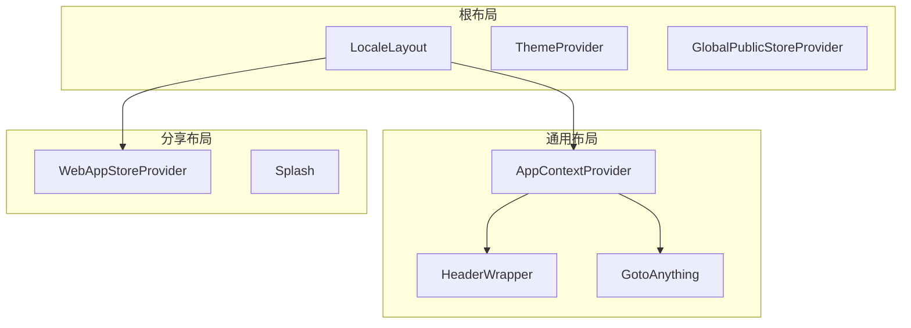
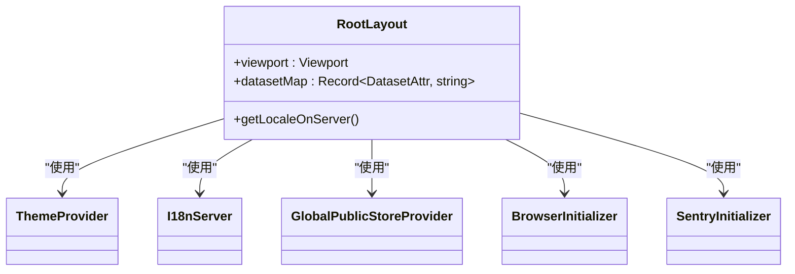
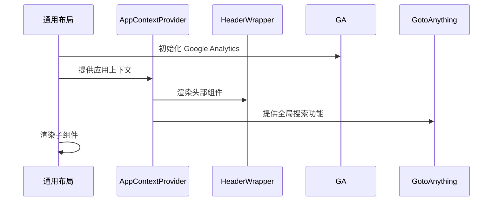
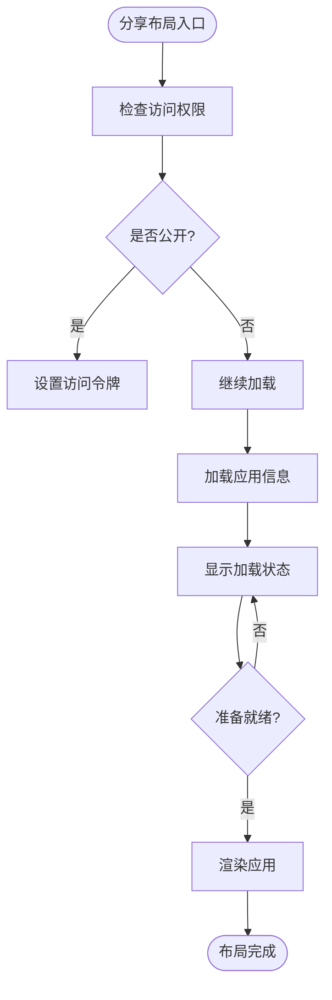

# 页面布局

<cite>
**本文档中引用的文件**  
- [layout.tsx](file://web/app/layout.tsx)
- [commonLayout/layout.tsx](file://web/app/(commonLayout)/layout.tsx)
- [shareLayout/layout.tsx](file://web/app/(shareLayout)/layout.tsx)
- [app-context.tsx](file://web/context/app-context.tsx)
- [web-app-context.tsx](file://web/context/web-app-context.tsx)
- [ga/index.tsx](file://web/app/components/base/ga/index.tsx)
- [header-wrapper.tsx](file://web/app/components/header/header-wrapper.tsx)
- [goto-anything/index.tsx](file://web/app/components/goto-anything/index.tsx)
- [loading/index.tsx](file://web/app/components/base/loading/index.tsx)
</cite>

## 目录
1. [简介](#简介)
2. [项目结构](#项目结构)
3. [核心组件](#核心组件)
4. [架构概述](#架构概述)
5. [详细组件分析](#详细组件分析)
6. [依赖分析](#依赖分析)
7. [性能考虑](#性能考虑)
8. [故障排除指南](#故障排除指南)
9. [结论](#结论)

## 简介
Dify 的页面布局系统采用多层嵌套结构，支持多种布局模式以适应不同使用场景。系统通过根布局、通用布局和分享布局的组合，实现了灵活的 UI 架构。布局组件与全局状态管理深度集成，支持主题切换、语言设置和用户偏好等功能。该系统还集成了 SEO 优化、性能监控和错误边界处理，确保应用在各种环境下的稳定性和可访问性。

## 项目结构
Dify 的页面布局主要由 Next.js 的布局系统驱动，采用基于文件夹的路由和布局嵌套机制。布局组件分为多个层级，包括根布局、通用布局和分享布局，每个布局对应不同的使用场景和权限模型。

```mermaid
graph TB
RootLayout[根布局 layout.tsx] --> CommonLayout[通用布局 (commonLayout)/layout.tsx]
RootLayout --> ShareLayout[分享布局 (shareLayout)/layout.tsx]
CommonLayout --> AppDetailLayout[应用详情布局 (appDetailLayout)/layout.tsx]
CommonLayout --> DatasetLayout[数据集布局 datasets/layout.tsx]
ShareLayout --> ChatLayout[聊天分享布局 chat/[token]/page.tsx]
ShareLayout --> WorkflowLayout[工作流分享布局 workflow/[token]/page.tsx]
ShareLayout --> SigninLayout[登录布局 webapp-signin/layout.tsx]
```

**Diagram sources**
- [layout.tsx](file://web/app/layout.tsx)
- [commonLayout/layout.tsx](file://web/app/(commonLayout)/layout.tsx)
- [shareLayout/layout.tsx](file://web/app/(shareLayout)/layout.tsx)

**Section sources**
- [layout.tsx](file://web/app/layout.tsx)
- [commonLayout/layout.tsx](file://web/app/(commonLayout)/layout.tsx)
- [shareLayout/layout.tsx](file://web/app/(shareLayout)/layout.tsx)

## 核心组件
Dify 的页面布局系统由多个核心组件构成，包括根布局、通用布局、分享布局以及相关的上下文提供者。这些组件共同协作，实现了灵活的布局切换和状态管理。根布局负责全局 HTML 结构和元数据，通用布局适用于管理后台，而分享布局则用于公开分享的应用实例。

**Section sources**
- [layout.tsx](file://web/app/layout.tsx)
- [commonLayout/layout.tsx](file://web/app/(commonLayout)/layout.tsx)
- [shareLayout/layout.tsx](file://web/app/(shareLayout)/layout.tsx)
- [app-context.tsx](file://web/context/app-context.tsx)
- [web-app-context.tsx](file://web/context/web-app-context.tsx)

## 架构概述
Dify 的页面布局架构采用分层设计，从根布局到具体页面布局形成清晰的继承关系。系统通过 React Context 实现全局状态管理，支持主题、语言和用户偏好等设置。布局组件与性能监控、SEO 优化和错误处理机制深度集成，确保应用的高性能和可靠性。



**Diagram sources**
- [layout.tsx](file://web/app/layout.tsx)
- [commonLayout/layout.tsx](file://web/app/(commonLayout)/layout.tsx)
- [shareLayout/layout.tsx](file://web/app/(shareLayout)/layout.tsx)
- [app-context.tsx](file://web/context/app-context.tsx)
- [web-app-context.tsx](file://web/context/web-app-context.tsx)

## 详细组件分析

### 根布局分析
根布局是整个应用的最外层容器，负责定义全局 HTML 结构、元数据和全局上下文。它集成了主题管理、国际化支持和性能监控等核心功能。



**Diagram sources**
- [layout.tsx](file://web/app/layout.tsx)

**Section sources**
- [layout.tsx](file://web/app/layout.tsx)

### 通用布局分析
通用布局适用于 Dify 的管理后台，提供完整的导航、头部和全局功能。它集成了用户配置、工作区信息和全局事件系统。



**Diagram sources**
- [commonLayout/layout.tsx](file://web/app/(commonLayout)/layout.tsx)
- [app-context.tsx](file://web/context/app-context.tsx)
- [header-wrapper.tsx](file://web/app/components/header/header-wrapper.tsx)
- [ga/index.tsx](file://web/app/components/base/ga/index.tsx)
- [goto-anything/index.tsx](file://web/app/components/goto-anything/index.tsx)

**Section sources**
- [commonLayout/layout.tsx](file://web/app/(commonLayout)/layout.tsx)
- [app-context.tsx](file://web/context/app-context.tsx)
- [header-wrapper.tsx](file://web/app/components/header/header-wrapper.tsx)

### 分享布局分析
分享布局用于公开分享的应用实例，提供简化的用户界面和访问控制。它专注于快速加载和用户体验，适用于外部用户访问。



**Diagram sources**
- [shareLayout/layout.tsx](file://web/app/(shareLayout)/layout.tsx)
- [web-app-context.tsx](file://web/context/web-app-context.tsx)
- [loading/index.tsx](file://web/app/components/base/loading/index.tsx)

**Section sources**
- [shareLayout/layout.tsx](file://web/app/(shareLayout)/layout.tsx)
- [web-app-context.tsx](file://web/context/web-app-context.tsx)

## 依赖分析
Dify 的布局系统依赖于多个核心模块和第三方库，形成了复杂的依赖网络。这些依赖确保了布局系统的功能完整性和性能优化。

```mermaid
graph LR
layout --> next-themes
layout --> use-context-selector
layout --> swr
layout --> zustand
layout --> next/script
layout --> @tanstack/react-query
commonLayout --> app-context
commonLayout --> header-wrapper
shareLayout --> web-app-context
shareLayout --> splash
```

**Diagram sources**
- [layout.tsx](file://web/app/layout.tsx)
- [commonLayout/layout.tsx](file://web/app/(commonLayout)/layout.tsx)
- [shareLayout/layout.tsx](file://web/app/(shareLayout)/layout.tsx)
- [app-context.tsx](file://web/context/app-context.tsx)
- [web-app-context.tsx](file://web/context/web-app-context.tsx)

**Section sources**
- [layout.tsx](file://web/app/layout.tsx)
- [commonLayout/layout.tsx](file://web/app/(commonLayout)/layout.tsx)
- [shareLayout/layout.tsx](file://web/app/(shareLayout)/layout.tsx)

## 性能考虑
Dify 的布局系统在性能方面进行了多项优化，包括代码分割、懒加载和缓存策略。根布局中的静态元数据和全局样式确保了快速首屏渲染，而动态上下文提供者则按需加载，减少初始包大小。分享布局特别优化了加载流程，通过条件渲染和预加载策略提升用户体验。

## 故障排除指南
当遇到布局相关问题时，应首先检查布局文件的嵌套结构是否正确。常见的问题包括上下文提供者缺失、布局组件未正确导出或路由配置错误。对于分享布局的访问问题，应检查访问令牌和权限设置。性能问题通常与不必要的重新渲染或大型依赖包有关，建议使用 React DevTools 进行性能分析。

**Section sources**
- [layout.tsx](file://web/app/layout.tsx)
- [commonLayout/layout.tsx](file://web/app/(commonLayout)/layout.tsx)
- [shareLayout/layout.tsx](file://web/app/(shareLayout)/layout.tsx)
- [app-context.tsx](file://web/context/app-context.tsx)
- [web-app-context.tsx](file://web/context/web-app-context.tsx)

## 结论
Dify 的页面布局系统通过精心设计的分层架构和多布局模式，成功实现了灵活性和一致性的平衡。系统不仅支持复杂的管理后台需求，还能提供轻量化的分享体验。通过与全局状态管理和性能优化技术的深度集成，该布局系统为 Dify 的稳定运行和良好用户体验提供了坚实基础。