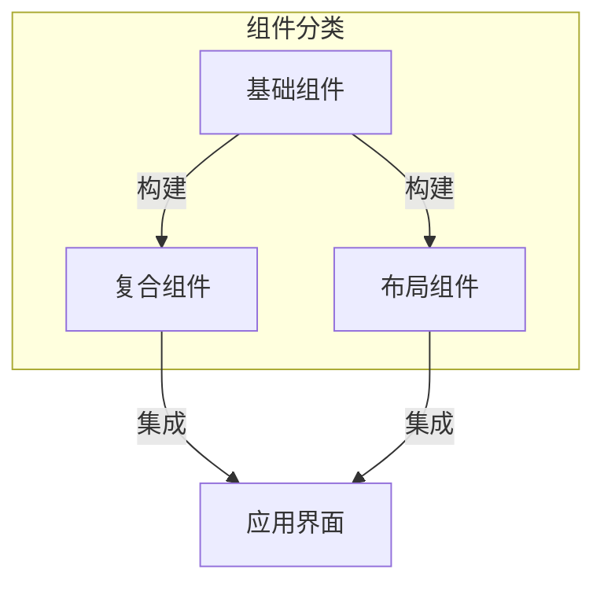
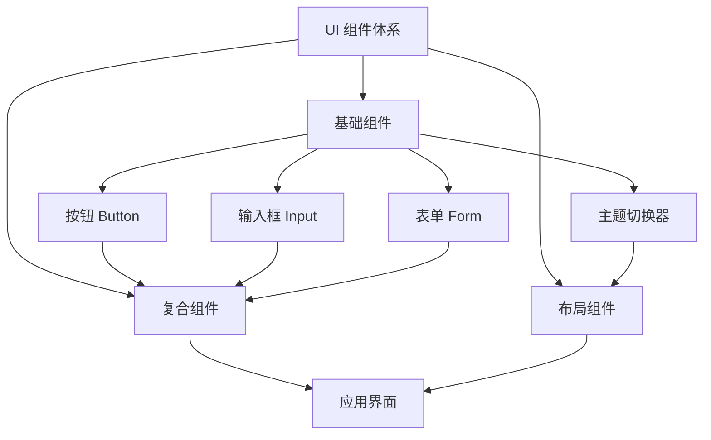
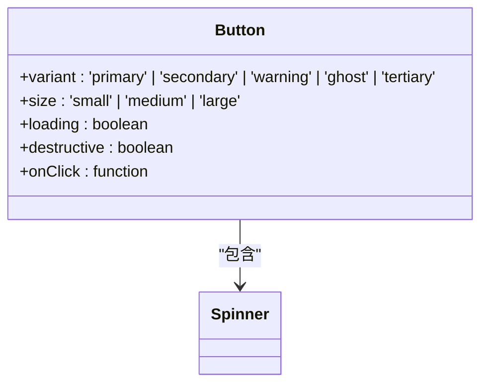
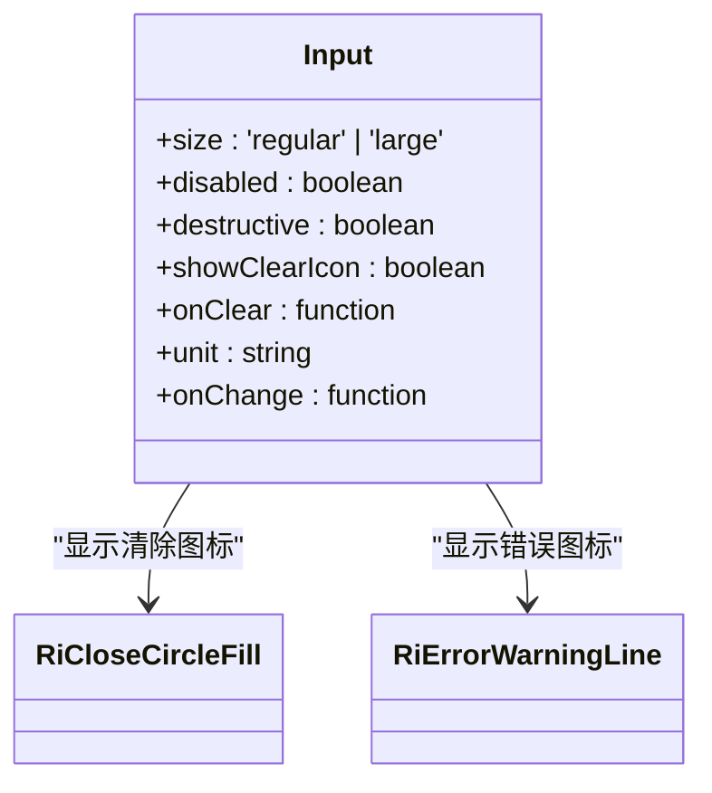
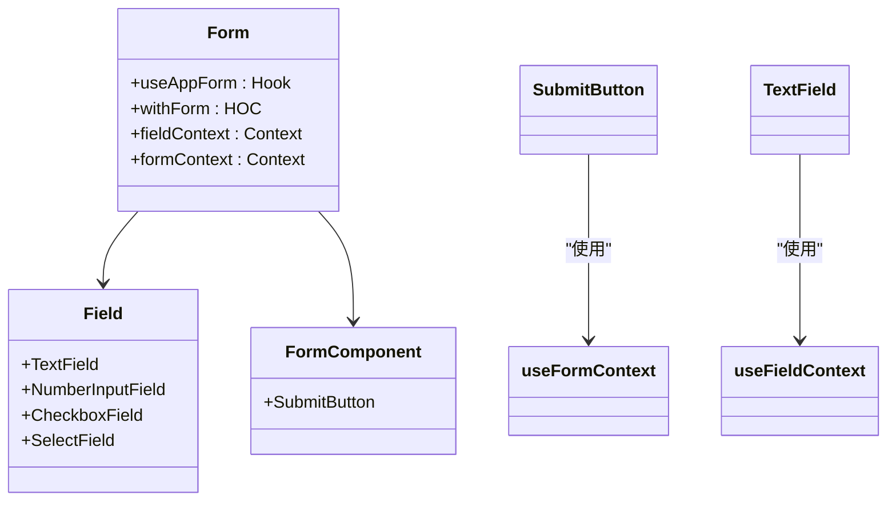
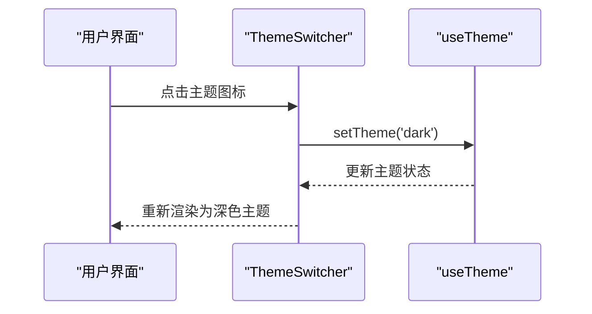
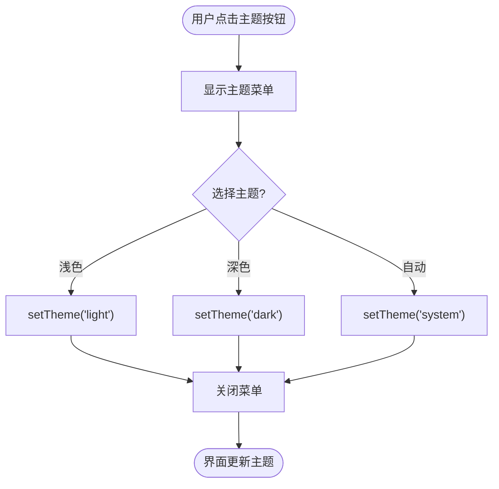

# 组件体系

<cite>
**本文档中引用的文件**  
- [button/index.tsx](file://web/app/components/base/button/index.tsx)
- [input/index.tsx](file://web/app/components/base/input/index.tsx)
- [form/index.tsx](file://web/app/components/base/form/index.tsx)
- [form/components/field/text.tsx](file://web/app/components/base/form/components/field/text.tsx)
- [form/components/form/submit-button.tsx](file://web/app/components/base/form/components/form/submit-button.tsx)
- [theme-switcher.tsx](file://web/app/components/base/theme-switcher.tsx)
- [theme-selector.tsx](file://web/app/components/base/theme-selector.tsx)
</cite>

## 目录
1. [简介](#简介)
2. [项目结构](#项目结构)
3. [核心组件](#核心组件)
4. [架构概述](#架构概述)
5. [详细组件分析](#详细组件分析)
6. [依赖分析](#依赖分析)
7. [性能考虑](#性能考虑)
8. [故障排除指南](#故障排除指南)
9. [结论](#结论)

## 简介
本文档详细介绍了 Dify 前端组件体系的设计原则与实现方式，重点围绕基于 React 的 UI 组件展开。文档涵盖组件的层次结构、可访问性实现、响应式设计策略、主题支持机制、状态管理方案以及开发最佳实践。

## 项目结构
Dify 的前端组件主要位于 `web/app/components` 目录下，采用模块化组织方式，分为基础组件、复合组件和布局组件三大类。基础组件存放于 `base` 子目录中，是整个组件体系的基石。



**Diagram sources**
- [base](file://web/app/components/base)

**Section sources**
- [components](file://web/app/components)

## 核心组件
Dify 的前端组件体系以 React 为基础，结合 Tailwind CSS 和 `class-variance-authority` 实现样式变体管理，通过 `@tanstack/react-form` 构建表单系统，并利用 `next-themes` 实现主题切换功能。

**Section sources**
- [button/index.tsx](file://web/app/components/base/button/index.tsx)
- [input/index.tsx](file://web/app/components/base/input/index.tsx)
- [form/index.tsx](file://web/app/components/base/form/index.tsx)

## 架构概述
Dify 的组件体系遵循分层设计原则，从原子级的基础组件逐步构建出复杂的用户界面。体系支持主题切换、国际化、表单状态管理等高级功能。



**Diagram sources**
- [button/index.tsx](file://web/app/components/base/button/index.tsx)
- [input/index.tsx](file://web/app/components/base/input/index.tsx)
- [form/index.tsx](file://web/app/components/base/form/index.tsx)
- [theme-switcher.tsx](file://web/app/components/base/theme-switcher.tsx)

## 详细组件分析
本节深入分析 Dify 组件体系中的关键组件实现。

### 基础组件分析
基础组件是构建用户界面的最小单元，包括按钮、输入框、选择器等。

#### 按钮组件
按钮组件使用 `cva`（class-variance-authority）定义多种样式变体，支持不同颜色主题和尺寸。



**Diagram sources**
- [button/index.tsx](file://web/app/components/base/button/index.tsx)

**Section sources**
- [button/index.tsx](file://web/app/components/base/button/index.tsx)

#### 输入框组件
输入框组件支持清除图标、错误状态、单位显示等特性，并通过 CSS 变量实现主题化。



**Diagram sources**
- [input/index.tsx](file://web/app/components/base/input/index.tsx)

**Section sources**
- [input/index.tsx](file://web/app/components/base/input/index.tsx)

### 复合组件分析
复合组件由多个基础组件组合而成，实现更复杂的功能。

#### 表单系统
Dify 使用 `@tanstack/react-form` 构建类型安全的表单系统，支持字段验证和提交状态管理。



**Diagram sources**
- [form/index.tsx](file://web/app/components/base/form/index.tsx)
- [form/components/field/text.tsx](file://web/app/components/base/form/components/field/text.tsx)
- [form/components/form/submit-button.tsx](file://web/app/components/base/form/components/form/submit-button.tsx)

**Section sources**
- [form/index.tsx](file://web/app/components/base/form/index.tsx)
- [form/components/field/text.tsx](file://web/app/components/base/form/components/field/text.tsx)
- [form/components/form/submit-button.tsx](file://web/app/components/base/form/components/form/submit-button.tsx)

### 主题支持机制
Dify 实现了完整的主题切换功能，支持浅色、深色和系统自动三种模式。

#### 主题切换器
提供紧凑的按钮式主题切换器，适合工具栏集成。



**Diagram sources**
- [theme-switcher.tsx](file://web/app/components/base/theme-switcher.tsx)

**Section sources**
- [theme-switcher.tsx](file://web/app/components/base/theme-switcher.tsx)

#### 主题选择器
提供下拉菜单式主题选择器，显示当前选中状态。



**Diagram sources**
- [theme-selector.tsx](file://web/app/components/base/theme-selector.tsx)

**Section sources**
- [theme-selector.tsx](file://web/app/components/base/theme-selector.tsx)

## 依赖分析
Dify 组件体系依赖多个第三方库来实现核心功能。

```mermaid
graph LR
A[Dify 组件体系] --> B[class-variance-authority]
A --> C[@tanstack/react-form]
A --> D[next-themes]
A --> E[react-i18next]
A --> F[lodash-es]
B --> G[样式变体管理]
C --> H[表单状态管理]
D --> I[主题切换]
E --> J[国际化]
F --> K[工具函数]
```

**Diagram sources**
- [go.mod](file://pyproject.toml)
- [package.json](file://web/package.json)

**Section sources**
- [package.json](file://web/package.json)

## 性能考虑
Dify 组件体系在性能方面采取了多项优化措施，包括组件懒加载、memoization、虚拟滚动等。基础组件经过精心设计，避免不必要的重渲染，确保在复杂界面中的流畅表现。

## 故障排除指南
当遇到组件显示异常或功能失效时，建议按以下步骤排查：
1. 检查主题配置是否正确加载
2. 验证国际化资源文件是否完整
3. 确认表单上下文是否正确提供
4. 检查浏览器控制台是否有样式加载错误

**Section sources**
- [theme-switcher.tsx](file://web/app/components/base/theme-switcher.tsx)
- [theme-selector.tsx](file://web/app/components/base/theme-selector.tsx)
- [form/index.tsx](file://web/app/components/base/form/index.tsx)

## 结论
Dify 的前端组件体系采用现代化的 React 技术栈，通过合理的分层设计和模块化组织，构建了一个可扩展、易维护的 UI 组件库。体系支持主题化、国际化和类型安全的表单处理，为开发高质量的用户界面提供了坚实基础。