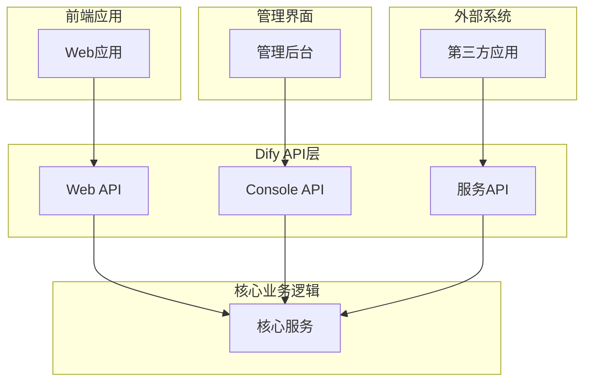
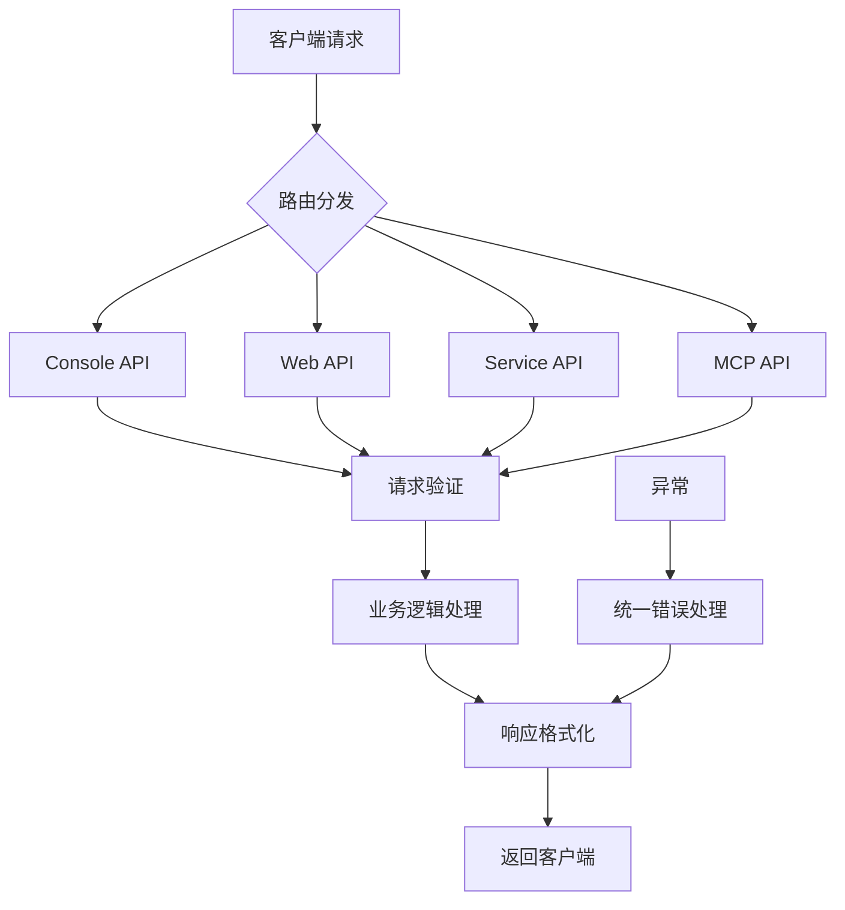
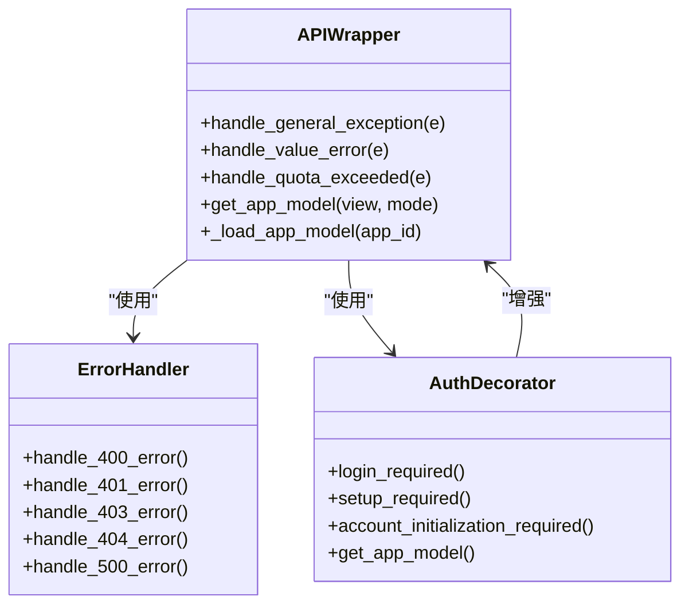

# API接口

<cite>
**本文档中引用的文件**  
- [app.py](file://api/app.py)
- [ext_blueprints.py](file://api/extensions/ext_blueprints.py)
- [external_api.py](file://api/libs/external_api.py)
- [wraps.py](file://api/controllers/console/app/wraps.py)
- [console/ping.py](file://api/controllers/console/ping.py)
- [service_api/wraps.py](file://api/controllers/service_api/wraps.py)
- [web/wraps.py](file://api/controllers/web/wraps.py)
- [mcp/__init__.py](file://api/controllers/mcp/__init__.py)
</cite>

## 目录
1. [简介](#简介)
2. [三层API架构设计](#三层api架构设计)
3. [基于Flask Blueprints的模块化路由设计](#基于flask-blueprints的模块化路由设计)
4. [API包装器（wraps.py）实现机制](#api包装器wrapspy实现机制)
5. [API调用示例](#api调用示例)
6. [常见问题排查指南](#常见问题排查指南)
7. [性能优化建议](#性能优化建议)

## 简介
Dify平台提供了一套完整的API接口体系，支持管理界面、前端应用和外部系统集成三种使用场景。本API文档详细介绍了Dify的三层API架构设计，涵盖Console API（管理界面）、Web API（前端应用）和服务API（外部集成）的功能划分与协作机制。文档深入解析了基于Flask Blueprints的模块化路由系统，包括版本控制、请求验证和响应格式化等关键设计。同时，文档阐述了API包装器（wraps.py）的统一实现机制，如何通过装饰器模式统一处理错误、认证和日志记录。此外，文档还提供了实际的API调用示例、常见问题排查指南和性能优化建议，帮助开发者高效使用Dify API。

## 三层API架构设计

Dify平台采用清晰的三层API架构设计，将不同使用场景的API接口进行逻辑分离，确保系统的可维护性和安全性。

### Console API（管理界面）
Console API主要用于Dify管理后台的内部功能实现，提供完整的应用管理、数据集管理、工作区配置等功能。这些API接口通常需要管理员或所有者权限才能访问，具有较高的安全要求。

### Web API（前端应用）
Web API为Dify的前端应用提供数据支持，主要用于用户交互场景，如对话生成、应用访问等。这些API接口设计注重用户体验和响应速度，通常通过Web界面直接调用。

### 服务API（外部集成）
服务API专为外部系统集成设计，提供标准化的RESTful接口，支持第三方应用通过API密钥进行身份验证和调用。这种设计使得Dify可以轻松集成到各种外部系统中，实现功能扩展。



**Diagram sources**
- [ext_blueprints.py](file://api/extensions/ext_blueprints.py#L37-L51)
- [external_api.py](file://api/libs/external_api.py#L36-L67)

**Section sources**
- [ext_blueprints.py](file://api/extensions/ext_blueprints.py#L0-L51)
- [external_api.py](file://api/libs/external_api.py#L36-L99)

## 基于Flask Blueprints的模块化路由设计

Dify采用Flask Blueprints实现模块化的路由设计，将不同功能的API接口组织在独立的蓝图中，提高了代码的可维护性和可扩展性。

### 路由模块化
通过Flask Blueprints，Dify将API接口按功能划分为多个模块，如控制台、文件服务、内部API、MCP协议和Web API等。每个蓝图都有独立的URL前缀和配置，实现了清晰的路由分离。

### 版本控制
Dify的API设计支持版本控制，通过在API命名空间中指定版本号，确保API的向后兼容性。这种设计允许在不破坏现有集成的情况下进行API的迭代和升级。

### 请求验证
Dify使用Flask-RESTX的请求解析器（reqparse.RequestParser）对API请求进行验证，确保输入参数的完整性和正确性。对于必需参数，系统会自动进行验证，如果缺少或格式错误，将返回相应的错误信息。

### 响应格式化
Dify的API响应采用统一的JSON格式，包含状态码、消息和数据等字段。通过ExternalApi类的错误处理器，系统能够将不同类型的异常转换为标准化的响应格式，便于客户端处理。



**Diagram sources**
- [ext_blueprints.py](file://api/extensions/ext_blueprints.py#L0-L38)
- [external_api.py](file://api/libs/external_api.py#L36-L99)

**Section sources**
- [ext_blueprints.py](file://api/extensions/ext_blueprints.py#L0-L51)
- [external_api.py](file://api/libs/external_api.py#L36-L99)

## API包装器（wraps.py）实现机制

Dify通过API包装器（wraps.py）实现统一的错误处理、认证和日志记录机制，提高了代码的复用性和可维护性。

### 装饰器模式
Dify使用Python的装饰器模式实现API包装器，通过@wraps装饰器将通用的处理逻辑封装在独立的函数中。这种方式使得业务逻辑代码更加简洁，同时确保了通用功能的一致性。

### 统一错误处理
API包装器通过errorhandler装饰器统一处理各种异常类型，将不同类型的异常转换为标准化的API响应。例如，ValueError被转换为400错误，AppInvokeQuotaExceededError被转换为429错误等。

### 认证机制
Dify的API包装器集成了多种认证机制，包括基于会话的认证和API密钥认证。通过current_user装饰器，系统能够获取当前登录用户的信息，并进行权限验证。

### 日志记录
API包装器通过got_request_exception信号机制实现统一的日志记录，确保所有API请求和异常都能被正确记录，便于后续的监控和问题排查。



**Diagram sources**
- [wraps.py](file://api/controllers/console/app/wraps.py#L0-L43)
- [external_api.py](file://api/libs/external_api.py#L66-L99)

**Section sources**
- [wraps.py](file://api/controllers/console/app/wraps.py#L0-L43)
- [external_api.py](file://api/libs/external_api.py#L66-L99)

## API调用示例

### 身份验证
```python
# 使用API密钥进行身份验证
headers = {
    "Authorization": "Bearer YOUR_API_KEY",
    "Content-Type": "application/json"
}
```

### 参数传递
```python
# 发送POST请求并传递JSON参数
import requests

url = "https://api.dify.ai/v1/apps"
data = {
    "name": "My App",
    "description": "A sample application"
}
response = requests.post(url, json=data, headers=headers)
```

### 响应解析
```python
# 解析API响应
if response.status_code == 200:
    result = response.json()
    app_id = result["id"]
    print(f"应用创建成功，ID: {app_id}")
else:
    error = response.json()
    print(f"请求失败: {error['message']}")
```

**Section sources**
- [external_api.py](file://api/libs/external_api.py#L36-L99)
- [wraps.py](file://api/controllers/console/app/wraps.py#L0-L43)

## 常见问题排查指南

### 401 Unauthorized错误
- 检查API密钥是否正确
- 确认API密钥是否有足够的权限
- 验证请求头中的Authorization字段格式是否正确

### 400 Bad Request错误
- 检查请求参数是否完整
- 验证参数类型是否正确
- 确认JSON格式是否正确

### 429 Too Many Requests错误
- 检查API调用频率是否超过配额
- 实现适当的请求重试机制
- 考虑升级到更高配额的计划

### 500 Internal Server Error错误
- 检查请求数据是否符合预期
- 查看服务器日志获取详细错误信息
- 联系技术支持获取帮助

**Section sources**
- [external_api.py](file://api/libs/external_api.py#L66-L99)
- [wraps.py](file://api/controllers/console/app/wraps.py#L0-L43)

## 性能优化建议

### 批量操作
对于大量数据的操作，建议使用批量API接口，减少网络往返次数，提高整体性能。

### 缓存策略
合理使用HTTP缓存头，对于不经常变化的数据，可以设置适当的缓存时间，减少重复请求。

### 异步处理
对于耗时较长的操作，建议使用异步API接口，避免阻塞客户端。

### 连接复用
使用HTTP Keep-Alive保持连接，减少TCP连接建立的开销。

**Section sources**
- [external_api.py](file://api/libs/external_api.py#L36-L99)
- [wraps.py](file://api/controllers/console/app/wraps.py#L0-L43)