# 前端API

<cite>
**本文档中引用的文件**  
- [completion.py](file://api/controllers/web/completion.py)
- [conversation.py](file://api/controllers/web/conversation.py)
- [message.py](file://api/controllers/web/message.py)
- [streamable_client.py](file://api/core/mcp/client/streamable_client.py)
- [sse_client.py](file://api/core/mcp/client/sse_client.py)
</cite>

## 目录
1. [简介](#简介)
2. [项目结构](#项目结构)
3. [核心组件](#核心组件)
4. [架构概述](#架构概述)
5. [详细组件分析](#详细组件分析)
6. [依赖分析](#依赖分析)
7. [性能考虑](#性能考虑)
8. [故障排除指南](#故障排除指南)
9. [结论](#结论)

## 简介
本文档详细介绍了Dify前端API的设计与实现，重点涵盖Web API的交互机制。文档深入解析了对话管理、补全请求、消息流式传输和会话状态维护等关键功能。同时阐述了实时通信机制，包括SSE（服务器发送事件）和WebSocket的使用场景。文档提供了完整的端点规范，包含请求头、参数、响应体结构和状态码，并包含JavaScript前端调用示例，展示如何处理流式数据和错误情况。此外，还包含了连接复用、缓存策略和错误重试等性能优化建议。

## 项目结构
Dify的API控制器位于`api/controllers/web`目录下，主要包含处理前端请求的核心模块。这些模块通过RESTful API提供服务，支持对话管理、消息处理和补全请求等功能。前端应用通过这些API端点与后端服务进行交互，实现完整的对话式AI应用功能。

**Diagram sources**
- [completion.py](file://api/controllers/web/completion.py)
- [conversation.py](file://api/controllers/web/conversation.py)
- [message.py](file://api/controllers/web/message.py)

**Section sources**
- [completion.py](file://api/controllers/web/completion.py)
- [conversation.py](file://api/controllers/web/conversation.py)
- [message.py](file://api/controllers/web/message.py)

## 核心组件
Dify前端API的核心组件包括补全请求处理、对话管理、消息处理和流式响应机制。这些组件共同构成了前端与后端交互的基础架构。补全请求处理支持文本生成应用，对话管理维护会话状态，消息处理提供历史记录和反馈功能，而流式响应机制则实现了实时数据传输。

**Section sources**
- [completion.py](file://api/controllers/web/completion.py)
- [conversation.py](file://api/controllers/web/conversation.py)
- [message.py](file://api/controllers/web/message.py)

## 架构概述
Dify的前端API架构采用分层设计，前端通过RESTful API与后端服务通信。API控制器接收请求并调用相应的服务层组件，服务层处理业务逻辑并与数据层交互。对于流式响应，系统使用SSE（服务器发送事件）技术实现实时数据推送，确保用户能够即时看到生成的内容。

```mermaid
graph TD
Client[前端客户端] --> |HTTP请求| API[API网关]
API --> CompletionController[补全控制器]
API --> ChatController[聊天控制器]
API --> ConversationController[对话控制器]
API --> MessageController[消息控制器]
CompletionController --> AppGenerateService[应用生成服务]
ChatController --> AppGenerateService
ConversationController --> WebConversationService[Web对话服务]
MessageController --> MessageService[消息服务]
AppGenerateService --> ModelRuntime[模型运行时]
WebConversationService --> Database[(数据库)]
MessageService --> Database
ModelRuntime --> |SSE流| Client
Database --> |响应| Client
```

**Diagram sources**
- [completion.py](file://api/controllers/web/completion.py)
- [conversation.py](file://api/controllers/web/conversation.py)
- [message.py](file://api/controllers/web/message.py)

## 详细组件分析

### 补全请求分析
补全请求组件处理文本生成应用的请求，支持阻塞和流式两种响应模式。客户端通过`/completion-messages`端点发送请求，服务端根据`response_mode`参数决定响应方式。

#### 补全请求API

**Diagram sources**
- [completion.py](file://api/controllers/web/completion.py)

**Section sources**
- [completion.py](file://api/controllers/web/completion.py)

### 对话管理分析
对话管理组件负责维护会话状态，支持对话列表获取、对话重命名、对话置顶和取消置顶等操作。这些功能通过`/conversations`端点提供服务。

#### 对话管理API

**Diagram sources**
- [conversation.py](file://api/controllers/web/conversation.py)

**Section sources**
- [conversation.py](file://api/controllers/web/conversation.py)

### 消息处理分析
消息处理组件提供消息历史记录、用户反馈、相似问题生成和建议问题等功能。这些功能通过`/messages`端点提供服务，支持分页查询和实时反馈。

#### 消息处理API

**Diagram sources**
- [message.py](file://api/controllers/web/message.py)

**Section sources**
- [message.py](file://api/controllers/web/message.py)

### 实时通信机制分析
Dify使用SSE（服务器发送事件）技术实现流式响应，确保用户能够实时看到生成的内容。流式客户端通过独立的线程处理服务器和客户端之间的消息传递。

#### 流式通信机制

**Diagram sources**
- [streamable_client.py](file://api/core/mcp/client/streamable_client.py)
- [sse_client.py](file://api/core/mcp/client/sse_client.py)

**Section sources**
- [streamable_client.py](file://api/core/mcp/client/streamable_client.py)
- [sse_client.py](file://api/core/mcp/client/sse_client.py)

## 依赖分析
Dify前端API的组件之间存在明确的依赖关系。API控制器依赖于服务层组件，服务层组件又依赖于模型运行时和数据库。这种分层架构确保了组件之间的松耦合，便于维护和扩展。

**Diagram sources**
- [completion.py](file://api/controllers/web/completion.py)
- [conversation.py](file://api/controllers/web/conversation.py)
- [message.py](file://api/controllers/web/message.py)

**Section sources**
- [completion.py](file://api/controllers/web/completion.py)
- [conversation.py](file://api/controllers/web/conversation.py)
- [message.py](file://api/controllers/web/message.py)

## 性能考虑
为了优化性能，Dify采用了多种策略。连接复用通过线程池管理SSE连接，减少资源消耗。缓存策略在适当的地方使用Redis缓存频繁访问的数据。错误重试机制确保在网络不稳定的情况下仍能提供可靠的服务。

**Section sources**
- [streamable_client.py](file://api/core/mcp/client/streamable_client.py)
- [sse_client.py](file://api/core/mcp/client/sse_client.py)

## 故障排除指南
当遇到API调用问题时，首先检查请求参数是否正确，特别是`response_mode`和`app_mode`参数。对于流式响应问题，检查SSE连接是否正常建立。如果遇到性能问题，可以检查线程池配置和队列大小。

**Section sources**
- [completion.py](file://api/controllers/web/completion.py)
- [conversation.py](file://api/controllers/web/conversation.py)
- [message.py](file://api/controllers/web/message.py)

## 结论
Dify前端API提供了一套完整的对话式AI应用接口，支持丰富的功能和高效的实时通信。通过合理的架构设计和性能优化，系统能够稳定地处理大量并发请求。开发者可以基于这些API构建功能强大的AI应用，为用户提供流畅的交互体验。