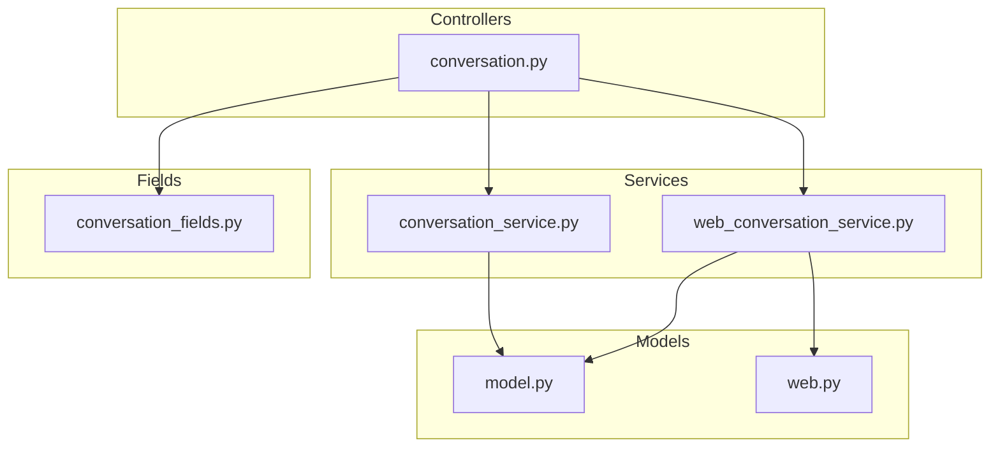
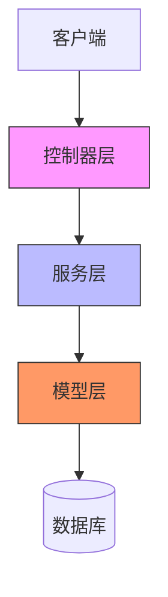
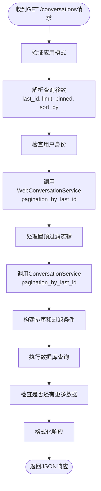
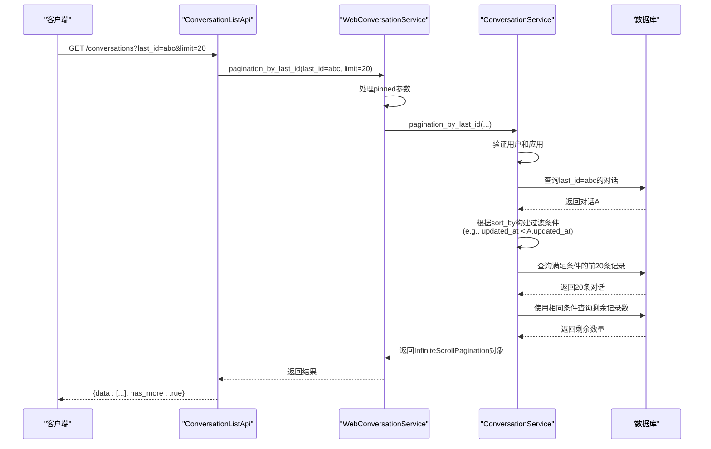
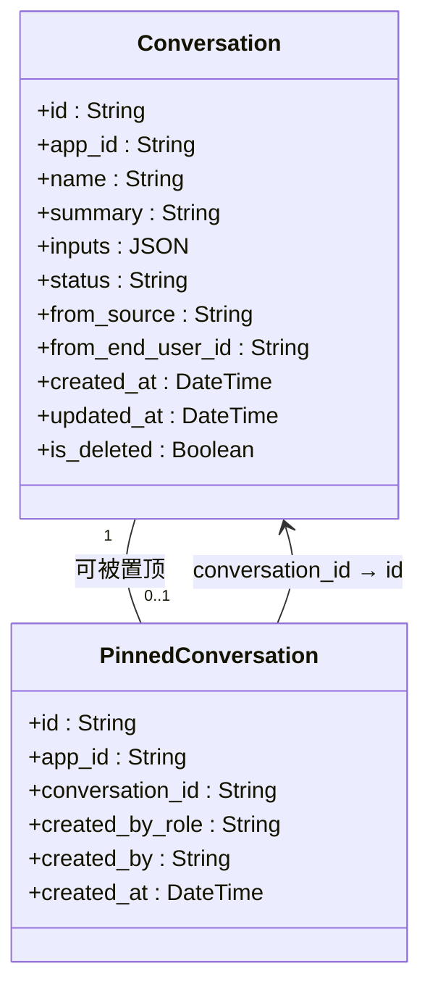
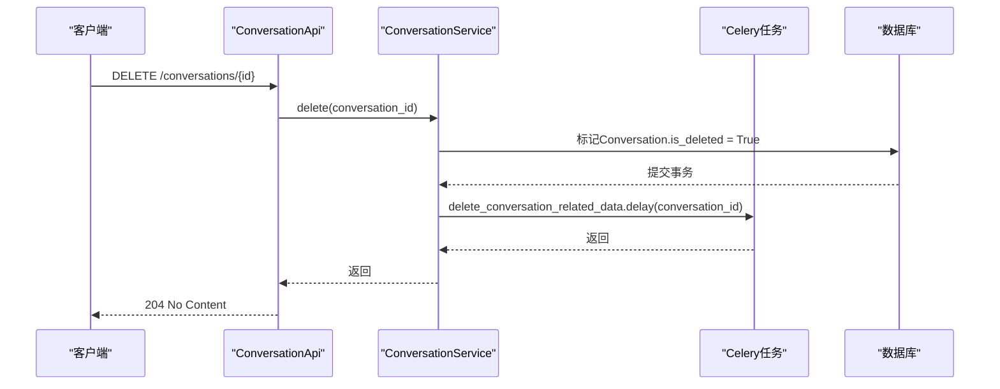
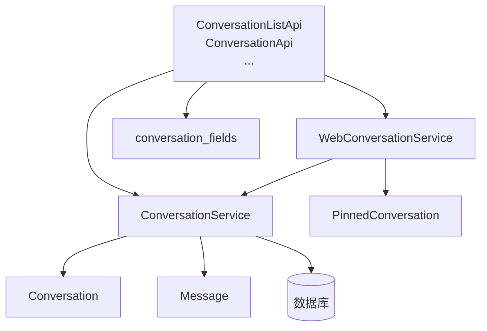

# 对话API

<cite>
**本文档中引用的文件**  
- [conversation.py](file://api/controllers/web/conversation.py)
- [conversation_fields.py](file://api/fields/conversation_fields.py)
- [conversation_service.py](file://api/services/conversation_service.py)
- [web_conversation_service.py](file://api/services/web_conversation_service.py)
- [model.py](file://api/models/model.py)
- [web.py](file://api/models/web.py)
</cite>

## 目录
1. [简介](#简介)
2. [项目结构](#项目结构)
3. [核心组件](#核心组件)
4. [架构概述](#架构概述)
5. [详细组件分析](#详细组件分析)
6. [依赖分析](#依赖分析)
7. [性能考虑](#性能考虑)
8. [故障排除指南](#故障排除指南)
9. [结论](#结论)
10. [附录](#附录)（如有必要）

## 简介
本文档详细介绍了Dify平台中对话API的实现，重点阐述了对话管理功能的设计与实现。文档涵盖了创建对话、获取对话历史、删除对话等核心端点，解释了对话状态的维护机制，包括会话ID的生成与管理。同时，文档详细说明了请求/响应格式，特别是分页处理和错误响应的规范。提供了完整的端点列表，包含HTTP方法、URL路径、请求参数、响应体结构和可能的状态码。此外，文档还包含了实际的curl命令示例和JavaScript调用代码，展示如何在前端应用中集成对话功能，并涵盖了性能考虑，如对话历史的分页策略和数据压缩。

## 项目结构
Dify的API项目结构清晰地组织了对话管理相关的代码。核心的对话API控制器位于`api/controllers/web/conversation.py`，负责处理所有与对话相关的HTTP请求。数据模型定义在`api/models/model.py`和`api/models/web.py`中，而业务逻辑则封装在`api/services/conversation_service.py`和`api/services/web_conversation_service.py`服务类中。响应字段的序列化由`api/fields/conversation_fields.py`定义。



**图示来源**
- [conversation.py](file://api/controllers/web/conversation.py#L1-L141)
- [conversation_service.py](file://api/services/conversation_service.py#L1-L327)
- [web_conversation_service.py](file://api/services/web_conversation_service.py#L1-L113)
- [model.py](file://api/models/model.py#L1-L799)
- [web.py](file://api/models/web.py#L1-L49)
- [conversation_fields.py](file://api/fields/conversation_fields.py#L1-L236)

**本节来源**
- [api/controllers/web/conversation.py](file://api/controllers/web/conversation.py)
- [api/services/conversation_service.py](file://api/services/conversation_service.py)
- [api/models/model.py](file://api/models/model.py)

## 核心组件
对话API的核心组件包括`ConversationListApi`、`ConversationApi`、`ConversationRenameApi`、`ConversationPinApi`和`ConversationUnPinApi`控制器，它们分别处理获取对话列表、删除对话、重命名对话、置顶和取消置顶对话的请求。这些控制器依赖于`ConversationService`和`WebConversationService`服务类来执行具体的业务逻辑，如数据库查询、分页和状态更新。数据模型`Conversation`和`PinnedConversation`定义了对话及其置顶状态的持久化结构。

**本节来源**
- [conversation.py](file://api/controllers/web/conversation.py#L1-L141)
- [conversation_service.py](file://api/services/conversation_service.py#L1-L327)
- [web_conversation_service.py](file://api/services/web_conversation_service.py#L1-L113)
- [model.py](file://api/models/model.py#L1-L799)
- [web.py](file://api/models/web.py#L1-L49)

## 架构概述
Dify对话API采用分层架构，将HTTP请求处理、业务逻辑和数据访问分离。控制器层接收并验证HTTP请求，服务层处理核心业务逻辑，模型层负责与数据库交互。这种设计确保了代码的可维护性和可测试性。



**图示来源**
- [conversation.py](file://api/controllers/web/conversation.py#L1-L141)
- [conversation_service.py](file://api/services/conversation_service.py#L1-L327)
- [model.py](file://api/models/model.py#L1-L799)

## 详细组件分析
本节将深入分析对话API的各个关键组件，包括其设计、实现和交互方式。

### 对话列表与分页分析
`ConversationListApi`提供了一个高效的无限滚动分页机制，用于获取用户的对话历史。它不依赖传统的页码，而是使用`last_id`和`limit`参数来实现性能优化的分页。

#### 对话列表API实现


**图示来源**
- [conversation.py](file://api/controllers/web/conversation.py#L1-L141)
- [web_conversation_service.py](file://api/services/web_conversation_service.py#L1-L113)
- [conversation_service.py](file://api/services/conversation_service.py#L1-L327)

#### 分页逻辑详解
分页的核心在于`ConversationService.pagination_by_last_id`方法。它使用游标分页（Cursor-based Pagination）而非偏移分页（Offset-based Pagination），避免了大数据集下的性能问题。



**图示来源**
- [conversation_service.py](file://api/services/conversation_service.py#L1-L327)
- [web_conversation_service.py](file://api/services/web_conversation_service.py#L1-L113)

**本节来源**
- [conversation.py](file://api/controllers/web/conversation.py#L1-L141)
- [conversation_service.py](file://api/services/conversation_service.py#L1-L327)
- [web_conversation_service.py](file://api/services/web_conversation_service.py#L1-L113)

### 对话状态管理分析
对话状态的维护主要通过`Conversation`模型和`PinnedConversation`模型来实现。会话ID（conversation_id）在创建时由数据库自动生成（使用`uuid_generate_v4()`），确保了全局唯一性。

#### 对话状态与置顶机制


**图示来源**
- [model.py](file://api/models/model.py#L1-L799)
- [web.py](file://api/models/web.py#L1-L49)

#### 置顶/取消置顶流程
```mermaid
flowchart TD
subgraph "置顶 (Pin)"
PinStart([PATCH /conversations/{id}/pin]) --> PinCheck["检查对话是否存在"]
PinCheck --> PinExists["查询PinnedConversation记录"]
PinExists --> |不存在| PinCreate["创建PinnedConversation记录"]
PinCreate --> PinDB["写入数据库"]
PinDB --> PinEnd([返回 success])
PinExists --> |已存在| PinEnd
end
subgraph "取消置顶 (Unpin)"
UnpinStart([PATCH /conversations/{id}/unpin]) --> UnpinCheck["检查对话是否存在"]
UnpinCheck --> UnpinExists["查询PinnedConversation记录"]
UnpinExists --> |存在| UnpinDelete["从数据库删除记录"]
UnpinDelete --> UnpinEnd([返回 success])
UnpinExists --> |不存在| UnpinEnd
end
```

**图示来源**
- [conversation.py](file://api/controllers/web/conversation.py#L1-L141)
- [web_conversation_service.py](file://api/services/web_conversation_service.py#L1-L113)

**本节来源**
- [conversation.py](file://api/controllers/web/conversation.py#L1-L141)
- [web_conversation_service.py](file://api/services/web_conversation_service.py#L1-L113)
- [model.py](file://api/models/model.py#L1-L799)
- [web.py](file://api/models/web.py#L1-L49)

### 对话重命名分析
`ConversationRenameApi`允许用户重命名对话。它支持手动重命名和自动重命名两种模式。

```mermaid
flowchart TD
RenameStart([POST /conversations/{id}/name]) --> ParseBody["解析JSON请求体<br/>(name, auto_generate)"]
ParseBody --> CheckMode["验证应用模式"]
CheckMode --> CheckAuto["检查auto_generate标志"]
CheckAuto --> |true| AutoGen["调用ConversationService.auto_generate_name"]
CheckAuto --> |false| ManualSet["设置conversation.name = name"]
AutoGen --> UpdateDB["更新数据库"]
ManualSet --> UpdateDB
UpdateDB --> ReturnConv["返回更新后的对话信息"]
ReturnConv --> End([返回JSON])
```

**图示来源**
- [conversation.py](file://api/controllers/web/conversation.py#L1-L141)
- [conversation_service.py](file://api/services/conversation_service.py#L1-L327)

**本节来源**
- [conversation.py](file://api/controllers/web/conversation.py#L1-L141)
- [conversation_service.py](file://api/services/conversation_service.py#L1-L327)

### 对话删除分析
`ConversationApi`的`delete`方法用于删除对话。它采用软删除策略，并通过Celery任务异步清理相关数据。



**图示来源**
- [conversation.py](file://api/controllers/web/conversation.py#L1-L141)
- [conversation_service.py](file://api/services/conversation_service.py#L1-L327)
- [tasks/delete_conversation_task.py](file://api/tasks/delete_conversation_task.py)

**本节来源**
- [conversation.py](file://api/controllers/web/conversation.py#L1-L141)
- [conversation_service.py](file://api/services/conversation_service.py#L1-L327)

## 依赖分析
对话API的组件之间存在清晰的依赖关系。控制器依赖于服务，服务依赖于模型和数据库。



**图示来源**
- [conversation.py](file://api/controllers/web/conversation.py#L1-L141)
- [conversation_service.py](file://api/services/conversation_service.py#L1-L327)
- [web_conversation_service.py](file://api/services/web_conversation_service.py#L1-L113)
- [model.py](file://api/models/model.py#L1-L799)
- [web.py](file://api/models/web.py#L1-L49)
- [conversation_fields.py](file://api/fields/conversation_fields.py#L1-L236)

**本节来源**
- [conversation.py](file://api/controllers/web/conversation.py#L1-L141)
- [conversation_service.py](file://api/services/conversation_service.py#L1-L327)
- [web_conversation_service.py](file://api/services/web_conversation_service.py#L1-L113)

## 性能考虑
对话API在设计时充分考虑了性能。

### 分页策略
- **无限滚动分页**：使用`last_id`和`limit`实现，避免了`OFFSET`在大数据集上的性能退化。
- **索引优化**：`Conversation`表在`app_id`, `from_source`, `from_end_user_id`上建立了复合索引，确保查询效率。
- **预计算**：`has_more`字段通过额外的`COUNT`查询预计算，避免了前端的复杂逻辑。

### 数据压缩与传输
- 响应体使用JSON格式，天然支持压缩。
- `simple_conversation_fields`等精简字段集用于列表展示，减少网络传输量。
- 数据库使用`JSON`和`JSONB`类型存储复杂结构，平衡了灵活性和查询性能。

### 异步操作
- 删除操作通过Celery异步任务`delete_conversation_related_data`执行，避免了长时间的HTTP请求阻塞。

**本节来源**
- [conversation_service.py](file://api/services/conversation_service.py#L1-L327)
- [model.py](file://api/models/model.py#L1-L799)

## 故障排除指南
### 常见错误响应
| 状态码 | 错误类型 | 原因 | 解决方案 |
| :--- | :--- | :--- | :--- |
| `404 Not Found` | `NotFound` | 对话ID不存在 | 检查`c_id`参数是否正确 |
| `400 Bad Request` | `ValidationError` | 请求参数格式错误 | 检查`last_id`是否为有效UUID，`limit`是否在1-100之间 |
| `403 Forbidden` | `NotChatAppError` | 应用模式不支持 | 确保应用模式为`chat`, `agent-chat`或`advanced-chat` |

### 调用示例
#### 使用curl获取对话列表
```bash
curl -X GET "http://localhost:5001/v1/conversations?limit=10&sort_by=-updated_at" \
  -H "Authorization: Bearer <your_api_key>"
```

#### 使用JavaScript创建对话（前端集成）
```javascript
// 假设使用fetch API
async function getConversations(lastId = null, limit = 20) {
  const params = new URLSearchParams();
  if (lastId) params.append('last_id', lastId);
  params.append('limit', limit);

  const response = await fetch(`/v1/conversations?${params}`, {
    method: 'GET',
    headers: {
      'Authorization': `Bearer ${apiKey}`,
      'Content-Type': 'application/json'
    }
  });

  if (!response.ok) {
    throw new Error(`HTTP error! status: ${response.status}`);
  }

  return await response.json();
}

// 使用示例
getConversations().then(data => {
  console.log(data);
  // 处理对话列表
});
```

**本节来源**
- [conversation.py](file://api/controllers/web/conversation.py#L1-L141)
- [conversation_service.py](file://api/services/conversation_service.py#L1-L327)
- [conversation_fields.py](file://api/fields/conversation_fields.py#L1-L236)

## 结论
Dify的对话API提供了一套功能完整、性能优良的对话管理接口。其分层架构和清晰的职责划分使得系统易于维护和扩展。通过采用游标分页、异步任务和精简的响应字段，API在处理大量对话数据时依然能保持高效。开发者可以轻松地通过提供的端点集成对话功能到前端应用中。

## 附录
### 完整端点列表

| HTTP方法 | URL路径 | 描述 | 认证要求 |
| :--- | :--- | :--- | :--- |
| `GET` | `/conversations` | 获取对话列表（支持分页和过滤） | 是 |
| `DELETE` | `/conversations/<uuid:c_id>` | 删除指定ID的对话 | 是 |
| `POST` | `/conversations/<uuid:c_id>/name` | 重命名对话 | 是 |
| `PATCH` | `/conversations/<uuid:c_id>/pin` | 置顶对话 | 是 |
| `PATCH` | `/conversations/<uuid:c_id>/unpin` | 取消置顶对话 | 是 |

### 请求/响应格式
- **请求参数**：主要通过URL查询参数（如`last_id`, `limit`）和JSON请求体（如`name`, `auto_generate`）传递。
- **响应体**：遵循统一的JSON格式，包含`data`数组和分页信息（`has_more`）。
- **错误响应**：返回标准的HTTP状态码和错误信息。