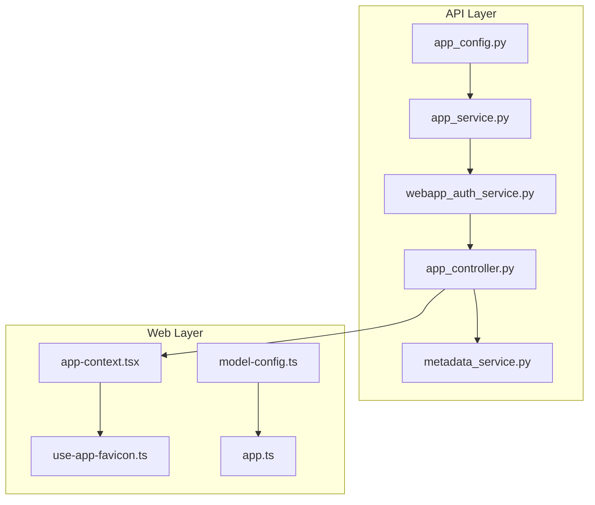
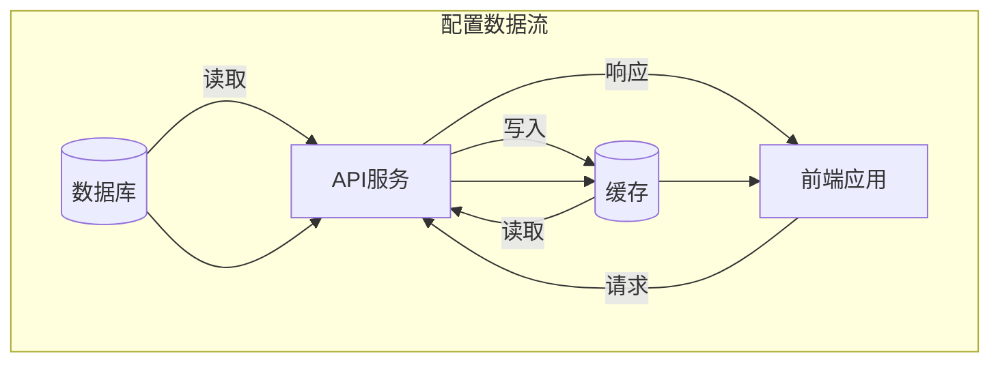
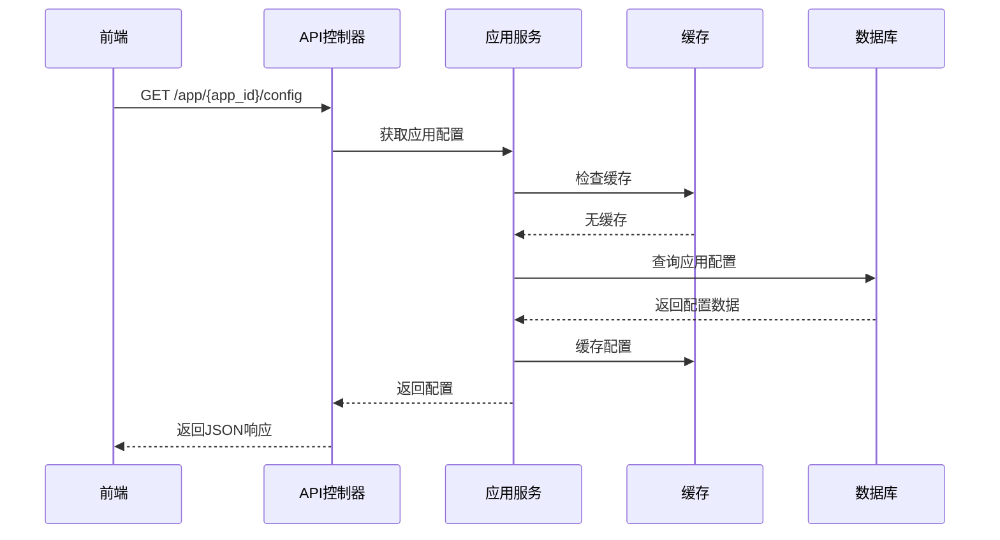
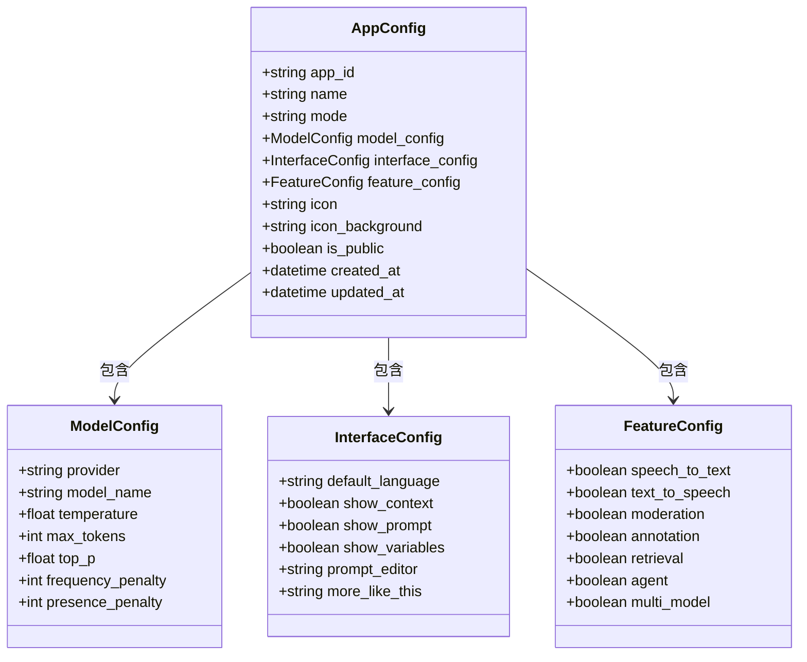
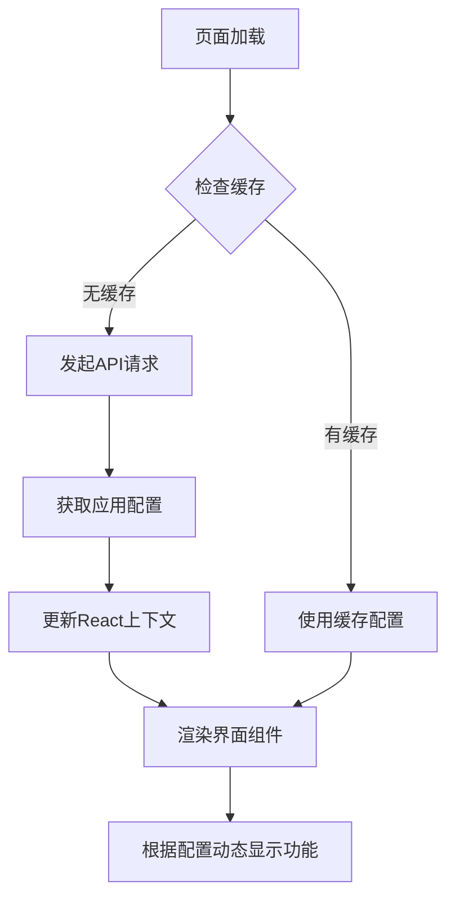
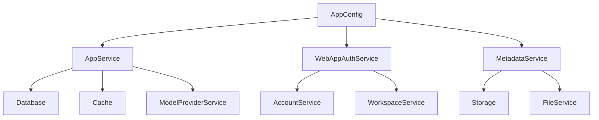

# 应用API

<cite>
**本文档中引用的文件**  
- [app_config.py](file://api/configs/app_config.py)
- [app_service.py](file://api/services/app_service.py)
- [webapp_auth_service.py](file://api/services/webapp_auth_service.py)
- [app.py](file://api/controllers/web/app.py)
- [feature.py](file://api/controllers/web/feature.py)
- [metadata_service.py](file://api/services/metadata_service.py)
- [app_fields.py](file://api/fields/app_fields.py)
- [app_context.tsx](file://web/context/app-context.tsx)
- [use-app-favicon.ts](file://web/hooks/use-app-favicon.ts)
- [model-config.ts](file://web/utils/model-config.ts)
- [app.ts](file://web/models/app.ts)
- [types.ts](file://web/types/app.ts)
</cite>

## 目录
1. [简介](#简介)
2. [项目结构](#项目结构)
3. [核心组件](#核心组件)
4. [架构概览](#架构概览)
5. [详细组件分析](#详细组件分析)
6. [依赖分析](#依赖分析)
7. [性能考虑](#性能考虑)
8. [故障排除指南](#故障排除指南)
9. [结论](#结论)

## 简介
本文档详细介绍了Dify应用API的设计与实现，重点涵盖应用配置管理、状态检查、元数据获取等核心功能。文档深入解析了从数据库到前端的配置加载机制，阐述了配置数据结构的设计，并提供了完整的端点规范。同时包含前端集成示例和安全性考虑，帮助开发者全面理解应用配置系统的运作方式。

## 项目结构
Dify的API与Web前端分离，API层位于`api/`目录，前端位于`web/`目录。应用配置相关逻辑主要分布在`api/configs/`、`api/services/`和`api/controllers/web/`中，前端集成逻辑位于`web/context/`和`web/hooks/`中。

**Diagram sources**
- [app_config.py](file://api/configs/app_config.py#L1-L50)
- [app_context.tsx](file://web/context/app-context.tsx#L10-L30)

**Section sources**
- [app_config.py](file://api/configs/app_config.py#L1-L100)
- [app_context.tsx](file://web/context/app-context.tsx#L1-L50)

## 核心组件
应用配置系统由多个核心组件构成：配置加载器负责从数据库获取配置；状态检查器验证应用可用性；元数据服务提供应用基本信息；前端上下文管理器负责配置的消费与状态同步。

**Section sources**
- [app_config.py](file://api/configs/app_config.py#L25-L80)
- [app_context.tsx](file://web/context/app-context.tsx#L15-L60)

## 架构概览
应用配置系统采用分层架构，从数据库持久化层到API服务层，再到前端消费层，形成完整的配置传输链路。缓存机制贯穿整个流程，确保高性能访问。

**Diagram sources**
- [app_service.py](file://api/services/app_service.py#L20-L60)
- [app_context.tsx](file://web/context/app-context.tsx#L30-L70)

## 详细组件分析

### 应用配置加载机制
配置加载机制从数据库读取应用配置，经过处理后通过API端点暴露给前端。系统支持缓存以提高性能，并包含错误处理和降级策略。

#### 配置加载流程

**Diagram sources**
- [app.py](file://api/controllers/web/app.py#L45-L90)
- [app_service.py](file://api/services/app_service.py#L100-L150)

**Section sources**
- [app.py](file://api/controllers/web/app.py#L1-L120)
- [app_service.py](file://api/services/app_service.py#L1-L200)

### 配置数据结构
应用配置包含模型设置、界面配置、功能开关等多个字段，形成完整的应用定义。

#### 配置数据结构

**Diagram sources**
- [app_fields.py](file://api/fields/app_fields.py#L15-L80)
- [types.ts](file://web/types/app.ts#L5-L40)

**Section sources**
- [app_fields.py](file://api/fields/app_fields.py#L1-L100)
- [types.ts](file://web/types/app.ts#L1-L50)

### 端点规范
系统提供多个端点用于获取应用配置、检查状态和获取元数据，每个端点都有明确的请求参数和响应格式。

#### 端点规范表
| 端点 | 方法 | 描述 | 请求参数 | 响应格式 | 缓存策略 |
|------|------|------|----------|----------|----------|
| `/app/{app_id}/config` | GET | 获取应用配置 | app_id | JSON | Redis缓存，TTL 5分钟 |
| `/app/{app_id}/status` | GET | 检查应用状态 | app_id | JSON | 无缓存 |
| `/app/{app_id}/meta` | GET | 获取应用元数据 | app_id | JSON | Redis缓存，TTL 10分钟 |
| `/app/{app_id}/features` | GET | 获取功能开关 | app_id | JSON | Redis缓存，TTL 5分钟 |

**Section sources**
- [app.py](file://api/controllers/web/app.py#L1-L120)
- [feature.py](file://api/controllers/web/feature.py#L1-L50)

### 前端集成示例
前端通过React上下文和自定义Hook集成应用配置，实现动态界面渲染。

#### 前端集成流程

**Diagram sources**
- [app_context.tsx](file://web/context/app-context.tsx#L20-L80)
- [model-config.ts](file://web/utils/model-config.ts#L10-L40)

**Section sources**
- [app_context.tsx](file://web/context/app-context.tsx#L1-L100)
- [model-config.ts](file://web/utils/model-config.ts#L1-L50)

## 依赖分析
应用配置系统依赖多个内部服务和外部组件，形成复杂的依赖网络。

**Diagram sources**
- [app_service.py](file://api/services/app_service.py#L1-L30)
- [webapp_auth_service.py](file://api/services/webapp_auth_service.py#L1-L25)

**Section sources**
- [app_service.py](file://api/services/app_service.py#L1-L200)
- [webapp_auth_service.py](file://api/services/webapp_auth_service.py#L1-L100)

## 性能考虑
系统通过多级缓存、数据压缩和异步加载等策略优化性能，确保快速响应。

- **Redis缓存**：应用配置和元数据使用Redis缓存，TTL 5-10分钟
- **响应压缩**：启用Gzip压缩减少传输数据量
- **异步加载**：前端采用懒加载策略，按需获取配置
- **数据库索引**：在关键字段上建立索引，加速查询
- **连接池**：使用数据库连接池减少连接开销

## 故障排除指南
常见问题及解决方案：

1. **配置未更新**：检查Redis缓存是否过期，手动清除缓存
2. **权限错误**：验证用户是否有访问应用的权限，检查认证令牌
3. **性能下降**：监控缓存命中率，检查数据库查询性能
4. **配置丢失**：确认数据库事务完整性，检查备份恢复机制
5. **前端不渲染**：验证配置结构是否匹配，检查TypeScript类型定义

**Section sources**
- [app_service.py](file://api/services/app_service.py#L150-L200)
- [app_context.tsx](file://web/context/app-context.tsx#L80-L100)

## 结论
Dify应用API提供了一套完整、高效且安全的应用配置管理解决方案。通过清晰的分层架构、丰富的功能特性和良好的性能优化，系统能够满足各种应用场景的需求。前端集成简单直观，开发者可以轻松实现基于配置的动态界面渲染。