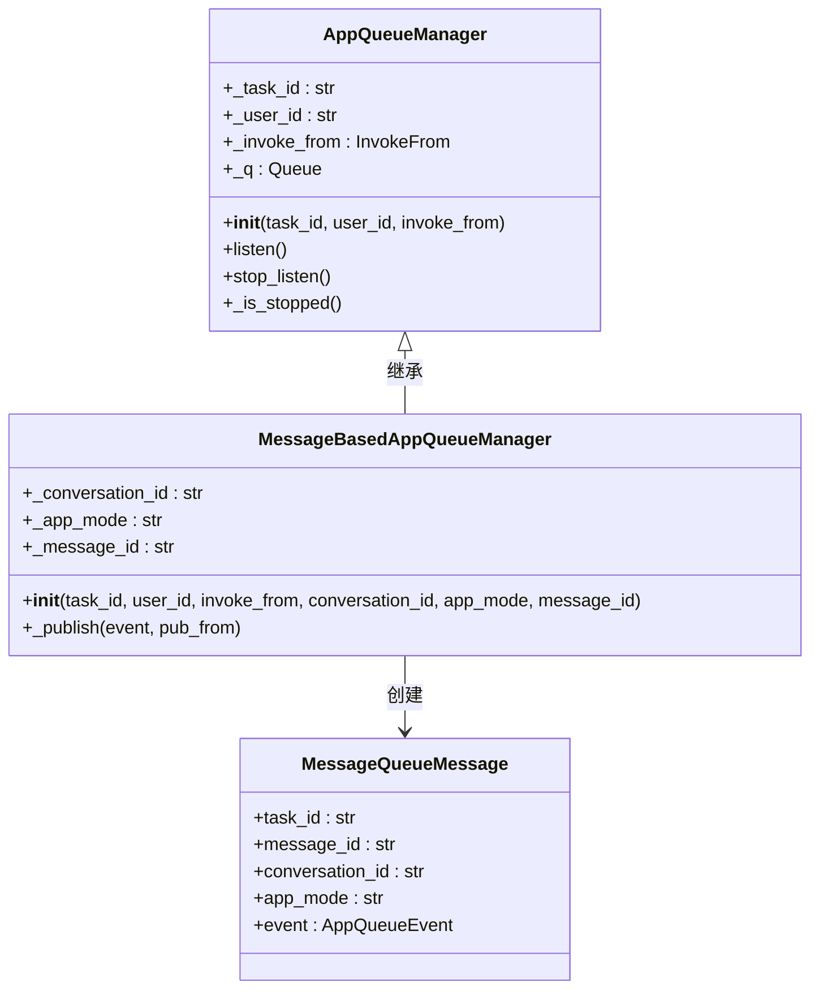
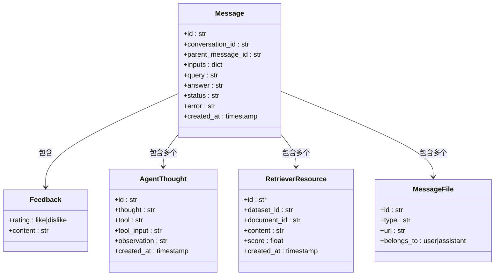
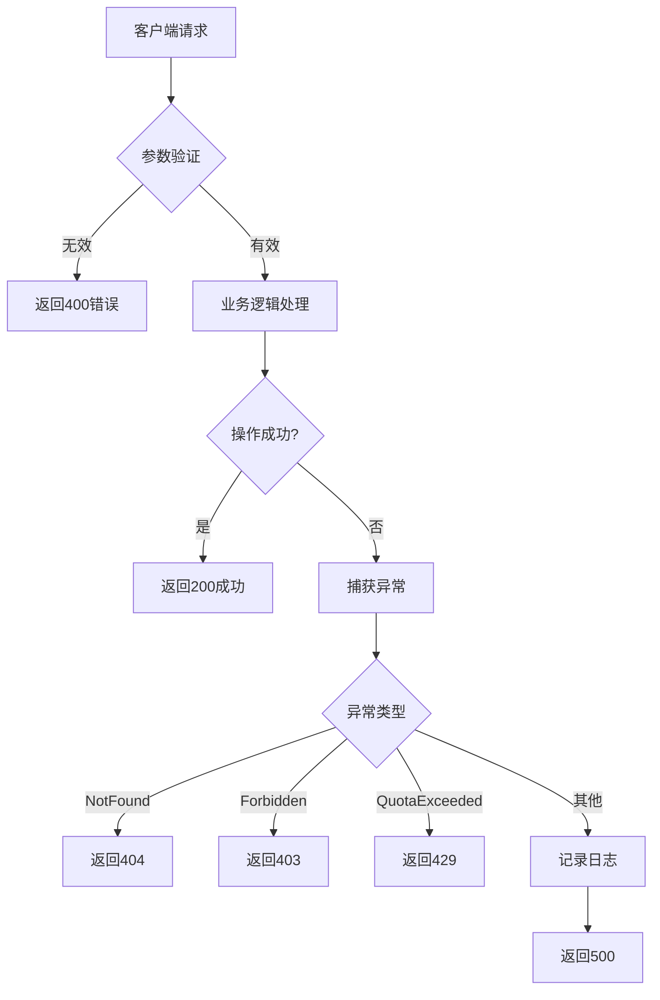
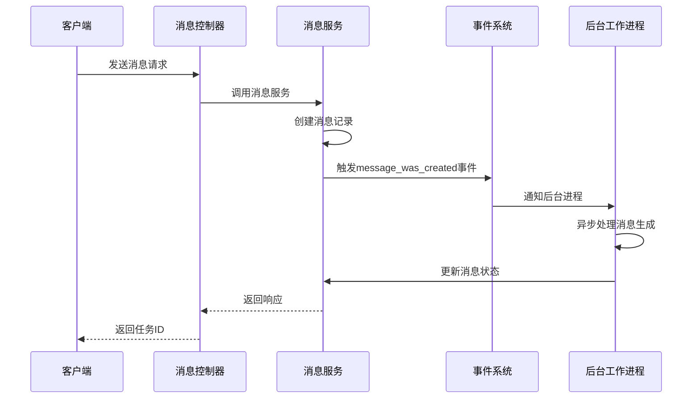

# 消息API

<cite>
**本文档中引用的文件**  
- [message.py](file://api/controllers/web/message.py)
- [message_service.py](file://api/services/message_service.py)
- [message_based_app_queue_manager.py](file://api/core/app/apps/message_based_app_queue_manager.py)
- [message_cycle_manager.py](file://api/core/app/task_pipeline/message_cycle_manager.py)
- [message_fields.py](file://api/fields/message_fields.py)
- [message_event.py](file://api/events/message_event.py)
</cite>

## 目录
1. [简介](#简介)
2. [核心功能](#核心功能)
3. [端点规范](#端点规范)
4. [消息队列处理机制](#消息队列处理机制)
5. [消息格式设计](#消息格式设计)
6. [调用示例](#调用示例)
7. [可靠性与错误处理](#可靠性与错误处理)
8. [事件系统集成](#事件系统集成)

## 简介

Dify的消息API为聊天应用提供了完整的消息发送、管理与交互功能。该API支持异步消息处理、历史消息获取、用户反馈提交以及智能建议生成等功能，适用于聊天、问答和智能代理等多种应用场景。系统通过消息队列实现异步处理，确保高并发下的响应性能和系统稳定性。

## 核心功能

Dify消息API的核心功能包括：
- 发送新消息并启动异步生成流程
- 分页获取会话中的消息历史记录
- 提交用户对消息的反馈（点赞/点踩）
- 获取基于上一条消息的智能建议问题
- 支持“更多类似”功能，生成与特定消息相似的新内容

这些功能通过Web控制器、服务层和任务管道的协同工作实现，确保了功能的可扩展性和系统的解耦。

**本节来源**  
- [message.py](file://api/controllers/web/message.py#L0-L200)
- [message_service.py](file://api/services/message_service.py#L0-L300)

## 端点规范

### 获取消息历史

**方法**: `GET /messages`  
**描述**: 分页获取指定会话中的消息历史记录，支持无限滚动分页。

**请求参数**:
- `conversation_id` (必需): 会话ID
- `first_id` (可选): 起始消息ID，用于分页
- `limit` (可选): 每页数量，默认20，最大100

**响应结构**:
```json
{
  "limit": 20,
  "has_more": true,
  "data": [
    {
      "id": "string",
      "conversation_id": "string",
      "parent_message_id": "string",
      "inputs": {},
      "query": "string",
      "answer": "string",
      "message_files": [...],
      "feedback": { "rating": "like|dislike" },
      "retriever_resources": [...],
      "created_at": 1700000000,
      "agent_thoughts": [...],
      "status": "normal|error",
      "error": "string"
    }
  ]
}
```

**状态码**:
- `200`: 成功
- `404`: 会话或首条消息不存在

### 提交消息反馈

**方法**: `POST /messages/{message_id}/feedbacks`  
**描述**: 为指定消息提交用户反馈。

**请求体**:
```json
{
  "rating": "like|dislike",
  "content": "optional feedback text"
}
```

**响应**:
```json
{ "result": "success" }
```

**状态码**:
- `200`: 成功
- `404`: 消息不存在

### 获取智能建议问题

**方法**: `GET /messages/{message_id}/suggested-questions`  
**描述**: 获取基于指定消息回答的智能建议问题。

**响应**:
```json
{ "data": ["问题1", "问题2", "问题3"] }
```

**状态码**:
- `200`: 成功
- `404`: 消息或会话不存在
- `403`: 当前应用模式不支持此功能

### 生成更多类似内容

**方法**: `GET /messages/{message_id}/more-like-this`  
**描述**: 基于指定消息生成更多类似的内容。

**查询参数**:
- `response_mode`: `blocking` 或 `streaming`

**响应**: 流式或阻塞模式的生成响应

**状态码**:
- `200`: 成功
- `403`: 非补全模式应用或功能禁用

**本节来源**  
- [message.py](file://api/controllers/web/message.py#L0-L200)
- [message_fields.py](file://api/fields/message_fields.py#L0-L77)

## 消息队列处理机制

Dify采用消息队列机制实现异步处理，确保消息生成过程的高效性和可靠性。



**图示来源**  
- [message_based_app_queue_manager.py](file://api/core/app/apps/message_based_app_queue_manager.py#L0-L47)

### 处理流程

1. **消息发布**: 通过 `_publish` 方法将事件封装为 `MessageQueueMessage` 并放入队列
2. **事件监听**: `listen()` 方法持续从队列中消费消息
3. **终止条件**: 当收到 `QueueStopEvent`、`QueueErrorEvent` 等终止事件时，停止监听
4. **异常传播**: 若任务已被停止，则抛出 `GenerateTaskStoppedError`

该机制支持流式响应和阻塞响应两种模式，通过 `PublishFrom` 枚举区分消息来源（应用管理器或任务管道）。

**本节来源**  
- [message_based_app_queue_manager.py](file://api/core/app/apps/message_based_app_queue_manager.py#L0-L47)
- [base_app_queue_manager.py](file://api/core/app/apps/base_app_queue_manager.py#L0-L48)

## 消息格式设计

消息API采用结构化设计，支持文本、文件、元数据等多种内容类型。



**图示来源**  
- [message_fields.py](file://api/fields/message_fields.py#L0-L77)
- [message_service.py](file://api/services/message_service.py#L0-L300)

### 字段说明

| 字段 | 类型 | 说明 |
|------|------|------|
| `id` | string | 消息唯一标识 |
| `conversation_id` | string | 所属会话ID |
| `parent_message_id` | string | 父消息ID，用于构建对话树 |
| `inputs` | object | 用户输入参数 |
| `query` | string | 用户提问内容 |
| `answer` | string | 系统回答内容 |
| `message_files` | array | 关联的文件列表 |
| `feedback` | object | 用户反馈信息 |
| `retriever_resources` | array | 检索到的知识库资源 |
| `agent_thoughts` | array | 智能代理的思考过程 |
| `created_at` | timestamp | 创建时间 |
| `status` | string | 消息状态（normal/error） |
| `error` | string | 错误信息（当状态为error时） |

**本节来源**  
- [message_fields.py](file://api/fields/message_fields.py#L0-L77)

## 调用示例

### 获取消息历史

```bash
curl -X GET "https://api.dify.ai/v1/messages?conversation_id=conv_123&limit=10" \
  -H "Authorization: Bearer {api_key}"
```

### 提交反馈

```bash
curl -X POST "https://api.dify.ai/v1/messages/msg_123/feedbacks" \
  -H "Authorization: Bearer {api_key}" \
  -H "Content-Type: application/json" \
  -d '{
    "rating": "like",
    "content": "回答很有帮助"
  }'
```

### 获取建议问题

```javascript
// Node.js SDK 示例
const dify = new DifyClient(apiKey);
const questions = await dify.getSuggested('msg_123', 'user_123');
console.log(questions.data);
```

```python
# Python SDK 示例
from dify_client import DifyClient

client = DifyClient(api_key="your-api-key")
response = client.get_suggested_questions(message_id="msg_123", user="user_123")
print(response['data'])
```

**本节来源**  
- [message.py](file://api/controllers/web/message.py#L0-L200)
- [nodejs-client/index.js](file://sdks/nodejs-client/index.js#L237-L294)
- [web/service/share.ts](file://web/service/share.ts#L266-L288)

## 可靠性与错误处理

### 错误处理策略

系统实现了分层的错误处理机制：



**图示来源**  
- [message.py](file://api/controllers/web/message.py#L0-L200)
- [message_service.py](file://api/services/message_service.py#L0-L300)

### 重试机制

- **客户端重试**: 建议在收到5xx错误时进行指数退避重试
- **服务端重试**: 消息队列支持任务重试，失败任务可重新入队
- **状态跟踪**: 通过 `task_id` 跟踪消息生成状态，支持中断和恢复

### 异常类型

| 异常 | HTTP状态码 | 说明 |
|------|------------|------|
| `ConversationNotExistsError` | 404 | 会话不存在 |
| `MessageNotExistsError` | 404 | 消息不存在 |
| `ProviderNotInitializeError` | 403 | 模型提供者未初始化 |
| `ProviderQuotaExceededError` | 429 | API配额超限 |
| `CompletionRequestError` | 400 | 补全请求错误 |
| `InternalServerError` | 500 | 服务器内部错误 |

**本节来源**  
- [message.py](file://api/controllers/web/message.py#L0-L200)
- [message_service.py](file://api/services/message_service.py#L0-L300)

## 事件系统集成

Dify通过事件系统实现组件间的松耦合通信。



**图示来源**  
- [message_event.py](file://api/events/message_event.py#L0-L4)
- [message_service.py](file://api/services/message_service.py#L0-L300)

### 事件生命周期

1. **消息创建**: 当新消息被创建时，触发 `message_was_created` 事件
2. **异步处理**: 事件被监听器捕获，启动后台任务处理
3. **状态更新**: 处理过程中通过队列更新消息状态
4. **完成通知**: 处理完成后更新消息内容和状态

这种设计实现了请求处理与消息生成的解耦，提高了系统的可扩展性和响应速度。

**本节来源**  
- [message_event.py](file://api/events/message_event.py#L0-L4)
- [message_cycle_manager.py](file://api/core/app/task_pipeline/message_cycle_manager.py#L0-L211)