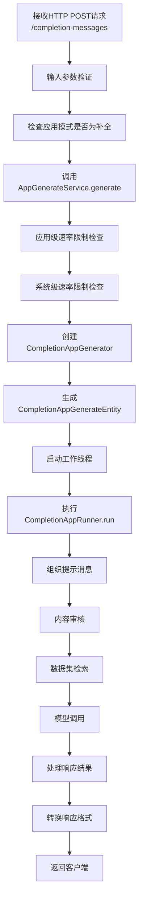
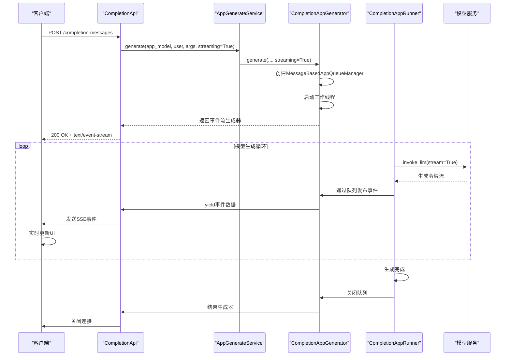
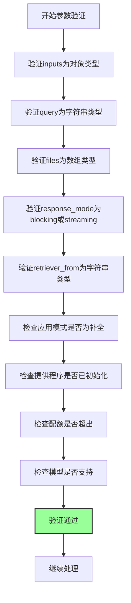
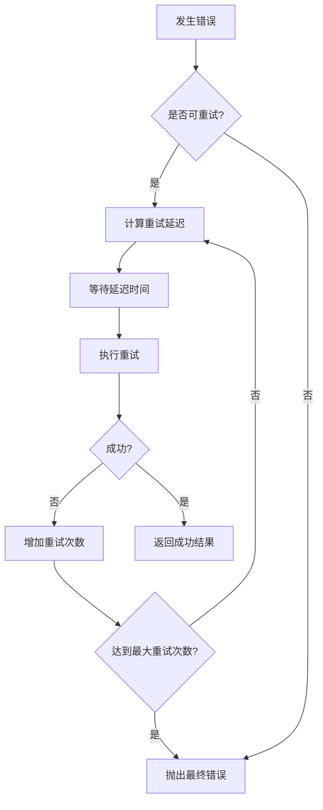
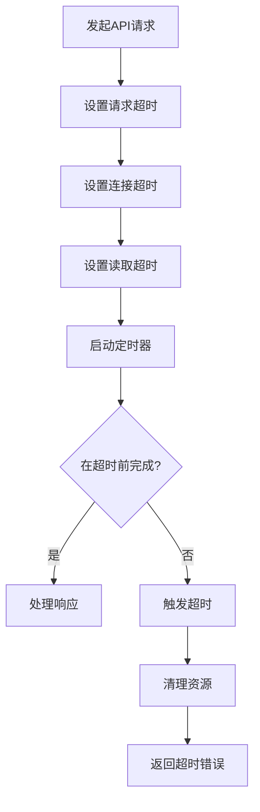
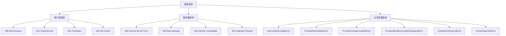
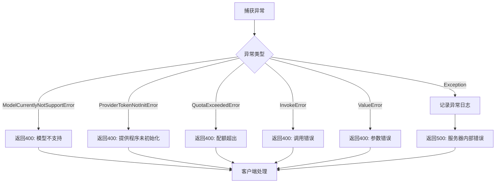

# 补全API

<cite>
**本文档引用的文件**
- [completion.py](file://api/controllers/web/completion.py)
- [app_generate_service.py](file://api/services/app_generate_service.py)
- [app_generator.py](file://api/core/app/apps/completion/app_generator.py)
- [app_runner.py](file://api/core/app/apps/completion/app_runner.py)
- [app_config_manager.py](file://api/core/app/apps/completion/app_config_manager.py)
</cite>

## 目录
1. [简介](#简介)
2. [补全请求处理流程](#补全请求处理流程)
3. [流式响应机制](#流式响应机制)
4. [请求参数设计](#请求参数设计)
5. [端点规范](#端点规范)
6. [前端调用示例](#前端调用示例)
7. [性能优化建议](#性能优化建议)
8. [错误处理](#错误处理)
9. [总结](#总结)

## 简介

补全API是Dify平台的核心功能之一，用于处理文本补全请求。该API支持阻塞和流式两种响应模式，能够处理用户输入、文件上传、模型调用等复杂场景。API通过分层架构设计，实现了输入验证、权限控制、速率限制、内容审核和模型调用等关键功能。

**Section sources**
- [completion.py](file://api/controllers/web/completion.py#L1-L237)

## 补全请求处理流程

补全请求的处理流程采用分层架构设计，从HTTP请求接收开始，经过多层服务调用，最终完成模型推理并返回结果。



**Diagram sources**
- [completion.py](file://api/controllers/web/completion.py#L15-L50)
- [app_generate_service.py](file://api/services/app_generate_service.py#L20-L50)
- [app_generator.py](file://api/core/app/apps/completion/app_generator.py#L20-L50)
- [app_runner.py](file://api/core/app/apps/completion/app_runner.py#L20-L50)

**Section sources**
- [completion.py](file://api/controllers/web/completion.py#L15-L50)
- [app_generate_service.py](file://api/services/app_generate_service.py#L20-L50)
- [app_generator.py](file://api/core/app/apps/completion/app_generator.py#L20-L50)
- [app_runner.py](file://api/core/app/apps/completion/app_runner.py#L20-L50)

## 流式响应机制

补全API支持流式响应，通过Server-Sent Events (SSE)技术实现实时文本生成。流式响应允许客户端在服务器生成内容的同时逐步接收和显示结果，提供更好的用户体验。

### SSE实现原理



**Diagram sources**
- [completion.py](file://api/controllers/web/completion.py#L15-L50)
- [app_generator.py](file://api/core/app/apps/completion/app_generator.py#L20-L50)
- [app_runner.py](file://api/core/app/apps/completion/app_runner.py#L20-L50)

**Section sources**
- [completion.py](file://api/controllers/web/completion.py#L15-L50)
- [app_generator.py](file://api/core/app/apps/completion/app_generator.py#L20-L50)
- [app_runner.py](file://api/core/app/apps/completion/app_runner.py#L20-L50)

## 请求参数设计

补全API的请求参数设计充分考虑了灵活性和易用性，支持多种输入类型和配置选项。

### 主要请求参数

| 参数名 | 类型 | 必需 | 描述 | 示例 |
|-------|------|------|------|------|
| inputs | object | 是 | 输入变量，用于填充提示模板 | {"name": "张三", "age": 30} |
| query | string | 否 | 查询文本，作为补全的上下文 | "请写一封邮件" |
| files | array | 否 | 文件列表，支持文件上传和处理 | [{"type": "image", "upload_file_id": "xxx"}] |
| response_mode | string | 否 | 响应模式：blocking或streaming | "streaming" |
| retriever_from | string | 否 | 检索来源 | "web_app" |

### 参数验证机制



**Diagram sources**
- [completion.py](file://api/controllers/web/completion.py#L25-L50)
- [app_generate_service.py](file://api/services/app_generate_service.py#L30-L50)

**Section sources**
- [completion.py](file://api/controllers/web/completion.py#L25-L50)
- [app_generate_service.py](file://api/services/app_generate_service.py#L30-L50)

## 端点规范

### 补全消息端点

#### 创建补全消息
- **URL**: `/completion-messages`
- **方法**: POST
- **认证**: 需要有效的API密钥

**请求头**
| 头部 | 值 | 描述 |
|------|-----|------|
| Content-Type | application/json | 请求体格式 |
| Authorization | Bearer {api_key} | API密钥 |

**请求体参数**
```json
{
  "inputs": {
    "variable1": "value1",
    "variable2": "value2"
  },
  "query": "用户查询文本",
  "files": [
    {
      "type": "image",
      "upload_file_id": "file-123"
    }
  ],
  "response_mode": "streaming",
  "retriever_from": "web_app"
}
```

**响应格式**

**阻塞模式响应**
```json
{
  "task_id": "task-123",
  "data": {
    "id": "msg-123",
    "answer": "生成的完整文本",
    "created_at": 1640995200,
    "from_source": "api",
    "from_end_user_id": "user-123",
    "message_id": "msg-123",
    "mode": "completion",
    "model_response": {
      "model": "gpt-3.5-turbo",
      "provider": "openai",
      "usage": {
        "prompt_tokens": 100,
        "completion_tokens": 50,
        "total_tokens": 150
      }
    },
    "parent_message_id": null,
    "query": "用户查询文本",
    "result": "succeeded",
    "status": "normal",
    "tokens": 50,
    "total_tokens": 150,
    "type": "answer"
  }
}
```

**流式模式响应**
```
event: message
data: {"event": "message", "data": {"id": "msg-123", "text": "第一段文本", "is_finished": false}}

event: message
data: {"event": "message", "data": {"id": "msg-123", "text": "第二段文本", "is_finished": false}}

event: message
data: {"event": "message", "data": {"id": "msg-123", "text": "完整文本", "is_finished": true, "metadata": {...}}}

event: end
data: {"event": "end"}
```

**状态码**
| 状态码 | 描述 |
|-------|------|
| 200 | 成功 |
| 400 | 请求参数错误 |
| 401 | 未授权 |
| 403 | 禁止访问 |
| 404 | 应用未找到 |
| 500 | 服务器内部错误 |

#### 停止补全消息
- **URL**: `/completion-messages/{task_id}/stop`
- **方法**: POST
- **认证**: 需要有效的API密钥

**路径参数**
| 参数 | 描述 |
|------|------|
| task_id | 要停止的任务ID |

**响应**
```json
{
  "result": "success"
}
```

**Section sources**
- [completion.py](file://api/controllers/web/completion.py#L15-L100)

## 前端调用示例

### 流式响应处理

```javascript
async function callCompletionAPI() {
  const response = await fetch('/completion-messages', {
    method: 'POST',
    headers: {
      'Content-Type': 'application/json',
      'Authorization': 'Bearer YOUR_API_KEY'
    },
    body: JSON.stringify({
      inputs: {
        name: '张三',
        age: 30
      },
      query: '请写一封介绍信',
      response_mode: 'streaming'
    })
  });

  if (!response.ok) {
    throw new Error(`HTTP error! status: ${response.status}`);
  }

  // 检查是否为流式响应
  if (response.headers.get('content-type') === 'text/event-stream') {
    const reader = response.body.getReader();
    const decoder = new TextDecoder('utf-8');
    let result = '';

    while (true) {
      const { done, value } = await reader.read();
      
      if (done) break;
      
      const chunk = decoder.decode(value);
      const lines = chunk.split('\n').filter(line => line.trim() !== '');
      
      for (const line of lines) {
        if (line.startsWith('data: ')) {
          try {
            const data = JSON.parse(line.substring(6));
            
            if (data.event === 'message') {
              const text = data.data.text || '';
              result += text;
              
              // 实时更新UI
              updateUI(result);
              
              if (data.data.is_finished) {
                // 处理完成事件
                handleCompletion(data.data.metadata);
              }
            } else if (data.event === 'error') {
              // 处理错误事件
              handleError(data.data);
            } else if (data.event === 'end') {
              // 处理结束事件
              handleEnd();
            }
          } catch (e) {
            console.error('解析SSE数据失败:', e);
          }
        }
      }
    }
  } else {
    // 处理阻塞模式响应
    const data = await response.json();
    updateUI(data.data.answer);
  }
}

function updateUI(text) {
  document.getElementById('result').innerHTML = text.replace(/\n/g, '<br>');
}

function handleError(error) {
  console.error('API调用错误:', error);
  document.getElementById('error').textContent = error.message;
}

function handleEnd() {
  console.log('补全完成');
  document.getElementById('status').textContent = '完成';
}
```

### 连接保持和重试机制

```javascript
class CompletionAPIClient {
  constructor(apiKey, baseUrl = '/api') {
    this.apiKey = apiKey;
    this.baseUrl = baseUrl;
    this.maxRetries = 3;
    this.retryDelay = 1000;
  }

  async call(prompt, options = {}) {
    const { 
      inputs = {}, 
      streaming = true, 
      timeout = 30000 
    } = options;

    let retries = 0;
    
    while (retries <= this.maxRetries) {
      try {
        return await this._makeRequest(prompt, inputs, streaming, timeout);
      } catch (error) {
        retries++;
        
        if (retries > this.maxRetries || !this._isRetryableError(error)) {
          throw error;
        }
        
        // 指数退避
        const delay = this.retryDelay * Math.pow(2, retries - 1);
        console.log(`请求失败，${delay}ms后重试 (${retries}/${this.maxRetries})`);
        
        await this._sleep(delay);
      }
    }
  }

  async _makeRequest(prompt, inputs, streaming, timeout) {
    const controller = new AbortController();
    const timeoutId = setTimeout(() => controller.abort(), timeout);

    try {
      const response = await fetch(`${this.baseUrl}/completion-messages`, {
        method: 'POST',
        headers: {
          'Content-Type': 'application/json',
          'Authorization': `Bearer ${this.apiKey}`
        },
        body: JSON.stringify({
          inputs,
          query: prompt,
          response_mode: streaming ? 'streaming' : 'blocking'
        }),
        signal: controller.signal
      });

      clearTimeout(timeoutId);

      if (!response.ok) {
        throw new Error(`HTTP ${response.status}: ${response.statusText}`);
      }

      return response;
    } catch (error) {
      clearTimeout(timeoutId);
      
      if (error.name === 'AbortError') {
        throw new Error('请求超时');
      }
      
      throw error;
    }
  }

  _isRetryableError(error) {
    // 5xx服务器错误和网络错误可重试
    return error.message.includes('5') || 
           error.name === 'TypeError' || 
           error.name === 'NetworkError';
  }

  _sleep(ms) {
    return new Promise(resolve => setTimeout(resolve, ms));
  }
}

// 使用示例
const client = new CompletionAPIClient('your-api-key');

try {
  const response = await client.call('请写一篇关于AI的文章', {
    inputs: { topic: '人工智能' },
    streaming: true
  });

  if (response.headers.get('content-type') === 'text/event-stream') {
    // 处理流式响应
    await processStream(response);
  } else {
    // 处理阻塞响应
    const data = await response.json();
    console.log(data.data.answer);
  }
} catch (error) {
  console.error('调用失败:', error.message);
}
```

**Section sources**
- [completion.py](file://api/controllers/web/completion.py#L15-L50)

## 性能优化建议

### 连接保持


**建议配置：**
- 最大连接数：50-100
- 连接超时：30秒
- 空闲连接超时：60秒
- 启用Keep-Alive

### 错误重试策略



**重试策略参数：**
- 最大重试次数：3次
- 初始延迟：1秒
- 指数退避：2倍增长
- 最大延迟：30秒
- 可重试错误：5xx服务器错误、网络超时、连接拒绝

### 超时处理



**超时配置建议：**
- 连接超时：5秒
- 请求超时：30秒（阻塞模式）
- 流式响应超时：300秒
- 心跳间隔：30秒（检测连接状态）

**Section sources**
- [completion.py](file://api/controllers/web/completion.py#L15-L50)
- [app_generate_service.py](file://api/services/app_generate_service.py#L20-L50)

## 错误处理

### 错误类型分类



### 错误处理流程



### 常见错误码

| 错误码 | HTTP状态码 | 描述 | 解决方案 |
|-------|-----------|------|---------|
| NotCompletionAppError | 400 | 应用模式不是补全 | 检查应用配置 |
| ProviderNotInitializeError | 400 | 提供程序未初始化 | 配置模型提供程序 |
| ProviderQuotaExceededError | 400 | 配额超出 | 升级订阅或等待重置 |
| ProviderModelCurrentlyNotSupportError | 400 | 模型不支持 | 选择支持的模型 |
| CompletionRequestError | 400 | 补全请求错误 | 检查请求参数 |
| InvokeRateLimitError | 429 | 调用频率超限 | 降低请求频率 |
| InternalServerError | 500 | 服务器内部错误 | 联系技术支持 |

**Section sources**
- [completion.py](file://api/controllers/web/completion.py#L50-L100)
- [app_generate_service.py](file://api/services/app_generate_service.py#L50-L100)

## 总结

Dify补全API提供了一套完整的文本生成解决方案，具有以下特点：

1. **灵活的请求处理**：支持阻塞和流式两种模式，满足不同场景需求
2. **完善的错误处理**：详细的错误分类和清晰的错误码，便于问题排查
3. **高性能设计**：通过连接保持、重试机制和超时控制确保服务稳定性
4. **实时流式响应**：基于SSE技术实现低延迟的实时文本生成
5. **安全的内容审核**：内置内容审核机制，确保生成内容的安全性
6. **可扩展的架构**：模块化设计便于功能扩展和维护

通过合理使用这些功能，开发者可以构建出高效、稳定、用户体验良好的AI应用。

**Section sources**
- [completion.py](file://api/controllers/web/completion.py#L1-L237)
- [app_generate_service.py](file://api/services/app_generate_service.py#L1-L251)
- [app_generator.py](file://api/core/app/apps/completion/app_generator.py#L1-L348)
- [app_runner.py](file://api/core/app/apps/completion/app_runner.py#L1-L179)