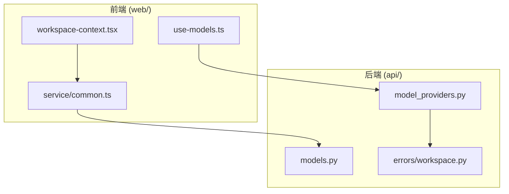
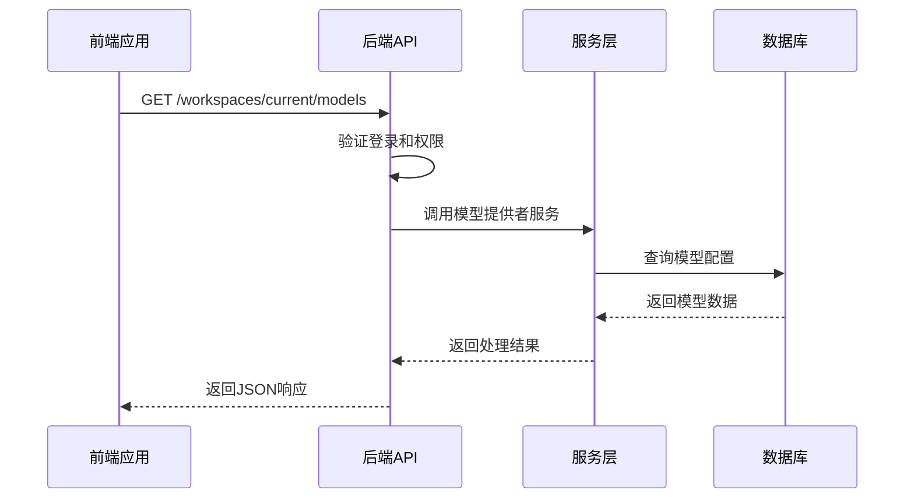
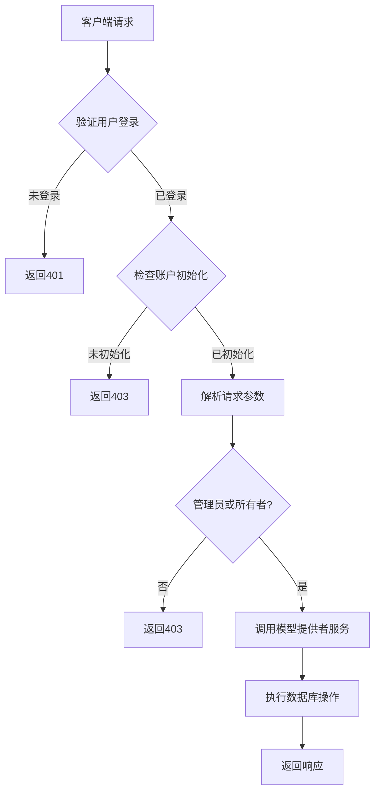
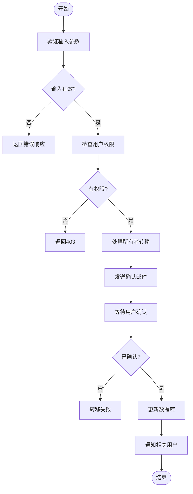
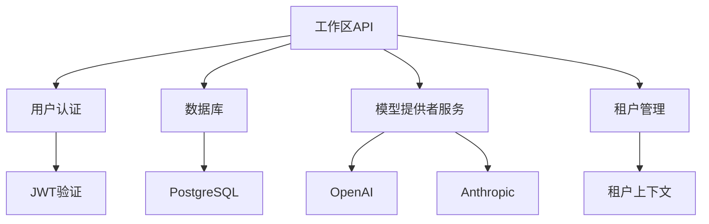

# 工作区服务API

<cite>
**本文档中引用的文件**  
- [model_providers.py](file://api/controllers/console/workspace/model_providers.py)
- [models.py](file://api/controllers/console/workspace/models.py)
- [workspace.py](file://api/services/errors/workspace.py)
- [workspace-context.tsx](file://web/context/workspace-context.tsx)
- [common.ts](file://web/service/common.ts)
- [use-models.ts](file://web/service/use-models.ts)
</cite>

## 目录
1. [简介](#简介)
2. [项目结构](#项目结构)
3. [核心组件](#核心组件)
4. [架构概述](#架构概述)
5. [详细组件分析](#详细组件分析)
6. [依赖分析](#依赖分析)
7. [性能考虑](#性能考虑)
8. [故障排除指南](#故障排除指南)
9. [结论](#结论)

## 简介
本文档详细介绍了Dify平台中工作区服务API的设计与实现，重点聚焦于工作区模型管理接口。文档涵盖API的认证机制、RESTful设计原则的应用、租户隔离策略以及完整的端点规范。通过分析后端控制器、前端服务调用和错误处理机制，全面揭示了工作区API的架构设计和技术实现细节。

## 项目结构
Dify的API服务主要位于`api/`目录下，前端逻辑位于`web/`目录。工作区相关功能集中在`api/controllers/console/workspace/`路径中，包括模型提供者和模型管理。前端通过React Context和SWR进行状态管理和数据获取，服务层封装业务逻辑，确保前后端分离和可维护性。

**Diagram sources**
- [workspace-context.tsx](file://web/context/workspace-context.tsx)
- [common.ts](file://web/service/common.ts)
- [model_providers.py](file://api/controllers/console/workspace/model_providers.py)

**Section sources**
- [workspace-context.tsx](file://web/context/workspace-context.tsx)
- [common.ts](file://web/service/common.ts)
- [model_providers.py](file://api/controllers/console/workspace/model_providers.py)

## 核心组件
工作区服务API的核心组件包括模型提供者管理、模型配置、租户隔离和认证机制。后端通过Flask RESTful实现API端点，前端使用TypeScript进行类型安全的API调用。错误处理通过自定义异常类实现，确保客户端能准确识别和处理不同类型的错误。

**Section sources**
- [models.py](file://api/controllers/console/workspace/models.py)
- [model_providers.py](file://api/controllers/console/workspace/model_providers.py)
- [workspace.py](file://api/services/errors/workspace.py)

## 架构概述
工作区服务API采用分层架构设计，前端通过RESTful API与后端交互。后端控制器处理HTTP请求，调用服务层进行业务逻辑处理，最终操作数据库。租户隔离通过`current_tenant_id`实现，确保数据安全和多租户支持。

**Diagram sources**
- [models.py](file://api/controllers/console/workspace/models.py)
- [model_providers.py](file://api/controllers/console/workspace/model_providers.py)

## 详细组件分析

### 模型管理组件分析
模型管理组件负责处理模型提供者的凭证配置、验证和切换。API端点设计遵循RESTful原则，使用标准HTTP方法进行资源操作。权限控制通过`@login_required`和`@account_initialization_required`装饰器实现。

#### 对于API/服务组件：

**Diagram sources**
- [models.py](file://api/controllers/console/workspace/models.py)
- [model_providers.py](file://api/controllers/console/workspace/model_providers.py)

**Section sources**
- [models.py](file://api/controllers/console/workspace/models.py)
- [model_providers.py](file://api/controllers/console/workspace/model_providers.py)

### 租户管理组件分析
租户管理组件处理工作区成员的邀请、角色更新和所有者转移。通过`tenant_account_joins`表的`current`字段标识当前活跃工作区，实现租户上下文切换。

#### 对于复杂逻辑组件：

**Diagram sources**
- [members.py](file://api/controllers/console/workspace/members.py)
- [common.ts](file://web/service/common.ts)

**Section sources**
- [members.py](file://api/controllers/console/workspace/members.py)
- [common.ts](file://web/service/common.ts)

## 依赖分析
工作区服务API依赖于用户认证系统、数据库服务和模型提供者服务。前端依赖React和SWR进行状态管理，后端依赖Flask和SQLAlchemy进行Web服务和数据访问。通过清晰的依赖关系，确保了系统的模块化和可扩展性。

**Diagram sources**
- [models.py](file://api/controllers/console/workspace/models.py)
- [model_providers.py](file://api/controllers/console/workspace/model_providers.py)
- [workspace-context.tsx](file://web/context/workspace-context.tsx)

**Section sources**
- [models.py](file://api/controllers/console/workspace/models.py)
- [model_providers.py](file://api/controllers/console/workspace/model_providers.py)
- [workspace-context.tsx](file://web/context/workspace-context.tsx)

## 性能考虑
API设计考虑了性能优化，包括使用缓存减少数据库查询、批量操作减少网络往返、以及异步处理耗时任务。模型配置数据在合理范围内缓存，避免频繁的数据库访问，提高响应速度。

## 故障排除指南
常见问题包括权限不足、模型验证失败和租户上下文错误。通过检查`WorkSpaceNotAllowedCreateError`、`WorkSpaceNotFoundError`等异常类型，可以快速定位问题根源。确保用户具有适当角色和权限是解决大多数问题的关键。

**Section sources**
- [workspace.py](file://api/services/errors/workspace.py)
- [models.py](file://api/controllers/console/workspace/models.py)

## 结论
Dify的工作区服务API通过清晰的RESTful设计、严格的权限控制和完善的错误处理，提供了安全可靠的模型管理功能。前后端分离的架构设计和类型安全的实现，确保了系统的可维护性和扩展性，为多租户AI应用开发提供了坚实基础。