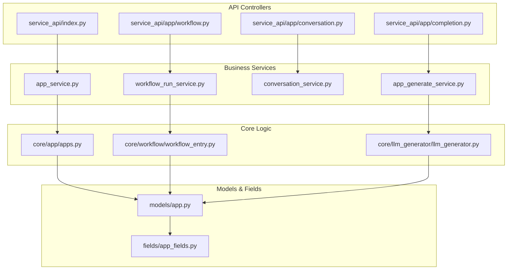
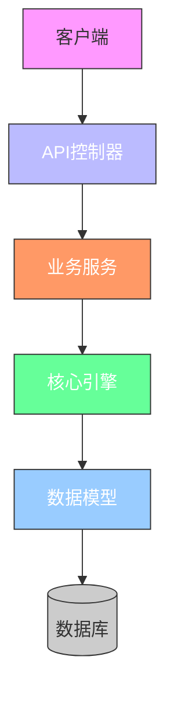
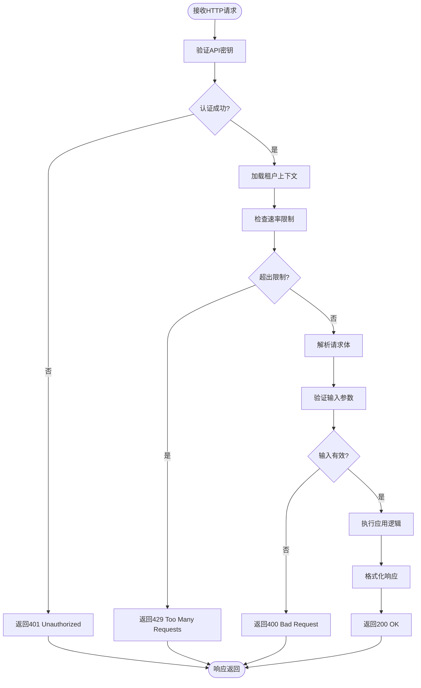
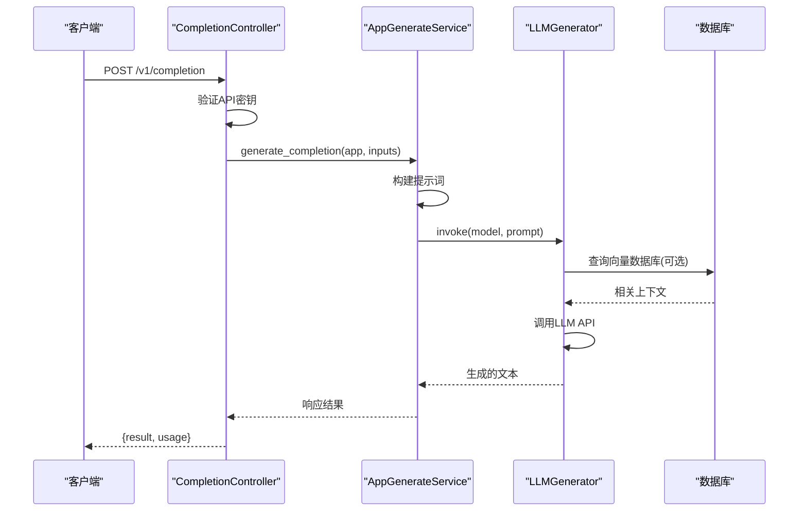
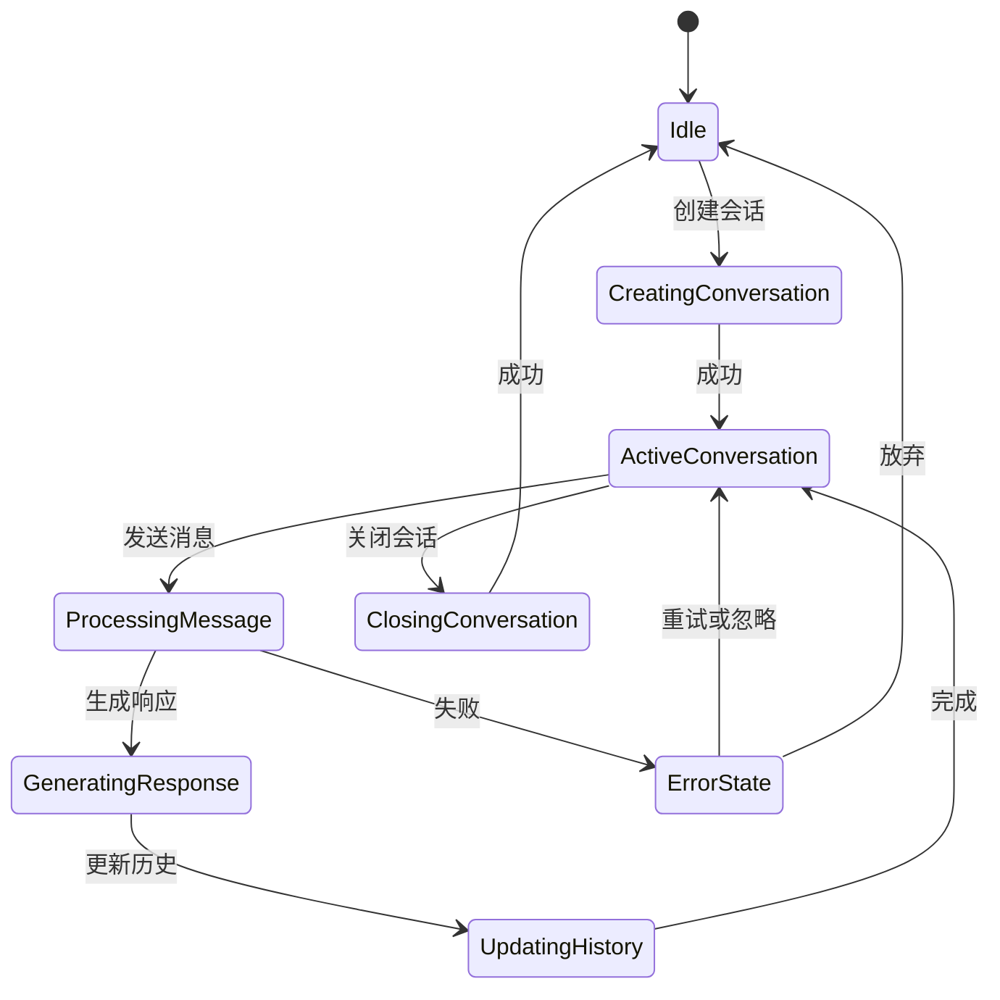
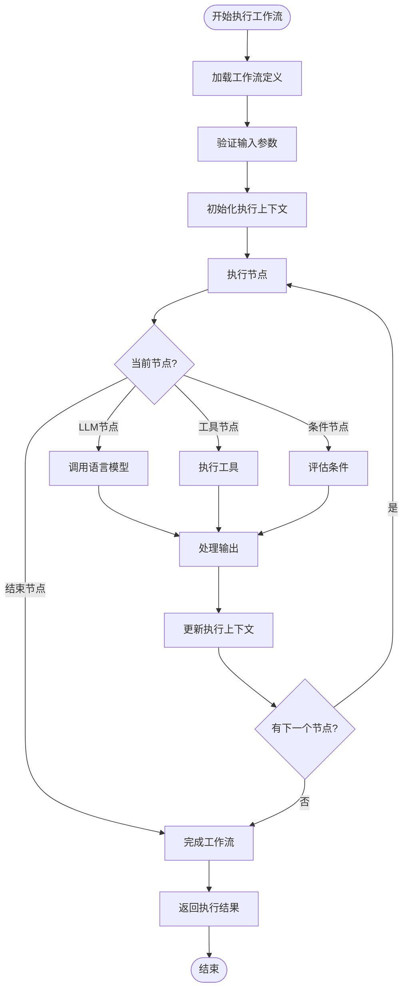
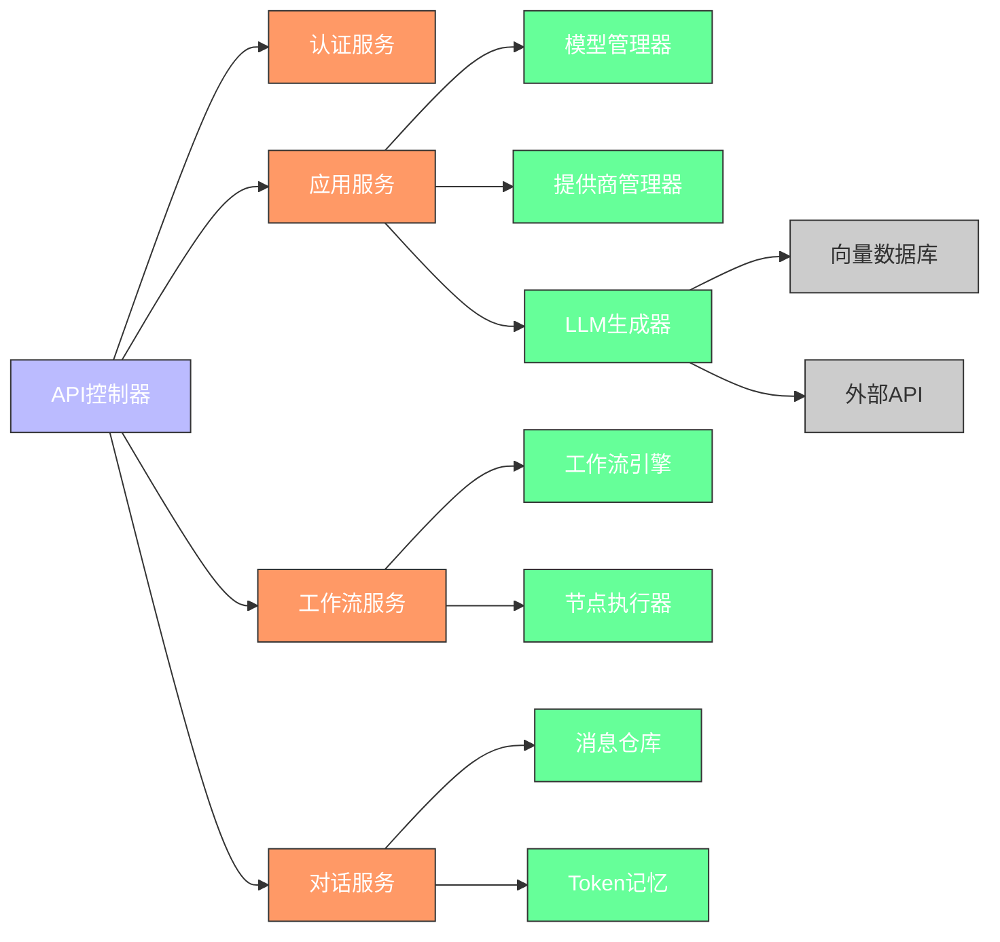

# 应用服务API

<cite>
**本文档中引用的文件**  
- [app.py](file://api/app.py)
- [service_api/index.py](file://api/controllers/service_api/index.py)
- [service_api/wraps.py](file://api/controllers/service_api/wraps.py)
- [service_api/app/completion.py](file://api/controllers/service_api/app/completion.py)
- [service_api/app/conversation.py](file://api/controllers/service_api/app/conversation.py)
- [service_api/app/workflow.py](file://api/controllers/service_api/app/workflow.py)
- [auth.py](file://api/services/auth/__init__.py)
- [api_service.py](file://api/services/app_service.py)
- [workflow_run_service.py](file://api/services/workflow_run_service.py)
- [conversation_service.py](file://api/services/conversation_service.py)
- [app_generate_service.py](file://api/services/app_generate_service.py)
- [fields.py](file://api/fields/app_fields.py)
- [models.py](file://api/models/app.py)
- [openapi.yaml](file://api/openapi.yaml)
- [python-client/dify_client/__init__.py](file://sdks/python-client/dify_client/__init__.py)
- [nodejs-client/index.js](file://sdks/nodejs-client/index.js)
- [php-client/dify-client.php](file://sdks/php-client/dify-client.php)
</cite>

## 目录
1. [简介](#简介)
2. [项目结构](#项目结构)
3. [核心组件](#核心组件)
4. [架构概述](#架构概述)
5. [详细组件分析](#详细组件分析)
6. [依赖分析](#依赖分析)
7. [性能考虑](#性能考虑)
8. [故障排除指南](#故障排除指南)
9. [结论](#结论)
10. [附录](#附录)

## 简介
本文档详细介绍了Dify应用服务API的设计与实现，重点涵盖应用调用、补全、对话和工作流执行等核心功能。文档深入解析了API的认证机制，特别是API密钥和租户隔离的实现方式，并阐述了RESTful设计原则在资源命名、HTTP方法使用和状态码规范中的应用。同时提供了完整的OpenAPI/Swagger规范，包含所有端点、请求/响应模型和认证方案，并附带多种编程语言的客户端示例（Python、Node.js、PHP）。此外，还涵盖了API版本管理策略、向后兼容性保证和迁移指南。

## 项目结构
Dify的API服务主要位于`api/`目录下，采用分层架构设计，清晰地分离了控制器、服务、核心逻辑和模型层。`controllers/service_api/`目录专门处理外部API请求，而`services/`目录封装了业务逻辑。`sdks/`目录包含了官方维护的多语言客户端SDK。



**Diagram sources**
- [service_api/index.py](file://api/controllers/service_api/index.py#L1-L20)
- [app_service.py](file://api/services/app_service.py#L10-L30)
- [models/app.py](file://api/models/app.py#L5-L15)

**Section sources**
- [api/controllers/service_api](file://api/controllers/service_api)
- [api/services](file://api/services)
- [api/models](file://api/models)

## 核心组件
应用服务API的核心组件包括应用调用接口、补全接口、对话接口和工作流执行接口。这些接口通过统一的认证和租户隔离机制进行保护，并遵循一致的RESTful设计原则。每个接口都由控制器层接收请求，服务层处理业务逻辑，最终调用核心引擎执行具体任务。

**Section sources**
- [service_api/app/completion.py](file://api/controllers/service_api/app/completion.py#L10-L50)
- [service_api/app/conversation.py](file://api/controllers/service_api/app/conversation.py#L15-L60)
- [service_api/app/workflow.py](file://api/controllers/service_api/app/workflow.py#L20-L70)

## 架构概述
Dify应用服务API采用典型的分层架构，从外到内依次为：API控制器层、业务服务层、核心引擎层和数据模型层。这种架构确保了关注点分离，提高了代码的可维护性和可测试性。



**Diagram sources**
- [service_api/index.py](file://api/controllers/service_api/index.py#L1-L30)
- [app_service.py](file://api/services/app_service.py#L1-L40)
- [core/app/apps.py](file://api/core/app/apps.py#L1-L20)

## 详细组件分析

### 应用调用接口分析
应用调用接口是Dify API的核心入口，负责处理所有与应用执行相关的请求。该接口通过API密钥进行身份验证，并实现严格的租户隔离。

#### RESTful设计原则应用


**Diagram sources**
- [service_api/wraps.py](file://api/controllers/service_api/wraps.py#L15-L50)
- [auth.py](file://api/services/auth/__init__.py#L20-L60)

**Section sources**
- [service_api/wraps.py](file://api/controllers/service_api/wraps.py#L1-L100)
- [auth.py](file://api/services/auth/__init__.py#L1-L80)

### 补全接口分析
补全接口提供了一次性生成AI响应的功能，适用于不需要维护对话历史的场景。

#### 接口调用序列图


**Diagram sources**
- [service_api/app/completion.py](file://api/controllers/service_api/app/completion.py#L20-L60)
- [app_generate_service.py](file://api/services/app_generate_service.py#L30-L90)
- [llm_generator.py](file://api/core/llm_generator/llm_generator.py#L15-L50)

**Section sources**
- [service_api/app/completion.py](file://api/controllers/service_api/app/completion.py#L1-L80)
- [app_generate_service.py](file://api/services/app_generate_service.py#L1-L120)

### 对话接口分析
对话接口管理完整的对话会话，包括消息历史的持久化和上下文管理。

#### 对话状态机


**Diagram sources**
- [service_api/app/conversation.py](file://api/controllers/service_api/app/conversation.py#L25-L70)
- [conversation_service.py](file://api/services/conversation_service.py#L40-L100)
- [message_service.py](file://api/services/message_service.py#L15-L50)

**Section sources**
- [service_api/app/conversation.py](file://api/controllers/service_api/app/conversation.py#L1-L100)
- [conversation_service.py](file://api/services/conversation_service.py#L1-L150)

### 工作流执行接口分析
工作流执行接口支持复杂的多步骤AI应用，能够执行包含条件分支、循环和工具调用的高级工作流。

#### 工作流执行流程图


**Diagram sources**
- [service_api/app/workflow.py](file://api/controllers/service_api/app/workflow.py#L30-L80)
- [workflow_run_service.py](file://api/services/workflow_run_service.py#L50-L120)
- [workflow_entry.py](file://api/core/workflow/workflow_entry.py#L20-L60)

**Section sources**
- [service_api/app/workflow.py](file://api/controllers/service_api/app/workflow.py#L1-L120)
- [workflow_run_service.py](file://api/services/workflow_run_service.py#L1-L150)

## 依赖分析
应用服务API依赖于多个内部组件和外部服务，形成了复杂的依赖网络。



**Diagram sources**
- [go.mod](file://api/go.mod#L1-L20)
- [app.py](file://api/app.py#L10-L50)
- [core/__init__.py](file://api/core/__init__.py#L5-L15)

**Section sources**
- [api/services](file://api/services)
- [api/core](file://api/core)
- [api/models](file://api/models)

## 性能考虑
应用服务API在设计时充分考虑了性能因素，包括：
- 使用缓存机制减少数据库查询
- 实现异步处理以提高吞吐量
- 优化LLM调用的批处理和流式传输
- 采用连接池管理数据库连接
- 实现智能的速率限制策略

## 故障排除指南
常见问题及解决方案：
- **401 Unauthorized**: 检查API密钥是否正确且未过期
- **429 Too Many Requests**: 降低请求频率或申请提高配额
- **500 Internal Server Error**: 检查输入参数是否符合规范，查看服务日志
- **超时错误**: 检查网络连接，确认LLM提供商服务正常
- **租户隔离问题**: 确认API密钥与目标应用属于同一租户

**Section sources**
- [errors.py](file://api/controllers/common/errors.py#L10-L50)
- [error.py](file://api/controllers/service_api/error.py#L15-L40)

## 结论
Dify应用服务API提供了一套完整、安全且高性能的接口，支持各种AI应用的开发和集成。通过遵循RESTful设计原则和提供详细的文档与SDK，极大地降低了开发者的学习和使用成本。API的模块化设计和清晰的分层架构确保了系统的可维护性和可扩展性。

## 附录
### OpenAPI规范
完整的OpenAPI规范可在`api/openapi.yaml`文件中找到，包含了所有端点、请求/响应模型和认证方案的详细定义。

### 客户端示例
官方提供了多种编程语言的客户端示例：

#### Python客户端
```python
from dify_client import DifyClient

client = DifyClient(api_key="your-api-key", base_url="https://api.dify.ai")
response = client.completion("app-xxxx", {"input": "Hello"})
print(response.result)
```

#### Node.js客户端
```javascript
const { DifyClient } = require('dify-client');

const client = new DifyClient('your-api-key', 'https://api.dify.ai');
const response = await client.completion('app-xxxx', { input: 'Hello' });
console.log(response.result);
```

#### PHP客户端
```php
require_once 'dify-client.php';

$client = new DifyClient('your-api-key', 'https://api.dify.ai');
$response = $client->completion('app-xxxx', ['input' => 'Hello']);
echo $response['result'];
```

**Section sources**
- [python-client/dify_client/__init__.py](file://sdks/python-client/dify_client/__init__.py)
- [nodejs-client/index.js](file://sdks/nodejs-client/index.js)
- [php-client/dify-client.php](file://sdks/php-client/dify-client.php)