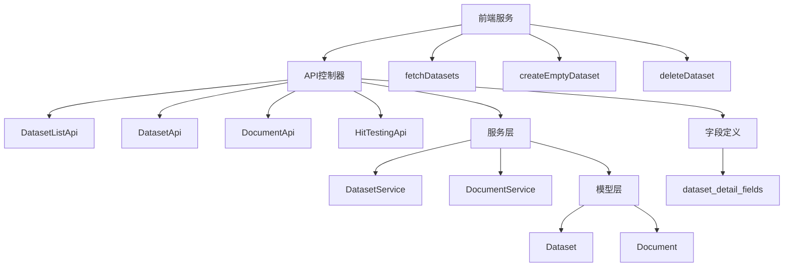
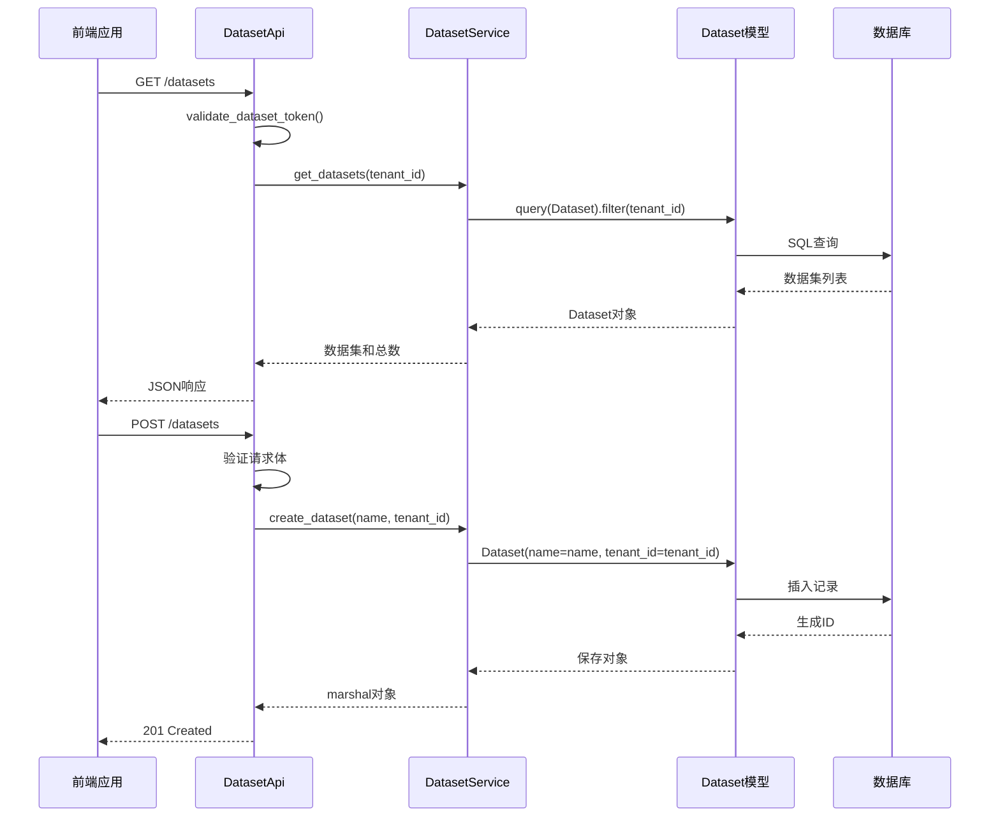
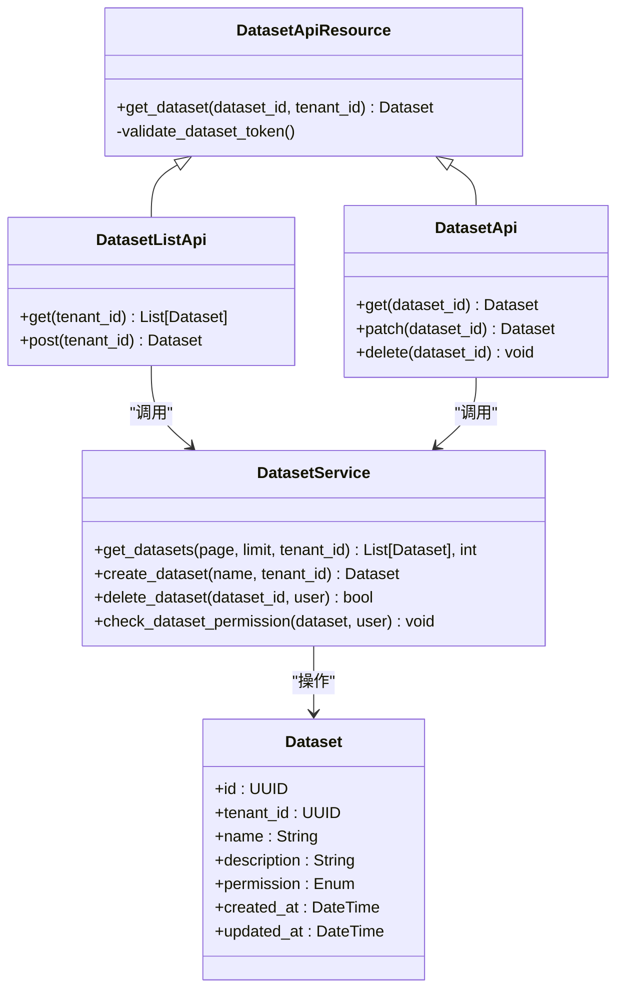
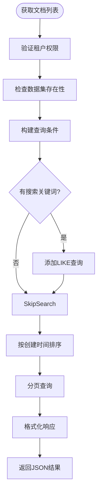
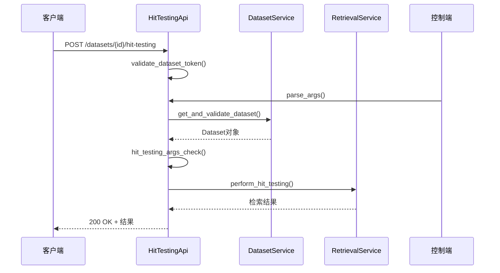
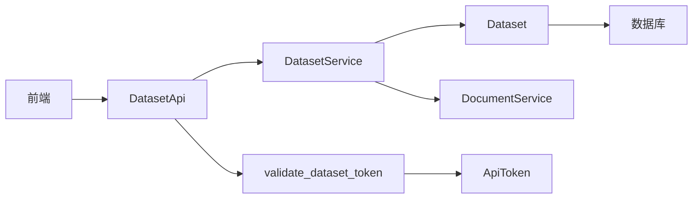

# 数据集服务API

<cite>
**本文档中引用的文件**  
- [dataset.py](file://api/controllers/service_api/dataset/dataset.py)
- [document.py](file://api/controllers/service_api/dataset/document.py)
- [wraps.py](file://api/controllers/service_api/wraps.py)
- [hit_testing.py](file://api/controllers/service_api/dataset/hit_testing.py)
- [datasets.ts](file://web/service/datasets.ts)
- [dataset_fields.py](file://api/fields/dataset_fields.py)
- [dataset.py](file://api/models/dataset.py)
- [dataset_service.py](file://api/services/dataset_service.py)
</cite>

## 目录
1. [简介](#简介)
2. [项目结构](#项目结构)
3. [核心组件](#核心组件)
4. [架构概述](#架构概述)
5. [详细组件分析](#详细组件分析)
6. [依赖分析](#依赖分析)
7. [性能考虑](#性能考虑)
8. [故障排除指南](#故障排除指南)
9. [结论](#结论)

## 简介
本文档详细介绍了Dify平台中数据集服务API的设计与实现。重点涵盖知识库操作接口，包括数据集的创建、文档上传、分段管理、检索测试等功能。文档还深入解析了API的认证机制、租户隔离策略、RESTful设计原则的应用，并提供完整的OpenAPI规范和多语言客户端示例。

## 项目结构
数据集服务API主要分布在`api/controllers/service_api/dataset/`目录下，包含核心资源类和业务逻辑。前端服务调用位于`web/service/datasets.ts`，模型定义在`api/models/dataset.py`，字段序列化在`api/fields/dataset_fields.py`，业务服务逻辑在`api/services/dataset_service.py`。

**图示来源**  
- [dataset.py](file://api/controllers/service_api/dataset/dataset.py)
- [document.py](file://api/controllers/service_api/dataset/document.py)
- [dataset_service.py](file://api/services/dataset_service.py)
- [dataset.py](file://api/models/dataset.py)
- [dataset_fields.py](file://api/fields/dataset_fields.py)
- [datasets.ts](file://web/service/datasets.ts)

**本节来源**  
- [api/controllers/service_api/dataset/](file://api/controllers/service_api/dataset/)
- [web/service/datasets.ts](file://web/service/datasets.ts)

## 核心组件
数据集服务API的核心组件包括数据集管理、文档管理、检索测试和权限控制。API通过`DatasetApiResource`基类实现统一的认证和租户验证，所有端点均基于RESTful设计原则构建，支持分页、搜索和过滤功能。

**本节来源**  
- [dataset.py](file://api/controllers/service_api/dataset/dataset.py#L1-L50)
- [wraps.py](file://api/controllers/service_api/wraps.py#L291-L310)

## 架构概述
数据集服务API采用分层架构，前端通过HTTP请求调用API端点，控制器层处理请求并验证权限，服务层执行业务逻辑，模型层与数据库交互。API通过API密钥进行认证，并基于租户ID实现数据隔离。

**图示来源**  
- [dataset.py](file://api/controllers/service_api/dataset/dataset.py)
- [wraps.py](file://api/controllers/service_api/wraps.py)
- [dataset_service.py](file://api/services/dataset_service.py)

## 详细组件分析

### 数据集管理分析
数据集管理API提供创建、读取、更新和删除（CRUD）操作。`DatasetListApi`支持分页和搜索，`DatasetApi`提供单个数据集的详细信息。API强制执行名称长度验证（1-40字符）和描述长度限制（不超过400字符）。

#### 类图

**图示来源**  
- [dataset.py](file://api/controllers/service_api/dataset/dataset.py)
- [dataset_service.py](file://api/services/dataset_service.py)
- [dataset.py](file://api/models/dataset.py)

**本节来源**  
- [dataset.py](file://api/controllers/service_api/dataset/dataset.py#L182-L324)
- [dataset_service.py](file://api/services/dataset_service.py)

### 文档管理分析
文档管理API允许在数据集中上传、列出和管理文档。`DocumentApi`提供文档的批量操作，包括启用、禁用和删除。API支持通过关键词搜索文档，并返回分页结果。

#### 流程图

**图示来源**  
- [document.py](file://api/controllers/service_api/dataset/document.py#L439-L472)

**本节来源**  
- [document.py](file://api/controllers/service_api/dataset/document.py)

### 检索测试分析
检索测试API允许用户测试数据集的检索性能。`HitTestingApi`端点接受查询参数，执行向量搜索，并返回匹配的文档片段。该功能用于评估知识库的检索效果。

#### 序列图

**图示来源**  
- [hit_testing.py](file://api/controllers/service_api/dataset/hit_testing.py)

**本节来源**  
- [hit_testing.py](file://api/controllers/service_api/dataset/hit_testing.py)

## 依赖分析
数据集服务API依赖多个核心模块：`DatasetService`处理业务逻辑，`Dataset`模型定义数据结构，`dataset_detail_fields`负责序列化，`validate_dataset_token`装饰器处理认证。API通过`tenant_id`实现租户隔离，确保数据安全。

**图示来源**  
- [dataset.py](file://api/controllers/service_api/dataset/dataset.py)
- [wraps.py](file://api/controllers/service_api/wraps.py)
- [dataset_service.py](file://api/services/dataset_service.py)

**本节来源**  
- [dataset.py](file://api/controllers/service_api/dataset/dataset.py)
- [wraps.py](file://api/controllers/service_api/wraps.py)
- [dataset_service.py](file://api/services/dataset_service.py)

## 性能考虑
API设计考虑了性能优化：使用分页避免大数据集加载，数据库查询添加适当索引，响应数据按需序列化。检索测试功能包含速率限制，防止滥用。建议客户端实现缓存机制，减少重复请求。

## 故障排除指南
常见问题包括：401错误（无效API密钥）、403错误（权限不足）、404错误（资源不存在）。检查API密钥是否正确，确保租户ID匹配，验证数据集ID是否存在。对于检索问题，检查文档是否已成功索引。

**本节来源**  
- [dataset.py](file://api/controllers/service_api/dataset/dataset.py)
- [wraps.py](file://api/controllers/service_api/wraps.py)

## 结论
Dify数据集服务API提供了一套完整的知识库管理功能，采用RESTful设计，支持认证和租户隔离。API结构清晰，易于集成，为开发者提供了强大的数据集操作能力。