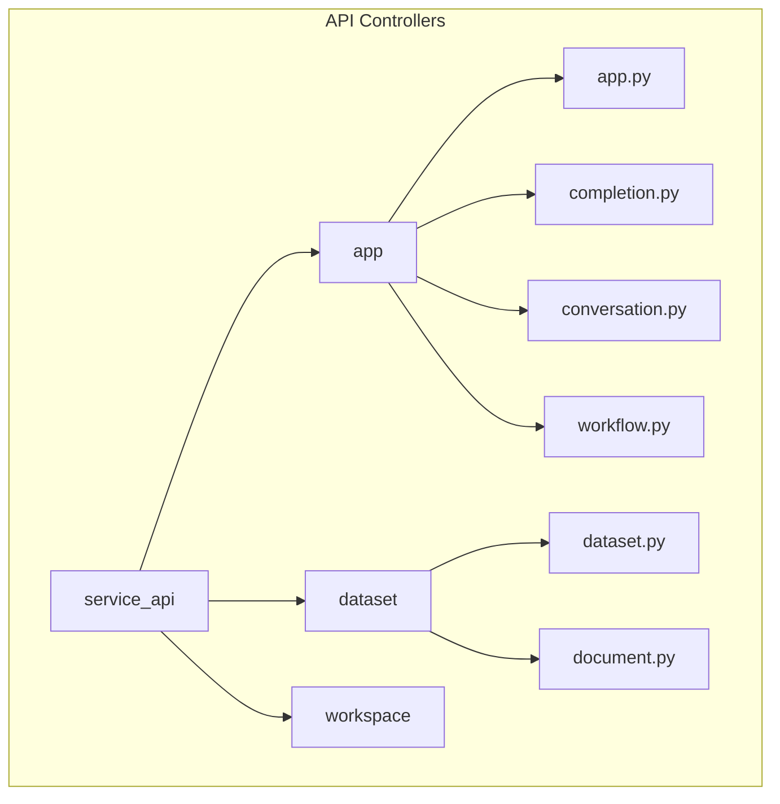
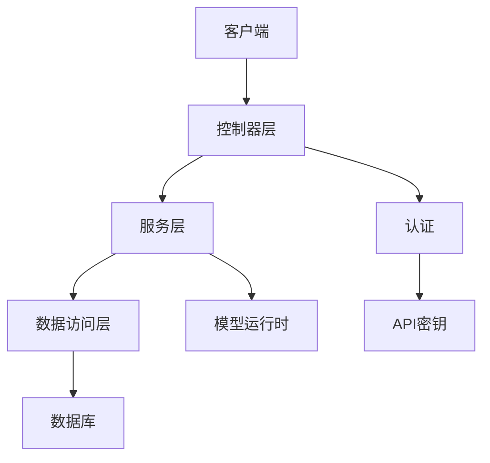
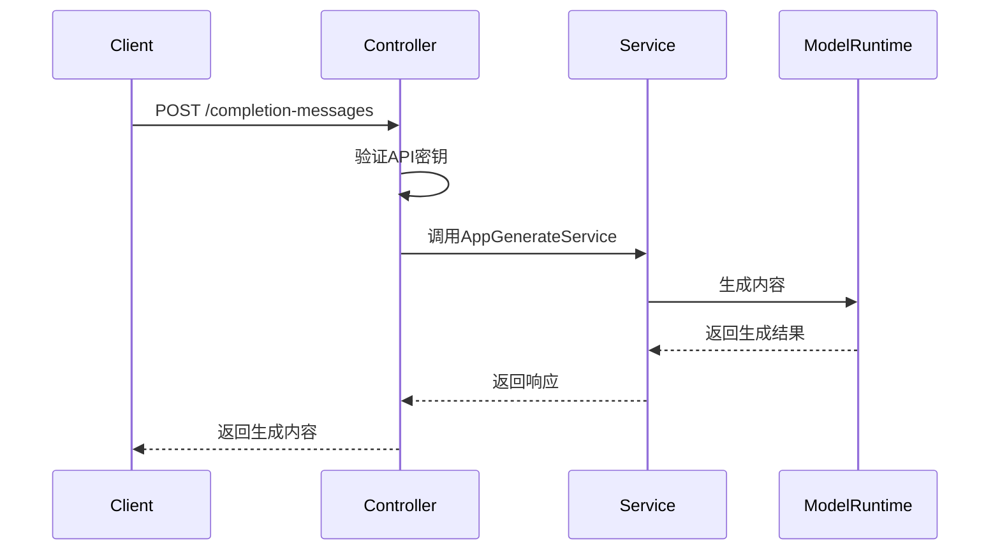
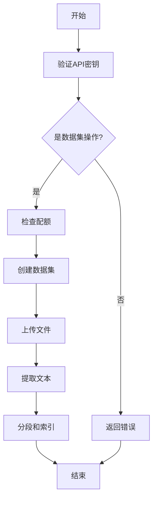
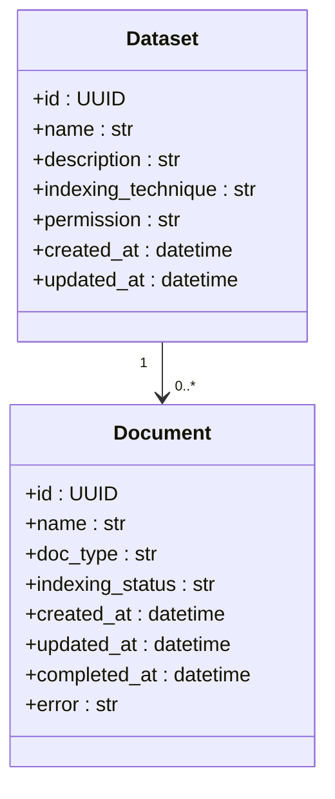
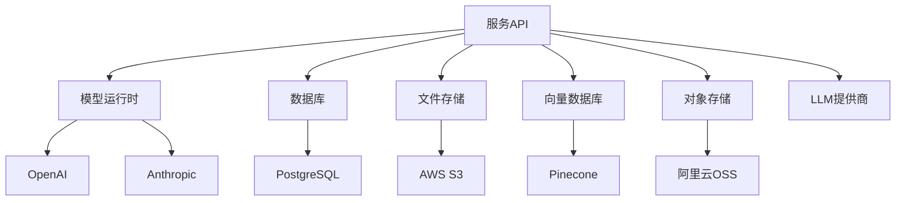

# 服务API

<cite>
**本文档中引用的文件**  
- [index.py](file://api/controllers/service_api/index.py)
- [wraps.py](file://api/controllers/service_api/wraps.py)
- [app.py](file://api/controllers/service_api/app/app.py)
- [completion.py](file://api/controllers/service_api/app/completion.py)
- [conversation.py](file://api/controllers/service_api/app/conversation.py)
- [workflow.py](file://api/controllers/service_api/app/workflow.py)
- [dataset.py](file://api/controllers/service_api/dataset/dataset.py)
- [document.py](file://api/controllers/service_api/dataset/document.py)
</cite>

## 目录
1. [简介](#简介)
2. [项目结构](#项目结构)
3. [核心组件](#核心组件)
4. [架构概述](#架构概述)
5. [详细组件分析](#详细组件分析)
6. [依赖分析](#依赖分析)
7. [性能考虑](#性能考虑)
8. [故障排除指南](#故障排除指南)
9. [结论](#结论)

## 简介
Dify服务API为外部集成提供了强大的RESTful接口，支持应用调用、知识库操作和数据集管理等功能。API设计遵循RESTful原则，使用标准HTTP方法和状态码，确保一致性和可预测性。认证机制基于API密钥，实现租户隔离和安全访问控制。文档涵盖API版本管理、向后兼容性保证和迁移指南，并提供Python、Node.js和PHP的客户端示例。

## 项目结构
Dify服务API的控制器位于`api/controllers/service_api`目录下，按功能模块组织。主要模块包括应用（app）、数据集（dataset）和工作区（workspace）。每个模块包含具体的API端点实现，如应用参数、完成消息、对话和工作流执行。认证和权限检查通过装饰器实现，确保安全访问。API使用Flask-RESTX框架构建，提供自动生成的API文档和请求验证功能。

**图源**  
- [app.py](file://api/controllers/service_api/app/app.py)
- [completion.py](file://api/controllers/service_api/app/completion.py)
- [conversation.py](file://api/controllers/service_api/app/conversation.py)
- [workflow.py](file://api/controllers/service_api/app/workflow.py)
- [dataset.py](file://api/controllers/service_api/dataset/dataset.py)
- [document.py](file://api/controllers/service_api/dataset/document.py)

**本节来源**  
- [app.py](file://api/controllers/service_api/app/app.py)
- [completion.py](file://api/controllers/service_api/app/completion.py)
- [conversation.py](file://api/controllers/service_api/app/conversation.py)
- [workflow.py](file://api/controllers/service_api/app/workflow.py)
- [dataset.py](file://api/controllers/service_api/dataset/dataset.py)
- [document.py](file://api/controllers/service_api/dataset/document.py)

## 核心组件
服务API的核心组件包括应用调用、知识库操作和数据集管理。应用调用支持完成消息和聊天消息的创建，提供阻塞和流式响应模式。知识库操作允许创建和管理数据集，支持文本和文件上传。数据集管理包括文档的增删改查，以及索引状态的监控。所有操作都通过API密钥进行认证，并实施租户隔离。

**本节来源**  
- [app.py](file://api/controllers/service_api/app/app.py)
- [completion.py](file://api/controllers/service_api/app/completion.py)
- [conversation.py](file://api/controllers/service_api/app/conversation.py)
- [workflow.py](file://api/controllers/service_api/app/workflow.py)
- [dataset.py](file://api/controllers/service_api/dataset/dataset.py)
- [document.py](file://api/controllers/service_api/dataset/document.py)

## 架构概述
Dify服务API采用分层架构，包括控制器层、服务层和数据访问层。控制器层处理HTTP请求和响应，应用认证和权限检查。服务层实现业务逻辑，调用模型运行时生成内容。数据访问层与数据库交互，管理应用、数据集和文档的持久化。API设计遵循RESTful原则，资源命名清晰，HTTP方法使用规范，状态码准确反映操作结果。

**图源**  
- [wraps.py](file://api/controllers/service_api/wraps.py)
- [app.py](file://api/controllers/service_api/app/app.py)
- [dataset.py](file://api/controllers/service_api/dataset/dataset.py)

**本节来源**  
- [wraps.py](file://api/controllers/service_api/wraps.py)
- [app.py](file://api/controllers/service_api/app/app.py)
- [dataset.py](file://api/controllers/service_api/dataset/dataset.py)

## 详细组件分析
### 应用调用分析
应用调用API支持创建完成消息和聊天消息，适用于不同应用场景。完成消息适用于一次性提示生成，聊天消息支持多轮对话。API提供阻塞和流式响应模式，满足不同性能需求。请求参数包括输入、查询、文件附件和响应模式。错误处理涵盖应用不可用、会话完成和提供商配额超限等场景。

**图源**  
- [completion.py](file://api/controllers/service_api/app/completion.py)
- [conversation.py](file://api/controllers/service_api/app/conversation.py)

**本节来源**  
- [completion.py](file://api/controllers/service_api/app/completion.py)
- [conversation.py](file://api/controllers/service_api/app/conversation.py)

### 知识库操作分析
知识库操作API允许创建和管理数据集，支持文本和文件上传。数据集创建时可指定索引技术、权限和检索模型。文档上传支持多种文件格式，自动进行文本提取和分段。API实施配额检查，防止资源滥用。错误处理包括数据集名称重复、文档索引错误和权限不足等场景。

**图源**  
- [dataset.py](file://api/controllers/service_api/dataset/dataset.py)
- [document.py](file://api/controllers/service_api/dataset/document.py)

**本节来源**  
- [dataset.py](file://api/controllers/service_api/dataset/dataset.py)
- [document.py](file://api/controllers/service_api/dataset/document.py)

### 数据集管理分析
数据集管理API提供文档的全生命周期管理，包括创建、更新、删除和状态查询。文档创建支持文本和文件两种方式，自动处理文件上传和文本提取。文档状态API返回索引进度，包括已完成和总段落数。删除操作检查文档是否正在索引，防止数据不一致。权限检查确保用户只能访问所属租户的资源。

**图源**  
- [dataset.py](file://api/controllers/service_api/dataset/dataset.py)
- [document.py](file://api/controllers/service_api/dataset/document.py)

**本节来源**  
- [dataset.py](file://api/controllers/service_api/dataset/dataset.py)
- [document.py](file://api/controllers/service_api/dataset/document.py)

## 依赖分析
服务API依赖多个内部和外部组件。内部依赖包括模型运行时、数据库和文件存储。外部依赖包括向量数据库、对象存储和LLM提供商。API通过服务层与这些组件交互，实现解耦。依赖管理通过配置文件和环境变量实现，支持灵活部署。错误处理机制确保在依赖组件故障时提供有意义的错误信息。

**图源**  
- [wraps.py](file://api/controllers/service_api/wraps.py)
- [dataset.py](file://api/controllers/service_api/dataset/dataset.py)

**本节来源**  
- [wraps.py](file://api/controllers/service_api/wraps.py)
- [dataset.py](file://api/controllers/service_api/dataset/dataset.py)

## 性能考虑
服务API设计考虑了性能和可扩展性。流式响应模式减少等待时间，提高用户体验。异步处理长任务，避免请求超时。缓存机制减少数据库查询，提高响应速度。配额限制防止资源滥用，确保系统稳定性。监控和日志记录帮助识别性能瓶颈，支持持续优化。

## 故障排除指南
常见问题包括API密钥无效、配额超限和模型初始化错误。解决方案包括检查API密钥、升级订阅计划和配置模型提供商。错误响应提供详细描述，帮助快速定位问题。日志记录和监控工具支持深入分析。文档提供示例代码和最佳实践，减少集成难度。

**本节来源**  
- [wraps.py](file://api/controllers/service_api/wraps.py)
- [completion.py](file://api/controllers/service_api/app/completion.py)
- [dataset.py](file://api/controllers/service_api/dataset/dataset.py)

## 结论
Dify服务API提供了一套完整的RESTful接口，支持应用调用、知识库操作和数据集管理。API设计遵循最佳实践，确保安全性、可靠性和可扩展性。认证机制基于API密钥，实现租户隔离。文档涵盖所有功能，提供详细的示例和指南。通过持续优化和监控，API能够满足各种应用场景的需求。