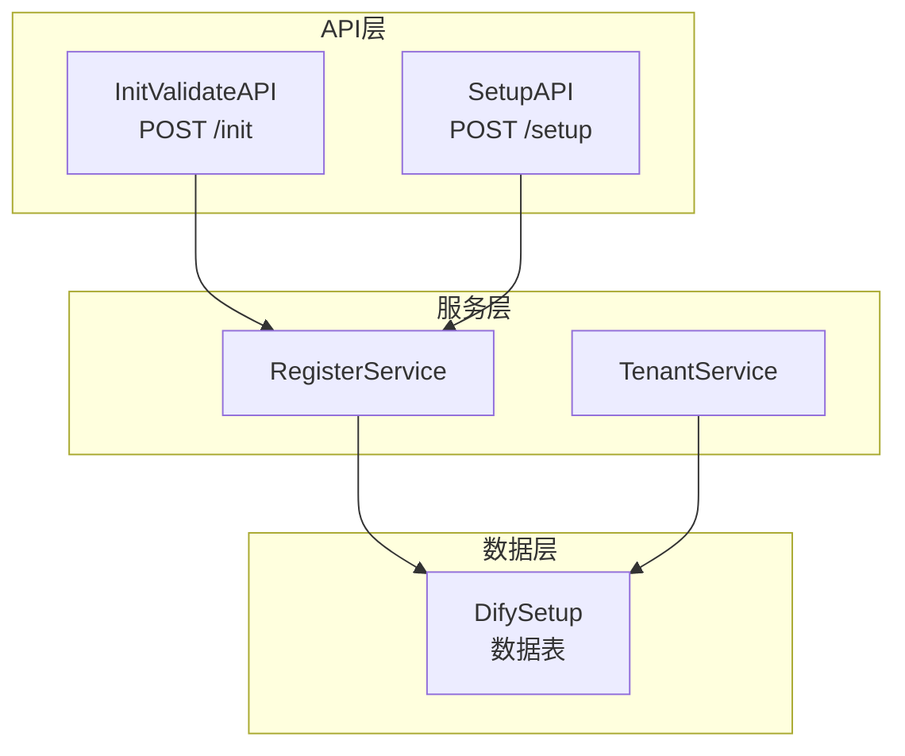
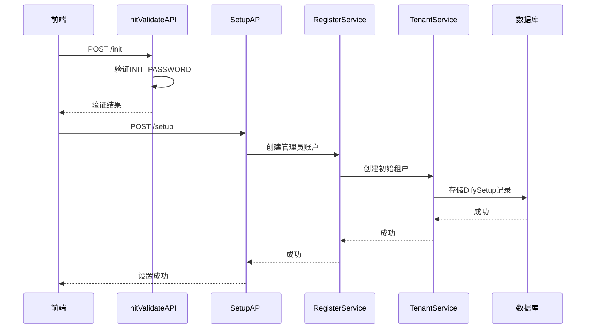
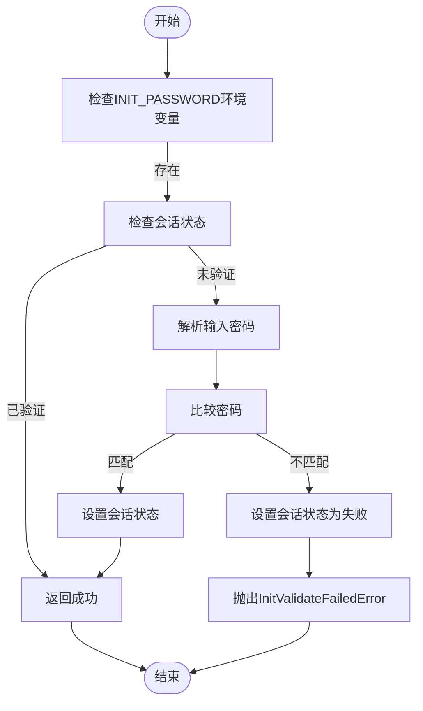
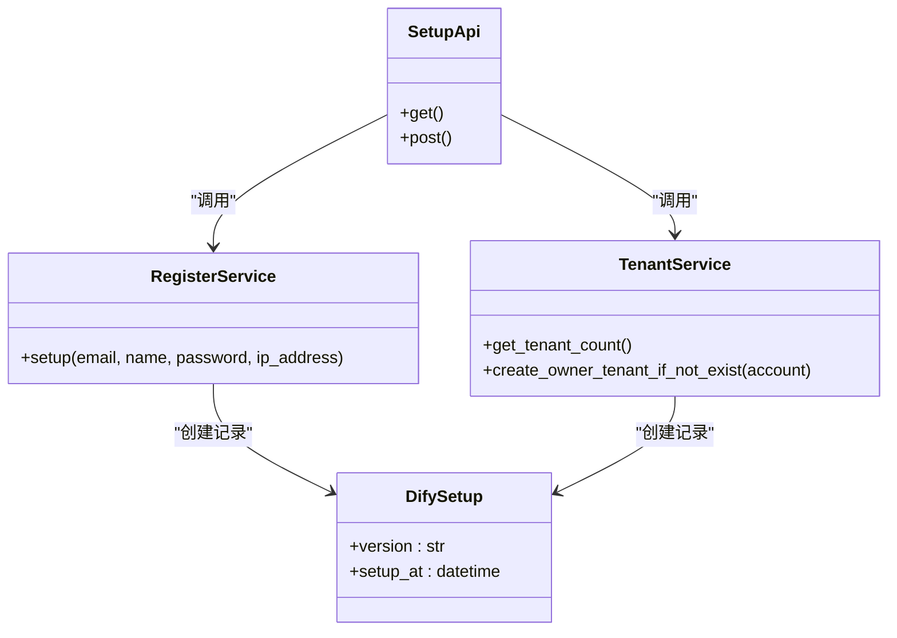
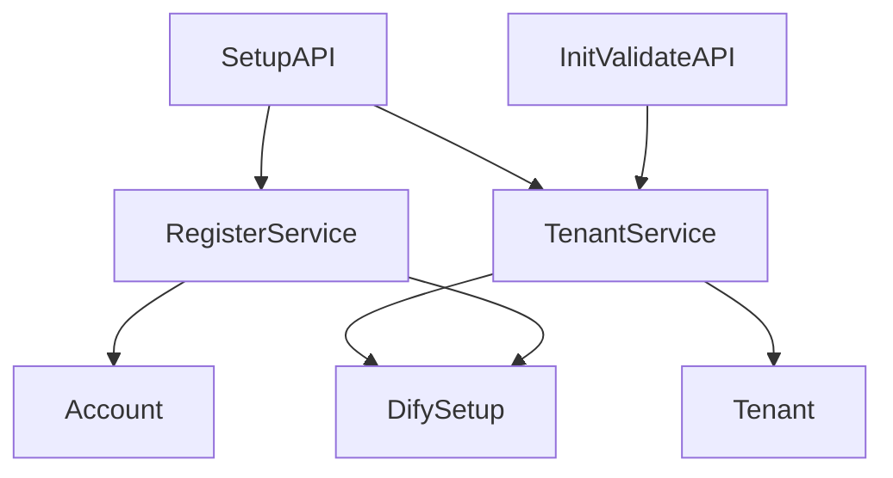

# 初始化设置API

<cite>
**本文档中引用的文件**  
- [setup.py](file://api/controllers/console/setup.py)
- [init_validate.py](file://api/controllers/console/init_validate.py)
- [common.ts](file://web/service/common.ts)
- [model.py](file://api/models/model.py)
- [account_service.py](file://api/services/account_service.py)
</cite>

## 目录
1. [简介](#简介)
2. [项目结构](#项目结构)
3. [核心组件](#核心组件)
4. [架构概述](#架构概述)
5. [详细组件分析](#详细组件分析)
6. [依赖分析](#依赖分析)
7. [性能考虑](#性能考虑)
8. [故障排除指南](#故障排除指南)
9. [结论](#结论)
10. [附录](#附录)（如有必要）

## 简介
本文档详细介绍了Dify系统的初始化设置API，重点阐述系统首次安装和初始化配置流程。文档涵盖了系统状态检查、环境验证、管理员账户创建、基础配置设置等端点，解释了安装向导的API交互流程，包括数据库连接测试、存储配置验证、基础服务健康检查等。同时，文档还详细描述了初始工作区和管理员用户的创建过程，以及系统就绪状态的判断标准。提供了完整的HTTP方法、URL模式、请求响应结构和错误代码，并包含实际的curl示例，演示自动化部署场景下的系统初始化。此外，文档还提供了预检查清单、常见初始化失败原因和解决方案。

## 项目结构
Dify项目的初始化设置API主要位于`api/controllers/console`目录下，涉及`setup.py`和`init_validate.py`两个核心文件。前端服务调用逻辑位于`web/service/common.ts`中。系统通过RESTful API提供初始化验证和设置功能，确保系统在首次部署时能够正确配置并创建管理员账户。



**Diagram sources**
- [setup.py](file://api/controllers/console/setup.py#L1-L61)
- [init_validate.py](file://api/controllers/console/init_validate.py#L1-L58)

**Section sources**
- [setup.py](file://api/controllers/console/setup.py#L1-L61)
- [init_validate.py](file://api/controllers/console/init_validate.py#L1-L58)

## 核心组件
初始化设置API的核心组件包括`InitValidateAPI`和`SetupAPI`，分别负责初始化验证和系统设置。`InitValidateAPI`用于验证初始化密码，确保只有授权用户可以进行系统设置。`SetupAPI`则负责创建管理员账户和初始租户，完成系统的初始化配置。

**Section sources**
- [setup.py](file://api/controllers/console/setup.py#L1-L61)
- [init_validate.py](file://api/controllers/console/init_validate.py#L1-L58)

## 架构概述
Dify的初始化设置API采用分层架构，前端通过`common.ts`中的`initValidate`和`setup`函数调用后端API。后端API通过`InitValidateAPI`和`SetupAPI`处理请求，调用`RegisterService`和`TenantService`完成业务逻辑，并将初始化状态存储在`DifySetup`数据表中。



**Diagram sources**
- [setup.py](file://api/controllers/console/setup.py#L1-L61)
- [init_validate.py](file://api/controllers/console/init_validate.py#L1-L58)
- [common.ts](file://web/service/common.ts#L51-L81)

## 详细组件分析

### 初始化验证分析
`InitValidateAPI`负责验证初始化密码，确保只有授权用户可以进行系统设置。该API通过检查环境变量`INIT_PASSWORD`和用户输入的密码是否匹配来完成验证。



**Diagram sources**
- [init_validate.py](file://api/controllers/console/init_validate.py#L1-L58)

**Section sources**
- [init_validate.py](file://api/controllers/console/init_validate.py#L1-L58)

### 系统设置分析
`SetupAPI`负责创建管理员账户和初始租户，完成系统的初始化配置。该API在验证通过后，调用`RegisterService.setup`方法创建管理员账户，并创建初始租户。



**Diagram sources**
- [setup.py](file://api/controllers/console/setup.py#L1-L61)
- [account_service.py](file://api/services/account_service.py#L1-L1386)

**Section sources**
- [setup.py](file://api/controllers/console/setup.py#L1-L61)
- [account_service.py](file://api/services/account_service.py#L1-L1386)

## 依赖分析
初始化设置API依赖于多个核心组件，包括`RegisterService`用于账户注册，`TenantService`用于租户管理，以及`DifySetup`数据表用于存储初始化状态。这些组件共同协作，确保系统能够正确初始化。



**Diagram sources**
- [setup.py](file://api/controllers/console/setup.py#L1-L61)
- [init_validate.py](file://api/controllers/console/init_validate.py#L1-L58)
- [model.py](file://api/models/model.py#L1-L1913)

**Section sources**
- [setup.py](file://api/controllers/console/setup.py#L1-L61)
- [init_validate.py](file://api/controllers/console/init_validate.py#L1-L58)
- [model.py](file://api/models/model.py#L1-L1913)

## 性能考虑
初始化设置API的性能主要受数据库操作影响。在创建管理员账户和初始租户时，需要进行多次数据库写入操作。建议在系统初始化时确保数据库连接稳定，并在高并发场景下考虑使用连接池优化数据库访问性能。

## 故障排除指南
在系统初始化过程中，可能会遇到以下常见问题：

1. **初始化密码验证失败**：检查环境变量`INIT_PASSWORD`是否正确设置，并确保输入的密码与之匹配。
2. **系统已初始化**：如果系统已经完成初始化，再次调用`/setup`接口会返回`AlreadySetupError`错误。
3. **数据库连接失败**：确保数据库服务正常运行，并检查数据库连接配置是否正确。
4. **网络问题**：在分布式部署环境中，确保各服务之间的网络通信正常。

**Section sources**
- [setup.py](file://api/controllers/console/setup.py#L1-L61)
- [init_validate.py](file://api/controllers/console/init_validate.py#L1-L58)

## 结论
Dify的初始化设置API提供了一套完整的系统初始化流程，通过`InitValidateAPI`和`SetupAPI`两个核心接口，确保系统在首次部署时能够安全、正确地完成配置。文档详细介绍了API的使用方法、交互流程和常见问题解决方案，为系统部署和维护提供了有力支持。

## 附录
### API端点列表
| 端点 | 方法 | 描述 |
|------|------|------|
| `/init` | GET | 获取初始化状态 |
| `/init` | POST | 验证初始化密码 |
| `/setup` | GET | 获取设置状态 |
| `/setup` | POST | 执行系统设置 |

### 错误代码
| 错误代码 | 描述 |
|---------|------|
| AlreadySetupError | 系统已初始化 |
| InitValidateFailedError | 初始化验证失败 |
| NotInitValidateError | 未通过初始化验证 |

### curl示例
```bash
# 验证初始化密码
curl -X POST http://localhost:5001/init \
  -H "Content-Type: application/json" \
  -d '{"password": "your_init_password"}'

# 执行系统设置
curl -X POST http://localhost:5001/setup \
  -H "Content-Type: application/json" \
  -d '{
    "email": "admin@example.com",
    "name": "Admin",
    "password": "admin_password"
  }'
```