# 工作区管理API

<cite>
**本文档中引用的文件**  
- [workspace.py](file://api/controllers/console/workspace/workspace.py)
- [members.py](file://api/controllers/console/workspace/members.py)
- [model_providers.py](file://api/controllers/console/workspace/model_providers.py)
- [load_balancing_config.py](file://api/controllers/console/workspace/load_balancing_config.py)
- [tool_providers.py](file://api/controllers/console/workspace/tool_providers.py)
- [endpoint.py](file://api/controllers/console/workspace/endpoint.py)
- [workspace_service.py](file://api/services/workspace_service.py)
</cite>

## 目录
1. [简介](#简介)
2. [工作区管理](#工作区管理)
3. [成员管理与角色权限](#成员管理与角色权限)
4. [模型提供商配置](#模型提供商配置)
5. [负载均衡配置](#负载均衡配置)
6. [工具提供商集成](#工具提供商集成)
7. [端点管理](#端点管理)
8. [权限模型与数据隔离](#权限模型与数据隔离)
9. [API使用示例](#api使用示例)
10. [错误代码](#错误代码)

## 简介
Dify工作区管理API为多租户环境下的工作区配置与管理提供了全面的接口支持。该API系统实现了工作区创建、成员管理、角色权限分配、模型提供商配置、工具提供商集成等核心功能。通过该API，管理员可以自动化配置工作区资源，实现跨工作区的资源隔离和配额管理。系统支持OpenAI、Anthropic、Azure等主流模型提供商的集成，并提供负载均衡和代理设置等高级功能。

## 工作区管理

工作区管理API提供了对工作区的全面控制，包括工作区列表获取、当前工作区信息查询、工作区切换和基本信息修改等功能。

### 获取工作区列表
获取当前用户加入的所有工作区列表。

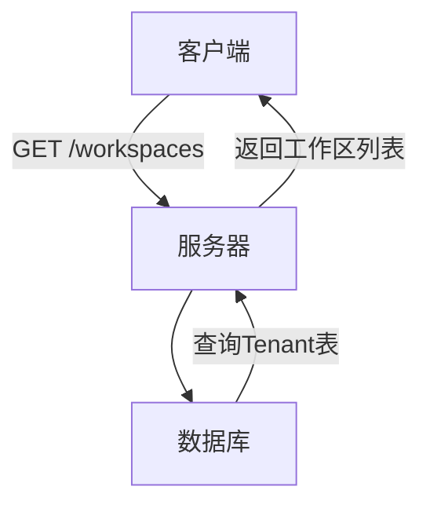

**Diagram sources**
- [workspace.py](file://api/controllers/console/workspace/workspace.py#L25-L45)

### 获取所有工作区
获取系统中所有工作区的分页列表（管理员权限）。

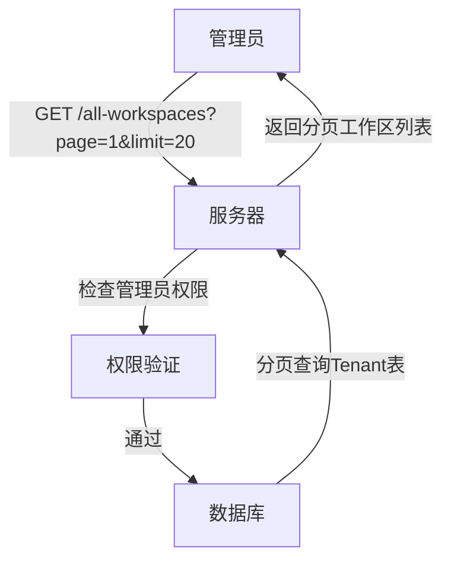

**Diagram sources**
- [workspace.py](file://api/controllers/console/workspace/workspace.py#L47-L68)

### 获取当前工作区信息
获取当前工作区的详细信息，包括ID、名称、计划、状态、创建时间、角色和自定义配置等。

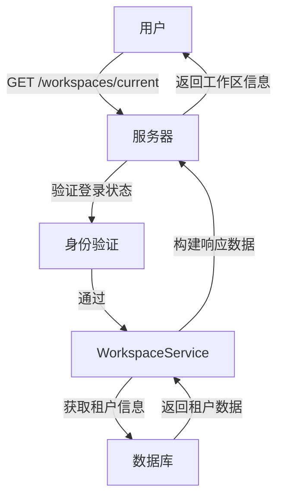

**Diagram sources**
- [workspace.py](file://api/controllers/console/workspace/workspace.py#L70-L100)
- [workspace_service.py](file://api/services/workspace_service.py#L10-L50)

### 切换工作区
切换到指定的工作区。

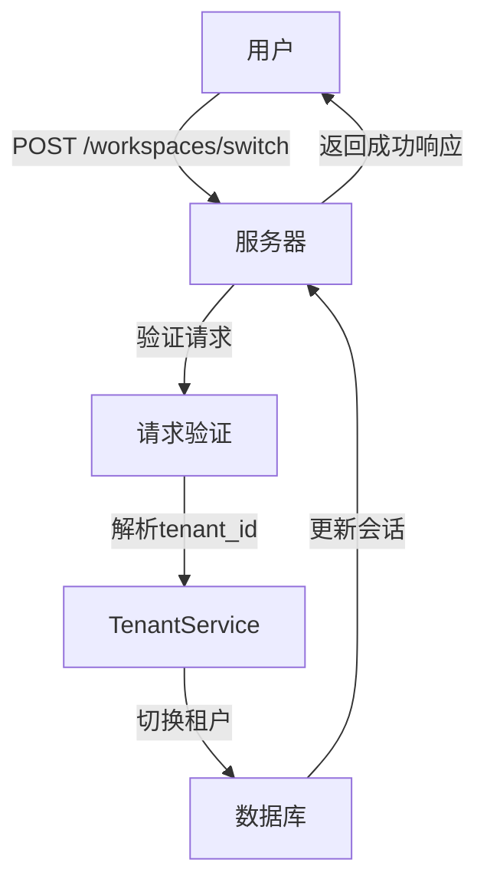

**Diagram sources**
- [workspace.py](file://api/controllers/console/workspace/workspace.py#L102-L125)

### 修改工作区信息
修改工作区的基本信息，如名称。

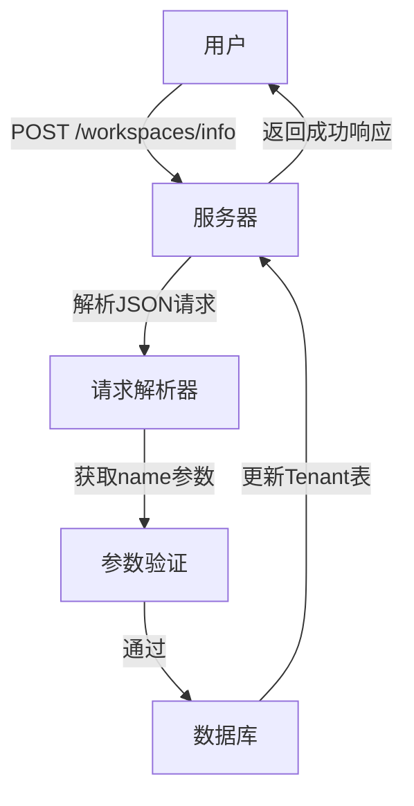

**Diagram sources**
- [workspace.py](file://api/controllers/console/workspace/workspace.py#L230-L253)

**Section sources**
- [workspace.py](file://api/controllers/console/workspace/workspace.py#L25-L253)

## 成员管理与角色权限

成员管理API提供了对工作区成员的全面管理功能，包括成员列表获取、成员邀请、角色更新和所有者转移等。

### 获取成员列表
获取当前工作区的所有成员列表。

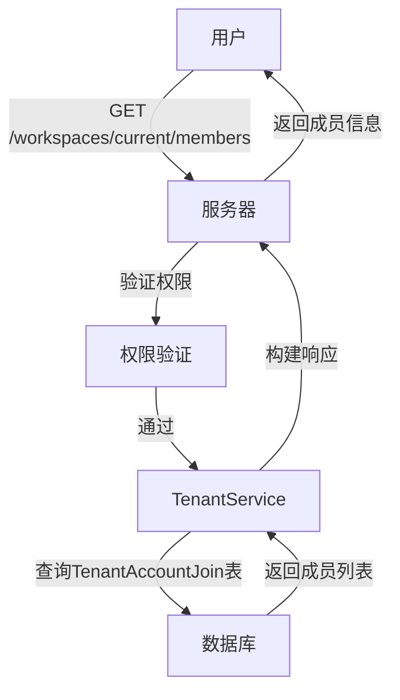

**Diagram sources**
- [members.py](file://api/controllers/console/workspace/members.py#L15-L30)

### 邀请成员
通过电子邮件邀请新成员加入工作区。

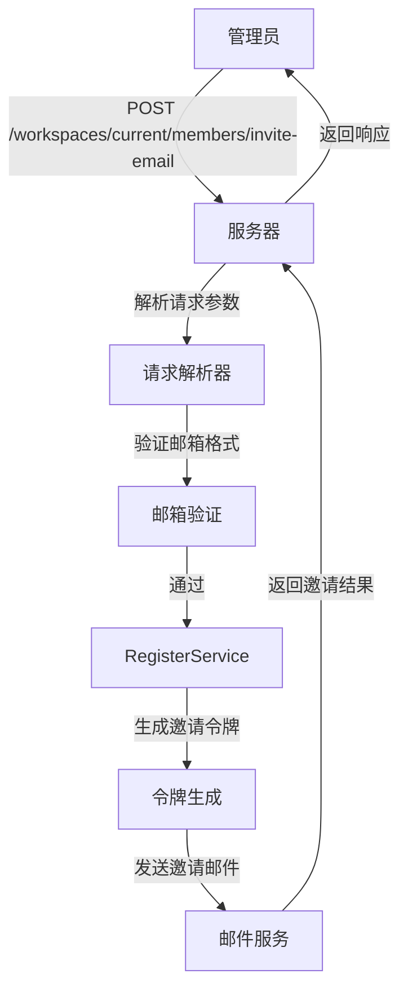

**Diagram sources**
- [members.py](file://api/controllers/console/workspace/members.py#L32-L85)

### 更新成员角色
更新指定成员的角色。

```mermaid
flowchart TD
Admin["管理员"] --> |PUT /workspaces/current/members/{member_id}/update-role| Server["服务器"]
Server --> |解析member_id| Parser["参数解析"]
Parser --> |验证新角色| Validator["角色验证"]
Validator --> |通过| Service["TenantService"]
Service --> |更新TenantAccountJoin表| DB["数据库"]
DB --> |返回成功| Server
Server --> |返回响应| Admin
```

**Diagram sources**
- [members.py](file://api/controllers/console/workspace/members.py#L140-L165)

### 所有者转移
安全地将工作区所有者角色转移给其他成员。

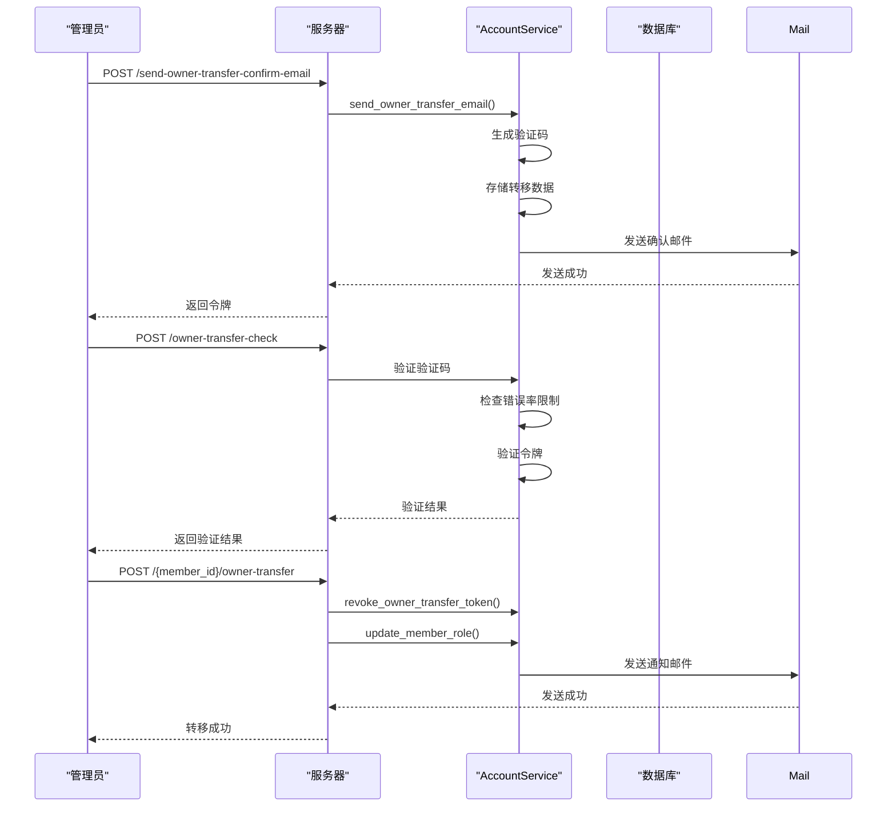

**Diagram sources**
- [members.py](file://api/controllers/console/workspace/members.py#L190-L313)

**Section sources**
- [members.py](file://api/controllers/console/workspace/members.py#L15-L313)

## 模型提供商配置

模型提供商配置API支持主流AI模型提供商的集成，包括OpenAI、Anthropic、Azure等，提供凭据管理、验证和首选提供商设置功能。

### 获取模型提供商列表
获取当前工作区支持的模型提供商列表。

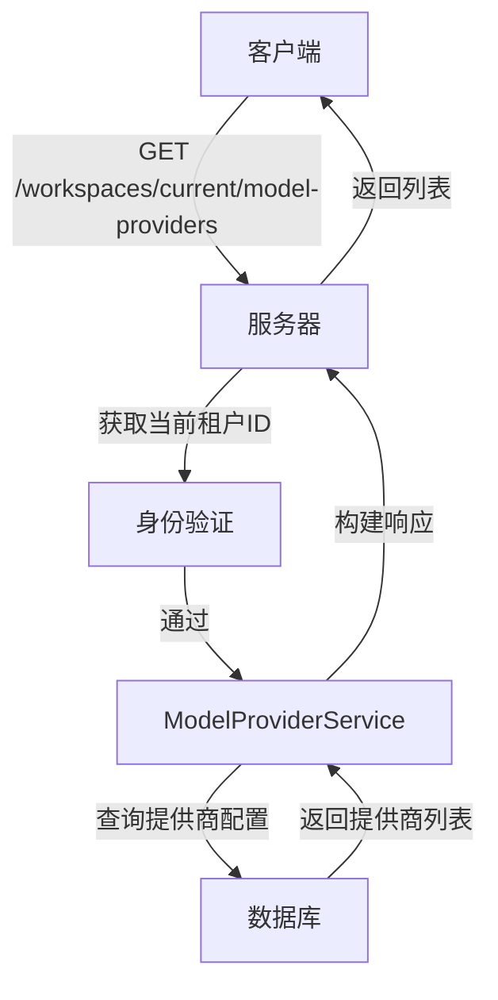

**Diagram sources**
- [model_providers.py](file://api/controllers/console/workspace/model_providers.py#L15-L35)

### 添加模型提供商凭据
为指定模型提供商添加新的凭据。

```mermaid
flowchart TD
Admin["管理员"] --> |POST /model-providers/{provider}/credentials| Server["服务器"]
Server --> |验证管理员权限| Auth["权限验证"]
Auth --> |通过| Parser["请求解析器"]
Parser --> |获取凭据数据| Validator["凭据验证"]
Validator --> |通过| Service["ModelProviderService"]
Service --> |创建提供商凭据| DB["数据库"]
DB --> |存储凭据| Server
Server --> |返回成功| Admin
```

**Diagram sources**
- [model_providers.py](file://api/controllers/console/workspace/model_providers.py#L37-L65)

### 验证模型提供商凭据
验证提供的模型提供商凭据是否有效。

```mermaid
flowchart TD
User["用户"] --> |POST /model-providers/{provider}/credentials/validate| Server["服务器"]
Server --> |解析凭据| Parser["请求解析器"]
Parser --> |调用验证服务| Service["ModelProviderService"]
Service --> |连接模型API| API["模型提供商API"]
API --> |返回验证结果| Service
Service --> |构建响应| Server
Server --> |返回验证结果| User
```

**Diagram sources**
- [model_providers.py](file://api/controllers/console/workspace/model_providers.py#L120-L145)

### 设置首选提供商类型
设置模型提供商的首选类型（系统默认或自定义）。

```mermaid
flowchart TD
Admin["管理员"] --> |POST /model-providers/{provider}/preferred-provider-type| Server["服务器"]
Server --> |验证管理员权限| Auth["权限验证"]
Auth --> |通过| Parser["请求解析器"]
Parser --> |获取首选类型| Service["ModelProviderService"]
Service --> |更新首选提供商| DB["数据库"]
DB --> |保存设置| Server
Server --> |返回成功| Admin
```

**Diagram sources**
- [model_providers.py](file://api/controllers/console/workspace/model_providers.py#L190-L215)

**Section sources**
- [model_providers.py](file://api/controllers/console/workspace/model_providers.py#L15-L264)

## 负载均衡配置

负载均衡配置API提供了对模型调用负载均衡的高级配置功能，支持多凭据的负载均衡和故障转移。

### 负载均衡凭据验证
验证用于负载均衡的模型提供商凭据。

```mermaid
flowchart TD
Admin["管理员"] --> |POST /model-providers/{provider}/models/load-balancing-configs/credentials-validate| Server["服务器"]
Server --> |验证特权角色| Auth["权限验证"]
Auth --> |通过| Parser["请求解析器"]
Parser --> |获取模型和凭据| Service["ModelLoadBalancingService"]
Service --> |验证凭据有效性| API["模型提供商API"]
API --> |返回验证结果| Service
Service --> |构建响应| Server
Server --> |返回结果| Admin
```

**Diagram sources**
- [load_balancing_config.py](file://api/controllers/console/workspace/load_balancing_config.py#L15-L60)

### 负载均衡配置凭据验证
验证特定负载均衡配置的凭据。

```mermaid
flowchart TD
Admin["管理员"] --> |POST /model-providers/{provider}/models/load-balancing-configs/{config_id}/credentials-validate| Server["服务器"]
Server --> |验证特权角色| Auth["权限验证"]
Auth --> |通过| Parser["请求解析器"]
Parser --> |获取配置ID和凭据| Service["ModelLoadBalancingService"]
Service --> |验证指定配置的凭据| API["模型提供商API"]
API --> |返回验证结果| Service
Service --> |构建响应| Server
Server --> |返回结果| Admin
```

**Diagram sources**
- [load_balancing_config.py](file://api/controllers/console/workspace/load_balancing_config.py#L62-L125)

**Section sources**
- [load_balancing_config.py](file://api/controllers/console/workspace/load_balancing_config.py#L15-L125)

## 工具提供商集成

工具提供商集成API支持多种类型的工具集成，包括内置工具、API工具、工作流工具和MCP工具。

### 内置工具提供商管理
管理内置工具提供商，如Google Search、Wolfram Alpha等。

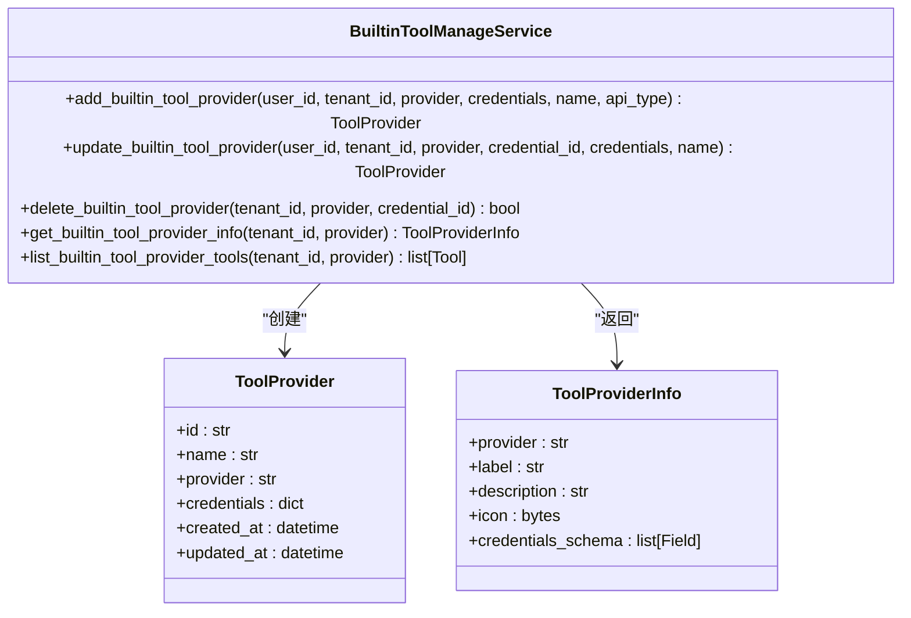

**Diagram sources**
- [tool_providers.py](file://api/controllers/console/workspace/tool_providers.py#L150-L250)

### API工具提供商管理
管理自定义API工具提供商。

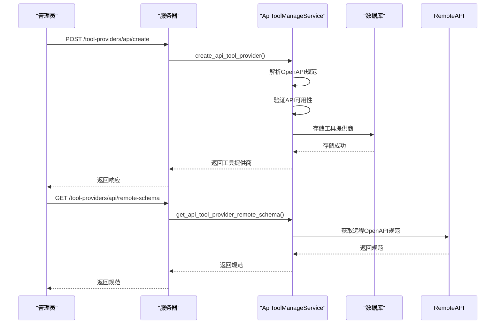

**Diagram sources**
- [tool_providers.py](file://api/controllers/console/workspace/tool_providers.py#L252-L450)

### 工作流工具提供商管理
将Dify工作流作为工具集成到其他应用中。

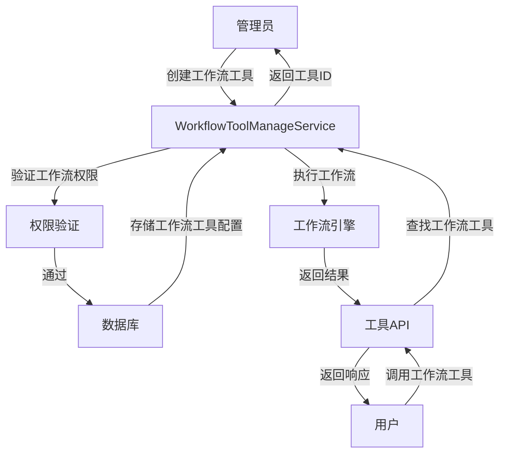

**Diagram sources**
- [tool_providers.py](file://api/controllers/console/workspace/tool_providers.py#L550-L650)

### OAuth工具集成
支持需要OAuth认证的工具提供商集成。

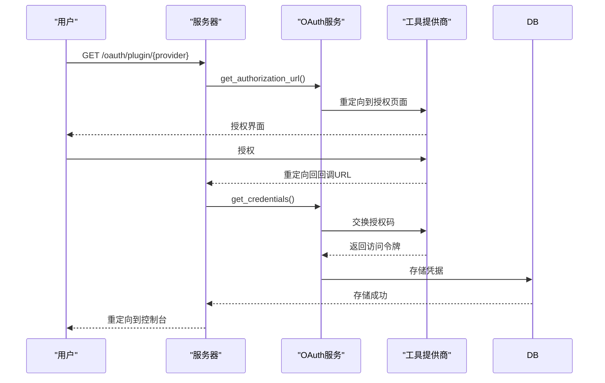

**Diagram sources**
- [tool_providers.py](file://api/controllers/console/workspace/tool_providers.py#L900-L1000)

**Section sources**
- [tool_providers.py](file://api/controllers/console/workspace/tool_providers.py#L15-L799)

## 端点管理

端点管理API用于管理插件的端点配置，支持端点的创建、更新、删除和启用/禁用。

### 创建端点
为指定插件创建新的端点。

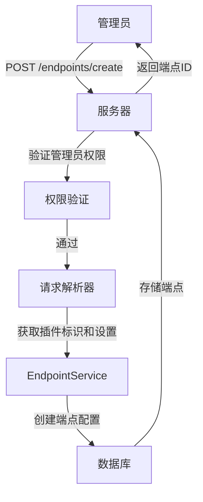

**Diagram sources**
- [endpoint.py](file://api/controllers/console/workspace/endpoint.py#L15-L40)

### 端点列表管理
获取端点列表，支持分页和按插件过滤。

```mermaid
flowchart TD
User["用户"] --> |GET /endpoints/list| Server["服务器"]
Server --> |验证权限| Auth["权限验证"]
Auth --> |通过| Parser["请求解析器"]
Parser --> |获取分页参数| Service["EndpointService"]
Service --> |查询端点表| DB["数据库"]
DB --> |返回端点列表| Service
Service --> |构建响应| Server
Server --> |返回列表| User
```

**Diagram sources**
- [endpoint.py](file://api/controllers/console/workspace/endpoint.py#L42-L65)

### 端点状态管理
启用或禁用指定的端点。

```mermaid
flowchart TD
Admin["管理员"] --> |POST /endpoints/enable| Server["服务器"]
Server --> |验证管理员权限| Auth["权限验证"]
Auth --> |通过| Parser["请求解析器"]
Parser --> |获取端点ID| Service["EndpointService"]
Service --> |更新端点状态| DB["数据库"]
DB --> |设置启用状态| Server
Server --> |返回成功| Admin
```

**Diagram sources**
- [endpoint.py](file://api/controllers/console/workspace/endpoint.py#L140-L165)

**Section sources**
- [endpoint.py](file://api/controllers/console/workspace/endpoint.py#L15-L209)

## 权限模型与数据隔离

Dify实现了严格的多租户权限模型和数据隔离机制，确保不同工作区之间的数据安全和资源隔离。

### 权限角色
Dify定义了多种权限角色，用于控制用户在工作区中的操作权限。

```mermaid
classDiagram
class TenantAccountRole {
+OWNER : str
+ADMIN : str
+NORMAL : str
+READ_ONLY : str
+DATASET_OPERATOR : str
}
class TenantAccountJoin {
+tenant_id : str
+account_id : str
+role : str
+inviter_id : str
+created_at : datetime
+updated_at : datetime
}
class Account {
+id : str
+email : str
+name : str
+password_hash : str
+created_at : datetime
+updated_at : datetime
}
class Tenant {
+id : str
+name : str
+plan : str
+status : str
+created_at : datetime
+updated_at : datetime
+custom_config : dict
}
TenantAccountJoin --> Tenant : "属于"
TenantAccountJoin --> Account : "关联"
TenantAccountRole <|-- TenantAccountJoin : "包含"
```

**Diagram sources**
- [members.py](file://api/controllers/console/workspace/members.py#L15-L313)
- [workspace.py](file://api/controllers/console/workspace/workspace.py#L25-L253)

### 数据隔离策略
Dify通过租户ID（tenant_id）实现数据隔离，确保每个工作区的数据独立存储和访问。

```mermaid
flowchart TD
subgraph "数据库"
Tenant["Tenant (租户表)"]
Account["Account (用户表)"]
TenantAccountJoin["TenantAccountJoin (租户用户关联表)"]
ModelProvider["ModelProvider (模型提供商表)"]
ToolProvider["ToolProvider (工具提供商表)"]
end
Tenant --> |1:N| TenantAccountJoin
Account --> |1:N| TenantAccountJoin
Tenant --> |1:N| ModelProvider
Tenant --> |1:N| ToolProvider
style Tenant fill:#f9f,stroke:#333
style Account fill:#bbf,stroke:#333
style TenantAccountJoin fill:#f96,stroke:#333
style ModelProvider fill:#6f9,stroke:#333
style ToolProvider fill:#69f,stroke:#333
```

**Diagram sources**
- [workspace.py](file://api/controllers/console/workspace/workspace.py#L25-L253)
- [model_providers.py](file://api/controllers/console/workspace/model_providers.py#L15-L264)
- [tool_providers.py](file://api/controllers/console/workspace/tool_providers.py#L15-L799)

### 跨工作区操作限制
Dify对跨工作区操作实施了严格的限制，确保数据安全和权限控制。

```mermaid
flowchart TD
User["用户"] --> |尝试访问| WorkspaceA["工作区A"]
WorkspaceA --> |检查租户关联| Auth["权限验证"]
Auth --> |用户属于工作区A| Allow["允许访问"]
User --> |尝试访问| WorkspaceB["工作区B"]
WorkspaceB --> |检查租户关联| Auth
Auth --> |用户不属于工作区B| Deny["拒绝访问"]
Admin["管理员"] --> |切换工作区| Switch["工作区切换API"]
Switch --> |验证目标工作区| Validator["验证器"]
Validator --> |用户已加入目标工作区| Success["切换成功"]
Validator --> |用户未加入目标工作区| Fail["切换失败"]
```

**Section sources**
- [workspace.py](file://api/controllers/console/workspace/workspace.py#L25-L253)
- [members.py](file://api/controllers/console/workspace/members.py#L15-L313)

## API使用示例

### curl示例

#### 获取当前工作区信息
```bash
curl -X GET \
  'http://localhost:5001/workspaces/current' \
  -H 'Authorization: Bearer <your-api-key>' \
  -H 'Content-Type: application/json'
```

#### 邀请成员
```bash
curl -X POST \
  'http://localhost:5001/workspaces/current/members/invite-email' \
  -H 'Authorization: Bearer <your-api-key>' \
  -H 'Content-Type: application/json' \
  -d '{
    "emails": ["user@example.com"],
    "role": "admin",
    "language": "en-US"
  }'
```

#### 添加OpenAI凭据
```bash
curl -X POST \
  'http://localhost:5001/workspaces/current/model-providers/openai/credentials' \
  -H 'Authorization: Bearer <your-api-key>' \
  -H 'Content-Type: application/json' \
  -d '{
    "credentials": {
      "openai_api_key": "sk-xxxxxxxxxxxxxxxxxxxxxxxxxxxxxxxxxxxxxxxx"
    },
    "name": "My OpenAI Account"
  }'
```

### Python SDK示例

```python
from dify_client import DifyClient

# 初始化客户端
client = DifyClient(api_key="your-api-key", base_url="http://localhost:5001")

# 获取当前工作区信息
workspace_info = client.get_current_workspace()
print(f"工作区名称: {workspace_info['name']}")

# 邀请成员
invite_result = client.invite_member(
    emails=["user@example.com"],
    role="admin"
)
print(f"邀请结果: {invite_result}")

# 添加模型提供商凭据
credential_result = client.add_model_provider_credential(
    provider="openai",
    credentials={"openai_api_key": "sk-xxxxxxxxxxxxxxxxxxxxxxxxxxxxxxxxxxxxxxxx"},
    name="My OpenAI Account"
)
print(f"凭据添加结果: {credential_result}")
```

## 错误代码

以下是工作区管理API的常见错误代码及其含义：

| 错误代码 | HTTP状态码 | 描述 |
|---------|-----------|------|
| `invalid-role` | 400 | 无效的角色名称 |
| `cannot-operate-self` | 400 | 不能对自己执行此操作 |
| `forbidden` | 403 | 无权限执行此操作 |
| `member-not-found` | 404 | 成员未找到 |
| `invalid-token` | 400 | 无效的令牌 |
| `invalid-email` | 400 | 无效的邮箱地址 |
| `workspace-members-limit-exceeded` | 400 | 工作区成员数量超过限制 |
| `email-send-ip-limit` | 400 | 邮件发送IP限制 |
| `owner-transfer-limit` | 400 | 所有者转移次数超过限制 |
| `no-file-uploaded` | 400 | 未上传文件 |
| `too-many-files` | 400 | 上传文件过多 |
| `filename-not-exists` | 400 | 文件名不存在 |
| `file-too-large` | 413 | 文件过大 |
| `unsupported-file-type` | 400 | 不支持的文件类型 |
| `credentials-validate-failed` | 400 | 凭据验证失败 |
| `plugin-permission-denied` | 400 | 插件权限被拒绝 |

**Section sources**
- [members.py](file://api/controllers/console/workspace/members.py#L15-L313)
- [model_providers.py](file://api/controllers/console/workspace/model_providers.py#L15-L264)
- [workspace.py](file://api/controllers/console/workspace/workspace.py#L25-L253)