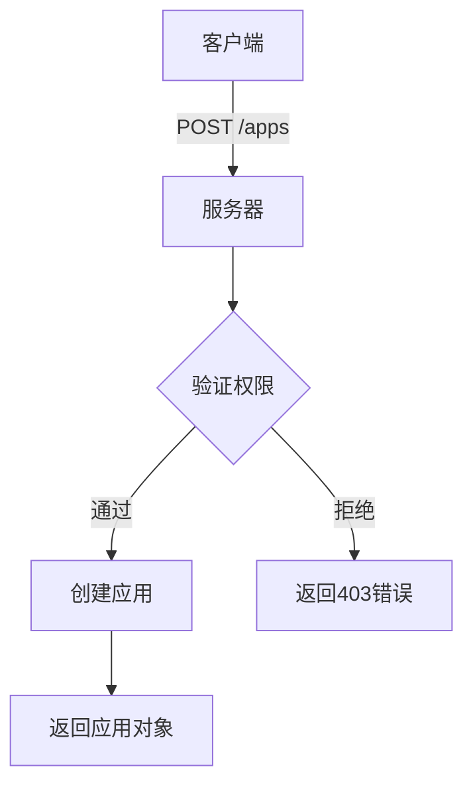

# 应用管理API

<cite>
**本文档中引用的文件**  
- [app.py](file://api/controllers/console/app/app.py)
- [mcp_server.py](file://api/controllers/console/app/mcp_server.py)
- [apps.ts](file://web/service/apps.ts)
- [index.tsx](file://web/service/demo/index.tsx)
</cite>

## 目录
1. [简介](#简介)
2. [应用生命周期管理](#应用生命周期管理)
3. [应用配置管理](#应用配置管理)
4. [站点与API配置](#站点与api配置)
5. [MCP服务器配置](#mcp服务器配置)
6. [使用示例](#使用示例)
7. [权限控制](#权限控制)
8. [错误处理](#错误处理)

## 简介
本API文档详细介绍了Dify平台中应用的创建、配置、发布和管理功能。通过这些API端点，开发者可以自动化管理不同类型的应用（如工作流应用、聊天应用、补全应用），实现应用的全生命周期控制。文档涵盖HTTP方法、URL模式、请求体结构、响应格式、错误代码，并提供实际的调用示例。

## 应用生命周期管理

### 创建应用
通过POST请求创建新应用，需要提供应用名称、描述、模式等基本信息。

**HTTP方法**: POST  
**URL**: `/apps`  
**请求体参数**:
- `name`: 应用名称（必填）
- `description`: 应用描述
- `mode`: 应用模式（聊天、工作流、补全等）
- `icon`: 应用图标
- `icon_background`: 图标背景色

**响应格式**: 创建成功的应用对象，状态码201。

**权限要求**: 用户必须具有编辑者权限。



**Section sources**
- [app.py](file://api/controllers/console/app/app.py#L99-L134)

### 复制应用
通过POST请求复制现有应用，创建一个具有相同配置的新应用实例。

**HTTP方法**: POST  
**URL**: `/apps/{app_id}/copy`  
**响应格式**: 复制成功的应用对象。

**Section sources**
- [app.py](file://api/controllers/console/app/app.py#L343-L373)

### 导出应用
将应用配置导出为DSL（领域特定语言）格式，便于备份或迁移。

**HTTP方法**: POST  
**URL**: `/apps/{app_id}/export`  
**响应格式**: 应用DSL配置文件。

**Section sources**
- [app.py](file://api/controllers/console/app/app.py#L343-L373)

### 删除应用
通过DELETE请求删除指定应用。

**HTTP方法**: DELETE  
**URL**: `/apps/{app_id}`  
**响应格式**: 成功状态信息。

## 应用配置管理

### 更新应用名称
修改应用的显示名称。

**HTTP方法**: POST  
**URL**: `/apps/{app_id}/name`  
**请求体参数**:
- `name`: 新的应用名称

**响应格式**: 更新后的应用对象。

**Section sources**
- [app.py](file://api/controllers/console/app/app.py#L265-L306)

### 更新应用图标
修改应用的图标和背景色。

**HTTP方法**: POST  
**URL**: `/apps/{app_id}/icon`  
**请求体参数**:
- `icon`: 图标标识符
- `icon_background`: 背景色值

**响应格式**: 更新后的应用对象。

**Section sources**
- [app.py](file://api/controllers/console/app/app.py#L265-L306)

### 更新模型配置
调整应用使用的模型参数和提示词模板。

**HTTP方法**: POST  
**URL**: `/apps/{app_id}/model-config`  
**请求体参数**: 模型配置对象，包括提示词、模型参数等。

**响应格式**: 更新状态。

**Section sources**
- [apps.ts](file://web/service/apps.ts#L98-L125)

## 站点与API配置

### 启用/禁用站点访问
控制应用是否可以通过站点URL公开访问。

**HTTP方法**: POST  
**URL**: `/apps/{app_id}/site-enable`  
**请求体参数**:
- `enable_site`: 布尔值，true表示启用

**响应格式**: 更新后的应用对象。

**权限要求**: 编辑者权限。

**Section sources**
- [app.py](file://api/controllers/console/app/app.py#L304-L347)

### 启用/禁用API访问
控制应用是否可以通过API端点访问。

**HTTP方法**: POST  
**URL**: `/apps/{app_id}/api-enable`  
**请求体参数**:
- `enable_api`: 布尔值，true表示启用

**响应格式**: 更新后的应用对象。

**权限要求**: 管理员或所有者权限。

**Section sources**
- [app.py](file://api/controllers/console/app/app.py#L304-L347)

### 追踪配置
管理应用的调用追踪功能。

**HTTP方法**: POST  
**URL**: `/apps/{app_id}/trace`  
**请求体参数**:
- `enabled`: 是否启用追踪
- `tracing_provider`: 追踪服务提供商

**响应格式**: 操作成功状态。

**Section sources**
- [app.py](file://api/controllers/console/app/app.py#L343-L373)

## MCP服务器配置

### 创建MCP服务器
为应用创建MCP（Model Control Plane）服务器实例。

**HTTP方法**: POST  
**URL**: `/apps/{app_id}/mcp-servers`  
**请求体参数**:
- `description`: 服务器描述
- `parameters`: 配置参数对象

**响应格式**: 创建的MCP服务器对象。

**Section sources**
- [mcp_server.py](file://api/controllers/console/app/mcp_server.py#L39-L72)

### 更新MCP服务器
修改现有MCP服务器的配置。

**HTTP方法**: PUT  
**URL**: `/apps/{app_id}/mcp-servers`  
**请求体参数**:
- `id`: 服务器ID
- `description`: 新描述
- `parameters`: 更新的参数
- `status`: 服务器状态

**响应格式**: 更新后的MCP服务器对象。

**Section sources**
- [mcp_server.py](file://api/controllers/console/app/mcp_server.py#L72-L107)

## 使用示例

### curl示例：创建应用
```bash
curl -X POST https://api.dify.ai/v1/apps \
  -H "Authorization: Bearer {api_key}" \
  -H "Content-Type: application/json" \
  -d '{
    "name": "我的新应用",
    "description": "这是一个测试应用",
    "mode": "chat",
    "icon": "message",
    "icon_background": "#FFECD1"
  }'
```

### Python SDK示例：更新应用配置
```python
import requests

def update_app_config(app_id, api_key, config):
    url = f"https://api.dify.ai/v1/apps/{app_id}/model-config"
    headers = {
        "Authorization": f"Bearer {api_key}",
        "Content-Type": "application/json"
    }
    response = requests.post(url, json=config, headers=headers)
    return response.json()
```

### 前端调用示例
```typescript
// 从web服务中获取的示例
const updateAppModelConfig = ({ url, body }) => {
  return post<UpdateAppModelConfigResponse>(url, { body })
}
```

**Section sources**
- [index.tsx](file://web/service/demo/index.tsx#L41-L99)

## 权限控制
应用管理API实施严格的权限控制机制：

- **创建/删除应用**: 需要编辑者或更高权限
- **API访问控制**: 需要管理员或所有者权限
- **敏感操作**: 如追踪配置，需要相应权限级别
- **租户隔离**: 用户只能访问所属租户的应用

权限验证通过装饰器实现，如`@login_required`、`@get_app_model`等。

**Section sources**
- [app.py](file://api/controllers/console/app/app.py#L99-L134)

## 错误处理

### 常见错误代码
- **400 Bad Request**: 请求参数无效
- **401 Unauthorized**: 认证失败
- **403 Forbidden**: 权限不足
- **404 Not Found**: 资源不存在
- **422 Unprocessable Entity**: 参数验证失败

### 参数验证规则
- 应用名称不能为空且长度有限制
- 模式必须是允许的类型之一
- 图标和背景色需要符合格式要求
- JSON参数需要有效结构

**Section sources**
- [app.py](file://api/controllers/console/app/app.py#L99-L134)