# 管理API

<cite>
**本文档中引用的文件**  
- [ping.py](file://api/controllers/console/ping.py)
- [version.py](file://api/controllers/console/version.py)
- [ext_blueprints.py](file://api/extensions/ext_blueprints.py)
- [__init__.py](file://api/controllers/console/__init__.py)
- [apikey.py](file://api/controllers/console/apikey.py)
- [auth.py](file://api/controllers/console/auth/login.py)
- [workspace.py](file://api/controllers/console/workspace/workspace.py)
- [models.py](file://api/controllers/console/workspace/models.py)
- [model_providers.py](file://api/controllers/console/workspace/model_providers.py)
- [feature.py](file://api/controllers/console/feature.py)
- [setup.py](file://api/controllers/console/setup.py)
- [wraps.py](file://api/controllers/console/wraps.py)
- [app.py](file://api/app.py)
</cite>

## 目录
1. [简介](#简介)
2. [项目结构](#项目结构)
3. [核心组件](#核心组件)
4. [架构概述](#架构概述)
5. [详细组件分析](#详细组件分析)
6. [依赖分析](#依赖分析)
7. [性能考虑](#性能考虑)
8. [故障排除指南](#故障排除指南)
9. [结论](#结论)

## 简介
Dify管理API为平台的管理界面提供后端支持，涵盖应用管理、工作区配置、用户认证、模型提供商设置等核心功能。该API基于Flask框架构建，采用Flask Blueprints进行模块化路由组织，支持版本控制（v1/v2），并使用Pydantic模型进行请求验证。API通过API密钥、OAuth和会话管理实现安全的身份验证机制。本文档详细描述了Console API的设计与实现，包括端点列表、HTTP方法、URL模式、请求参数、响应格式、错误代码、curl示例和Python客户端调用代码，同时涵盖安全最佳实践、速率限制策略和常见问题排查。

## 项目结构
Dify的API层位于`api/`目录下，采用清晰的模块化结构。核心控制器位于`controllers/console/`目录，按功能划分为多个子模块，如`app`、`auth`、`workspace`等。服务层位于`services/`目录，提供业务逻辑封装。扩展模块在`extensions/`目录中定义，包括蓝图注册、CORS配置等。整个结构支持高内聚低耦合的设计原则，便于维护和扩展。

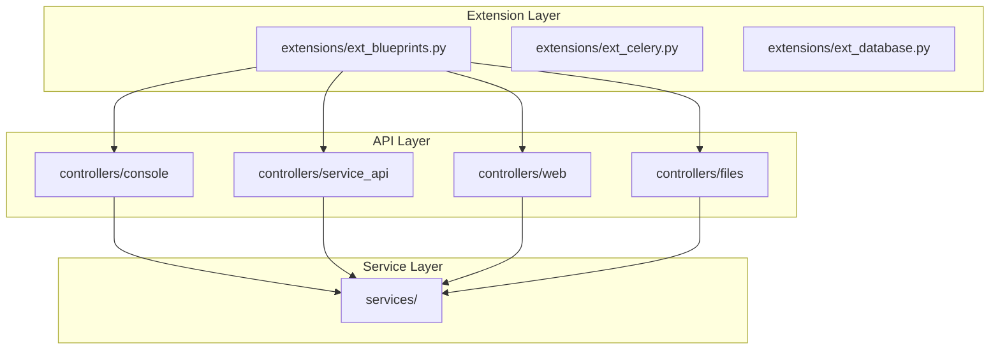

**Diagram sources**
- [ext_blueprints.py](file://api/extensions/ext_blueprints.py#L37-L51)
- [__init__.py](file://api/controllers/console/__init__.py#L0-L184)

**Section sources**
- [ext_blueprints.py](file://api/extensions/ext_blueprints.py#L0-L52)
- [__init__.py](file://api/controllers/console/__init__.py#L0-L184)

## 核心组件
管理API的核心组件包括基于Flask Blueprints的路由系统、版本控制机制、请求验证（使用Pydantic）、身份验证流程（API密钥、OAuth、会话管理）、工作区管理、应用配置、模型提供商集成和特性开关管理。这些组件协同工作，为Dify的管理界面提供稳定、安全、可扩展的后端服务。

**Section sources**
- [app.py](file://api/app.py#L1-L50)
- [ext_blueprints.py](file://api/extensions/ext_blueprints.py#L0-L52)

## 架构概述
Dify管理API采用分层架构，前端通过HTTP请求与API交互，API层通过Flask Blueprints组织路由，调用服务层处理业务逻辑，最终与数据库和外部服务通信。API通过`ExternalApi`类封装，支持CORS、请求验证和错误处理。身份验证通过装饰器实现，支持多种认证方式。整个架构支持水平扩展和微服务化。

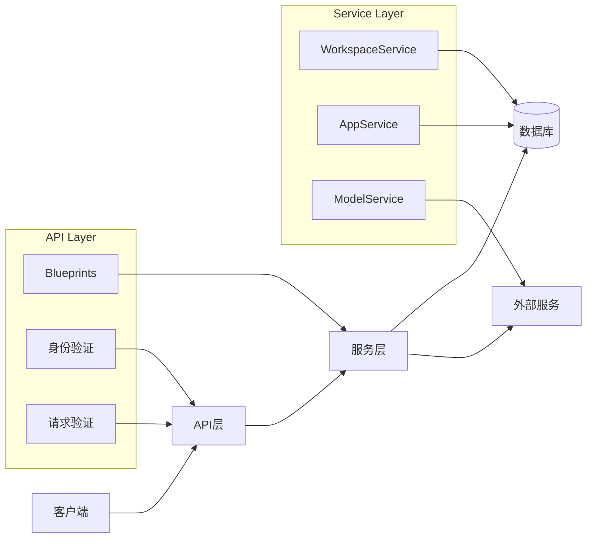

**Diagram sources**
- [ext_blueprints.py](file://api/extensions/ext_blueprints.py#L37-L51)
- [__init__.py](file://api/controllers/console/__init__.py#L0-L184)
- [workspace.py](file://api/controllers/console/workspace/workspace.py#L1-L20)

## 详细组件分析

### 健康检查与版本管理
健康检查和版本管理是API的基础功能，用于确保服务可用性和提供更新信息。

#### 健康检查端点
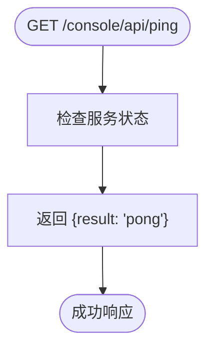

**Diagram sources**
- [ping.py](file://api/controllers/console/ping.py#L0-L13)

#### 版本检查流程
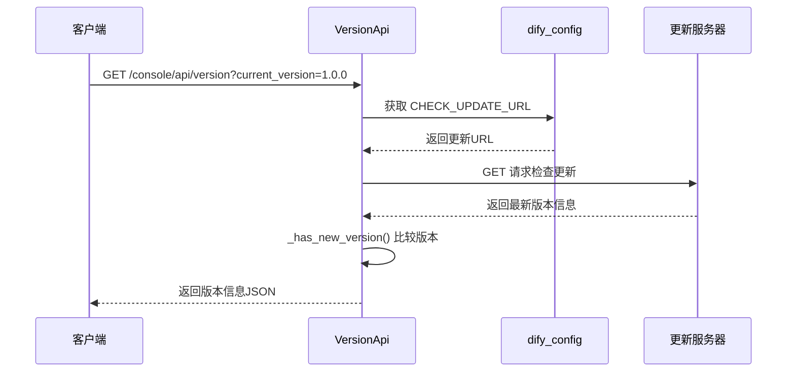

**Diagram sources**
- [version.py](file://api/controllers/console/version.py#L0-L64)

**Section sources**
- [ping.py](file://api/controllers/console/ping.py#L0-L13)
- [version.py](file://api/controllers/console/version.py#L0-L64)

### 路由组织与版本控制
API使用Flask Blueprints进行模块化路由组织，支持版本控制和功能隔离。

#### 蓝图注册流程
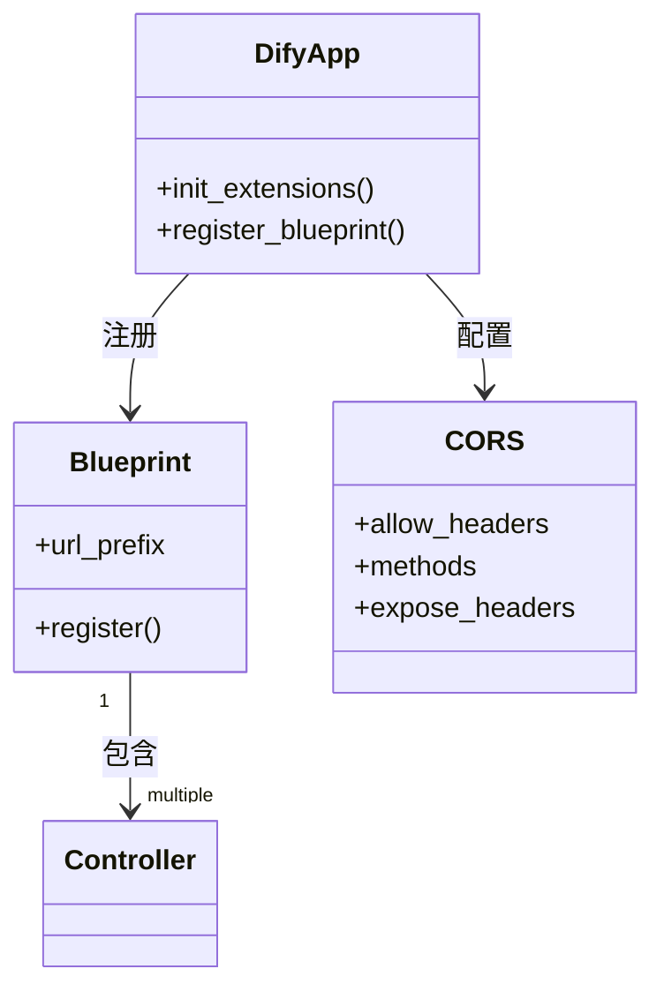

**Diagram sources**
- [ext_blueprints.py](file://api/extensions/ext_blueprints.py#L0-L52)
- [__init__.py](file://api/controllers/console/__init__.py#L0-L184)

**Section sources**
- [ext_blueprints.py](file://api/extensions/ext_blueprints.py#L0-L52)

### 身份验证机制
管理API支持多种身份验证方式，包括API密钥、OAuth和会话管理。

#### API密钥验证流程
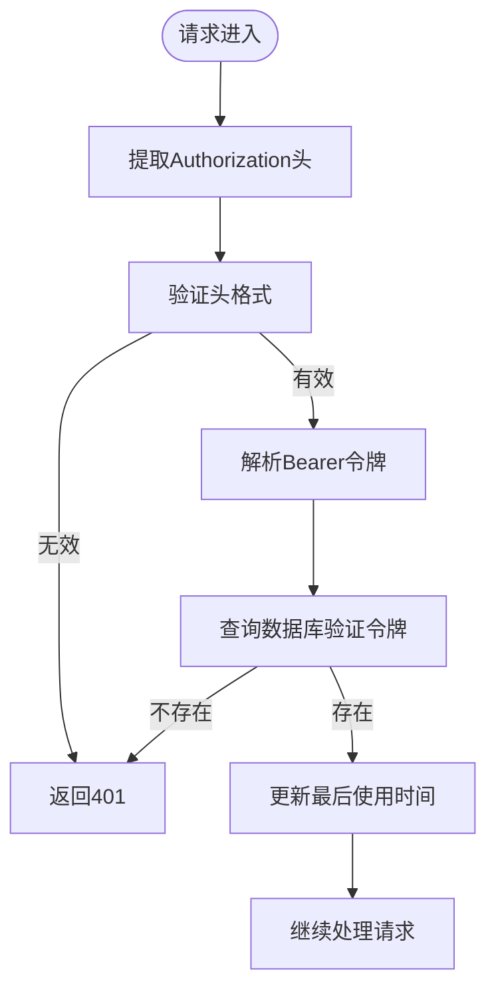

**Diagram sources**
- [wraps.py](file://api/controllers/service_api/wraps.py#L216-L256)
- [apikey.py](file://api/controllers/console/apikey.py#L1-L20)

#### OAuth认证流程
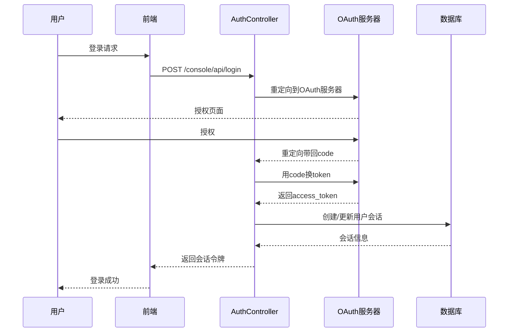

**Diagram sources**
- [auth.py](file://api/controllers/console/auth/login.py#L1-L30)
- [oauth_server.py](file://api/controllers/console/auth/oauth_server.py#L1-L20)

**Section sources**
- [auth.py](file://api/controllers/console/auth/login.py#L1-L30)
- [wraps.py](file://api/controllers/service_api/wraps.py#L216-L256)

### 工作区管理
工作区管理是管理API的核心功能之一，支持多租户架构。

#### 工作区API结构
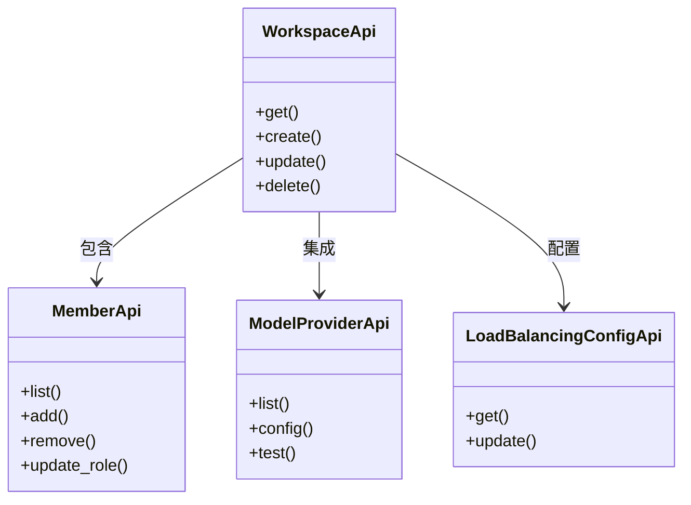

**Diagram sources**
- [workspace.py](file://api/controllers/console/workspace/workspace.py#L1-L20)
- [members.py](file://api/controllers/console/workspace/members.py#L1-L15)
- [model_providers.py](file://api/controllers/console/workspace/model_providers.py#L1-L15)

**Section sources**
- [workspace.py](file://api/controllers/console/workspace/workspace.py#L1-L100)
- [members.py](file://api/controllers/console/workspace/members.py#L1-L50)

### 应用与模型管理
管理API提供全面的应用和模型配置功能。

#### 应用导入流程
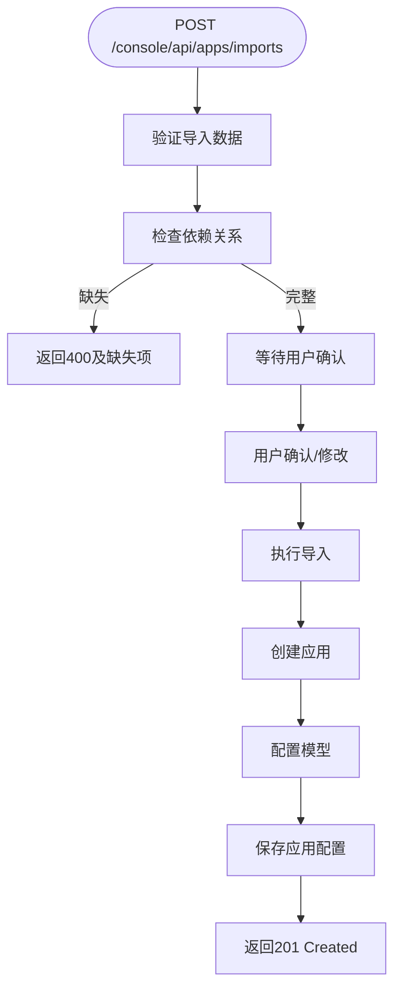

**Diagram sources**
- [app_import.py](file://api/controllers/console/app/app_import.py#L1-L20)
- [app.py](file://api/controllers/console/app/app.py#L1-L15)

#### 模型配置验证
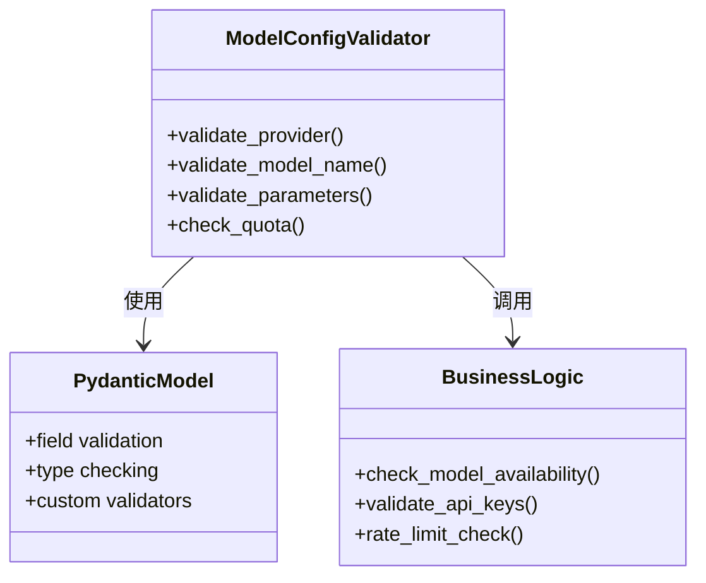

**Diagram sources**
- [model_config.py](file://api/controllers/console/app/model_config.py#L1-L15)
- [app_model_config_service.py](file://api/services/app_model_config_service.py#L1-L20)

**Section sources**
- [model_config.py](file://api/controllers/console/app/model_config.py#L1-L50)
- [app_import.py](file://api/controllers/console/app/app_import.py#L1-L50)

## 依赖分析
管理API的组件间依赖关系清晰，遵循高内聚低耦合原则。

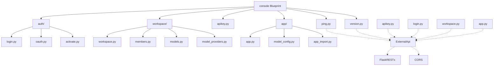

**Diagram sources**
- [ext_blueprints.py](file://api/extensions/ext_blueprints.py#L37-L51)
- [__init__.py](file://api/controllers/console/__init__.py#L0-L184)

**Section sources**
- [ext_blueprints.py](file://api/extensions/ext_blueprints.py#L0-L52)
- [__init__.py](file://api/controllers/console/__init__.py#L0-L184)

## 性能考虑
管理API在设计时考虑了性能优化，包括缓存策略、数据库连接池和异步处理。

- **缓存机制**：使用Redis缓存频繁访问的数据，如工作区配置、模型提供商信息
- **数据库优化**：使用连接池管理数据库连接，避免频繁创建销毁
- **异步任务**：耗时操作（如应用导入、数据索引）通过Celery异步执行
- **速率限制**：对关键API端点实施速率限制，防止滥用
- **响应压缩**：对响应内容进行GZIP压缩，减少网络传输

## 故障排除指南
### 常见问题及解决方案

| 问题现象 | 可能原因 | 解决方案 |
|--------|--------|--------|
| 401 Unauthorized | 认证令牌无效或过期 | 检查Authorization头格式，重新获取令牌 |
| 403 Forbidden | 权限不足 | 检查用户角色和权限配置 |
| 429 Too Many Requests | 触发速率限制 | 降低请求频率，或联系管理员调整限制 |
| 500 Internal Error | 服务端异常 | 检查服务日志，确认数据库连接正常 |
| 版本检查失败 | 无法连接更新服务器 | 检查网络连接和CHECK_UPDATE_URL配置 |

**Section sources**
- [error.py](file://api/controllers/console/error.py#L1-L20)
- [wraps.py](file://api/controllers/console/wraps.py#L1-L30)

## 结论
Dify管理API通过模块化设计、清晰的分层架构和完善的验证机制，为平台提供了稳定可靠的管理功能。API基于Flask Blueprints组织，支持版本控制和功能扩展。身份验证机制灵活，支持API密钥、OAuth等多种方式。工作区、应用、模型等核心功能的API设计合理，便于集成和使用。通过遵循本文档中的最佳实践，开发者可以高效地使用和扩展Dify的管理API功能。