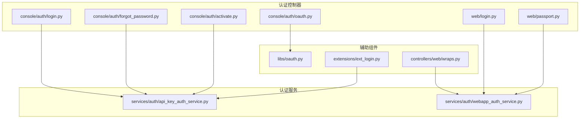
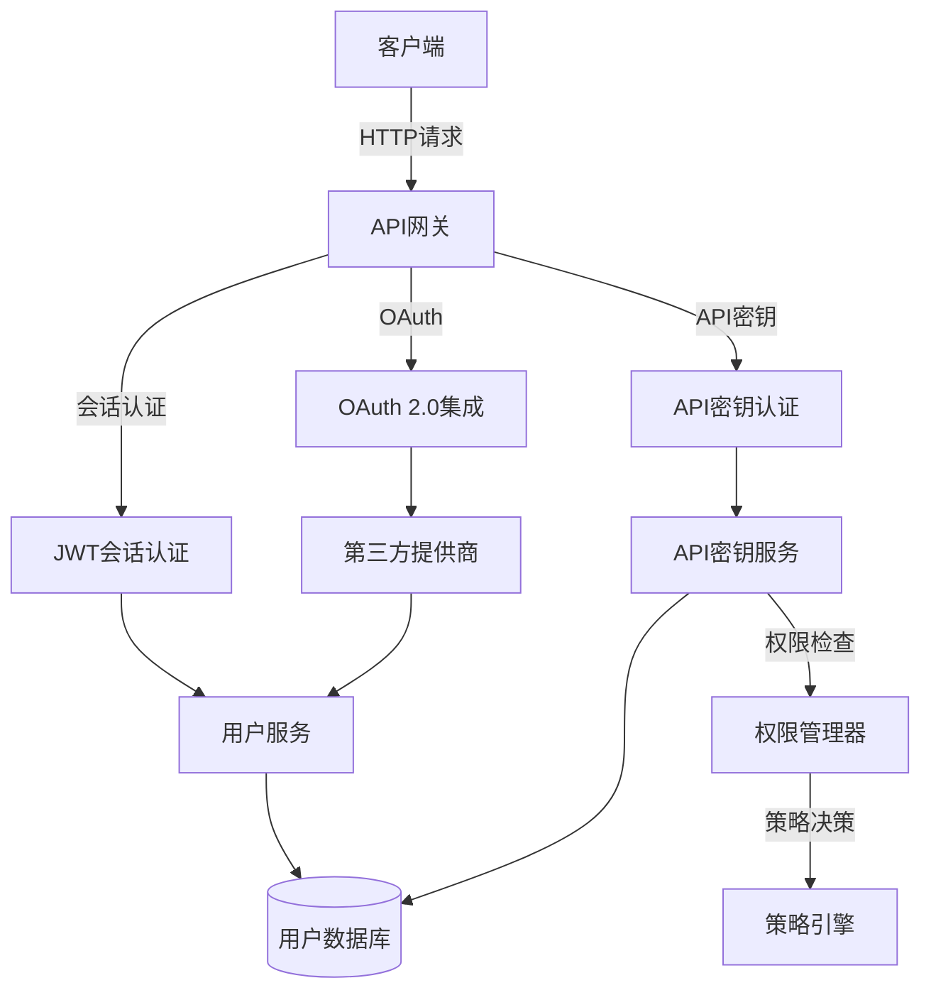
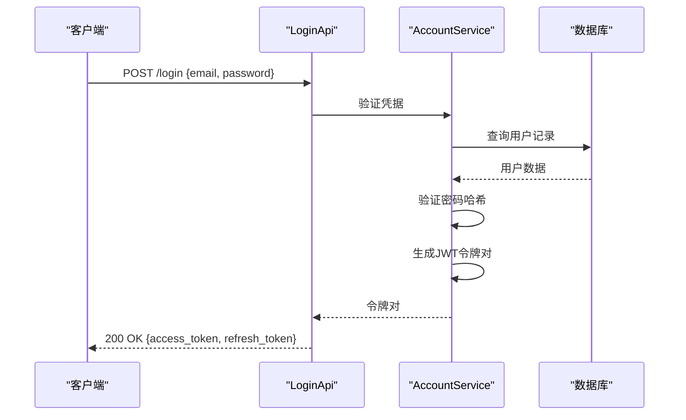
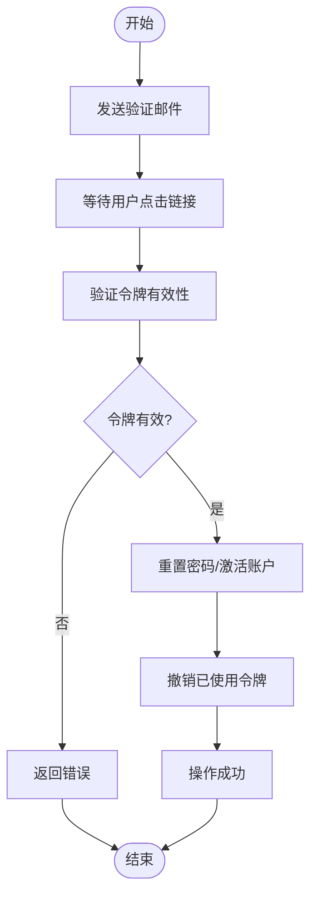
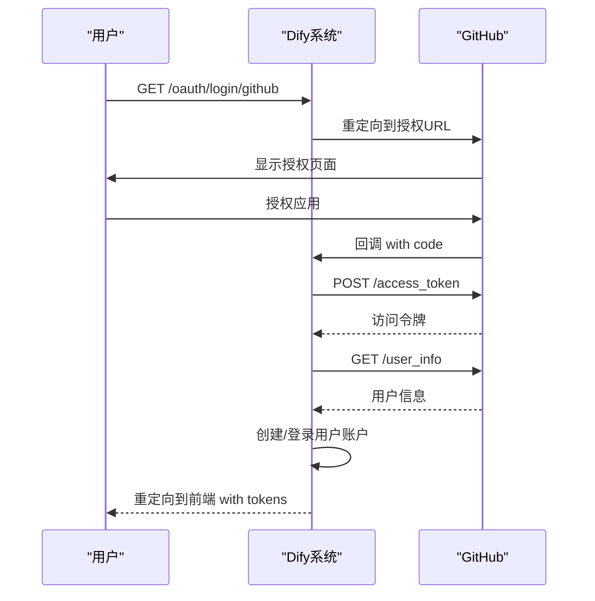
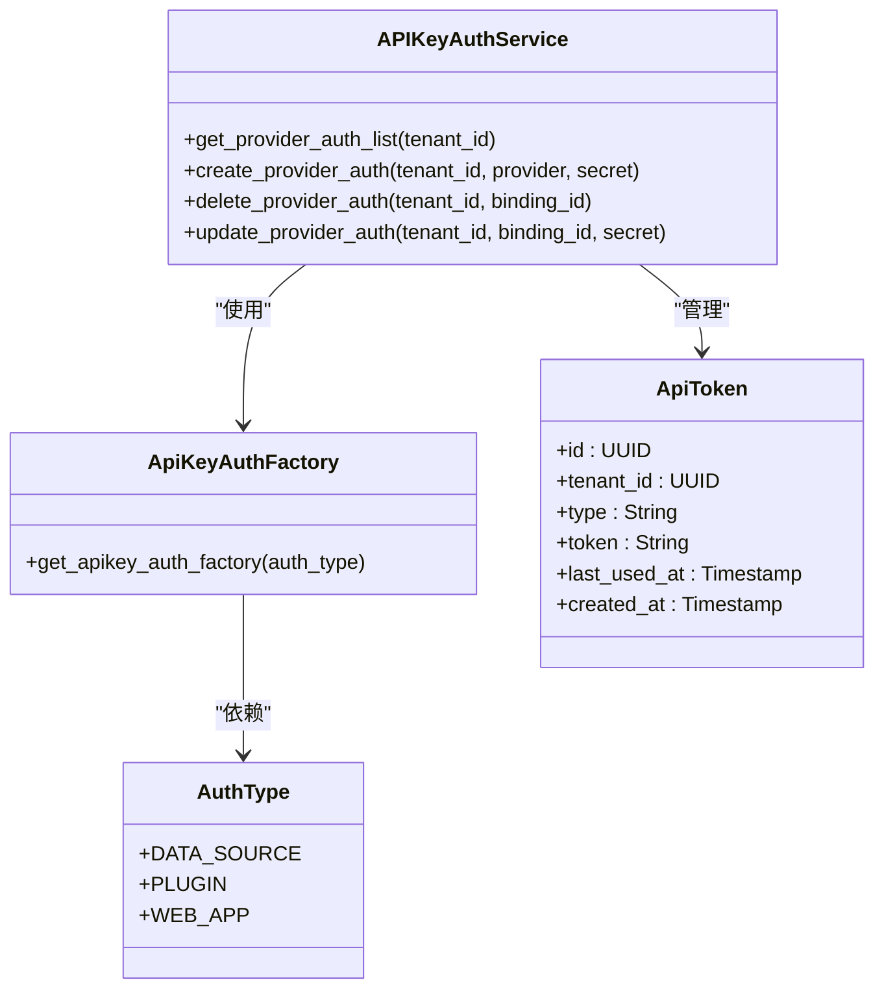
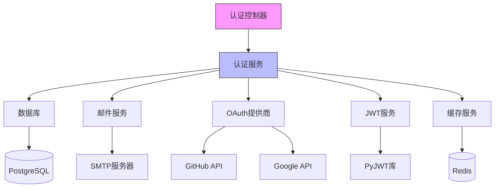

# 认证API

<cite>
**本文档中引用的文件**  
- [login.py](file://api/controllers/console/auth/login.py)
- [forgot_password.py](file://api/controllers/console/auth/forgot_password.py)
- [activate.py](file://api/controllers/console/auth/activate.py)
- [oauth.py](file://api/controllers/console/auth/oauth.py)
- [oauth_server.py](file://api/controllers/console/auth/oauth_server.py)
- [passport.py](file://api/controllers/web/passport.py)
- [login.py](file://api/controllers/web/login.py)
- [wraps.py](file://api/controllers/web/wraps.py)
- [ext_login.py](file://api/extensions/ext_login.py)
- [account.py](file://api/controllers/console/workspace/account.py)
- [apikey.py](file://api/controllers/console/apikey.py)
- [api_key_auth_service.py](file://api/services/auth/api_key_auth_service.py)
- [api_key_auth_factory.py](file://api/services/auth/api_key_auth_factory.py)
- [auth_type.py](file://api/services/auth/auth_type.py)
- [oauth.py](file://api/libs/oauth.py)
- [webapp_auth_service.py](file://api/services/auth/webapp_auth_service.py)
</cite>

## 目录
1. [简介](#简介)
2. [项目结构](#项目结构)
3. [核心组件](#核心组件)
4. [架构概述](#架构概述)
5. [详细组件分析](#详细组件分析)
6. [依赖分析](#依赖分析)
7. [性能考虑](#性能考虑)
8. [故障排除指南](#故障排除指南)
9. [结论](#结论)

## 简介
Dify认证API提供了一套完整的用户身份验证和授权机制，支持基于会话和API密钥的双重认证模式。系统实现了标准的登录、登出、密码重置、账户激活流程，并集成了OAuth 2.0协议支持第三方身份提供商（如GitHub、Google）的单点登录。API密钥系统允许细粒度的权限控制和范围管理，确保安全的API访问。本文档详细描述了所有认证端点、安全最佳实践和集成方式。

## 项目结构
Dify的认证功能分布在多个模块中，主要集中在`api/controllers/console/auth`和`api/controllers/web`目录下。系统采用分层架构，将认证逻辑分离到服务层（`api/services/auth`）和控制器层。OAuth集成通过`libs/oauth.py`实现，API密钥管理位于`api/controllers/console/apikey.py`。

**Diagram sources**
- [login.py](file://api/controllers/console/auth/login.py#L1-L50)
- [forgot_password.py](file://api/controllers/console/auth/forgot_password.py#L1-L30)
- [api_key_auth_service.py](file://api/services/auth/api_key_auth_service.py#L1-L20)

**Section sources**
- [login.py](file://api/controllers/console/auth/login.py#L1-L100)
- [forgot_password.py](file://api/controllers/console/auth/forgot_password.py#L1-L80)

## 核心组件
Dify认证系统的核心组件包括基于JWT的会话管理、API密钥认证、OAuth 2.0集成和多因素认证支持。系统实现了完整的用户生命周期管理，从注册、激活到密码重置和账户删除。API密钥系统支持应用级和数据集级的密钥管理，提供细粒度的访问控制。

**Section sources**
- [auth_type.py](file://api/services/auth/auth_type.py#L1-L50)
- [api_key_auth_factory.py](file://api/services/auth/api_key_auth_factory.py#L1-L40)

## 架构概述
Dify认证架构采用微服务设计理念，将认证功能解耦为独立的服务组件。系统支持两种主要的认证模式：基于JWT的会话认证和基于API密钥的无状态认证。OAuth集成通过适配器模式实现，支持多种第三方身份提供商。API密钥管理系统实现了权限范围控制，确保最小权限原则。

**Diagram sources**
- [ext_login.py](file://api/extensions/ext_login.py#L50-L90)
- [webapp_auth_service.py](file://api/services/auth/webapp_auth_service.py#L10-L40)

## 详细组件分析

### 登录与会话管理分析
Dify的登录系统支持邮箱密码登录和基于验证码的邮箱登录。成功认证后，系统生成JWT访问令牌和刷新令牌，实现安全的会话管理。访问令牌用于常规API调用，刷新令牌用于获取新的访问令牌，延长会话有效期。

**Diagram sources**
- [login.py](file://api/controllers/console/auth/login.py#L80-L120)
- [account.py](file://api/controllers/console/workspace/account.py#L180-L220)

**Section sources**
- [login.py](file://api/controllers/console/auth/login.py#L1-L150)
- [account.py](file://api/controllers/console/workspace/account.py#L180-L230)

### 密码重置与账户激活分析
密码重置和账户激活流程采用安全的令牌机制，防止未经授权的访问。系统生成一次性令牌，通过邮件发送给用户。令牌包含有效期和使用次数限制，确保安全性。用户通过验证令牌完成密码重置或账户激活。

**Diagram sources**
- [forgot_password.py](file://api/controllers/console/auth/forgot_password.py#L60-L150)
- [activate.py](file://api/controllers/console/auth/activate.py#L50-L75)

**Section sources**
- [forgot_password.py](file://api/controllers/console/auth/forgot_password.py#L1-L200)
- [activate.py](file://api/controllers/console/auth/activate.py#L1-L80)

### OAuth 2.0集成分析
Dify支持GitHub和Google的OAuth 2.0集成，允许用户使用第三方账户登录。系统实现了标准的授权码流程，包括授权请求、令牌获取和用户信息拉取。OAuth集成支持邀请令牌传递，实现无缝的用户引导体验。

**Diagram sources**
- [oauth.py](file://api/controllers/console/auth/oauth.py#L30-L70)
- [oauth.py](file://api/libs/oauth.py#L40-L110)

**Section sources**
- [oauth.py](file://api/controllers/console/auth/oauth.py#L1-L100)
- [oauth.py](file://api/libs/oauth.py#L1-L150)

### API密钥管理系统分析
API密钥系统为应用程序提供安全的无状态认证机制。系统支持创建、列出、删除API密钥，并实施最大密钥数量限制。每个API密钥关联到特定资源（如应用或数据集），实现细粒度的访问控制。

**Diagram sources**
- [api_key_auth_service.py](file://api/services/auth/api_key_auth_service.py#L1-L30)
- [api_key_auth_factory.py](file://api/services/auth/api_key_auth_factory.py#L1-L25)
- [apikey.py](file://api/controllers/console/apikey.py#L1-L150)

**Section sources**
- [api_key_auth_service.py](file://api/services/auth/api_key_auth_service.py#L1-L100)
- [api_key_auth_factory.py](file://api/services/auth/api_key_auth_factory.py#L1-L50)
- [apikey.py](file://api/controllers/console/apikey.py#L1-L200)

## 依赖分析
Dify认证系统依赖多个核心组件和服务，形成复杂的依赖网络。主要依赖包括数据库服务、邮件服务、第三方OAuth提供商和JWT令牌服务。系统通过清晰的接口定义和依赖注入，确保组件间的松耦合。

**Diagram sources**
- [ext_login.py](file://api/extensions/ext_login.py#L50-L90)
- [webapp_auth_service.py](file://api/services/auth/webapp_auth_service.py#L1-L20)

**Section sources**
- [ext_login.py](file://api/extensions/ext_login.py#L1-L100)
- [webapp_auth_service.py](file://api/services/auth/webapp_auth_service.py#L1-L80)

## 性能考虑
Dify认证系统在设计时考虑了性能优化，包括JWT令牌的快速验证、API密钥的缓存机制和数据库查询的优化。系统采用连接池管理数据库连接，使用Redis缓存频繁访问的数据，如API密钥和会话状态。密码哈希使用bcrypt算法，在安全性和性能间取得平衡。

## 故障排除指南
常见认证问题包括登录失败、令牌无效、OAuth回调错误和API密钥权限不足。排查时应首先检查日志中的错误代码，验证请求参数的正确性，确认网络连接状态。对于OAuth问题，需检查重定向URL配置和客户端凭据的有效性。API密钥问题通常与权限范围或密钥状态有关。

**Section sources**
- [errors.py](file://api/controllers/common/errors.py#L1-L50)
- [error.py](file://api/controllers/console/auth/error.py#L1-L30)

## 结论
Dify认证API提供了一套全面、安全的身份验证和授权解决方案。系统支持多种认证模式，包括传统的邮箱密码登录、现代的OAuth集成和API密钥认证。通过合理的架构设计和安全实践，Dify确保了用户数据的安全性和系统的可靠性。开发者可以基于这套API构建安全的应用程序，同时终端用户能够享受便捷的登录体验。