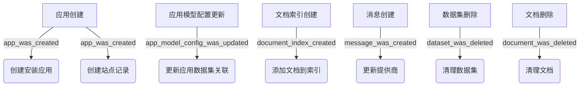
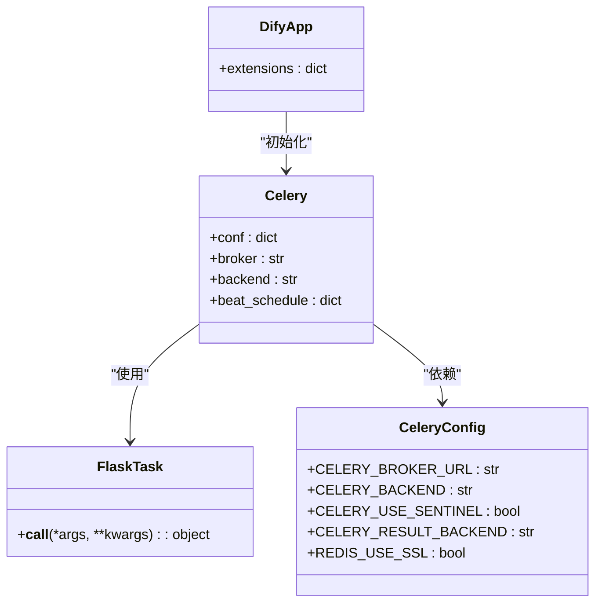
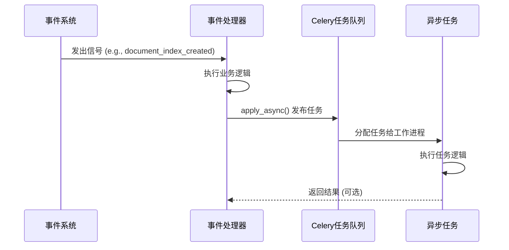
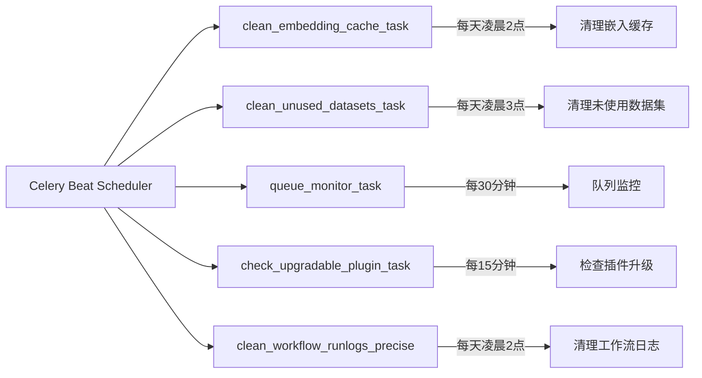
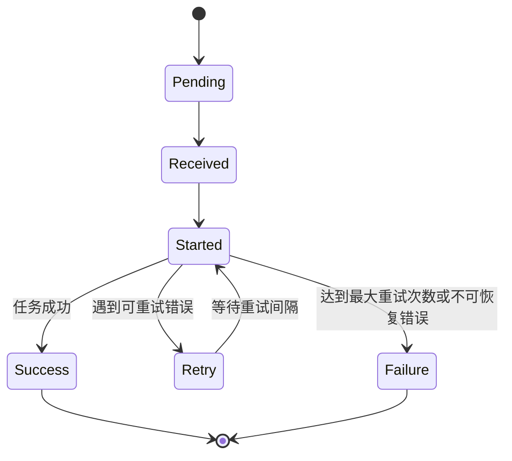
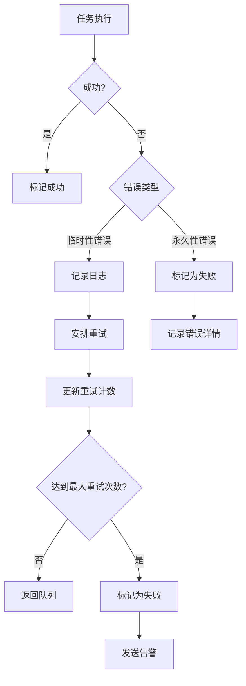
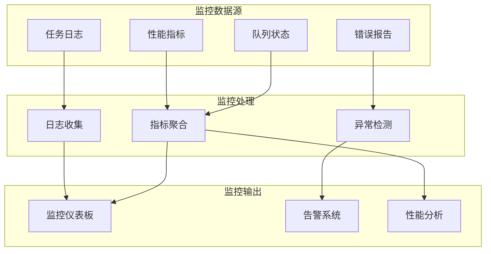

# 事件与任务集成

<cite>
**本文档引用的文件**  
- [ext_celery.py](file://api/extensions/ext_celery.py)
- [app_event.py](file://api/events/app_event.py)
- [dataset_event.py](file://api/events/dataset_event.py)
- [document_event.py](file://api/events/document_event.py)
- [document_index_event.py](file://api/events/document_index_event.py)
- [message_event.py](file://api/events/message_event.py)
- [tenant_event.py](file://api/events/tenant_event.py)
- [create_document_index.py](file://api/events/event_handlers/create_document_index.py)
- [clean_when_dataset_deleted.py](file://api/events/event_handlers/clean_when_dataset_deleted.py)
- [clean_when_document_deleted.py](file://api/events/event_handlers/clean_when_document_deleted.py)
- [update_provider_when_message_created.py](file://api/events/event_handlers/update_provider_when_message_created.py)
- [add_document_to_index_task.py](file://api/tasks/add_document_to_index_task.py)
- [clean_dataset_task.py](file://api/tasks/clean_dataset_task.py)
- [clean_document_task.py](file://api/tasks/clean_document_task.py)
- [ops_trace_task.py](file://api/tasks/ops_trace_task.py)
- [workflow_execution_tasks.py](file://api/tasks/workflow_execution_tasks.py)
- [workflow_node_execution_tasks.py](file://api/tasks/workflow_node_execution_tasks.py)
- [clean_embedding_cache_task.py](file://api/schedule/clean_embedding_cache_task.py)
- [clean_unused_datasets_task.py](file://api/schedule/clean_unused_datasets_task.py)
- [queue_monitor_task.py](file://api/schedule/queue_monitor_task.py)
</cite>

## 目录
1. [简介](#简介)
2. [事件系统概览](#事件系统概览)
3. [Celery任务队列集成](#celery任务队列集成)
4. [事件触发异步任务机制](#事件触发异步任务机制)
5. [任务创建与调度方式](#任务创建与调度方式)
6. [任务重试策略与超时处理](#任务重试策略与超时处理)
7. [错误恢复机制](#错误恢复机制)
8. [性能优化建议](#性能优化建议)
9. [监控与日志记录方案](#监控与日志记录方案)
10. [结论](#结论)

## 简介
本文档详细说明Dify平台中事件系统与Celery任务队列的集成机制。重点阐述事件如何触发异步任务、任务的创建与调度流程、重试与错误处理策略，并提供性能优化和监控方案，以确保事件驱动任务的可靠执行和可追踪性。

## 事件系统概览

Dify使用Blinker信号库实现事件驱动架构，定义了多个核心事件，用于解耦系统组件并触发异步处理逻辑。



**Diagram sources**  
- [app_event.py](file://api/events/app_event.py#L1-L13)
- [dataset_event.py](file://api/events/dataset_event.py#L1-L4)
- [document_event.py](file://api/events/document_event.py#L1-L4)
- [document_index_event.py](file://api/events/document_index_event.py#L1-L4)
- [message_event.py](file://api/events/message_event.py#L1-L4)

**Section sources**
- [app_event.py](file://api/events/app_event.py#L1-L13)
- [dataset_event.py](file://api/events/dataset_event.py#L1-L4)
- [document_event.py](file://api/events/document_event.py#L1-L4)

## Celery任务队列集成

系统通过`ext_celery.py`模块初始化Celery应用，实现与Flask应用的无缝集成，支持SSL连接、Sentinel配置和定时任务调度。



**Diagram sources**  
- [ext_celery.py](file://api/extensions/ext_celery.py#L1-L163)

**Section sources**
- [ext_celery.py](file://api/extensions/ext_celery.py#L1-L163)

## 事件触发异步任务机制

当特定事件发生时，相应的事件处理器会发布异步任务到Celery队列，实现事件与任务的绑定。



**Diagram sources**  
- [create_document_index.py](file://api/events/event_handlers/create_document_index.py#L1-L20)
- [add_document_to_index_task.py](file://api/tasks/add_document_to_index_task.py#L1-L30)

**Section sources**
- [create_document_index.py](file://api/events/event_handlers/create_document_index.py#L1-L20)
- [clean_when_dataset_deleted.py](file://api/events/event_handlers/clean_when_dataset_deleted.py#L1-L15)
- [clean_when_document_deleted.py](file://api/events/event_handlers/clean_when_document_deleted.py#L1-L15)

## 任务创建与调度方式

异步任务通过Celery的`apply_async`方法创建，支持参数传递、队列指定和执行选项配置。系统还支持基于时间表的周期性任务调度。

### 任务创建示例
```python
# 在事件处理器中创建任务
add_document_to_index_task.delay(document_id=str(document.id))
```

### 周期性任务调度
系统根据配置动态注册定时任务，如清理缓存、监控队列等。



**Diagram sources**  
- [ext_celery.py](file://api/extensions/ext_celery.py#L100-L160)
- [clean_embedding_cache_task.py](file://api/schedule/clean_embedding_cache_task.py#L1-L20)
- [queue_monitor_task.py](file://api/schedule/queue_monitor_task.py#L1-L20)

**Section sources**
- [ext_celery.py](file://api/extensions/ext_celery.py#L100-L160)
- [clean_embedding_cache_task.py](file://api/schedule/clean_embedding_cache_task.py#L1-L20)
- [clean_unused_datasets_task.py](file://api/schedule/clean_unused_datasets_task.py#L1-L20)

## 任务重试策略与超时处理

系统通过Celery配置和任务装饰器实现任务重试和超时控制，确保任务的可靠执行。

### 重试策略
- **自动重试**：对于可恢复的错误（如网络超时），任务会自动重试
- **最大重试次数**：通过`max_retries`参数限制重试次数
- **重试间隔**：使用`countdown`或`expires`控制重试时间间隔

### 超时处理
- **软超时**：`soft_time_limit` - 任务在超时前有机会进行清理
- **硬超时**：`time_limit` - 任务在超时后被强制终止
- **连接超时**：配置`broker_transport_options`中的socket_timeout



**Section sources**
- [ext_celery.py](file://api/extensions/ext_celery.py#L50-L90)
- [add_document_to_index_task.py](file://api/tasks/add_document_to_index_task.py#L20-L50)

## 错误恢复机制

系统实现了多层次的错误恢复机制，确保任务失败时能够正确处理并恢复。

### 错误处理策略
1. **任务级错误处理**：在任务函数中捕获异常并记录日志
2. **重试机制**：对临时性错误进行自动重试
3. **死信队列**：将无法处理的任务转移到死信队列进行人工干预
4. **状态回滚**：在任务失败时回滚相关业务状态

### 典型错误恢复场景
- **文档索引失败**：`retry_document_indexing_task`用于重试失败的索引任务
- **数据清理失败**：`clean_document_task`和`clean_dataset_task`具有幂等性，可安全重试
- **邮件发送失败**：邮件相关任务具有重试机制，确保通知送达



**Diagram sources**  
- [retry_document_indexing_task.py](file://api/tasks/retry_document_indexing_task.py#L1-L30)
- [clean_document_task.py](file://api/tasks/clean_document_task.py#L1-L30)
- [mail_inner_task.py](file://api/tasks/mail_inner_task.py#L1-L30)

**Section sources**
- [retry_document_indexing_task.py](file://api/tasks/retry_document_indexing_task.py#L1-L30)
- [ops_trace_task.py](file://api/tasks/ops_trace_task.py#L1-L30)

## 性能优化建议

为提高事件驱动任务系统的性能和效率，建议采用以下优化策略：

### 批量处理
- **合并小任务**：将多个相似的小任务合并为批量任务处理
- **批量索引**：使用`batch_create_segment_to_index_task`进行批量文档索引
- **批量清理**：使用`batch_clean_document_task`进行批量文档清理

### 任务优先级设置
- **高优先级队列**：为关键任务（如消息处理）设置高优先级队列
- **低优先级队列**：为耗时任务（如数据清理）设置低优先级队列
- **多工作进程**：配置不同优先级的工作进程处理不同队列

### 资源优化
- **连接池**：复用数据库和Redis连接，减少连接开销
- **内存管理**：限制任务内存使用，避免内存泄漏
- **并发控制**：合理设置worker并发数，避免资源争用

```mermaid
erDiagram
TASK_QUEUE ||--o{ TASK : "包含"
TASK_QUEUE }|--|| PRIORITY_LEVEL : "具有"
TASK }|--|| TASK_TYPE : "属于"
TASK }|--|| EXECUTION_STATUS : "具有"
class TASK_QUEUE {
string name
int priority
int max_concurrency
}
class TASK {
string task_id
string task_name
json args
timestamp created_at
timestamp started_at
timestamp completed_at
string status
int retry_count
string queue_name
}
class PRIORITY_LEVEL {
int level
string description
}
class TASK_TYPE {
string type
string description
int default_priority
int soft_time_limit
int time_limit
}
class EXECUTION_STATUS {
string status
string description
}
```

**Diagram sources**  
- [workflow_execution_tasks.py](file://api/tasks/workflow_execution_tasks.py#L1-L50)
- [workflow_node_execution_tasks.py](file://api/tasks/workflow_node_execution_tasks.py#L1-L50)

**Section sources**
- [workflow_execution_tasks.py](file://api/tasks/workflow_execution_tasks.py#L1-L50)
- [batch_create_segment_to_index_task.py](file://api/tasks/batch_create_segment_to_index_task.py#L1-L30)

## 监控与日志记录方案

系统提供了全面的监控和日志记录机制，用于跟踪事件驱动任务的执行状态和性能指标。

### 日志记录
- **任务日志**：每个任务执行时记录详细的日志信息
- **错误日志**：捕获并记录任务执行中的异常
- **性能日志**：记录任务执行时间、资源使用等性能数据
- **结构化日志**：使用JSON格式记录日志，便于分析和查询

### 监控指标
- **队列长度**：监控各任务队列的积压情况
- **任务执行时间**：跟踪任务的平均执行时间和分布
- **失败率**：监控任务失败率和重试率
- **资源使用**：监控Celery worker的CPU、内存使用情况

### 监控工具集成
- **Sentry**：用于错误跟踪和告警
- **OpenTelemetry**：用于分布式追踪
- **自定义监控**：`queue_monitor_task`定期检查队列状态并发送告警



**Diagram sources**  
- [ext_celery.py](file://api/extensions/ext_celery.py#L70-L80)
- [queue_monitor_task.py](file://api/schedule/queue_monitor_task.py#L1-L30)
- [ops_trace_task.py](file://api/tasks/ops_trace_task.py#L1-L30)

**Section sources**
- [queue_monitor_task.py](file://api/schedule/queue_monitor_task.py#L1-L30)
- [ops_trace_task.py](file://api/tasks/ops_trace_task.py#L1-L30)
- [ext_sentry.py](file://api/extensions/ext_sentry.py#L1-L30)

## 结论
Dify平台通过Blinker事件系统与Celery任务队列的深度集成，实现了高效、可靠的异步任务处理机制。事件驱动架构解耦了系统组件，Celery提供了强大的任务调度、重试和监控能力。通过合理的性能优化和监控策略，系统能够稳定处理各种异步任务，确保业务逻辑的可靠执行。建议在实际使用中根据具体场景调整任务优先级、重试策略和监控阈值，以达到最佳性能和可靠性平衡。