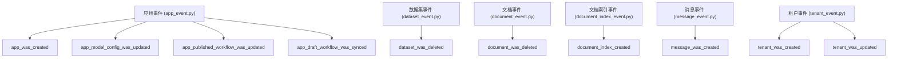
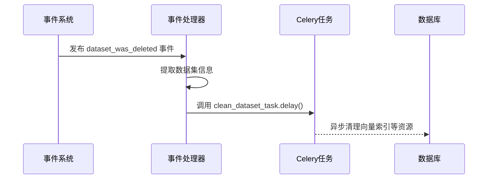
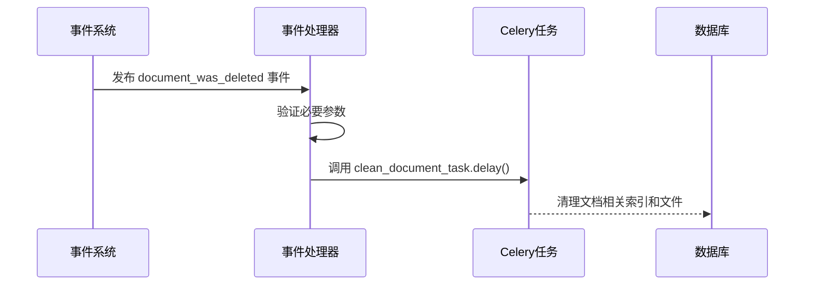
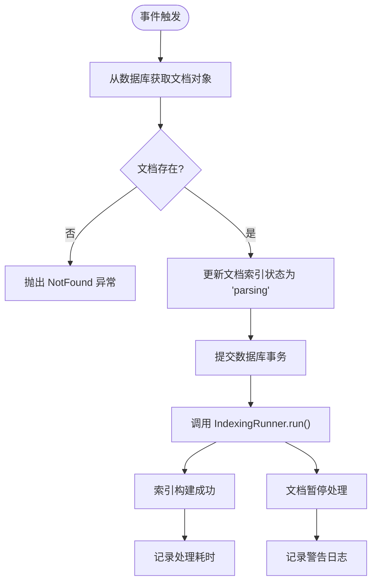
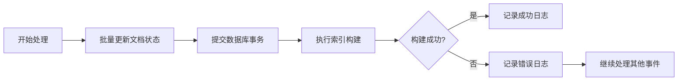

# 事件处理器

<cite>
**本文档中引用的文件**   
- [app_event.py](file://api/events/app_event.py)
- [dataset_event.py](file://api/events/dataset_event.py)
- [document_event.py](file://api/events/document_event.py)
- [document_index_event.py](file://api/events/document_index_event.py)
- [message_event.py](file://api/events/message_event.py)
- [tenant_event.py](file://api/events/tenant_event.py)
- [clean_when_dataset_deleted.py](file://api/events/event_handlers/clean_when_dataset_deleted.py)
- [clean_when_document_deleted.py](file://api/events/event_handlers/clean_when_document_deleted.py)
- [create_document_index.py](file://api/events/event_handlers/create_document_index.py)
- [tasks/clean_dataset_task.py](file://api/tasks/clean_dataset_task.py)
- [tasks/clean_document_task.py](file://api/tasks/clean_document_task.py)
- [core/indexing_runner.py](file://api/core/indexing_runner.py)
</cite>

## 目录
1. [简介](#简介)
2. [事件定义与分类](#事件定义与分类)
3. [核心事件处理器分析](#核心事件处理器分析)
4. [执行机制与依赖注入](#执行机制与依赖注入)
5. [错误处理与事务管理](#错误处理与事务管理)
6. [处理器隔离性与并发控制](#处理器隔离性与并发控制)
7. [注册机制与信号连接](#注册机制与信号连接)
8. [总结](#总结)

## 简介
Dify系统通过事件驱动架构实现组件间的松耦合通信。事件处理器作为核心机制，监听特定业务事件并触发相应的异步任务或同步操作。本文档深入解析事件处理器的实现机制，涵盖其职责划分、执行时机、数据访问模式及与其他系统组件的交互方式。

## 事件定义与分类
Dify的事件系统基于`blinker`库实现，定义了多个领域事件，分别对应不同的业务实体变更。



**Diagram sources**
- [app_event.py](file://api/events/app_event.py#L1-L13)
- [dataset_event.py](file://api/events/dataset_event.py#L1-L4)
- [document_event.py](file://api/events/document_event.py#L1-L4)
- [document_index_event.py](file://api/events/document_index_event.py#L1-L4)
- [message_event.py](file://api/events/message_event.py#L1-L4)
- [tenant_event.py](file://api/events/tenant_event.py#L1-L7)

**Section sources**
- [app_event.py](file://api/events/app_event.py#L1-L13)
- [dataset_event.py](file://api/events/dataset_event.py#L1-L4)

## 核心事件处理器分析
事件处理器分布在`event_handlers`目录中，每个处理器监听特定事件并在触发时执行相应逻辑。

### 数据集删除清理处理器
当数据集被删除时，触发清理相关资源的异步任务。



**Diagram sources**
- [clean_when_dataset_deleted.py](file://api/events/event_handlers/clean_when_dataset_deleted.py#L1-L15)
- [tasks/clean_dataset_task.py](file://api/tasks/clean_dataset_task.py#L1-L20)

**Section sources**
- [clean_when_dataset_deleted.py](file://api/events/event_handlers/clean_when_dataset_deleted.py#L1-L15)

### 文档删除清理处理器
处理文档删除事件，触发对应的清理任务。



**Diagram sources**
- [clean_when_document_deleted.py](file://api/events/event_handlers/clean_when_document_deleted.py#L1-L13)
- [tasks/clean_document_task.py](file://api/tasks/clean_document_task.py#L1-L20)

**Section sources**
- [clean_when_document_deleted.py](file://api/events/event_handlers/clean_when_document_deleted.py#L1-L13)

### 文档索引创建处理器
处理文档索引创建事件，启动同步索引构建流程。



**Diagram sources**
- [create_document_index.py](file://api/events/event_handlers/create_document_index.py#L1-L51)
- [core/indexing_runner.py](file://api/core/indexing_runner.py#L1-L100)

**Section sources**
- [create_document_index.py](file://api/events/event_handlers/create_document_index.py#L1-L51)

## 执行机制与依赖注入
事件处理器通过装饰器模式注册到事件系统，利用依赖注入访问数据库和服务层。

### 数据库访问
处理器通过`ext_database`扩展获取数据库会话，执行数据查询和状态更新操作。

### 服务层调用
直接调用核心服务类（如`IndexingRunner`）或通过Celery任务队列进行异步处理，实现业务逻辑解耦。

### 上下文管理
使用`contextlib.suppress`等机制管理异常上下文，确保部分失败不影响整体流程。

**Section sources**
- [create_document_index.py](file://api/events/event_handlers/create_document_index.py#L1-L51)
- [extensions/ext_database.py](file://api/extensions/ext_database.py#L1-L20)

## 错误处理与事务管理
事件处理器实现了多层次的错误处理和事务控制机制。

### 异常处理策略
- 使用`try-except`捕获特定业务异常（如`DocumentIsPausedError`）
- 通过`contextlib.suppress`忽略非关键异常
- 记录详细的日志信息用于问题排查

### 事务管理
- 在处理开始前批量更新文档状态并提交事务
- 确保状态变更的原子性
- 避免长时间持有数据库连接



**Diagram sources**
- [create_document_index.py](file://api/events/event_handlers/create_document_index.py#L1-L51)

**Section sources**
- [create_document_index.py](file://api/events/event_handlers/create_document_index.py#L1-L51)

## 处理器隔离性与并发控制
事件处理器设计考虑了执行隔离性和并发安全。

### 执行隔离
- 每个处理器独立运行，避免相互影响
- 异步任务通过Celery队列进行资源隔离
- 同步操作限制在必要范围内

### 并发控制
- 数据库操作使用事务保证一致性
- 状态更新采用乐观锁机制
- 长时间运行任务移交至后台工作进程

**Section sources**
- [create_document_index.py](file://api/events/event_handlers/create_document_index.py#L1-L51)
- [tasks/clean_dataset_task.py](file://api/tasks/clean_dataset_task.py#L1-L20)

## 注册机制与信号连接
事件处理器使用`blinker`库的信号机制进行注册和连接。

### 装饰器注册
通过`@signal.connect`装饰器将处理器函数注册到特定事件。

### 依赖注入模式
处理器通过模块导入直接引用所需服务和任务，由应用启动时完成依赖解析。

```python
[handle 函数注册](file://api/events/event_handlers/clean_when_dataset_deleted.py#L5-L15)
```

**Section sources**
- [clean_when_dataset_deleted.py](file://api/events/event_handlers/clean_when_dataset_deleted.py#L5-L15)
- [clean_when_document_deleted.py](file://api/events/event_handlers/clean_when_document_deleted.py#L5-L13)
- [create_document_index.py](file://api/events/event_handlers/create_document_index.py#L10-L12)

## 总结
Dify的事件处理器系统采用清晰的职责划分和松耦合设计，通过事件驱动架构实现了系统的可扩展性和维护性。处理器能够有效访问数据库、调用服务层，并与其他组件协同工作。完善的错误处理、事务管理和隔离性设计确保了系统的稳定运行。