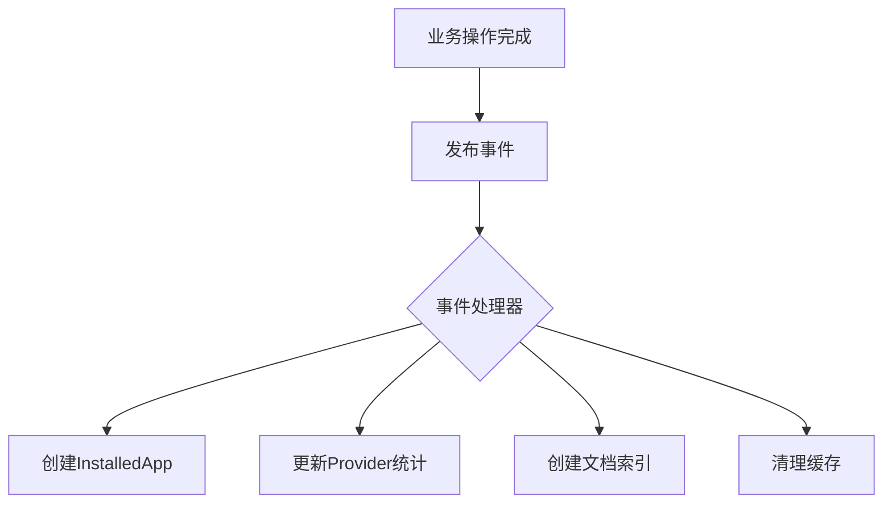

# 事件类型

<cite>
**本文档中引用的文件**  
- [app_event.py](file://api/events/app_event.py)
- [dataset_event.py](file://api/events/dataset_event.py)
- [document_event.py](file://api/events/document_event.py)
- [message_event.py](file://api/events/message_event.py)
- [tenant_event.py](file://api/events/tenant_event.py)
- [document_index_event.py](file://api/events/document_index_event.py)
- [create_installed_app_when_app_created.py](file://api/events/event_handlers/create_installed_app_when_app_created.py)
- [update_provider_when_message_created.py](file://api/events/event_handlers/update_provider_when_message_created.py)
- [create_document_index.py](file://api/events/event_handlers/create_document_index.py)
</cite>

## 目录
1. [简介](#简介)
2. [事件类型概览](#事件类型概览)
3. [应用事件](#应用事件)
4. [数据集事件](#数据集事件)
5. [文档事件](#文档事件)
6. [消息事件](#消息事件)
7. [租户事件](#租户事件)
8. [事件流转与影响范围](#事件流转与影响范围)
9. [事件版本控制与兼容性](#事件版本控制与兼容性)

## 简介
Dify 系统通过事件驱动架构实现组件间的松耦合通信。事件机制用于在关键业务操作发生时通知相关系统模块，确保数据一致性、触发异步任务并维护系统状态同步。本文档详细说明 Dify 中定义的各类事件，包括其触发条件、载荷结构、业务语义、发布方式及处理流程。

## 事件类型概览
Dify 定义了多种事件类型，涵盖应用、数据集、文档、消息和租户等核心领域。所有事件均基于 `blinker` 库的信号机制实现，通过命名信号进行发布和订阅。事件的发送者（sender）通常为领域对象实例，附加参数（kwargs）携带事件上下文。

**Section sources**
- [app_event.py](file://api/events/app_event.py#L1-L13)
- [dataset_event.py](file://api/events/dataset_event.py#L1-L4)
- [document_event.py](file://api/events/document_event.py#L1-L4)
- [message_event.py](file://api/events/message_event.py#L1-L4)
- [tenant_event.py](file://api/events/tenant_event.py#L1-L7)
- [document_index_event.py](file://api/events/document_index_event.py#L1-L4)

## 应用事件
应用事件与 Dify 中的应用（App）生命周期和配置变更相关。

### app_was_created
**触发条件**：当一个新应用被创建时触发。  
**事件载荷**：
- `sender`: 被创建的 `app` 对象实例。
- `kwargs`: 无额外参数。  
**业务语义**：标志着一个新应用的诞生，用于初始化与应用相关的资源，如创建安装记录、站点记录等。  
**发布方式**：在应用创建逻辑完成后，通过 `app_was_created.send(app)` 发布。

**Section sources**
- [app_event.py](file://api/events/app_event.py#L4)
- [create_installed_app_when_app_created.py](file://api/events/event_handlers/create_installed_app_when_app_created.py#L1-L16)

### app_model_config_was_updated
**触发条件**：当应用的模型配置（App Model Config）被更新时触发。  
**事件载荷**：
- `sender`: 发生变更的 `app` 对象实例。
- `kwargs`: 包含 `app_model_config` 对象。  
**业务语义**：通知系统应用的核心配置已变更，可能需要更新与应用关联的数据集连接等。  
**发布方式**：在模型配置更新后，通过 `app_model_config_was_updated.send(app, app_model_config=updated_config)` 发布。

**Section sources**
- [app_event.py](file://api/events/app_event.py#L7)

### app_published_workflow_was_updated
**触发条件**：当应用的已发布工作流（Published Workflow）被更新时触发。  
**事件载荷**：
- `sender`: 发生变更的 `app` 对象实例。
- `kwargs`: 包含 `published_workflow` 对象。  
**业务语义**：用于同步应用与数据集之间的关联，确保工作流变更后索引等资源得到正确维护。  
**发布方式**：在工作流发布流程中，通过 `app_published_workflow_was_updated.send(app, published_workflow=new_workflow)` 发布。

**Section sources**
- [app_event.py](file://api/events/app_event.py#L10)

### app_draft_workflow_was_synced
**触发条件**：当应用的草稿工作流（Draft Workflow）被同步时触发。  
**事件载荷**：
- `sender`: 发生变更的 `app` 对象实例。
- `kwargs`: 包含 `synced_draft_workflow` 对象。  
**业务语义**：用于清理与工具参数相关的缓存，确保草稿变更不会影响缓存数据。  
**发布方式**：在草稿工作流同步逻辑中，通过 `app_draft_workflow_was_synced.send(app, synced_draft_workflow=draft)` 发布。

**Section sources**
- [app_event.py](file://api/events/app_event.py#L13)

## 数据集事件
数据集事件与 Dify 中的数据集（Dataset）生命周期相关。

### dataset_was_deleted
**触发条件**：当一个数据集被删除时触发。  
**事件载荷**：
- `sender`: 被删除的 `dataset` 对象实例。
- `kwargs`: 无额外参数。  
**业务语义**：通知系统一个数据集已被移除，用于触发清理任务，如删除关联的文档、索引和缓存。  
**发布方式**：在数据集删除逻辑的最后阶段，通过 `dataset_was_deleted.send(dataset)` 发布。

**Section sources**
- [dataset_event.py](file://api/events/dataset_event.py#L4)

## 文档事件
文档事件与 Dify 中的文档（Document）生命周期相关。

### document_was_deleted
**触发条件**：当一个文档被删除时触发。  
**事件载荷**：
- `sender`: 被删除的 `document` 对象实例。
- `kwargs`: 无额外参数。  
**业务语义**：通知系统一个文档已被移除，用于触发清理任务，如从向量数据库中删除索引。  
**发布方式**：在文档删除逻辑完成后，通过 `document_was_deleted.send(document)` 发布。

**Section sources**
- [document_event.py](file://api/events/document_event.py#L4)

## 消息事件
消息事件与 Dify 中的用户消息（Message）生命周期相关。

### message_was_created
**触发条件**：当一个新消息被创建并成功存储后触发。  
**事件载荷**：
- `sender`: 被创建的 `message` 对象实例。
- `kwargs`: 包含 `conversation` 对象和 `application_generate_entity` 对象。  
**业务语义**：这是系统中最关键的事件之一，用于更新服务提供商（Provider）的使用统计，包括最后使用时间和配额扣除。  
**发布方式**：在消息创建并持久化到数据库后，通过 `message_was_created.send(message, conversation=conv, application_generate_entity=entity)` 发布。

**Section sources**
- [message_event.py](file://api/events/message_event.py#L4)
- [update_provider_when_message_created.py](file://api/events/event_handlers/update_provider_when_message_created.py#L1-L290)

## 租户事件
租户事件与 Dify 中的租户（Tenant）生命周期相关。

### tenant_was_created
**触发条件**：当一个新租户被创建时触发。  
**事件载荷**：
- `sender`: 被创建的 `tenant` 对象实例。
- `kwargs`: 无额外参数。  
**业务语义**：标志着一个新租户的注册，可用于初始化租户专属的配置或资源。  
**发布方式**：在租户创建流程的最后，通过 `tenant_was_created.send(tenant)` 发布。

**Section sources**
- [tenant_event.py](file://api/events/tenant_event.py#L4)

### tenant_was_updated
**触发条件**：当租户信息被更新时触发。  
**事件载荷**：
- `sender`: 发生变更的 `tenant` 对象实例。
- `kwargs`: 无额外参数。  
**业务语义**：通知系统租户的配置或状态已变更，可能需要进行相应的同步或清理操作。  
**发布方式**：在租户更新逻辑完成后，通过 `tenant_was_updated.send(tenant)` 发布。

**Section sources**
- [tenant_event.py](file://api/events/tenant_event.py#L7)

## 事件流转与影响范围
Dify 的事件流转遵循发布-订阅模式。事件发布者在完成核心业务逻辑后发出信号，一个或多个事件处理器（Event Handler）会监听这些信号并执行后续操作。

**Diagram sources**
- [app_event.py](file://api/events/app_event.py#L4)
- [message_event.py](file://api/events/message_event.py#L4)
- [document_index_event.py](file://api/events/document_index_event.py#L4)
- [create_installed_app_when_app_created.py](file://api/events/event_handlers/create_installed_app_when_app_created.py#L1-L16)
- [update_provider_when_message_created.py](file://api/events/event_handlers/update_provider_when_message_created.py#L1-L290)
- [create_document_index.py](file://api/events/event_handlers/create_document_index.py#L1-L51)

例如，`app_was_created` 事件会触发 `create_installed_app_when_app_created.py` 处理器，该处理器负责在 `InstalledApp` 表中创建一条新记录。同样，`message_was_created` 事件会触发 `update_provider_when_message_created.py` 处理器，该处理器负责更新服务提供商的 `last_used` 时间戳和 `quota_used` 配额。

## 事件版本控制与兼容性
Dify 目前的事件系统主要依赖于 Python 的 `blinker` 库，该库本身不提供内置的事件版本控制机制。事件的兼容性主要通过以下方式保证：

1.  **向后兼容的载荷设计**：事件处理器在实现时，应使用 `kwargs.get()` 方法来获取可选参数，以避免因参数缺失而导致的错误。这允许在不破坏现有处理器的情况下向事件添加新的上下文信息。
2.  **信号名称的稳定性**：事件的信号名称（如 `"app-was-created"`）被视为公共契约，一旦发布，不应轻易更改，以确保处理器能够正确订阅。
3.  **处理器的健壮性**：处理器代码中包含异常处理逻辑（如 `update_provider_when_message_created.py` 中的 `try-except` 块），确保单个处理器的失败不会影响整个事件发布流程或核心业务逻辑。
4.  **文档化**：通过本文档等手段明确记录每个事件的触发条件、载荷结构和预期行为，为开发者提供清晰的接口说明。

**Section sources**
- [update_provider_when_message_created.py](file://api/events/event_handlers/update_provider_when_message_created.py#L1-L290)
- [create_installed_app_when_app_created.py](file://api/events/event_handlers/create_installed_app_when_app_created.py#L1-L16)