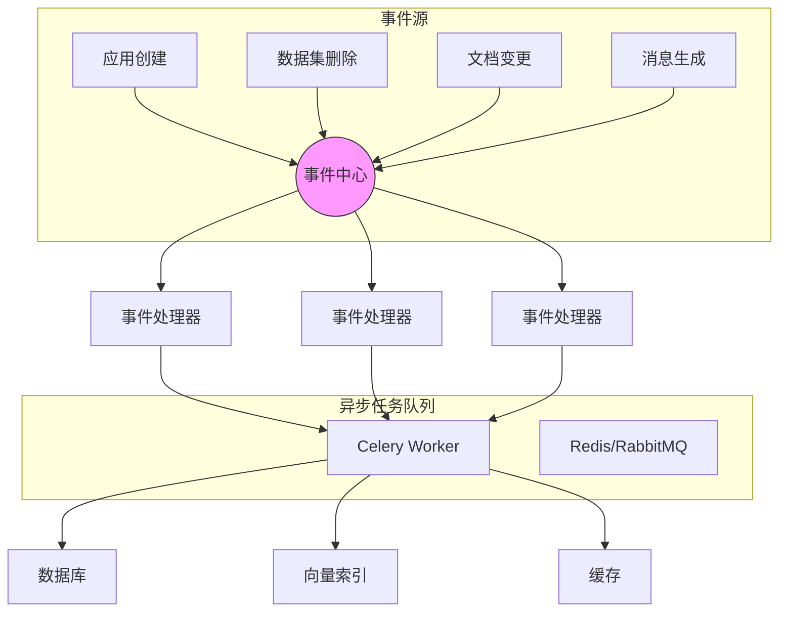
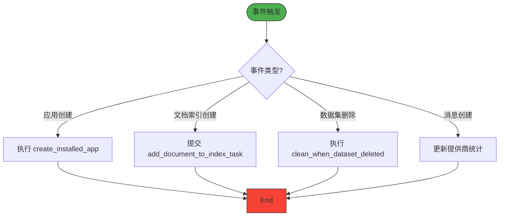
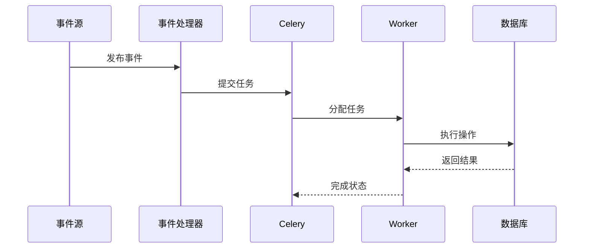

# 事件系统

<cite>
**本文档引用的文件**  
- [app_event.py](file://api/events/app_event.py)
- [dataset_event.py](file://api/events/dataset_event.py)
- [document_event.py](file://api/events/document_event.py)
- [document_index_event.py](file://api/events/document_index_event.py)
- [message_event.py](file://api/events/message_event.py)
- [tenant_event.py](file://api/events/tenant_event.py)
- [clean_when_dataset_deleted.py](file://api/events/event_handlers/clean_when_dataset_deleted.py)
- [create_document_index.py](file://api/events/event_handlers/create_document_index.py)
- [create_installed_app_when_app_created.py](file://api/events/event_handlers/create_installed_app_when_app_created.py)
- [create_site_record_when_app_created.py](file://api/events/event_handlers/create_site_record_when_app_created.py)
- [update_provider_when_message_created.py](file://api/events/event_handlers/update_provider_when_message_created.py)
- [ext_celery.py](file://api/extensions/ext_celery.py)
</cite>

## 目录
1. [简介](#简介)
2. [事件系统架构](#事件系统架构)
3. [核心事件类型](#核心事件类型)
4. [事件处理器设计](#事件处理器设计)
5. [Celery 集成机制](#celery-集成机制)
6. [事件监控与错误处理](#事件监控与错误处理)
7. [总结](#总结)

## 简介
Dify 事件系统采用事件驱动架构，通过发布-订阅模式实现系统组件间的解耦。该系统基于 Python 的 `blinker` 库构建，支持同步与异步事件处理，确保关键操作的可靠执行。事件系统在应用创建、数据集变更、文档索引等关键业务场景中发挥核心作用。

## 事件系统架构

**图示来源**  
- [app_event.py](file://api/events/app_event.py#L1-L13)
- [dataset_event.py](file://api/events/dataset_event.py#L1-L4)
- [ext_celery.py](file://api/extensions/ext_celery.py#L1-L50)

**本节来源**  
- [app_event.py](file://api/events/app_event.py#L1-L13)
- [ext_celery.py](file://api/extensions/ext_celery.py#L1-L50)

## 核心事件类型

### 应用相关事件
- `app_was_created`：应用创建时触发，用于初始化安装记录和站点配置
- `app_model_config_was_updated`：应用模型配置更新时触发，同步数据集关联
- `app_published_workflow_was_updated`：发布工作流更新时触发，更新数据集关联
- `app_draft_workflow_was_synced`：草稿工作流同步时触发，清理工具参数缓存

### 数据集与文档事件
- `dataset_was_deleted`：数据集删除时触发，清理相关文档和索引
- `document_was_deleted`：文档删除时触发，从索引中移除文档
- `document_index_created`：文档索引创建时触发，启动异步索引任务

### 消息与租户事件
- `message_was_created`：消息创建时触发，更新提供商使用统计
- `tenant_was_created`：租户创建时触发，初始化租户资源
- `tenant_was_updated`：租户更新时触发，同步配置变更

**本节来源**  
- [app_event.py](file://api/events/app_event.py#L1-L13)
- [dataset_event.py](file://api/events/dataset_event.py#L1-L4)
- [document_event.py](file://api/events/document_event.py#L1-L4)
- [document_index_event.py](file://api/events/document_index_event.py#L1-L4)
- [message_event.py](file://api/events/message_event.py#L1-L4)
- [tenant_event.py](file://api/events/tenant_event.py#L1-L7)

## 事件处理器设计

### 处理器实现模式
事件处理器采用模块化设计，每个处理器对应一个独立的 Python 模块，位于 `api/events/event_handlers/` 目录下。处理器通过 `connect` 方法订阅特定事件，实现关注点分离。

### 同步与异步处理策略
- **同步处理**：适用于轻量级、高时效性操作（如缓存更新）
- **异步处理**：适用于耗时操作（如索引构建、数据清理），通过 Celery 提交任务

### 典型处理器分析
- `create_installed_app_when_app_created.py`：应用创建后自动生成安装记录
- `create_document_index.py`：触发文档索引创建的异步任务
- `clean_when_dataset_deleted.py`：级联清理数据集相关资源
- `update_provider_when_message_created.py`：更新模型提供商的调用统计

**图示来源**  
- [create_installed_app_when_app_created.py](file://api/events/event_handlers/create_installed_app_when_app_created.py#L1-L20)
- [create_document_index.py](file://api/events/event_handlers/create_document_index.py#L1-L25)
- [clean_when_dataset_deleted.py](file://api/events/event_handlers/clean_when_dataset_deleted.py#L1-L30)

**本节来源**  
- [create_installed_app_when_app_created.py](file://api/events/event_handlers/create_installed_app_when_app_created.py#L1-L20)
- [create_document_index.py](file://api/events/event_handlers/create_document_index.py#L1-L25)
- [clean_when_dataset_deleted.py](file://api/events/event_handlers/clean_when_dataset_deleted.py#L1-L30)

## Celery 集成机制

### 集成架构
事件系统通过 `ext_celery.py` 扩展与 Celery 队列集成，实现异步任务调度。所有耗时操作均通过 Celery Worker 在后台执行，确保主流程响应性能。

### 任务提交流程
1. 事件处理器接收到事件
2. 根据事件类型选择对应 Celery 任务
3. 通过 `delay()` 或 `apply_async()` 提交任务
4. 任务执行结果可选地通过回调处理

### 关键任务类型
- `add_document_to_index_task`：添加文档到向量索引
- `document_indexing_task`：文档索引同步
- `clean_dataset_task`：数据集清理
- `ops_trace_task`：操作追踪记录

**图示来源**  
- [ext_celery.py](file://api/extensions/ext_celery.py#L1-L50)
- [create_document_index.py](file://api/events/event_handlers/create_document_index.py#L1-L25)

**本节来源**  
- [ext_celery.py](file://api/extensions/ext_celery.py#L1-L50)
- [tasks/add_document_to_index_task.py](file://api/tasks/add_document_to_index_task.py#L1-L30)

## 事件监控与错误处理

### 错误处理机制
- **重试策略**：Celery 任务配置指数退避重试
- **异常捕获**：处理器层捕获并记录异常，防止事件流中断
- **死信队列**：失败任务转入死信队列供人工处理

### 监控实现
- **日志记录**：所有事件处理过程记录详细日志
- **指标收集**：通过 OpenTelemetry 收集事件处理延迟、成功率等指标
- **告警机制**：关键事件处理失败触发告警通知

### 可靠性保障
- **事务一致性**：事件发布与数据库操作保持事务一致性
- **幂等设计**：处理器设计保证多次执行结果一致
- **状态追踪**：关键任务状态持久化，支持故障恢复

**本节来源**  
- [ext_celery.py](file://api/extensions/ext_celery.py#L1-L50)
- [tasks/workflow_execution_tasks.py](file://api/tasks/workflow_execution_tasks.py#L1-L40)
- [events/event_handlers/*.py](file://api/events/event_handlers/)

## 总结
Dify 事件系统通过清晰的发布-订阅模式实现了系统的高内聚低耦合。基于 Blinker 和 Celery 的技术栈，系统既能保证实时响应，又能可靠处理耗时任务。事件处理器的模块化设计和完善的错误处理机制，确保了系统的稳定性和可维护性，为 Dify 的核心业务功能提供了坚实的基础支撑。