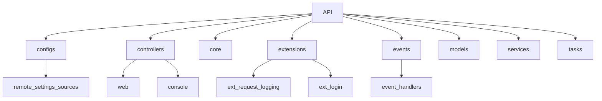
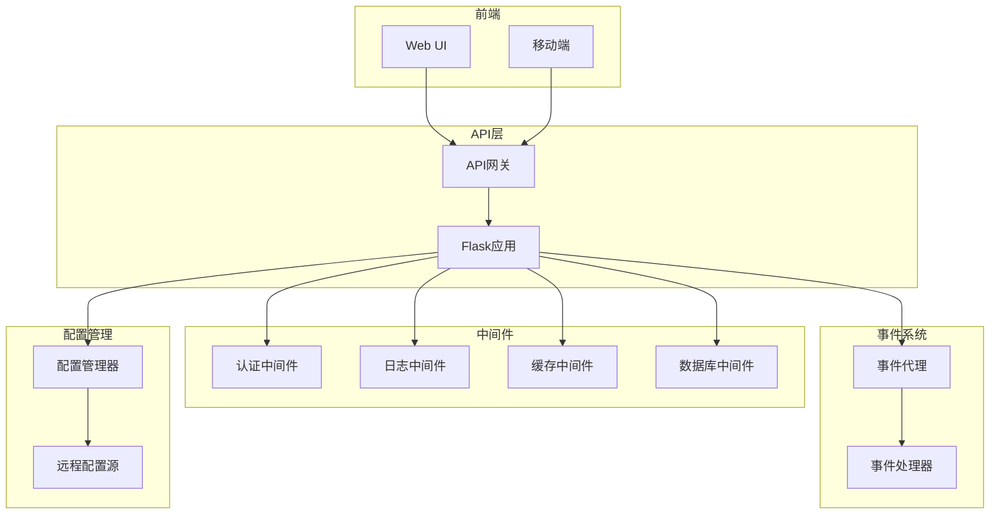
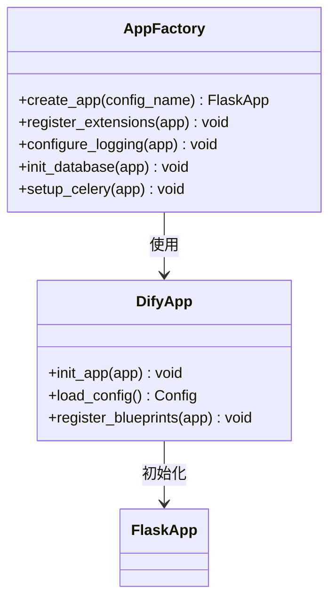
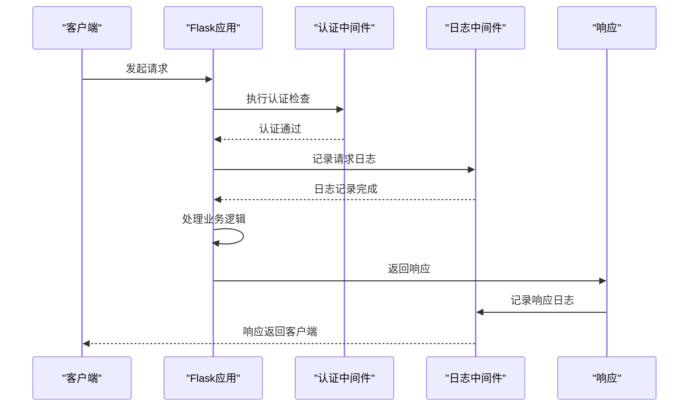
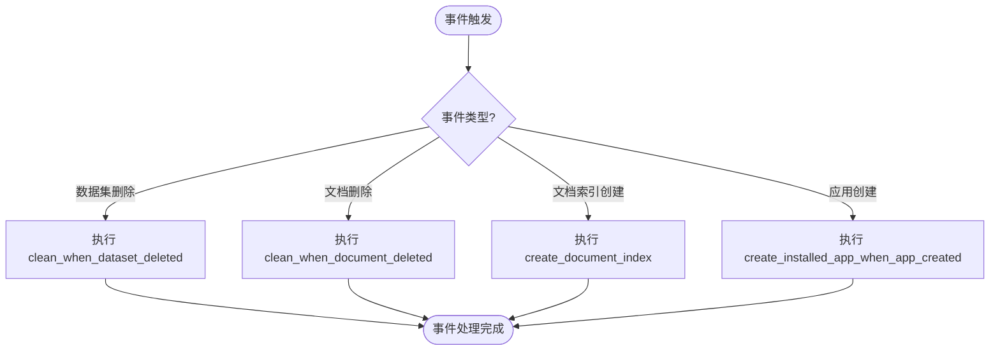
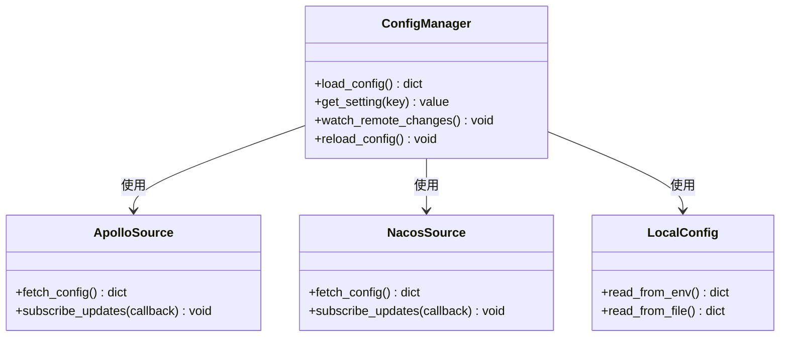
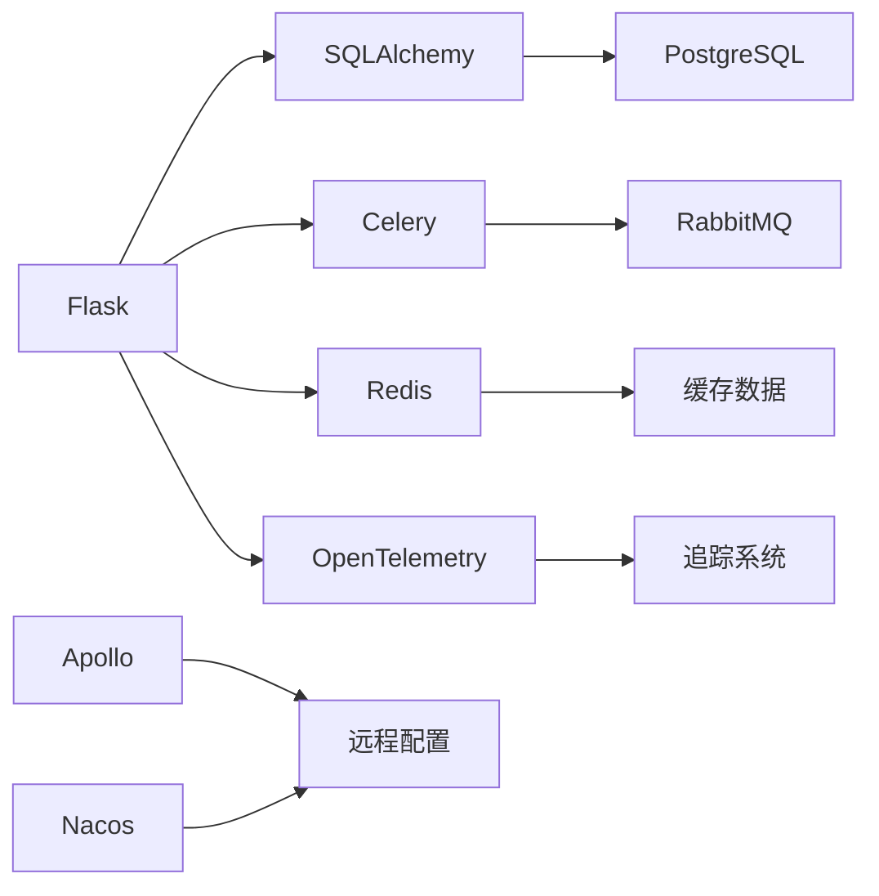

# 后端架构

<cite>
**本文档引用文件**  
- [app_factory.py](file://api/app_factory.py)
- [dify_app.py](file://api/dify_app.py)
- [app.py](file://api/app.py)
- [extensions/ext_request_logging.py](file://api/extensions/ext_request_logging.py)
- [extensions/ext_login.py](file://api/extensions/ext_login.py)
- [extensions/ext_celery.py](file://api/extensions/ext_celery.py)
- [extensions/ext_redis.py](file://api/extensions/ext_redis.py)
- [extensions/ext_database.py](file://api/extensions/ext_database.py)
- [events/event_handlers](file://api/events/event_handlers)
- [configs/remote_settings_sources](file://api/configs/remote_settings_sources)
- [configs/app_config.py](file://api/configs/app_config.py)
- [controllers/web](file://api/controllers/web)
- [controllers/console](file://api/controllers/console)
- [core/model_manager.py](file://api/core/model_manager.py)
- [services/app_service.py](file://api/services/app_service.py)
</cite>

## 目录
1. [简介](#简介)
2. [项目结构](#项目结构)
3. [核心组件](#核心组件)
4. [架构概览](#架构概览)
5. [详细组件分析](#详细组件分析)
6. [依赖分析](#依赖分析)
7. [性能考虑](#性能考虑)
8. [故障排除指南](#故障排除指南)
9. [结论](#结论)

## 简介
Dify 是一个基于 Flask 的后端服务，采用微服务架构设计，支持模块化扩展和高可维护性。本项目通过应用工厂模式实现灵活的初始化流程，结合中间件系统完成请求处理、认证授权和日志记录等功能。事件驱动架构确保系统组件间的松耦合，配置管理系统支持环境变量管理及 Apollo、Nacos 等远程配置源集成，具备动态更新能力。整体架构注重性能优化与扩展性设计。

## 项目结构

**图示来源**  
- [api](file://api)
- [configs](file://api/configs)
- [controllers](file://api/controllers)
- [extensions](file://api/extensions)
- [events](file://api/events)

**本节来源**  
- [api](file://api)

## 核心组件

Dify 的核心组件包括应用工厂、中间件系统、事件处理器、配置管理模块和服务调度机制。这些组件共同构建了一个可扩展、高性能的后端架构。

**本节来源**  
- [app_factory.py](file://api/app_factory.py)
- [dify_app.py](file://api/dify_app.py)
- [configs/app_config.py](file://api/configs/app_config.py)
- [extensions](file://api/extensions)
- [events](file://api/events)

## 架构概览

**图示来源**  
- [dify_app.py](file://api/dify_app.py)
- [extensions](file://api/extensions)
- [events](file://api/events)
- [configs/remote_settings_sources](file://api/configs/remote_settings_sources)

**本节来源**  
- [dify_app.py](file://api/dify_app.py)
- [app_factory.py](file://api/app_factory.py)

## 详细组件分析

### 应用工厂模式分析

应用工厂模式是 Dify 架构的核心设计之一，通过 `app_factory.py` 实现。该模式将 Flask 应用的创建过程封装为可复用的函数，支持不同环境下的配置加载和扩展注册。

**图示来源**  
- [app_factory.py](file://api/app_factory.py#L1-L50)
- [dify_app.py](file://api/dify_app.py#L1-L30)

**本节来源**  
- [app_factory.py](file://api/app_factory.py)
- [dify_app.py](file://api/dify_app.py)

### 中间件系统分析

中间件系统负责处理请求生命周期中的关键环节，包括认证、日志记录、压缩等。每个中间件通过 Flask 的扩展机制注册，并在请求前后执行相应逻辑。

**图示来源**  
- [extensions/ext_login.py](file://api/extensions/ext_login.py#L1-L40)
- [extensions/ext_request_logging.py](file://api/extensions/ext_request_logging.py#L1-L35)

**本节来源**  
- [extensions/ext_login.py](file://api/extensions/ext_login.py)
- [extensions/ext_request_logging.py](file://api/extensions/ext_request_logging.py)

### 事件驱动架构分析

事件驱动架构通过解耦系统组件提升可维护性和扩展性。Dify 使用事件发布-订阅模式，在特定操作（如数据集删除、文档索引创建）后触发相应的事件处理器。

**图示来源**  
- [events/app_event.py](file://api/events/app_event.py#L1-L20)
- [events/dataset_event.py](file://api/events/dataset_event.py#L1-L20)
- [events/event_handlers](file://api/events/event_handlers)

**本节来源**  
- [events](file://api/events)
- [events/event_handlers](file://api/events/event_handlers)

### 配置管理系统分析

配置管理系统支持本地配置与远程配置源（如 Apollo、Nacos）的集成，允许动态更新配置而无需重启服务。系统优先级为：环境变量 > 远程配置 > 默认配置。

**图示来源**  
- [configs/remote_settings_sources/apollo](file://api/configs/remote_settings_sources/apollo#L1-L30)
- [configs/remote_settings_sources/nacos](file://api/configs/remote_settings_sources/nacos#L1-L30)
- [configs/app_config.py](file://api/configs/app_config.py#L1-L40)

**本节来源**  
- [configs/remote_settings_sources](file://api/configs/remote_settings_sources)
- [configs/app_config.py](file://api/configs/app_config.py)

## 依赖分析

**图示来源**  
- [extensions/ext_database.py](file://api/extensions/ext_database.py#L1-L20)
- [extensions/ext_celery.py](file://api/extensions/ext_celery.py#L1-L20)
- [extensions/ext_redis.py](file://api/extensions/ext_redis.py#L1-L20)
- [configs/remote_settings_sources](file://api/configs/remote_settings_sources)

**本节来源**  
- [extensions](file://api/extensions)
- [configs/remote_settings_sources](file://api/configs/remote_settings_sources)

## 性能考虑

Dify 在性能方面采取多项优化措施：
- 使用 Redis 缓存频繁访问的数据，减少数据库压力
- Celery 异步任务处理耗时操作，避免阻塞主线程
- 支持连接池和数据库读写分离
- 提供请求日志采样机制，降低日志写入开销
- 配置热更新避免服务重启带来的性能波动

建议在生产环境中启用缓存、合理配置 Celery worker 数量，并监控关键指标如响应时间、队列长度和错误率。

## 故障排除指南

常见问题及解决方案：
- **配置未生效**：确认环境变量优先级，检查远程配置源连接状态
- **事件未触发**：验证事件发布代码是否执行，检查事件处理器注册情况
- **中间件异常**：查看日志输出，确认中间件加载顺序和依赖关系
- **性能下降**：检查 Redis 缓存命中率，监控 Celery 任务队列积压情况
- **认证失败**：核对 Token 有效期，检查登录中间件配置

**本节来源**  
- [extensions](file://api/extensions)
- [events](file://api/events)
- [configs](file://api/configs)

## 结论

Dify 的后端架构采用基于 Flask 的微服务设计，通过应用工厂模式实现灵活初始化，中间件系统保障请求处理的完整性和安全性，事件驱动机制促进组件解耦，配置管理系统支持动态更新和多源集成。整体架构具备良好的可扩展性、可维护性和性能表现，适用于复杂的企业级应用场景。