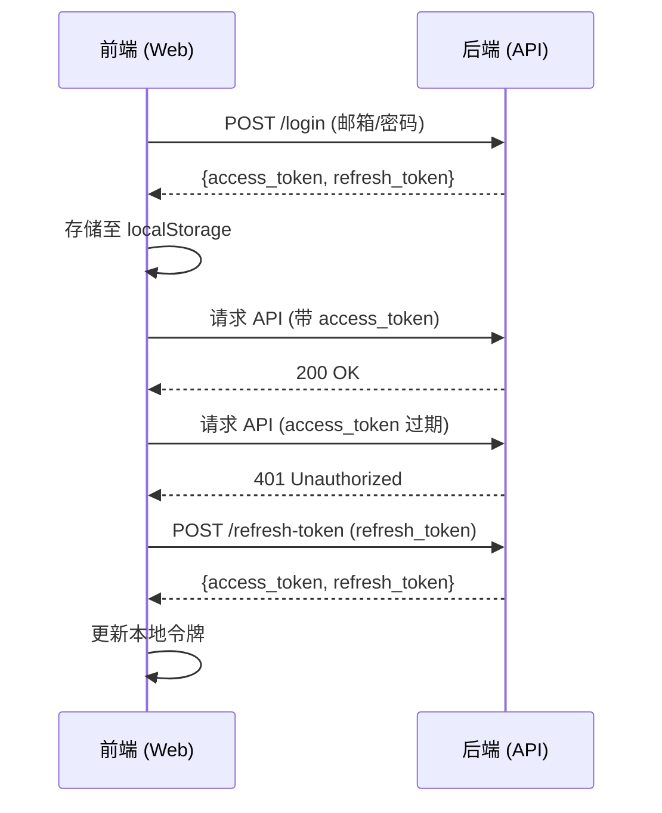
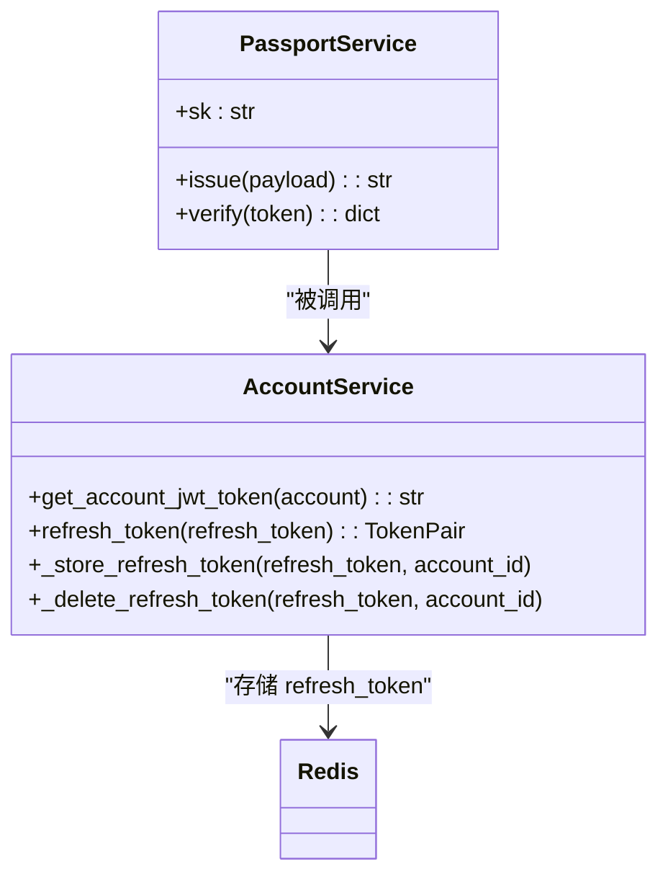
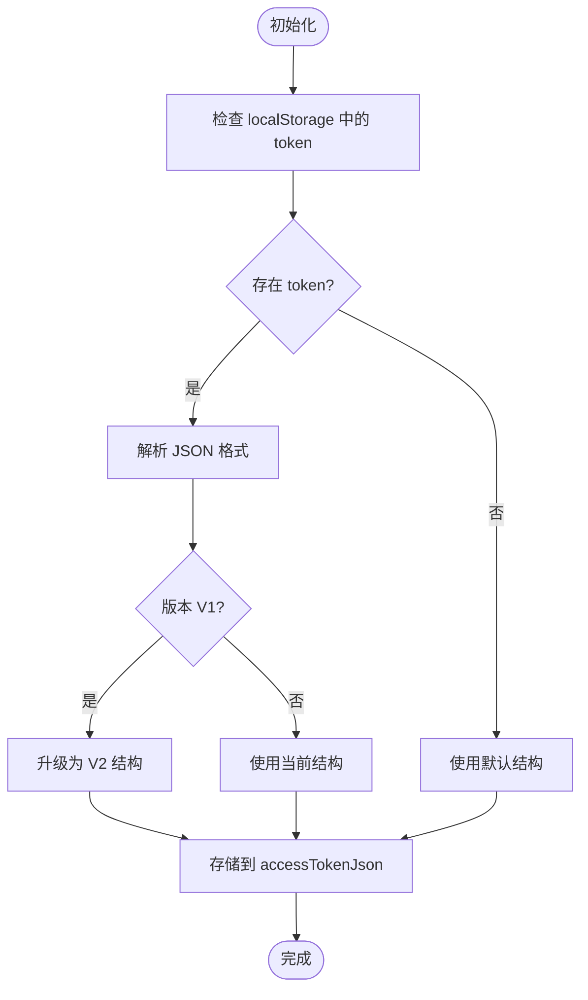
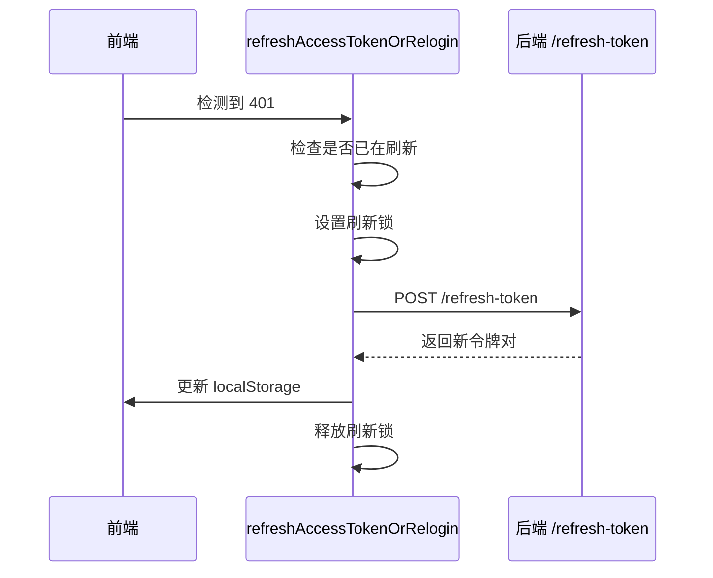
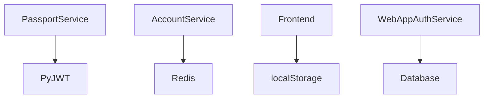

# 会话控制

<cite>
**本文档中引用的文件**  
- [passport.py](file://api/libs/passport.py)
- [account_service.py](file://api/services/account_service.py)
- [refresh-token.ts](file://web/service/refresh-token.ts)
- [passport.py](file://api/controllers/web/passport.py)
- [login.py](file://api/controllers/web/login.py)
</cite>

## 目录
1. [简介](#简介)
2. [项目结构](#项目结构)
3. [核心组件](#核心组件)
4. [架构概述](#架构概述)
5. [详细组件分析](#详细组件分析)
6. [依赖分析](#依赖分析)
7. [性能考虑](#性能考虑)
8. [故障排除指南](#故障排除指南)
9. [结论](#结论)

## 简介
Dify 的会话控制机制基于 JWT（JSON Web Token）实现，采用双令牌模式（访问令牌和刷新令牌）来保障用户会话的安全性与连续性。系统通过 PassportService 统一管理令牌的生成与验证，并结合 Redis 存储刷新令牌以实现令牌失效控制。前端通过 localStorage 管理多设备登录状态，并支持强制登出和会话续期功能。

## 项目结构
Dify 的会话控制相关代码分布在后端 API 与前端 Web 两个主要模块中，涉及认证服务、令牌管理、登录流程及前端状态同步。

```mermaid
graph TD
subgraph "Backend"
A[passport.py] --> B[account_service.py]
B --> C[web/passport.py]
C --> D[web/login.py]
end
subgraph "Frontend"
E[refresh-token.ts] --> F[utils.ts]
F --> G[webapp-signin/page.tsx]
end
Backend < --> Frontend
```

**Diagram sources**  
- [passport.py](file://api/libs/passport.py#L0-L24)
- [account_service.py](file://api/services/account_service.py#L0-L799)
- [refresh-token.ts](file://web/service/refresh-token.ts#L0-L92)

**Section sources**
- [passport.py](file://api/libs/passport.py#L0-L24)
- [account_service.py](file://api/services/account_service.py#L0-L799)

## 核心组件
Dify 的会话控制核心由 PassportService 负责 JWT 令牌的签发与验证，AccountService 管理用户登录状态与双令牌生成，前端通过 refresh-token.ts 实现自动刷新机制。

**Section sources**
- [passport.py](file://api/libs/passport.py#L0-L24)
- [account_service.py](file://api/services/account_service.py#L393-L425)
- [refresh-token.ts](file://web/service/refresh-token.ts#L39-L76)

## 架构概述
Dify 采用标准的双令牌安全架构，后端生成 JWT 访问令牌与长期有效的刷新令牌，前端在令牌过期时自动请求刷新，确保用户体验流畅且安全。



**Diagram sources**  
- [login.py](file://api/controllers/web/login.py#L37-L71)
- [account_service.py](file://api/services/account_service.py#L393-L425)
- [refresh-token.ts](file://web/service/refresh-token.ts#L39-L76)

## 详细组件分析

### 双令牌机制分析
Dify 使用访问令牌（Access Token）和刷新令牌（Refresh Token）的双令牌模式，提升安全性并支持无感续期。

#### 令牌生成与验证类图


**Diagram sources**  
- [passport.py](file://api/libs/passport.py#L0-L24)
- [account_service.py](file://api/services/account_service.py#L393-L425)

### 多设备登录与会话管理
系统通过 localStorage 管理多个共享会话的访问令牌，并支持按用户 ID 区分存储，实现多设备状态隔离。

#### 前端令牌存储逻辑


**Diagram sources**  
- [utils.ts](file://web/app/components/share/utils.ts#L32-L62)

### 令牌刷新流程
前端在检测到 401 错误后，通过专用刷新机制获取新令牌，避免无限循环。

#### 令牌刷新序列图


**Diagram sources**  
- [refresh-token.ts](file://web/service/refresh-token.ts#L39-L76)

## 依赖分析
会话控制系统依赖于 PyJWT 库进行令牌编解码，Redis 用于刷新令牌的存储与失效管理，前端依赖浏览器 localStorage 实现持久化。



**Diagram sources**  
- [passport.py](file://api/libs/passport.py#L0-L24)
- [account_service.py](file://api/services/account_service.py#L393-L425)

**Section sources**
- [passport.py](file://api/libs/passport.py#L0-L24)
- [account_service.py](file://api/services/account_service.py#L393-L425)

## 性能考虑
- 令牌验证为无状态操作，性能开销低
- 刷新令牌存储于 Redis，读写高效
- 前端使用 localStorage，访问速度快
- 支持并发刷新控制，避免重复请求

## 故障排除指南
常见问题包括令牌过期未刷新、多标签页冲突、localStorage 清除后无法登录等。建议检查：
- 浏览器是否禁用 localStorage
- 网络请求是否返回 401 且未触发刷新
- Redis 是否正常运行
- SECRET_KEY 配置是否一致

**Section sources**
- [refresh-token.ts](file://web/service/refresh-token.ts#L39-L76)
- [passport.py](file://api/libs/passport.py#L0-L24)

## 结论
Dify 的会话控制机制设计合理，采用行业标准的双令牌模式，结合前后端协同实现安全、高效的用户认证与会话管理。建议持续关注令牌安全性、刷新机制健壮性及多设备兼容性。