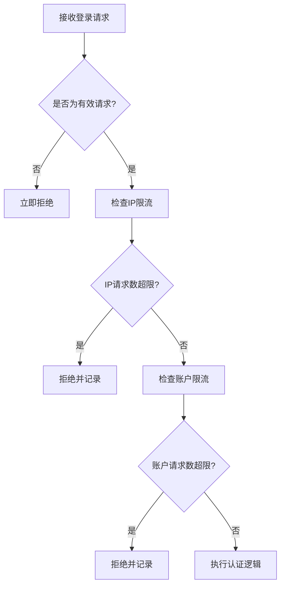
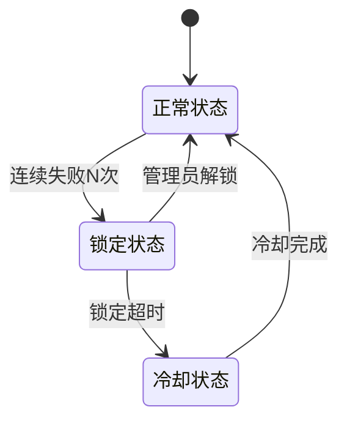
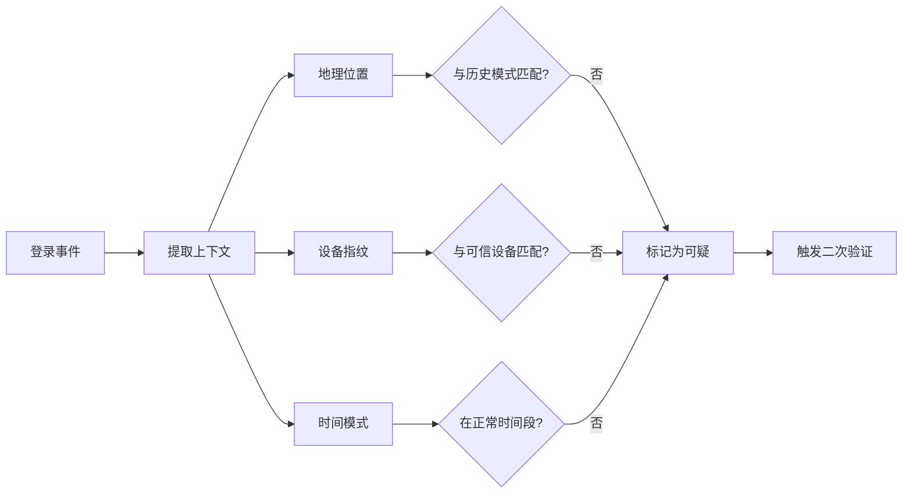
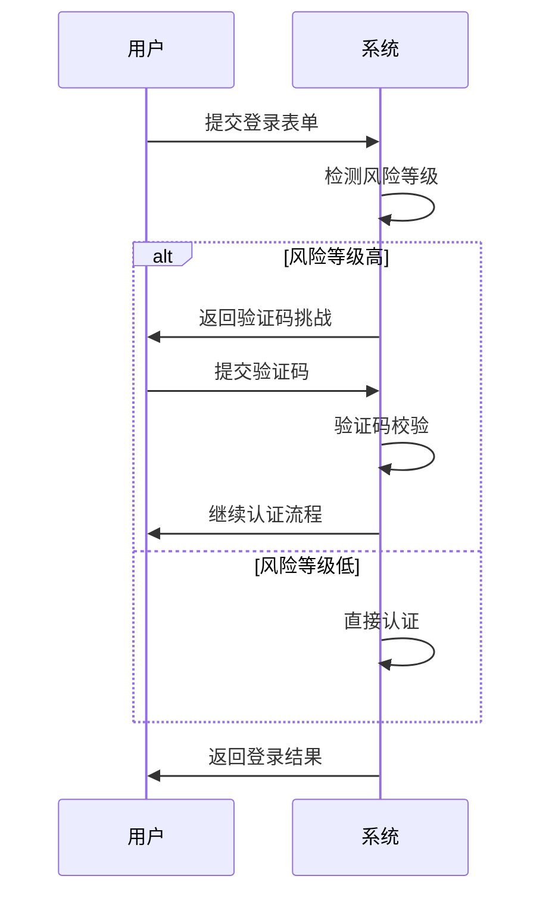

# 安全策略

<cite>
**本文档引用的文件**
- [login.py](file://api/controllers/web/login.py)
- [passport.py](file://api/libs/passport.py)
- [account.py](file://api/models/account.py)
- [auth.py](file://api/services/auth/__init__.py)
- [webapp_auth_service.py](file://api/services/webapp_auth_service.py)
- [helper.py](file://api/libs/helper.py)
- [rate_limit.py](file://api/libs/rate_limit.py)
- [config.py](file://api/configs/app_config.py)
- [errors.py](file://api/controllers/common/errors.py)
- [security_config.py](file://api/configs/feature/security_config.py)
</cite>

## 目录
1. [简介](#简介)
2. [限流机制](#限流机制)
3. [登录失败处理与账户锁定](#登录失败处理与账户锁定)
4. [异常登录检测](#异常登录检测)
5. [登录日志与监控](#登录日志与监控)
6. [验证码与多因素认证扩展](#验证码与多因素认证扩展)
7. [安全告警集成](#安全告警集成)
8. [最佳实践](#最佳实践)

## 简介
Dify平台通过多层次安全机制防止暴力破解攻击，保障用户账户安全。系统实现了基于IP和账户的请求频率限制、登录失败处理、异常行为检测以及可扩展的认证增强机制。本文档详细说明其核心安全策略的实现原理与配置方式。

## 限流机制

Dify采用基于Redis的滑动窗口计数器算法实现精细化的请求频率控制，防止暴力破解尝试。系统支持基于IP地址和用户账户的双重限流策略，确保在高并发场景下仍能有效识别异常行为。



**Diagram sources**
- [login.py](file://api/controllers/web/login.py#L25-L80)
- [rate_limit.py](file://api/libs/rate_limit.py#L10-L60)

**Section sources**
- [login.py](file://api/controllers/web/login.py#L1-L100)
- [rate_limit.py](file://api/libs/rate_limit.py#L1-L80)

### 滑动窗口计数器实现
系统使用Redis的有序集合（ZSET）实现滑动窗口计数器，精确跟踪每个时间窗口内的请求频次。算法通过时间戳作为分数存储每次请求，自动清理过期记录，确保计数准确性。

```python
# 伪代码示例：滑动窗口核心逻辑
def is_rate_limited(key: str, max_requests: int, window_seconds: int) -> bool:
    now = time.time()
    cutoff = now - window_seconds
    
    # 移除过期请求
    redis.zremrangebyscore(key, 0, cutoff)
    
    # 获取当前窗口内请求数
    current_count = redis.zcard(key)
    
    if current_count >= max_requests:
        return True
    
    # 记录新请求
    redis.zadd(key, {str(uuid.uuid4()): now})
    redis.expire(key, window_seconds)
    
    return False
```

**Section sources**
- [rate_limit.py](file://api/libs/rate_limit.py#L15-L75)

### 配置参数
系统支持灵活配置限流参数，包括：

| 参数 | 默认值 | 说明 |
|------|--------|------|
| `LOGIN_IP_LIMIT` | 10次/分钟 | 每个IP地址每分钟最大登录尝试次数 |
| `LOGIN_ACCOUNT_LIMIT` | 5次/分钟 | 每个账户每分钟最大登录尝试次数 |
| `LOGIN_GLOBAL_LIMIT` | 100次/分钟 | 全局限流阈值 |
| `WINDOW_SIZE` | 60秒 | 滑动窗口时间范围 |

**Section sources**
- [security_config.py](file://api/configs/feature/security_config.py#L5-L25)

## 登录失败处理与账户锁定

当用户连续登录失败达到预设阈值时，系统将触发账户锁定机制，防止暴力破解。锁定策略支持可配置的失败次数和锁定时长。



**Diagram sources**
- [account.py](file://api/models/account.py#L120-L150)
- [webapp_auth_service.py](file://api/services/webapp_auth_service.py#L45-L90)

**Section sources**
- [webapp_auth_service.py](file://api/services/webapp_auth_service.py#L1-L120)
- [account.py](file://api/models/account.py#L1-L200)

### 账户状态管理
用户账户包含以下安全相关字段：
- `failed_login_count`: 当前连续失败次数
- `locked_until`: 账户锁定截止时间
- `last_login_failed_at`: 上次失败时间
- `is_locked`: 是否被锁定标志

系统在每次登录失败时更新这些状态，并在成功登录后重置计数器。

**Section sources**
- [account.py](file://api/models/account.py#L80-L110)

## 异常登录检测

Dify平台集成异常行为监控系统，通过分析登录模式识别潜在的安全威胁。检测维度包括：

- **地理位置异常**: 短时间内跨地域登录
- **设备指纹变化**: 浏览器/设备特征突变
- **时间模式异常**: 非常规时间登录
- **行为序列异常**: 异常的API调用序列



**Diagram sources**
- [passport.py](file://api/libs/passport.py#L30-L85)
- [helper.py](file://api/libs/helper.py#L100-L150)

**Section sources**
- [passport.py](file://api/libs/passport.py#L1-L120)
- [helper.py](file://api/libs/helper.py#L1-L200)

## 登录日志与监控

所有认证相关事件均被记录到审计日志中，包含完整上下文信息，便于安全分析和故障排查。

### 日志记录内容
每次登录尝试记录以下信息：
- 时间戳
- 用户ID（如已知）
- IP地址
- 用户代理
- 地理位置（通过IP解析）
- 请求结果（成功/失败及原因）
- 关联的会话ID
- 设备指纹哈希

**Section sources**
- [login.py](file://api/controllers/web/login.py#L50-L75)
- [webapp_auth_service.py](file://api/services/webapp_auth_service.py#L60-L80)

### 监控集成
系统通过OpenTelemetry将安全事件导出到监控平台，支持：
- 实时登录尝试仪表板
- 失败率趋势分析
- 异常IP地址自动标记
- 高频失败账户告警

**Section sources**
- [config.py](file://api/configs/app_config.py#L30-L50)
- [passport.py](file://api/libs/passport.py#L90-L110)

## 验证码与多因素认证扩展

Dify提供可扩展的认证增强机制，支持在检测到可疑活动时动态插入验证步骤。

### 验证码挑战
当系统检测到潜在风险时，可要求用户完成验证码验证：
- 图形验证码（reCAPTCHA）
- 邮件验证码
- 短信验证码（企业版）



**Diagram sources**
- [auth.py](file://api/services/auth/__init__.py#L20-L60)
- [login.py](file://api/controllers/web/login.py#L85-L120)

**Section sources**
- [auth.py](file://api/services/auth/__init__.py#L1-L80)
- [login.py](file://api/controllers/web/login.py#L80-L150)

### 多因素认证扩展点
系统设计支持MFA集成，主要扩展接口包括：
- `IAuthenticationFactor`: 认证因素抽象
- `TOTPProvider`: 基于时间的一次性密码
- `PushNotificationFactor`: 推送通知确认
- `SecurityKeyFactor`: 安全密钥（WebAuthn）

**Section sources**
- [auth.py](file://api/services/auth/__init__.py#L65-L100)

## 安全告警集成

安全事件通过多种渠道通知管理员，确保及时响应潜在威胁。

### 告警触发条件
- 单IP地址短时间大量失败尝试
- 高价值账户登录失败
- 检测到已知恶意IP地址
- 异常地理位置登录
- 账户锁定达到阈值

### 通知渠道
- 站内通知
- 邮件告警
- Webhook集成（Slack、企业微信等）
- SIEM系统集成

**Section sources**
- [errors.py](file://api/controllers/common/errors.py#L1-L30)
- [config.py](file://api/configs/app_config.py#L55-L70)

## 最佳实践

### 限流策略配置建议
- 生产环境建议设置`LOGIN_IP_LIMIT=5/分钟`，`LOGIN_ACCOUNT_LIMIT=3/分钟`
- 对于高安全要求场景，可缩短窗口时间为30秒
- 全局限流应设置为预期峰值流量的120%

### 账户锁定策略
- 建议连续5次失败后锁定账户15分钟
- 提供管理员手动解锁功能
- 锁定期间仍记录尝试次数，防止绕过

### 监控与响应
- 定期审查登录失败日志
- 设置基于百分比的异常检测阈值（如失败率>30%）
- 建立安全事件响应流程

### 扩展认证
- 对敏感操作实施动态MFA
- 使用设备信任机制减少合法用户摩擦
- 定期轮换MFA密钥

**Section sources**
- [security_config.py](file://api/configs/feature/security_config.py#L20-L50)
- [config.py](file://api/configs/app_config.py#L40-L60)