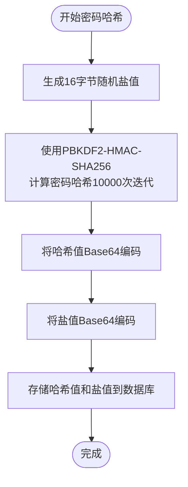
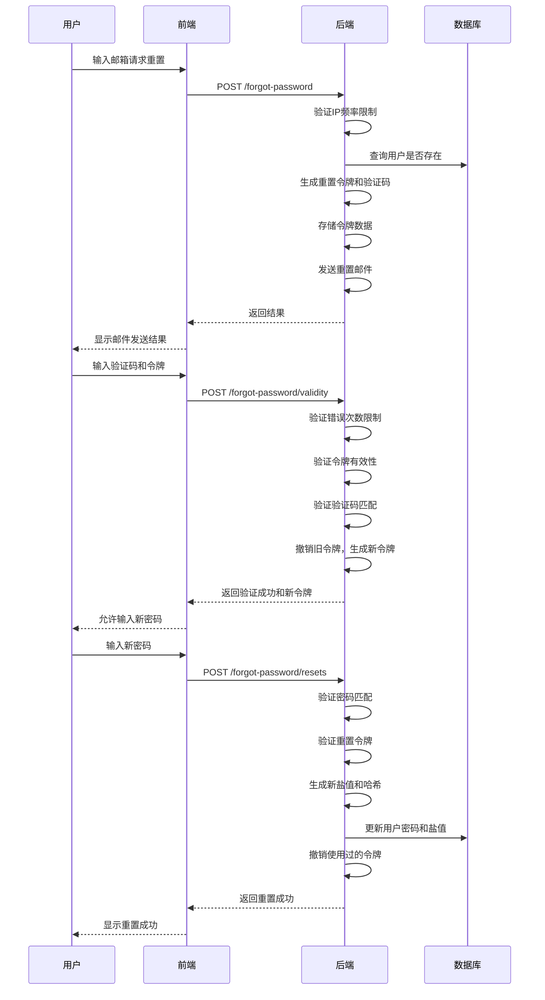
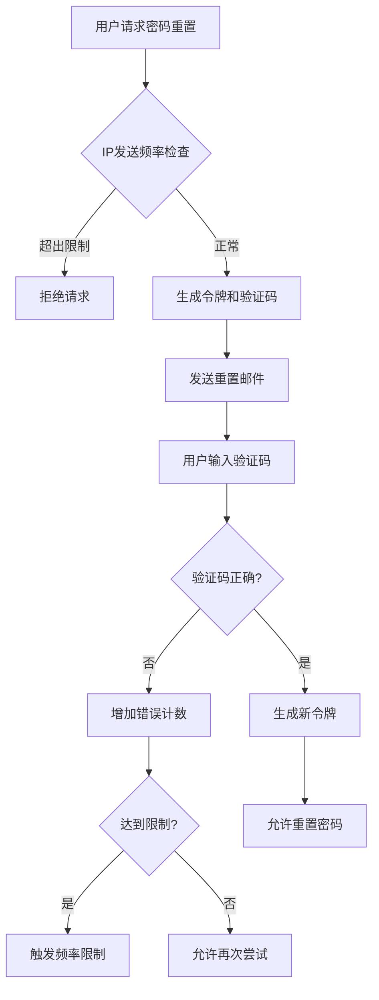

# 密码管理

<cite>
**本文档中引用的文件**  
- [password.py](file://api/libs/password.py)
- [forgot_password.py](file://api/controllers/console/auth/forgot_password.py)
- [forgot_password.py](file://api/controllers/web/forgot_password.py)
- [encrypter.py](file://api/core/helper/encrypter.py)
- [account.py](file://api/models/account.py)
- [login.py](file://api/libs/login.py)
</cite>

## 目录
1. [简介](#简介)
2. [密码强度验证](#密码强度验证)
3. [密码哈希与存储](#密码哈希与存储)
4. [密码重置流程](#密码重置流程)
5. [密码重置令牌机制](#密码重置令牌机制)
6. [安全实践与防护机制](#安全实践与防护机制)
7. [总结](#总结)

## 简介
Dify 系统实现了完整的用户密码管理机制，涵盖用户注册时的密码强度校验、加密存储、密码重置流程以及相关安全防护策略。系统通过 PBKDF2-HMAC-SHA256 算法进行密码哈希，结合随机盐值防止彩虹表攻击，并通过令牌机制实现安全的密码重置功能。本文档详细解析其核心实现逻辑与安全设计。

## 密码强度验证

Dify 在用户注册或修改密码时强制执行密码强度策略，确保用户密码具备基本安全性。系统通过正则表达式验证密码复杂度，要求密码必须同时包含字母和数字，且长度不少于8位。

该策略在 `api/libs/password.py` 中定义，通过 `valid_password` 函数实现校验逻辑。若密码不符合要求，系统将抛出 `ValueError` 异常，阻止弱密码的使用。

**Section sources**
- [password.py](file://api/libs/password.py#L5-L12)

## 密码哈希与存储

Dify 未使用 bcrypt 算法，而是采用 PBKDF2-HMAC-SHA256 算法进行密码哈希。该算法通过多次迭代（10,000次）增强计算成本，有效抵御暴力破解攻击。

密码哈希过程包含以下关键步骤：
1. 生成16字节的随机盐值（salt），使用 `secrets.token_bytes(16)` 保证密码学安全性
2. 使用 `hashlib.pbkdf2_hmac` 对密码和盐值进行哈希运算
3. 将生成的哈希值和盐值分别以 Base64 编码后存储至数据库

验证密码时，系统使用相同的盐值重新计算哈希值，并与存储的哈希值进行比较。该机制在 `hash_password` 和 `compare_password` 函数中实现。

**Diagram sources**
- [password.py](file://api/libs/password.py#L14-L26)
- [forgot_password.py](file://api/controllers/console/auth/forgot_password.py#L135-L137)

**Section sources**
- [password.py](file://api/libs/password.py#L14-L26)

## 密码重置流程

Dify 提供了完整的密码重置流程，包含三个主要阶段：发送重置邮件、验证验证码、重置密码。该流程通过 REST API 实现，确保用户身份验证的安全性。

### 流程步骤
1. **发送重置邮件**：用户输入邮箱后，系统检查IP发送频率限制，验证邮箱格式，并生成包含重置令牌的邮件发送给用户
2. **验证验证码**：用户收到邮件中的验证码后，在前端输入验证码和令牌，系统验证其有效性
3. **重置密码**：验证通过后，用户输入新密码，系统更新数据库中的密码哈希和盐值

该流程在控制台和Web端分别实现了 `ForgotPasswordSendEmailApi`、`ForgotPasswordCheckApi` 和 `ForgotPasswordResetApi` 三个API资源。

**Diagram sources**
- [forgot_password.py](file://api/controllers/console/auth/forgot_password.py#L28-L179)
- [forgot_password.py](file://api/controllers/web/forgot_password.py#L15-L171)

**Section sources**
- [forgot_password.py](file://api/controllers/console/auth/forgot_password.py#L28-L179)
- [forgot_password.py](file://api/controllers/web/forgot_password.py#L15-L171)

## 密码重置令牌机制

Dify 的密码重置令牌机制设计了多重安全策略，确保令牌的一次性使用和时效性管理。

### 令牌生成与管理
- 使用 `AccountService.generate_reset_password_token` 生成令牌，包含邮箱、验证码和阶段信息
- 令牌数据存储在服务端（如Redis或内存缓存），不依赖JWT等无状态令牌
- 每个令牌具有明确的使用阶段（phase），初始为验证阶段，验证通过后切换到重置阶段

### 一次性使用策略
- 一旦令牌被成功验证或用于密码重置，立即通过 `AccountService.revoke_reset_password_token` 撤销
- 撤销后的令牌无法再次使用，防止重放攻击
- 新的验证流程会生成全新的令牌，确保每次操作的独立性

### 有效期管理
- 系统通过缓存的过期策略自动管理令牌有效期
- 在验证阶段，若验证码输入错误达到限制次数，将触发错误率限制
- 令牌在使用后立即失效，不依赖时间过期机制，提高安全性

**Section sources**
- [forgot_password.py](file://api/controllers/console/auth/forgot_password.py#L78-L85)
- [forgot_password.py](file://api/controllers/console/auth/forgot_password.py#L125-L128)

## 安全实践与防护机制

Dify 实现了多项安全实践，防止密码泄露和账户滥用。

### 密码尝试次数限制
系统对密码重置过程中的验证码错误进行频率控制：
- 使用 `AccountService.is_forgot_password_error_rate_limit` 检查错误次数
- 错误达到阈值后，触发 `EmailPasswordResetLimitError`
- 通过 `AccountService.add_forgot_password_error_rate_limit` 记录错误次数
- 验证成功后调用 `AccountService.reset_forgot_password_error_rate_limit` 重置计数

### IP发送频率限制
为防止邮件轰炸攻击，系统对密码重置邮件的发送实施IP级别限制：
- 使用 `AccountService.is_email_send_ip_limit` 检查IP发送频率
- 超过限制时抛出 `EmailSendIpLimitError`
- 有效防止恶意用户通过自动化脚本大量发送重置邮件

### 账户锁定机制
虽然未直接实现账户锁定，但通过以下机制间接实现：
- 验证码错误次数限制阻止暴力破解
- IP发送频率限制防止邮件轰炸
- 令牌一次性使用策略防止重放攻击
- 密码强度要求防止弱密码

**Diagram sources**
- [forgot_password.py](file://api/controllers/console/auth/forgot_password.py#L47-L51)
- [forgot_password.py](file://api/controllers/console/auth/forgot_password.py#L91-L98)

**Section sources**
- [forgot_password.py](file://api/controllers/console/auth/forgot_password.py#L47-L51)
- [forgot_password.py](file://api/controllers/console/auth/forgot_password.py#L91-L98)

## 总结
Dify 的密码管理系统通过PBKDF2-HMAC-SHA256算法实现安全的密码存储，结合严格的密码强度验证、多阶段的密码重置流程和全面的安全防护机制，有效保障用户账户安全。系统通过令牌撤销机制确保一次性使用，通过IP和错误次数限制防止滥用，构建了完整的密码安全防护体系。