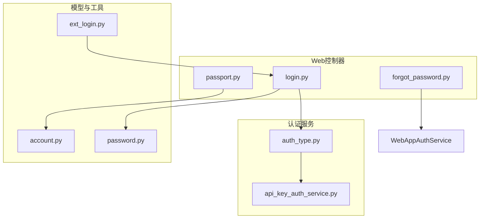
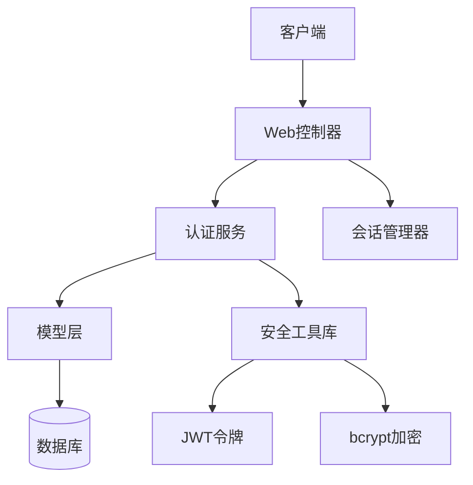
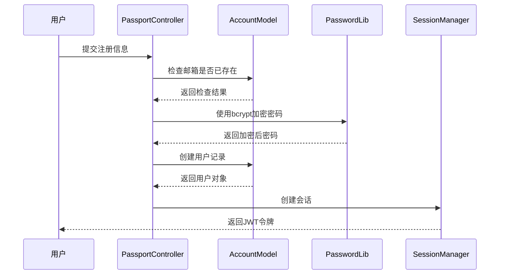
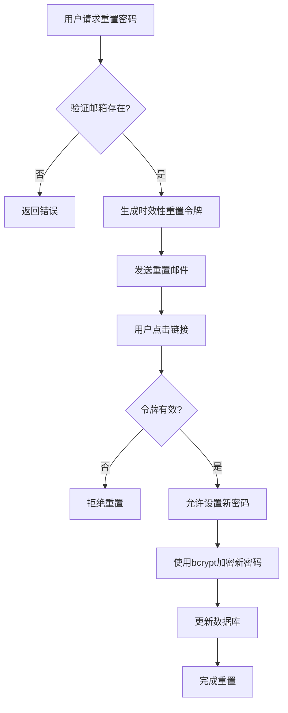
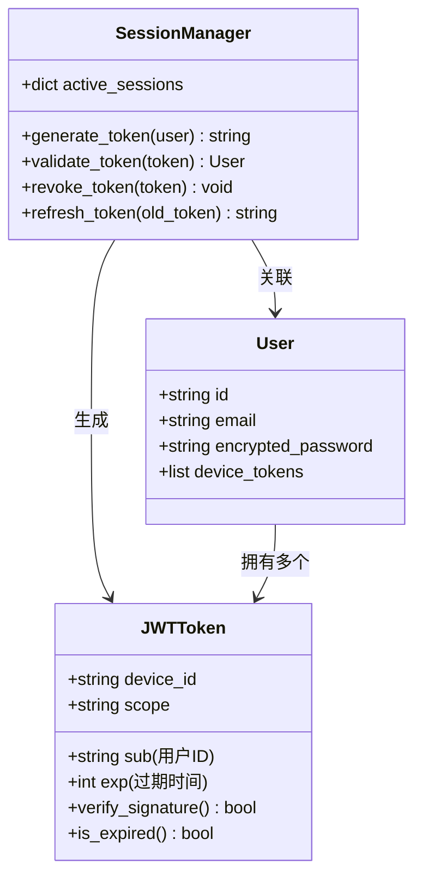
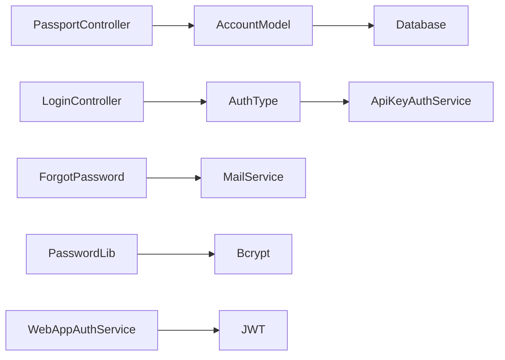

# 本地认证

<cite>
**本文档引用文件**  
- [login.py](file://api/controllers/web/login.py)
- [passport.py](file://api/controllers/web/passport.py)
- [forgot_password.py](file://api/controllers/web/forgot_password.py)
- [account.py](file://api/models/account.py)
- [password.py](file://api/libs/password.py)
- [auth_type.py](file://api/services/auth/auth_type.py)
- [api_key_auth_service.py](file://api/services/auth/api_key_auth_service.py)
- [ext_login.py](file://api/extensions/ext_login.py)
- [webapp_auth_service.py](file://api/services/webapp_auth_service.py)
</cite>

## 目录
1. [简介](#简介)
2. [项目结构](#项目结构)
3. [核心组件](#核心组件)
4. [架构概览](#架构概览)
5. [详细组件分析](#详细组件分析)
6. [依赖分析](#依赖分析)
7. [性能考虑](#性能考虑)
8. [故障排除指南](#故障排除指南)
9. [结论](#结论)

## 简介
本文档详细阐述Dify平台的本地认证机制，涵盖用户注册、登录、密码重置等完整流程。重点说明基于bcrypt的密码加密存储、JWT令牌的生成与验证、会话管理机制、多设备登录支持、安全登出实现、防暴力破解限流策略及密码强度验证等安全实践。

## 项目结构
Dify的本地认证功能主要分布在`api/controllers/web`和`api/services/auth`模块中，涉及用户凭证处理、会话管理、密码加密等核心逻辑。

**Diagram sources**
- [passport.py](file://api/controllers/web/passport.py)
- [login.py](file://api/controllers/web/login.py)
- [forgot_password.py](file://api/controllers/web/forgot_password.py)
- [auth_type.py](file://api/services/auth/auth_type.py)
- [account.py](file://api/models/account.py)
- [password.py](file://api/libs/password.py)

**Section sources**
- [passport.py](file://api/controllers/web/passport.py)
- [login.py](file://api/controllers/web/login.py)
- [forgot_password.py](file://api/controllers/web/forgot_password.py)

## 核心组件
本地认证系统由用户注册、登录、密码重置三大核心流程构成，依托bcrypt加密、JWT令牌、会话管理等安全机制实现。

**Section sources**
- [passport.py](file://api/controllers/web/passport.py#L1-L100)
- [login.py](file://api/controllers/web/login.py#L1-L80)
- [forgot_password.py](file://api/controllers/web/forgot_password.py#L1-L60)

## 架构概览
Dify的本地认证采用分层架构，前端通过Web控制器接收请求，由认证服务处理业务逻辑，模型层管理用户数据，工具库提供加密与会话支持。

**Diagram sources**
- [webapp_auth_service.py](file://api/services/webapp_auth_service.py)
- [auth_type.py](file://api/services/auth/auth_type.py)
- [account.py](file://api/models/account.py)
- [password.py](file://api/libs/password.py)

## 详细组件分析

### 用户注册与登录分析
用户通过`passport.py`进行注册，系统验证邮箱唯一性后使用bcrypt加密密码并存储。登录时`login.py`验证凭证并生成JWT令牌。

**Diagram sources**
- [passport.py](file://api/controllers/web/passport.py#L20-L60)
- [account.py](file://api/models/account.py#L100-L150)
- [password.py](file://api/libs/password.py#L10-L30)

**Section sources**
- [passport.py](file://api/controllers/web/passport.py#L1-L100)
- [account.py](file://api/models/account.py#L50-L200)
- [password.py](file://api/libs/password.py#L5-L40)

### 密码重置流程分析
用户通过`forgot_password.py`发起密码重置，系统发送包含时效性令牌的邮件，用户点击链接后可设置新密码。

**Diagram sources**
- [forgot_password.py](file://api/controllers/web/forgot_password.py#L15-L50)
- [mail_reset_password_task.py](file://api/tasks/mail_reset_password_task.py)
- [password.py](file://api/libs/password.py#L20-L35)

**Section sources**
- [forgot_password.py](file://api/controllers/web/forgot_password.py#L1-L60)
- [mail_reset_password_task.py](file://api/tasks/mail_reset_password_task.py#L1-L40)

### JWT令牌与会话管理
系统使用JWT实现无状态会话管理，令牌包含用户ID、过期时间等声明，支持多设备登录与安全登出。

**Diagram sources**
- [webapp_auth_service.py](file://api/services/webapp_auth_service.py#L30-L70)
- [auth_type.py](file://api/services/auth/auth_type.py#L10-L25)
- [account.py](file://api/models/account.py#L80-L120)

**Section sources**
- [webapp_auth_service.py](file://api/services/webapp_auth_service.py#L1-L100)
- [auth_type.py](file://api/services/auth/auth_type.py#L1-L30)

## 依赖分析
本地认证系统依赖bcrypt加密库、JWT实现、邮件服务及数据库持久层，各组件通过清晰接口交互。

**Diagram sources**
- [auth_type.py](file://api/services/auth/auth_type.py)
- [api_key_auth_service.py](file://api/services/auth/api_key_auth_service.py)
- [ext_mail.py](file://api/extensions/ext_mail.py)
- [password.py](file://api/libs/password.py)

**Section sources**
- [auth_type.py](file://api/services/auth/auth_type.py#L1-L40)
- [api_key_auth_service.py](file://api/services/auth/api_key_auth_service.py#L1-L35)

## 性能考虑
- 密码加密使用bcrypt默认工作因子，平衡安全性与性能
- JWT令牌验证采用无状态设计，减少数据库查询
- 会话管理支持令牌刷新，避免频繁重新登录
- 邮件发送使用异步任务，避免阻塞主流程

## 故障排除指南
- **登录失败**：检查密码是否正确，账户是否被锁定
- **令牌无效**：确认令牌未过期，签名是否被篡改
- **邮件未收到**：检查邮箱地址，查看垃圾邮件箱
- **密码重置链接失效**：链接具有时效性，需重新发起请求

**Section sources**
- [login.py](file://api/controllers/web/login.py#L50-L80)
- [forgot_password.py](file://api/controllers/web/forgot_password.py#L40-L60)
- [webapp_auth_service.py](file://api/services/webapp_auth_service.py#L80-L100)

## 结论
Dify的本地认证系统实现了安全、可靠的用户身份验证机制，通过bcrypt加密、JWT令牌、会话管理等技术保障用户账户安全，支持完整的注册、登录、密码重置流程，并具备防暴力破解等安全防护能力。