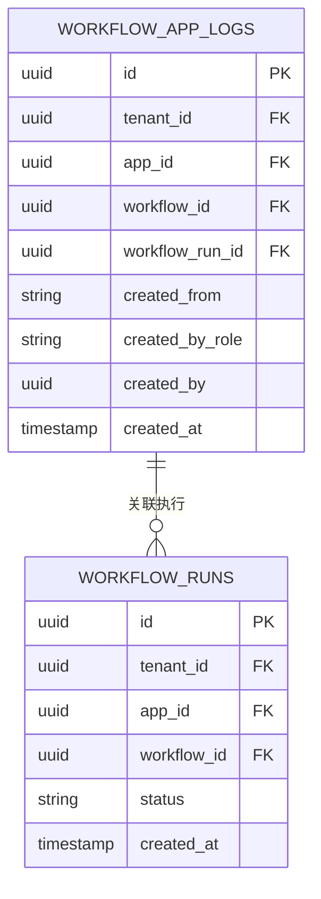
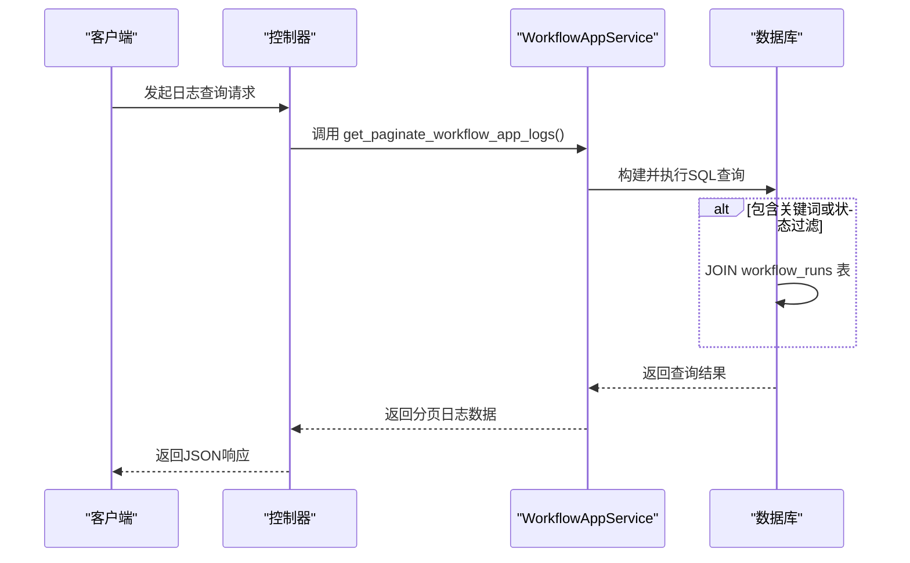

# 审计日志

<cite>
**本文档中引用的文件**  
- [workflow.py](file://api/models/workflow.py)
- [workflow_app_service.py](file://api/services/workflow_app_service.py)
- [workflow_app_log.py](file://api/controllers/console/app/workflow_app_log.py)
- [enums.py](file://api/models/enums.py)
</cite>

## 目录
1. [简介](#简介)
2. [操作日志生成机制](#操作日志生成机制)
3. [日志存储结构](#日志存储结构)
4. [查询接口与追溯能力](#查询接口与追溯能力)
5. [权限变更历史追溯](#权限变更历史追溯)
6. [日志安全保护措施](#日志安全保护措施)

## 简介
Dify 系统通过审计日志机制全面追踪用户在工作流应用中的关键操作行为。审计日志记录了创建、修改和删除等核心事件，为系统安全、合规性审查和问题排查提供了重要依据。本文档详细说明审计日志的生成、存储、查询及安全保护机制。

## 操作日志生成机制

Dify 的审计日志主要围绕工作流应用（Workflow App）的执行过程进行事件捕获。每当一个工作流被运行时，系统会自动生成一条审计日志记录。

关键操作事件的捕获流程如下：
1. **工作流触发**：当用户通过 Web 应用、API 或已安装的应用启动一个工作流时，系统会创建一个 `WorkflowRun` 实例来表示本次执行。
2. **日志创建**：在 `WorkflowRun` 创建的同时，系统会调用 `WorkflowAppService` 服务，向 `workflow_app_logs` 数据表中插入一条新的日志记录。
3. **信息填充**：日志记录会填充关键信息，包括租户ID、应用ID、工作流ID、执行ID、触发来源、创建者角色和ID、以及创建时间。

此机制确保了所有用户驱动的工作流执行行为都被完整记录，无论是由控制台账户（`account`）还是终端用户（`end_user`）发起。

**Section sources**
- [workflow.py](file://api/models/workflow.py#L816-L849)
- [workflow_app_service.py](file://api/services/workflow_app_service.py#L0-L36)

## 日志存储结构

审计日志的核心数据存储在数据库的 `workflow_app_logs` 表中。该表的结构设计旨在高效地记录和检索操作事件。

### 数据表字段说明

| 字段名 | 类型 | 描述 |
| :--- | :--- | :--- |
| `id` | UUID | 日志记录的唯一标识符 |
| `tenant_id` | UUID | 关联的工作区（租户）ID |
| `app_id` | UUID | 关联的应用ID |
| `workflow_id` | UUID | 关联的工作流定义ID |
| `workflow_run_id` | UUID | 关联的具体工作流执行实例ID |
| `created_from` | String | 触发来源，可选值：`service-api`, `web-app`, `installed-app` |
| `created_by_role` | String | 创建者角色，可选值：`account` (控制台账户), `end_user` (终端用户) |
| `created_by` | UUID | 创建者的ID，其含义取决于 `created_by_role` |
| `created_at` | Timestamp | 日志记录的创建时间 |

### 索引设计
为了优化查询性能，该表建立了以下索引：
- **主键索引**：`id`
- **复合索引**：`(tenant_id, app_id)`，用于快速按工作区和应用筛选日志。
- **复合索引**：`(workflow_run_id)`，用于根据执行ID快速查找。

这种存储结构确保了日志数据的完整性和查询效率。

**Diagram sources**
- [workflow.py](file://api/models/workflow.py#L816-L849)

**Section sources**
- [workflow.py](file://api/models/workflow.py#L816-L849)

## 查询接口与追溯能力

Dify 提供了强大的查询接口，允许管理员和开发者根据多种条件检索审计日志，从而实现对用户操作的精确追溯。

### 查询接口 (`WorkflowAppService.get_paginate_workflow_app_logs`)

该服务方法是查询审计日志的核心接口，支持以下过滤条件：

- **应用范围**：通过 `app_model` 参数限定查询特定应用的日志。
- **关键词搜索**：通过 `keyword` 参数在工作流的输入、输出或终端用户会话ID中进行模糊搜索。
- **状态过滤**：通过 `status` 参数（如 `succeeded`, `failed`）筛选特定执行状态的日志。
- **时间范围**：通过 `created_at_before` 和 `created_at_after` 参数限定日志的创建时间。
- **创建者过滤**：
  - `created_by_end_user_session_id`：根据终端用户的会话ID进行过滤。
  - `created_by_account`：根据控制台账户的邮箱进行过滤。
- **分页支持**：通过 `page` 和 `limit` 参数实现分页查询。

### 查询流程
1. **构建基础查询**：首先根据 `tenant_id` 和 `app_id` 构建基础查询语句。
2. **动态添加条件**：根据传入的参数，动态地向查询中添加 `WHERE` 子句。
3. **关联查询**：当需要根据关键词或状态过滤时，会通过 `workflow_run_id` 与 `workflow_runs` 表进行 `JOIN` 操作。
4. **结果排序与分页**：结果按 `created_at` 降序排列，并应用分页限制。
5. **返回结果**：返回包含总记录数、分页信息和日志数据列表的字典。

此接口设计灵活，能够满足多种审计和监控场景的需求。

**Diagram sources**
- [workflow_app_service.py](file://api/services/workflow_app_service.py#L36-L126)

**Section sources**
- [workflow_app_service.py](file://api/services/workflow_app_service.py#L0-L126)
- [workflow_app_log.py](file://api/controllers/console/app/workflow_app_log.py#L31-L65)

## 权限变更历史追溯

虽然当前审计日志模型主要聚焦于工作流的执行事件，但其设计为追溯权限变更历史提供了基础。

### 追溯机制
1. **创建者角色 (`created_by_role`)**：该字段明确记录了每次操作是由 `account`（通常拥有管理权限）还是 `end_user`（通常拥有有限权限）发起的。通过分析日志流，可以观察到权限使用模式的变化。
2. **时间序列分析**：结合 `created_at` 字段，可以按时间线梳理特定应用或工作流的操作历史。例如，可以识别出某个应用是否从仅由管理员操作，转变为也由终端用户频繁使用。
3. **关联分析**：通过 `workflow_run_id` 可以关联到具体的执行详情，包括执行状态和输入输出。这有助于判断权限变更后，用户执行的操作是否符合预期。

### 局限性
目前的 `workflow_app_logs` 表并未直接记录如“用户角色变更”、“应用分享”或“API密钥创建”等纯粹的权限管理操作。要实现完整的权限变更追溯，需要扩展审计日志的覆盖范围，将这些管理操作也纳入记录。

## 日志安全保护措施

为确保审计日志的完整性和机密性，防止日志篡改和未授权访问，Dify 采取了以下安全措施：

### 防止日志篡改
1. **只追加设计**：审计日志表 `workflow_app_logs` 的设计原则是只允许插入（INSERT）新记录，不允许更新（UPDATE）或删除（DELETE）现有记录。这是防止日志被篡改的最根本措施。
2. **数据库级约束**：通过数据库的主键和外键约束，确保了每条日志记录的唯一性和关联数据的完整性。
3. **应用层控制**：在应用代码层面，`WorkflowAppLog` 模型没有提供任何修改或删除日志的方法，所有操作都通过受控的服务接口进行。

### 防止未授权访问
1. **基于角色的访问控制 (RBAC)**：查询审计日志的接口（如 `workflow_app_log.py` 中的控制器）会强制执行权限检查。只有拥有相应权限的用户（如工作区所有者或管理员）才能访问日志数据。
2. **数据范围隔离**：查询接口要求传入 `app_model`，这确保了用户只能查询其有权访问的应用的日志。查询语句中 `tenant_id` 和 `app_id` 的过滤条件实现了数据的多租户隔离。
3. **安全的查询参数处理**：在进行关键词搜索时，系统会对输入的 `keyword` 进行转义处理（如 `keyword_like_val`），以防止潜在的SQL注入攻击。

这些措施共同构成了一个纵深防御体系，保障了审计日志作为可信证据源的安全性。

**Section sources**
- [workflow.py](file://api/models/workflow.py#L816-L849)
- [workflow_app_service.py](file://api/services/workflow_app_service.py#L0-L126)
- [workflow_app_log.py](file://api/controllers/console/app/workflow_app_log.py#L31-L65)