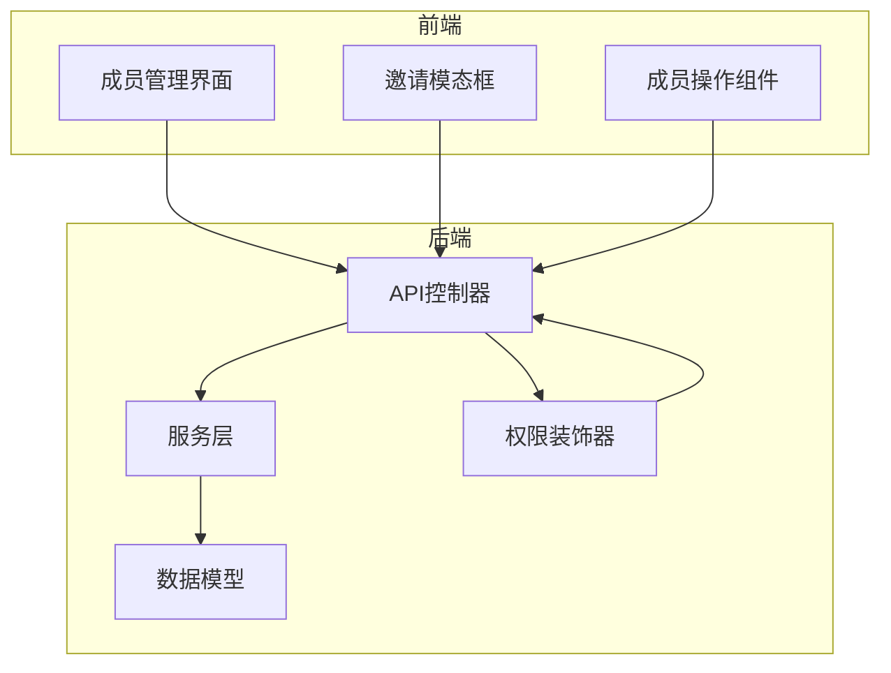
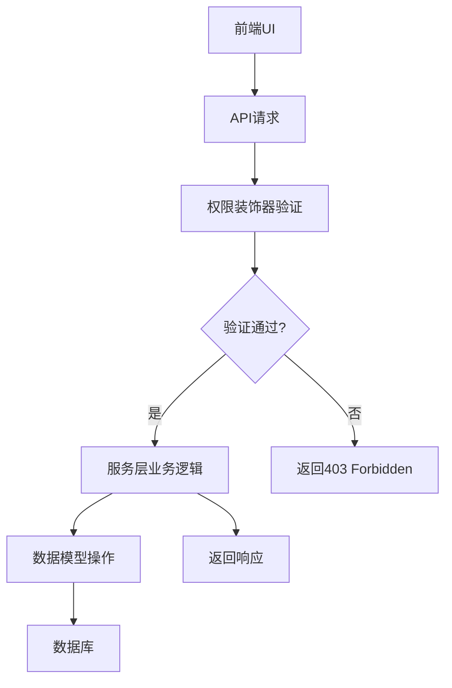
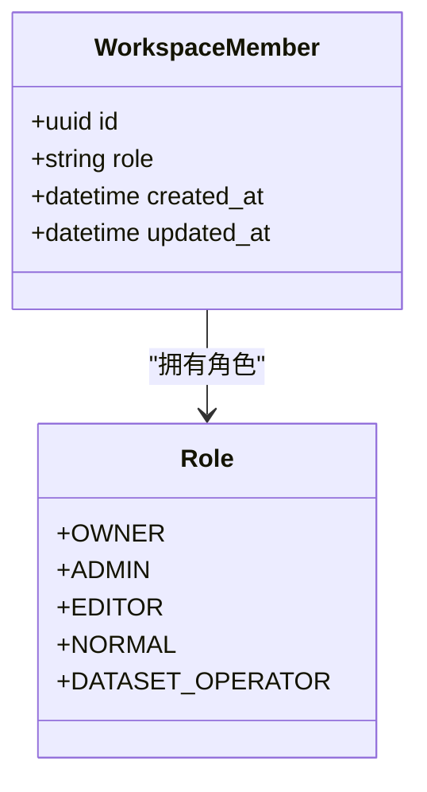
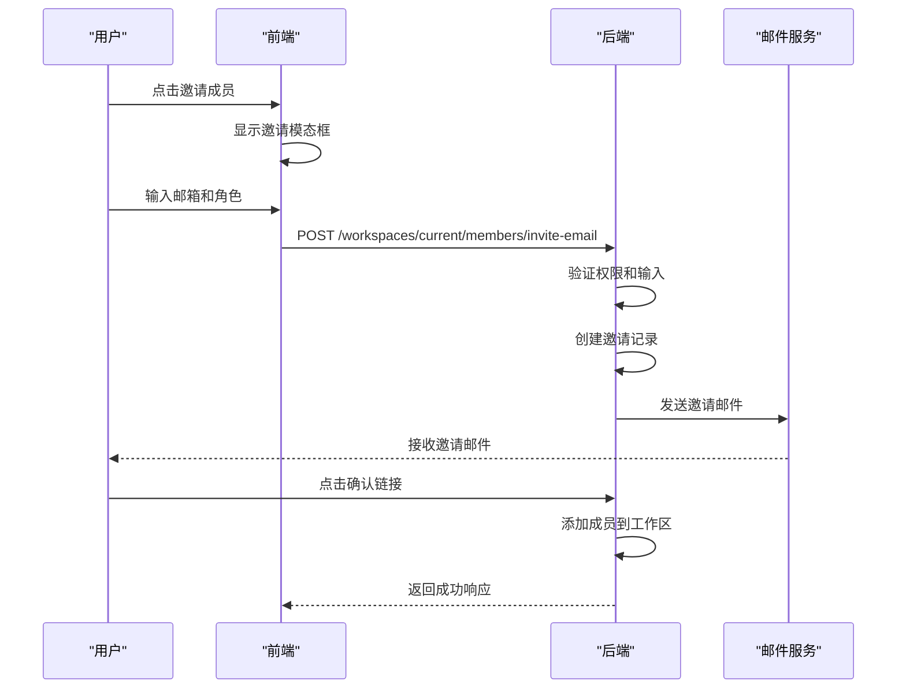
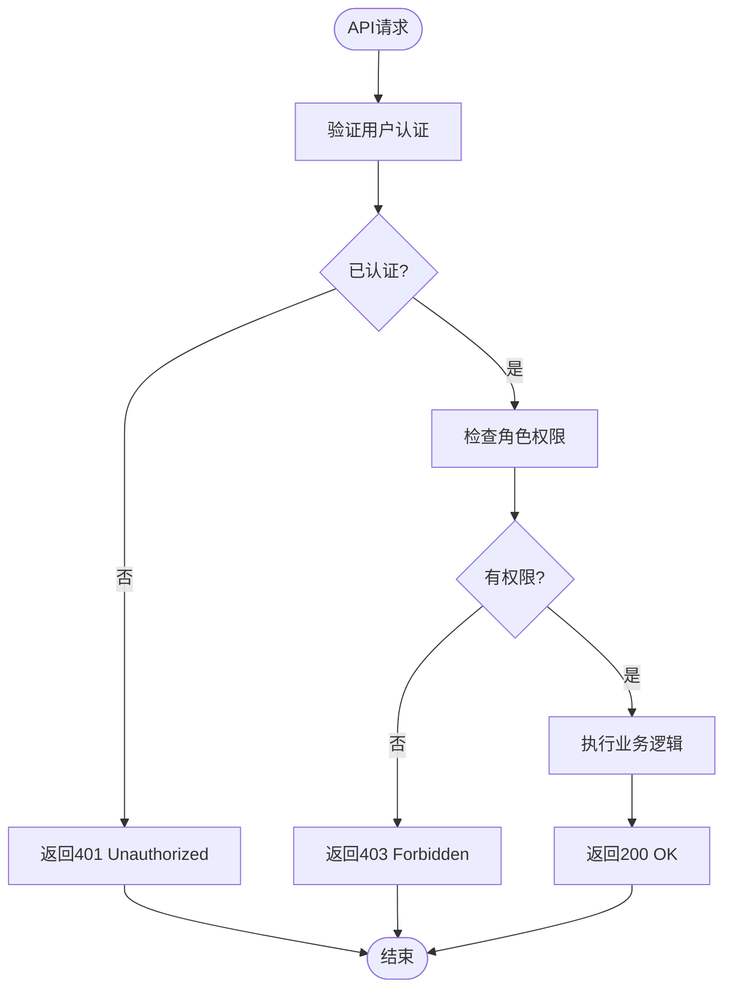
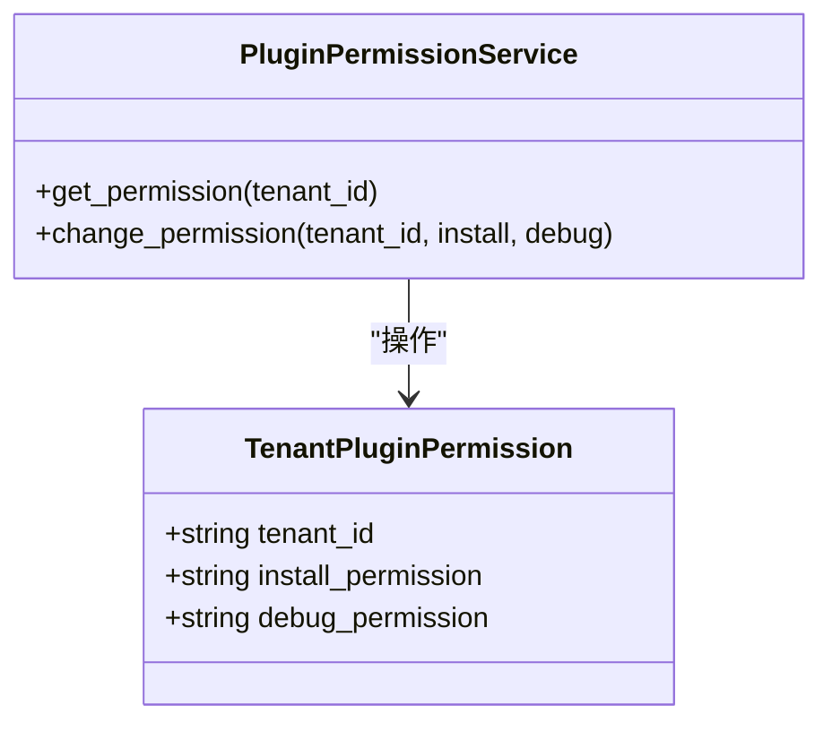
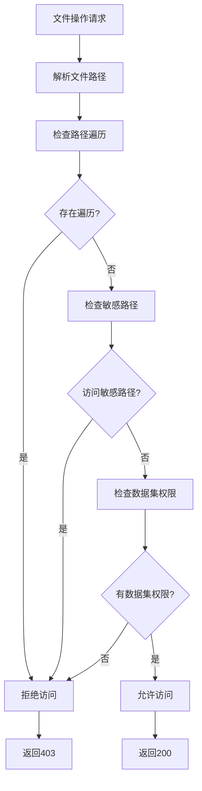
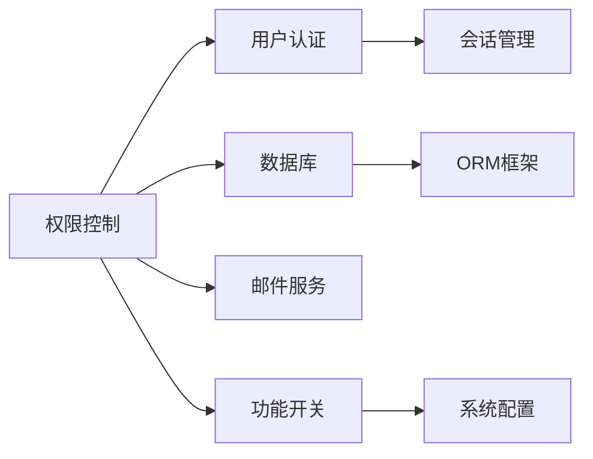

# 权限控制

<cite>
**本文档引用文件**  
- [members.py](file://api/controllers/console/workspace/members.py)
- [workspace.py](file://api/controllers/console/workspace/__init__.py)
- [plugin_permission_service.py](file://api/services/plugin/plugin_permission_service.py)
- [volume_permissions.py](file://api/extensions/storage/clickzetta_volume/volume_permissions.py)
- [app-context.tsx](file://web/context/app-context.tsx)
- [index.tsx](file://web/app/components/header/account-setting/members-page/index.tsx)
- [operation.tsx](file://web/app/components/header/account-setting/members-page/operation/index.tsx)
- [role-selector.tsx](file://web/app/components/header/account-setting/members-page/invite-modal/role-selector.tsx)
- [workflow_app_log.py](file://api/controllers/console/app/workflow_app_log.py)
- [workflow_app_service.py](file://api/services/workflow_app_service.py)
- [account.py](file://api/models/account.py)
- [enums.py](file://api/models/enums.py)
</cite>

## 目录
1. [简介](#简介)
2. [项目结构](#项目结构)
3. [核心组件](#核心组件)
4. [架构概述](#架构概述)
5. [详细组件分析](#详细组件分析)
6. [依赖分析](#依赖分析)
7. [性能考虑](#性能考虑)
8. [故障排除指南](#故障排除指南)
9. [结论](#结论)

## 简介
本文档详细阐述Dify平台在多租户环境下的权限控制机制，重点分析工作区（Workspace）模型的设计与实现。文档涵盖基于角色的访问控制（RBAC）体系、成员管理流程、权限检查逻辑、安全防护措施以及审计日志功能，旨在为开发者和系统管理员提供全面的权限控制理解。

## 项目结构
Dify的权限控制功能主要分布在API后端与Web前端两个部分。后端逻辑集中于`api/controllers/console/workspace`和`api/services`目录，前端交互则位于`web/app/components/header/account-setting/members-page`。核心模型定义在`api/models`中，权限检查装饰器分布在`api/extensions`和`api/controllers/console/wraps.py`。

**Diagram sources**
- [index.tsx](file://web/app/components/header/account-setting/members-page/index.tsx)
- [members.py](file://api/controllers/console/workspace/members.py)
- [workspace.py](file://api/controllers/console/workspace/__init__.py)

**Section sources**
- [members.py](file://api/controllers/console/workspace/members.py)
- [index.tsx](file://web/app/components/header/account-setting/members-page/index.tsx)

## 核心组件
权限控制系统的核心组件包括工作区成员管理API、角色权限模型、权限检查装饰器和前端交互组件。系统通过RBAC模型实现精细化的访问控制，确保不同角色的用户只能执行其被授权的操作。

**Section sources**
- [members.py](file://api/controllers/console/workspace/members.py)
- [account.py](file://api/models/account.py)
- [enums.py](file://api/models/enums.py)

## 架构概述
Dify的权限控制采用分层架构，从前端UI到后端服务再到数据模型，每一层都有相应的权限处理逻辑。前端负责展示角色信息和操作按钮，后端API通过装饰器进行权限验证，服务层执行具体的业务逻辑，数据模型定义了权限相关的实体关系。

**Diagram sources**
- [wraps.py](file://api/controllers/console/wraps.py)
- [members.py](file://api/controllers/console/workspace/members.py)
- [workspace_service.py](file://api/services/workspace_service.py)

## 详细组件分析

### 工作区成员管理分析
工作区成员管理是权限控制的核心功能，支持成员邀请、角色变更和所有者转移等操作。系统通过RESTful API暴露这些功能，并在后端进行严格的权限检查。

#### 成员角色分析

**Diagram sources**
- [account.py](file://api/models/account.py)
- [enums.py](file://api/models/enums.py)

#### 成员邀请流程分析

**Diagram sources**
- [members.py](file://api/controllers/console/workspace/members.py)
- [index.tsx](file://web/app/components/header/account-setting/members-page/index.tsx)
- [role-selector.tsx](file://web/app/components/header/account-setting/members-page/invite-modal/role-selector.tsx)

#### 权限检查机制分析

**Diagram sources**
- [wraps.py](file://api/controllers/console/wraps.py)
- [workspace.py](file://api/controllers/console/workspace/__init__.py)

**Section sources**
- [members.py](file://api/controllers/console/workspace/members.py)
- [wraps.py](file://api/controllers/console/wraps.py)

### 插件权限服务分析
插件权限服务管理租户级别的插件安装和调试权限，为系统提供额外的安全控制层。

**Diagram sources**
- [plugin_permission_service.py](file://api/services/plugin/plugin_permission_service.py)
- [account.py](file://api/models/account.py)

**Section sources**
- [plugin_permission_service.py](file://api/services/plugin/plugin_permission_service.py)

### 数据卷权限分析
数据卷权限系统提供细粒度的文件访问控制，防止路径遍历等安全攻击。

**Diagram sources**
- [volume_permissions.py](file://api/extensions/storage/clickzetta_volume/volume_permissions.py)

**Section sources**
- [volume_permissions.py](file://api/extensions/storage/clickzetta_volume/volume_permissions.py)

## 依赖分析
权限控制系统依赖于多个核心模块，包括用户认证、数据库访问和邮件服务。这些依赖关系确保了权限功能的完整性和可靠性。

**Diagram sources**
- [members.py](file://api/controllers/console/workspace/members.py)
- [plugin_permission_service.py](file://api/services/plugin/plugin_permission_service.py)
- [wraps.py](file://api/controllers/console/wraps.py)

**Section sources**
- [members.py](file://api/controllers/console/workspace/members.py)
- [plugin_permission_service.py](file://api/services/plugin/plugin_permission_service.py)

## 性能考虑
权限检查作为高频操作，系统通过缓存和批量查询优化性能。角色信息在用户登录时加载并缓存，减少数据库查询次数。API端点设计遵循REST原则，支持分页和过滤，避免一次性返回大量数据。

## 故障排除指南
当遇到权限相关问题时，可按以下步骤排查：
1. 确认用户角色是否正确
2. 检查功能开关是否启用
3. 验证API端点权限装饰器配置
4. 查看服务器日志中的权限拒绝记录
5. 确认数据库中权限记录的完整性

**Section sources**
- [errors.py](file://api/services/errors/workspace.py)
- [wraps.py](file://api/controllers/console/wraps.py)

## 结论
Dify的权限控制系统通过RBAC模型实现了灵活而安全的访问控制。系统设计考虑了多租户环境的复杂性，提供了从工作区管理到数据访问的全方位保护。通过前后端协同工作，系统既保证了安全性，又提供了良好的用户体验。