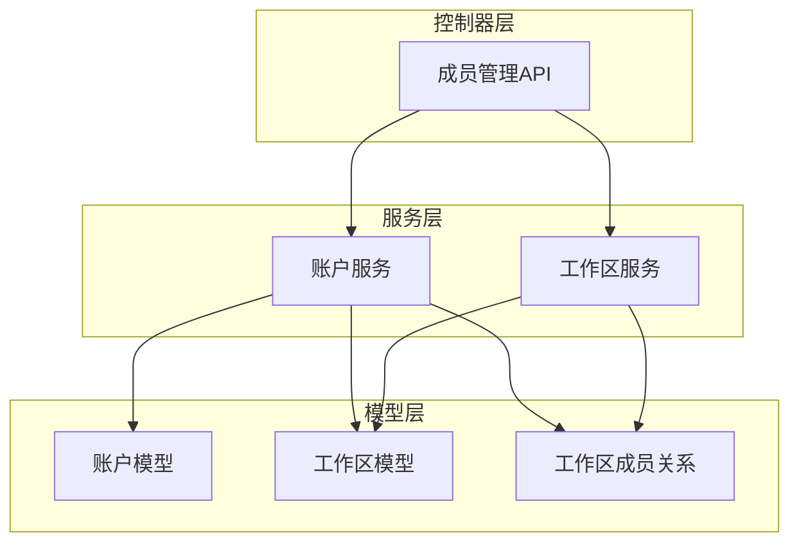
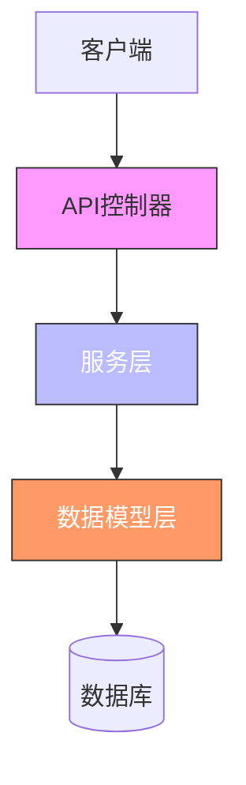
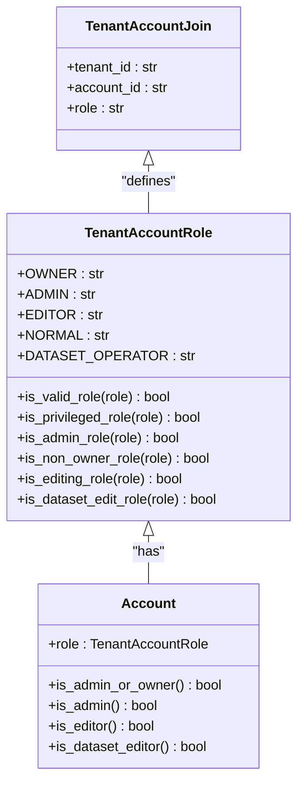
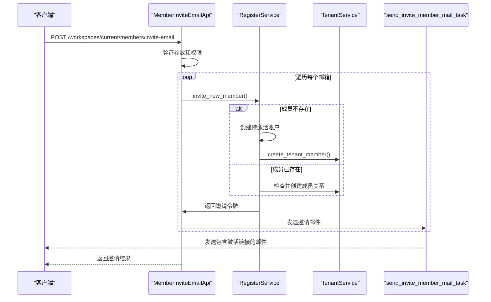
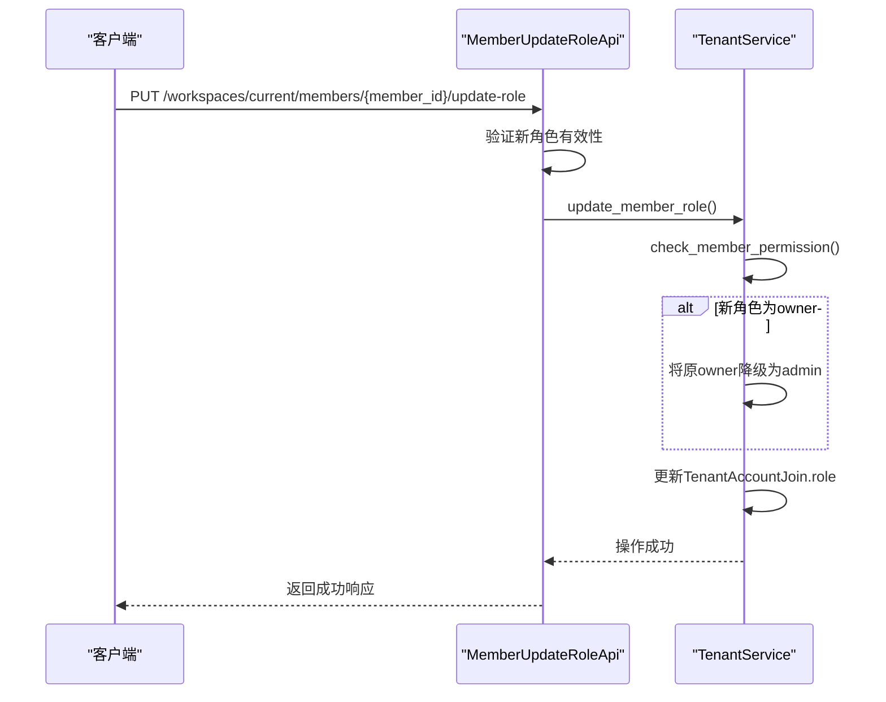
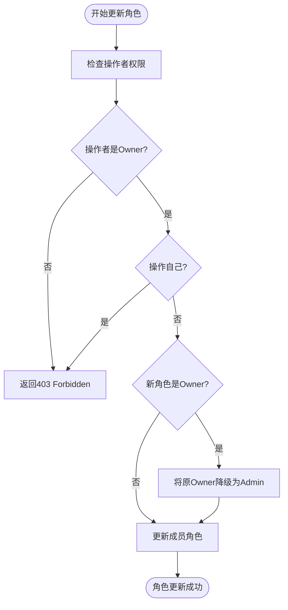
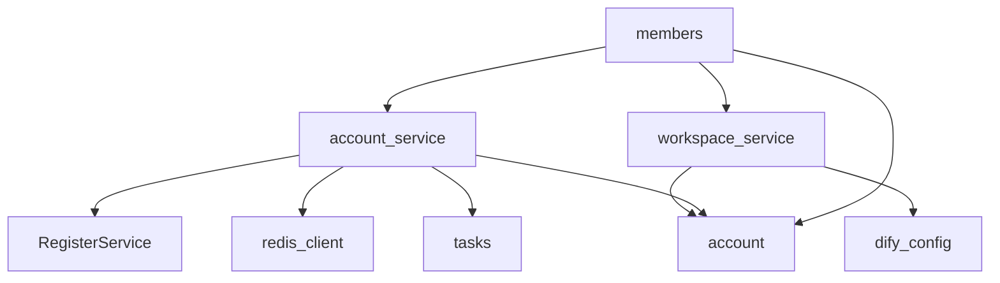

# 角色管理

<cite>
**本文档引用的文件**
- [members.py](file://api/controllers/console/workspace/members.py)
- [account.py](file://api/models/account.py)
- [workspace_service.py](file://api/services/workspace_service.py)
- [account_service.py](file://api/services/account_service.py)
</cite>

## 目录
1. [简介](#简介)
2. [项目结构](#项目结构)
3. [核心组件](#核心组件)
4. [架构概述](#架构概述)
5. [详细组件分析](#详细组件分析)
6. [依赖分析](#依赖分析)
7. [性能考虑](#性能考虑)
8. [故障排除指南](#故障排除指南)
9. [结论](#结论)
10. [附录](#附录)（如有必要）

## 简介
本文档详细阐述了Dify平台中工作区角色管理系统的实现机制。重点分析了Owner、Admin和Normal Member三种核心角色的权限边界与职责划分，深入解析了角色分配的API接口实现逻辑，包括邀请链接生成、角色变更和成员移除等关键业务流程。同时，文档还探讨了角色权限的继承机制、多工作区场景下的管理策略，并提供了防止角色提升漏洞的安全措施和最佳实践，旨在为开发者和系统管理员提供全面的技术参考。

## 项目结构
Dify的角色管理系统主要由控制器（Controller）、模型（Model）和服务（Service）三层构成，遵循典型的MVC架构模式。核心逻辑分布在`api/controllers/console/workspace`、`api/models`和`api/services`三个目录下。`members.py`文件定义了所有与成员管理相关的API端点，`account.py`文件定义了用户、工作区及成员关系的数据模型，而`account_service.py`和`workspace_service.py`则封装了具体的业务逻辑。

**图示来源**
- [members.py](file://api/controllers/console/workspace/members.py#L1-L313)
- [account_service.py](file://api/services/account_service.py#L1-L1385)
- [workspace_service.py](file://api/services/workspace_service.py#L1-L50)
- [account.py](file://api/models/account.py#L1-L339)

**本节来源**
- [members.py](file://api/controllers/console/workspace/members.py#L1-L313)
- [account_service.py](file://api/services/account_service.py#L1-L1385)
- [workspace_service.py](file://api/services/workspace_service.py#L1-L50)
- [account.py](file://api/models/account.py#L1-L339)

## 核心组件
角色管理的核心组件包括`TenantAccountRole`枚举类、`TenantAccountJoin`关系模型以及`TenantService`服务类。`TenantAccountRole`明确定义了系统中的所有角色及其权限等级，`TenantAccountJoin`模型通过`tenant_id`和`account_id`的组合唯一键，实现了用户与工作区的多对多关系，并通过`role`字段存储具体的成员角色。`TenantService`类则提供了创建成员、更新角色、移除成员等核心业务方法，是权限控制逻辑的执行中心。

**本节来源**
- [account.py](file://api/models/account.py#L1-L339)
- [account_service.py](file://api/services/account_service.py#L1-L1385)

## 架构概述
Dify的角色管理架构采用分层设计，确保了高内聚和低耦合。API控制器接收HTTP请求，进行初步的参数验证和权限检查（如`@login_required`装饰器），然后将请求委派给服务层。服务层（`TenantService`）包含完整的业务逻辑，负责与数据库交互，执行具体的增删改查操作，并处理复杂的权限校验。数据模型层（`TenantAccountJoin`）则负责数据的持久化和关系映射。这种分层架构使得系统易于维护和扩展。

**图示来源**
- [members.py](file://api/controllers/console/workspace/members.py#L1-L313)
- [account_service.py](file://api/services/account_service.py#L1-L1385)
- [account.py](file://api/models/account.py#L1-L339)

## 详细组件分析
本节将深入分析角色管理的关键组件，包括角色定义、权限校验、API接口实现和安全机制。

### 角色定义与权限边界
Dify定义了五种工作区角色：`OWNER`、`ADMIN`、`EDITOR`、`NORMAL`和`DATASET_OPERATOR`。其中，`OWNER`和`ADMIN`被视为特权角色（privileged roles），拥有最高级别的管理权限。

#### 角色权限分析

**图示来源**
- [account.py](file://api/models/account.py#L1-L339)

**本节来源**
- [account.py](file://api/models/account.py#L1-L339)

### API接口实现
角色管理的API接口主要通过`members.py`中的Flask-RESTx资源类实现，每个类对应一个或多个HTTP端点。

#### 成员邀请与角色变更流程

**图示来源**
- [members.py](file://api/controllers/console/workspace/members.py#L1-L313)
- [account_service.py](file://api/services/account_service.py#L1-L1385)

#### 成员角色更新流程

**图示来源**
- [members.py](file://api/controllers/console/workspace/members.py#L1-L313)
- [account_service.py](file://api/services/account_service.py#L1-L1385)

**本节来源**
- [members.py](file://api/controllers/console/workspace/members.py#L1-L313)
- [account_service.py](file://api/services/account_service.py#L1-L1385)

### 安全机制与最佳实践
为防止权限提升等安全漏洞，系统实施了严格的校验和防护措施。

#### 防止角色提升漏洞

**图示来源**
- [account_service.py](file://api/services/account_service.py#L1-L1385)

**本节来源**
- [account_service.py](file://api/services/account_service.py#L1-L1385)

## 依赖分析
角色管理系统依赖于多个核心模块。`members.py`控制器依赖`account_service.py`和`workspace_service.py`来执行业务逻辑，同时依赖`account.py`中的数据模型进行数据库操作。`account_service.py`服务类是核心，它直接操作`TenantAccountJoin`等数据库模型，并调用`RegisterService`来处理新成员的注册流程。此外，系统还依赖`redis_client`进行令牌管理和速率限制，依赖`tasks`模块的异步任务（如`send_invite_member_mail_task`）来发送邮件通知，确保了主流程的高效性。

**图示来源**
- [members.py](file://api/controllers/console/workspace/members.py#L1-L313)
- [account_service.py](file://api/services/account_service.py#L1-L1385)
- [workspace_service.py](file://api/services/workspace_service.py#L1-L50)

**本节来源**
- [members.py](file://api/controllers/console/workspace/members.py#L1-L313)
- [account_service.py](file://api/services/account_service.py#L1-L1385)
- [workspace_service.py](file://api/services/workspace_service.py#L1-L50)

## 性能考虑
在性能方面，系统通过多种方式进行了优化。首先，使用Redis缓存频繁访问的数据，如刷新令牌（`refresh_token`）和邀请令牌（`member_invite:token`），减少了数据库查询次数。其次，关键的权限检查操作（如`is_login_error_rate_limit`）也通过Redis实现，利用其原子操作特性保证了高并发下的正确性。此外，邮件发送等耗时操作被设计为异步任务，通过Celery队列处理，避免阻塞API响应，提升了用户体验。

## 故障排除指南
在使用角色管理功能时，可能会遇到以下常见问题：

*   **邀请链接无效或过期**：检查`dify_config.INVITE_EXPIRY_HOURS`配置项，确保邀请链接在有效期内使用。过期的链接需要重新生成。
*   **无法将成员角色更改为Owner**：确保当前操作者是工作区的Owner，并且不能将自己设置为新Owner。系统会自动将原Owner降级。
*   **邮件发送失败**：检查邮件服务配置和网络连接。系统内置了IP发送频率限制（`is_email_send_ip_limit`），如果短时间内发送过多邮件，可能会被暂时限制。
*   **成员无法加入工作区**：确认邀请链接中的`workspace_id`和`email`与生成时一致，并且该成员尚未加入该工作区。

**本节来源**
- [account_service.py](file://api/services/account_service.py#L1-L1385)
- [members.py](file://api/controllers/console/workspace/members.py#L1-L313)

## 结论
Dify的角色管理系统设计严谨，通过清晰的角色划分、分层的架构设计和严格的安全校验，有效地管理了工作区内的成员权限。系统不仅实现了基本的成员增删改查功能，还通过异步任务和Redis缓存优化了性能，并通过多层防护机制保障了系统的安全性。理解其内部实现对于进行二次开发或故障排查至关重要。