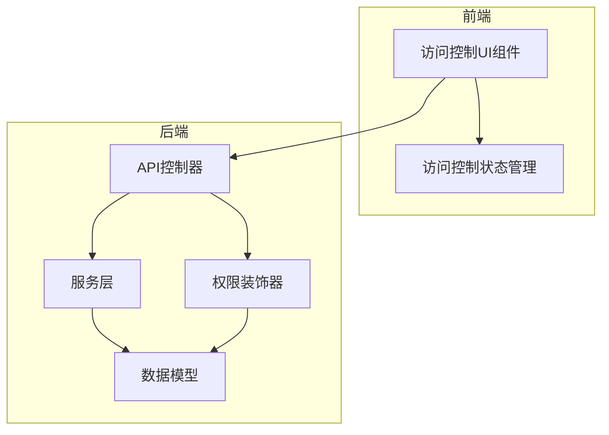
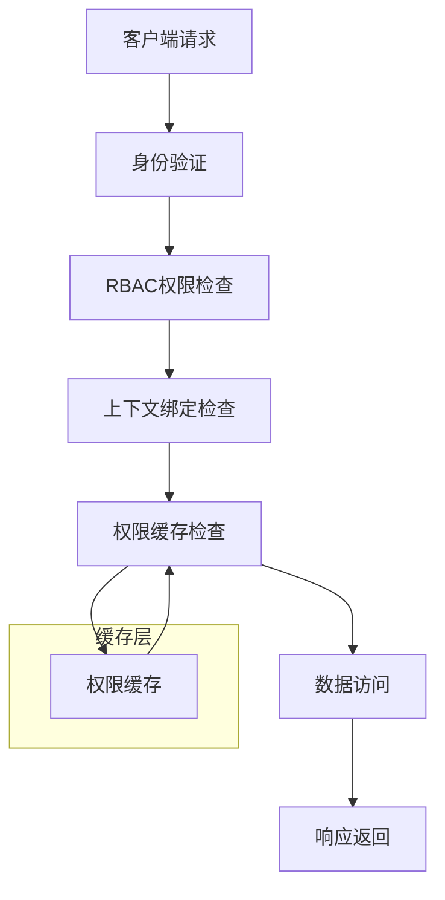
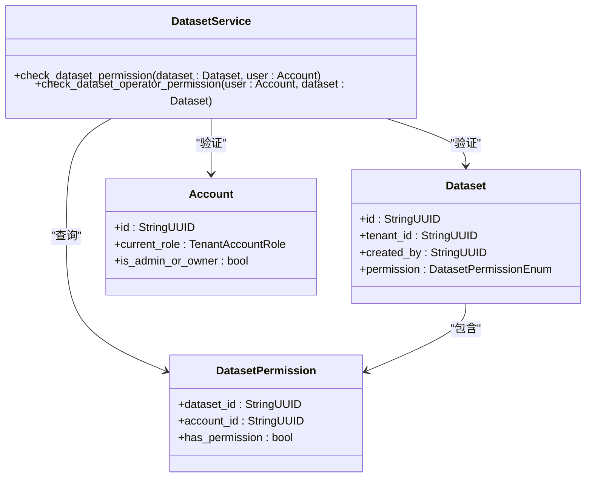
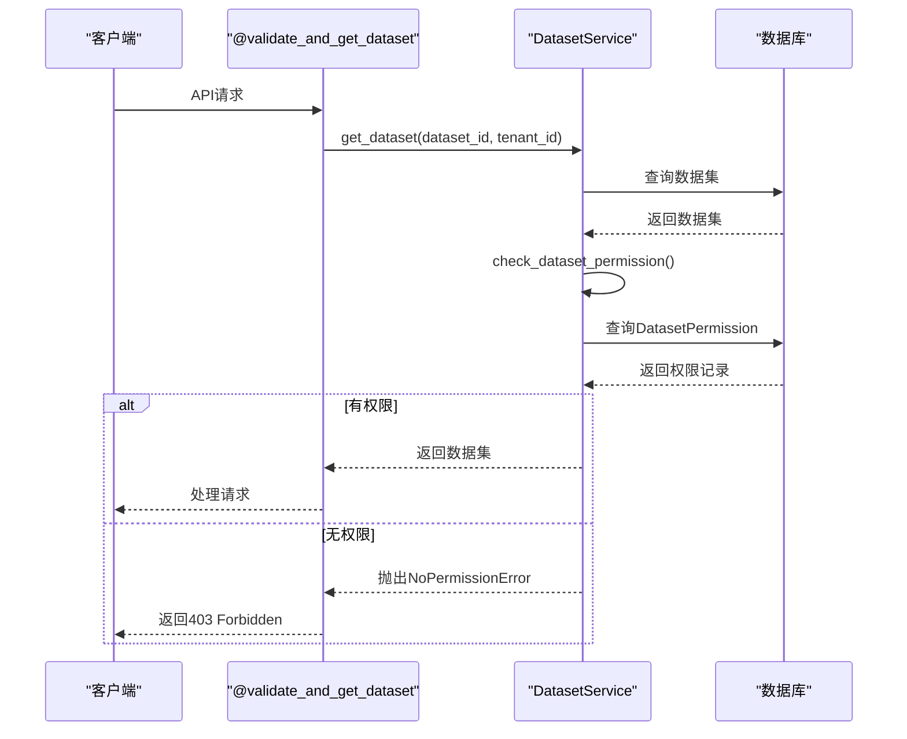
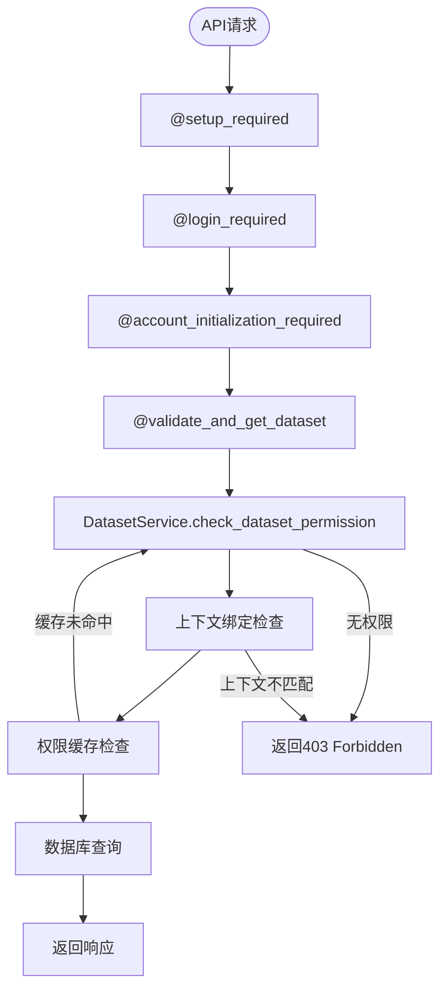
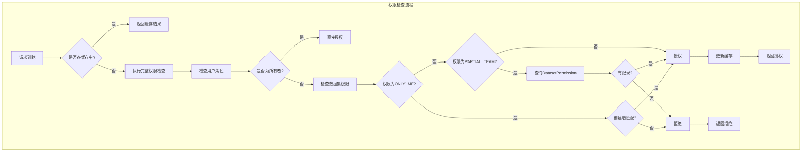
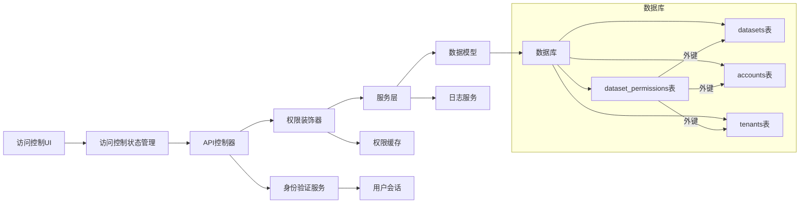

# 访问控制

<cite>
**本文档中引用的文件**  
- [dataset.py](file://api/models/dataset.py)
- [dataset_service.py](file://api/services/dataset_service.py)
- [datasets.py](file://api/controllers/console/datasets/datasets.py)
- [wraps.py](file://api/controllers/service_api/wraps.py)
- [volume_permissions.py](file://api/extensions/storage/clickzetta_volume/volume_permissions.py)
- [access-control-store.ts](file://web/context/access-control-store.ts)
- [app-access-control/index.tsx](file://web/app/components/app/app-access-control/index.tsx)
- [specific-groups-or-members.tsx](file://web/app/components/app/app-access-control/specific-groups-or-members.tsx)
- [7e6a8693e07a_add_table_dataset_permissions.py](file://api/migrations/versions/7e6a8693e07a_add_table_dataset_permissions.py)
</cite>

## 目录
1. [引言](#引言)
2. [项目结构](#项目结构)
3. [核心组件](#核心组件)
4. [架构概述](#架构概述)
5. [详细组件分析](#详细组件分析)
6. [依赖分析](#依赖分析)
7. [性能考虑](#性能考虑)
8. [故障排除指南](#故障排除指南)
9. [结论](#结论)

## 引言
Dify平台实现了基于角色的访问控制（RBAC）机制，用于保护工作区资源、应用配置和数据集。本文档详细说明了其权限检查机制，重点分析`@validate_and_get_dataset`装饰器的实现原理、API端点保护策略以及防止越权访问的技术方案。

## 项目结构
Dify的访问控制功能分布在多个模块中，主要包括后端API控制器、服务层、模型定义和前端组件。核心权限逻辑位于`api/controllers`和`api/services`目录下，而前端交互逻辑则在`web/app/components/app/app-access-control`中实现。

**Diagram sources**
- [access-control-store.ts](file://web/context/access-control-store.ts)
- [app-access-control/index.tsx](file://web/app/components/app/app-access-control/index.tsx)
- [datasets.py](file://api/controllers/console/datasets/datasets.py)
- [dataset_service.py](file://api/services/dataset_service.py)
- [dataset.py](file://api/models/dataset.py)

**Section sources**
- [access-control-store.ts](file://web/context/access-control-store.ts)
- [app-access-control/index.tsx](file://web/app/components/app/app-access-control/index.tsx)
- [datasets.py](file://api/controllers/console/datasets/datasets.py)

## 核心组件
Dify的访问控制核心组件包括基于RBAC的权限检查机制、装饰器`@validate_and_get_dataset`、API端点保护策略以及上下文绑定检查和权限缓存机制。

**Section sources**
- [dataset_service.py](file://api/services/dataset_service.py)
- [wraps.py](file://api/controllers/service_api/wraps.py)
- [volume_permissions.py](file://api/extensions/storage/clickzetta_volume/volume_permissions.py)

## 架构概述
Dify的访问控制架构采用分层设计，从前端UI到后端服务形成完整的权限验证链。系统通过装饰器模式实现权限检查，确保每个API调用都经过严格的权限验证。

**Diagram sources**
- [dataset_service.py](file://api/services/dataset_service.py)
- [wraps.py](file://api/controllers/service_api/wraps.py)
- [volume_permissions.py](file://api/extensions/storage/clickzetta_volume/volume_permissions.py)

## 详细组件分析

### RBAC权限检查机制分析
Dify实现了基于角色的访问控制（RBAC）机制，通过`DatasetService.check_dataset_permission`方法验证用户对特定资源的访问权限。

**Diagram sources**
- [dataset_service.py](file://api/services/dataset_service.py#L682-L708)
- [dataset.py](file://api/models/dataset.py)

**Section sources**
- [dataset_service.py](file://api/services/dataset_service.py#L682-L708)
- [dataset.py](file://api/models/dataset.py)

### @validate_and_get_dataset装饰器实现原理
`@validate_and_get_dataset`装饰器用于验证和获取数据集，确保用户只能访问其有权限的数据集。

**Diagram sources**
- [wraps.py](file://api/controllers/service_api/wraps.py#L291-L310)
- [dataset_service.py](file://api/services/dataset_service.py)

**Section sources**
- [wraps.py](file://api/controllers/service_api/wraps.py#L291-L310)

### API端点保护策略
Dify通过装饰器链保护API端点，确保工作区资源、应用配置和数据集的安全访问。

**Diagram sources**
- [datasets.py](file://api/controllers/console/datasets/datasets.py#L341-L380)
- [wraps.py](file://api/controllers/service_api/wraps.py)

**Section sources**
- [datasets.py](file://api/controllers/console/datasets/datasets.py#L341-L380)

### 防止越权访问技术方案
Dify采用多种技术方案防止越权访问，包括上下文绑定检查和权限缓存机制。

**Diagram sources**
- [dataset_service.py](file://api/services/dataset_service.py#L682-L708)
- [volume_permissions.py](file://api/extensions/storage/clickzetta_volume/volume_permissions.py)

**Section sources**
- [dataset_service.py](file://api/services/dataset_service.py#L682-L708)

## 依赖分析
Dify的访问控制功能依赖于多个核心组件和外部服务，形成复杂的依赖关系网络。

**Diagram sources**
- [dataset.py](file://api/models/dataset.py)
- [7e6a8693e07a_add_table_dataset_permissions.py](file://api/migrations/versions/7e6a8693e07a_add_table_dataset_permissions.py)
- [access-control-store.ts](file://web/context/access-control-store.ts)

**Section sources**
- [dataset.py](file://api/models/dataset.py)
- [7e6a8693e07a_add_table_dataset_permissions.py](file://api/migrations/versions/7e6a8693e07a_add_table_dataset_permissions.py)

## 性能考虑
Dify的访问控制机制在设计时考虑了性能优化，通过权限缓存和索引优化减少数据库查询开销。

**Section sources**
- [dataset.py](file://api/models/dataset.py)
- [dataset_service.py](file://api/services/dataset_service.py)

## 故障排除指南
当遇到访问控制相关问题时，可以按照以下步骤进行排查：

1. 检查用户角色和权限设置
2. 验证数据集的访问模式配置
3. 检查API请求的认证信息
4. 查看服务日志中的权限拒绝记录
5. 确认数据库中`dataset_permissions`表的记录

**Section sources**
- [dataset_service.py](file://api/services/dataset_service.py)
- [wraps.py](file://api/controllers/service_api/wraps.py)

## 结论
Dify的访问控制机制通过RBAC模型、装饰器模式和缓存策略，实现了对工作区资源、应用配置和数据集的全面保护。系统采用分层验证方式，确保每个API调用都经过严格的身份验证和权限检查，有效防止了越权访问风险。