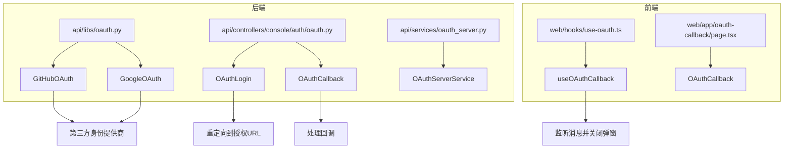
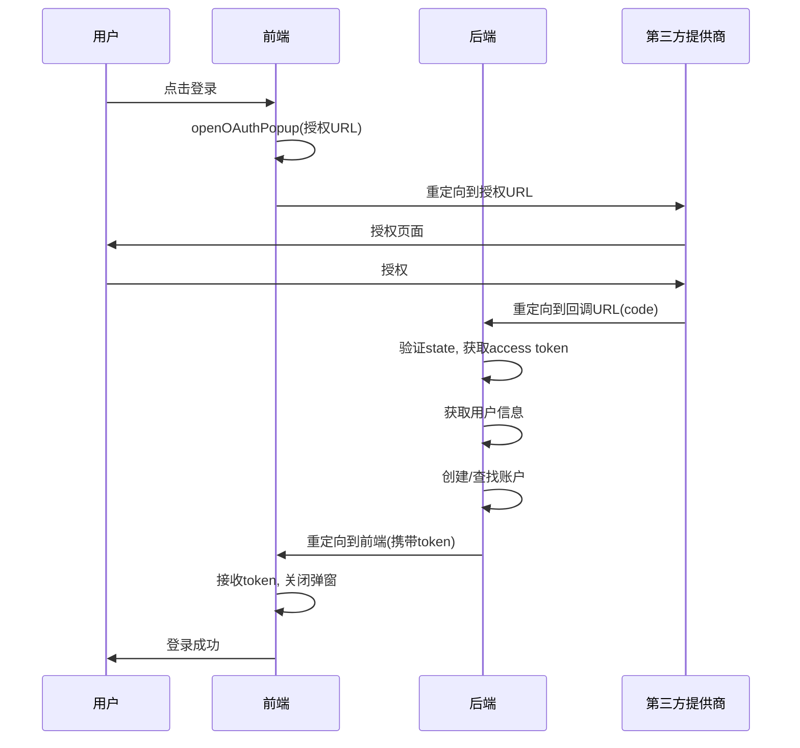
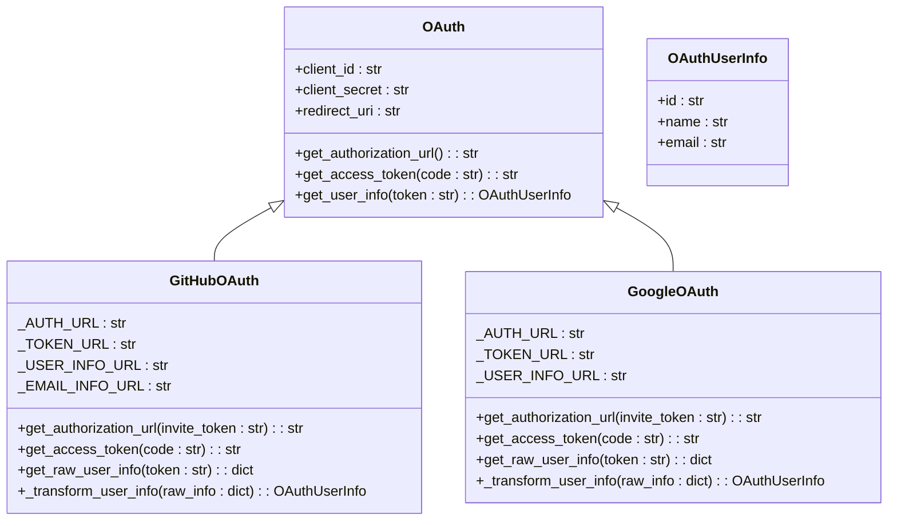
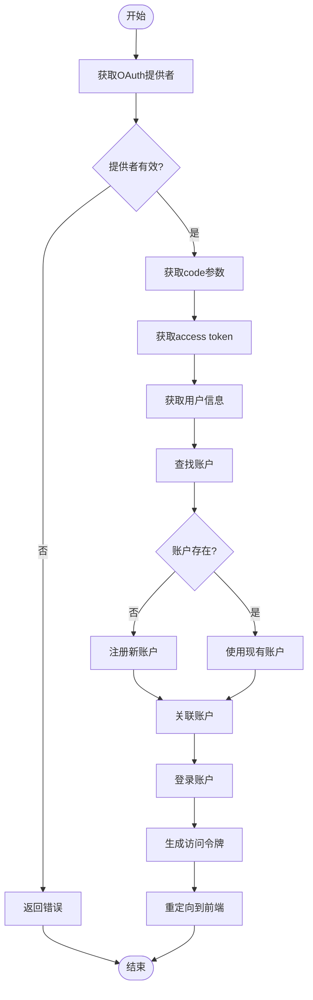
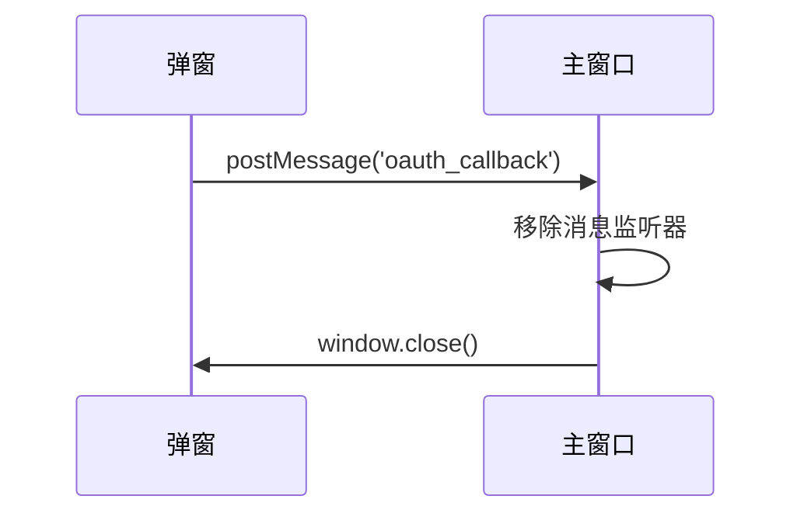
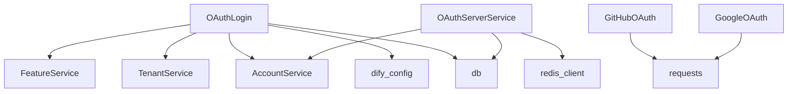

# OAuth集成

<cite>
**本文档中引用的文件**  
- [oauth.py](file://api/libs/oauth.py)
- [oauth.py](file://api/controllers/console/auth/oauth.py)
- [oauth_server.py](file://api/controllers/console/auth/oauth_server.py)
- [oauth_server.py](file://api/services/oauth_server.py)
- [use-oauth.ts](file://web/hooks/use-oauth.ts)
- [page.tsx](file://web/app/oauth-callback/page.tsx)
- [oauth_data_source.py](file://api/libs/oauth_data_source.py)
</cite>

## 目录
1. [简介](#简介)
2. [项目结构](#项目结构)
3. [核心组件](#核心组件)
4. [架构概述](#架构概述)
5. [详细组件分析](#详细组件分析)
6. [依赖分析](#依赖分析)
7. [性能考虑](#性能考虑)
8. [故障排除指南](#故障排除指南)
9. [结论](#结论)

## 简介
Dify系统实现了OAuth 2.0协议，支持通过第三方身份提供商（如GitHub和Google）进行用户身份验证。该集成允许用户使用其现有的社交账户登录系统，简化注册和登录流程。系统采用授权码流程，确保安全的身份验证过程，并通过state参数和CSRF防护机制防止跨站请求伪造攻击。此外，系统还支持OAuth服务器功能，允许外部应用通过OAuth协议访问Dify的资源。

## 项目结构
Dify的OAuth集成分布在多个模块中，主要包括后端服务、控制器、库函数以及前端组件。后端逻辑主要位于`api`目录下的`libs`和`controllers/console/auth`子目录中，而前端部分则位于`web`目录下的`hooks`和`app/oauth-callback`路径中。

**Diagram sources**
- [oauth.py](file://api/libs/oauth.py)
- [oauth.py](file://api/controllers/console/auth/oauth.py)
- [use-oauth.ts](file://web/hooks/use-oauth.ts)
- [page.tsx](file://web/app/oauth-callback/page.tsx)

**Section sources**
- [oauth.py](file://api/libs/oauth.py)
- [oauth.py](file://api/controllers/console/auth/oauth.py)
- [use-oauth.ts](file://web/hooks/use-oauth.ts)
- [page.tsx](file://web/app/oauth-callback/page.tsx)

## 核心组件
Dify的OAuth集成包含几个关键组件：`OAuth`抽象基类、具体的`GitHubOAuth`和`GoogleOAuth`实现、用于处理登录和回调的控制器、以及前端的钩子函数。这些组件共同协作，完成从用户发起登录请求到最终认证成功的整个流程。

**Section sources**
- [oauth.py](file://api/libs/oauth.py#L1-L133)
- [oauth.py](file://api/controllers/console/auth/oauth.py#L1-L187)

## 架构概述
Dify的OAuth架构采用分层设计，前端通过弹窗发起OAuth请求，后端控制器处理授权流程，库函数封装具体的OAuth协议实现，服务层负责令牌管理和验证。整个流程遵循OAuth 2.0授权码模式，确保安全性。

**Diagram sources**
- [oauth.py](file://api/libs/oauth.py#L1-L133)
- [oauth.py](file://api/controllers/console/auth/oauth.py#L1-L187)
- [use-oauth.ts](file://web/hooks/use-oauth.ts#L1-L36)
- [page.tsx](file://web/app/oauth-callback/page.tsx#L1-L11)

## 详细组件分析

### OAuth库实现
Dify的OAuth库提供了抽象的`OAuth`类和具体的`GitHubOAuth`、`GoogleOAuth`实现。这些类封装了获取授权URL、访问令牌和用户信息的逻辑。

#### 类图

**Diagram sources**
- [oauth.py](file://api/libs/oauth.py#L1-L133)

**Section sources**
- [oauth.py](file://api/libs/oauth.py#L1-L133)

### 控制器实现
控制器负责处理OAuth登录和回调请求。`OAuthLogin`类生成授权URL并重定向用户，`OAuthCallback`类处理回调，验证令牌并创建或查找用户账户。

#### 流程图

**Diagram sources**
- [oauth.py](file://api/controllers/console/auth/oauth.py#L1-L187)

**Section sources**
- [oauth.py](file://api/controllers/console/auth/oauth.py#L1-L187)

### 前端实现
前端使用React钩子`useOAuthCallback`来处理OAuth回调。当用户在弹窗中完成授权后，该钩子会向主窗口发送消息并关闭弹窗。

#### 序列图

**Diagram sources**
- [use-oauth.ts](file://web/hooks/use-oauth.ts#L1-L36)
- [page.tsx](file://web/app/oauth-callback/page.tsx#L1-L11)

**Section sources**
- [use-oauth.ts](file://web/hooks/use-oauth.ts#L1-L36)
- [page.tsx](file://web/app/oauth-callback/page.tsx#L1-L11)

## 依赖分析
Dify的OAuth集成依赖于多个内部和外部组件。内部依赖包括配置管理、数据库访问、账户服务等，外部依赖主要是第三方身份提供商的API。

**Diagram sources**
- [oauth.py](file://api/controllers/console/auth/oauth.py#L1-L187)
- [oauth.py](file://api/libs/oauth.py#L1-L133)
- [oauth_server.py](file://api/services/oauth_server.py#L1-L94)

**Section sources**
- [oauth.py](file://api/controllers/console/auth/oauth.py#L1-L187)
- [oauth.py](file://api/libs/oauth.py#L1-L133)
- [oauth_server.py](file://api/services/oauth_server.py#L1-L94)

## 性能考虑
Dify的OAuth集成在性能方面做了以下优化：使用Redis缓存OAuth令牌，减少数据库查询；采用异步HTTP请求获取用户信息；通过连接池管理数据库连接。此外，系统还实现了令牌过期机制，确保安全性的同时避免频繁的授权流程。

## 故障排除指南
在使用Dify的OAuth集成时，可能会遇到以下常见问题：

1. **授权失败**：检查客户端ID和密钥是否正确，重定向URL是否匹配。
2. **回调无法处理**：确保后端服务正常运行，网络连接正常。
3. **用户信息获取失败**：检查第三方提供商的API是否可用，访问令牌是否有效。
4. **账户创建失败**：检查系统是否允许注册，工作区创建权限是否开启。

**Section sources**
- [oauth.py](file://api/controllers/console/auth/oauth.py#L1-L187)
- [oauth.py](file://api/libs/oauth.py#L1-L133)

## 结论
Dify的OAuth集成提供了一套完整、安全的身份验证解决方案。通过抽象工厂模式支持多种身份提供商，采用标准的OAuth 2.0协议确保安全性，并通过前后端协同工作提供流畅的用户体验。该集成易于扩展，可以方便地添加新的身份提供商，满足不同用户的需求。