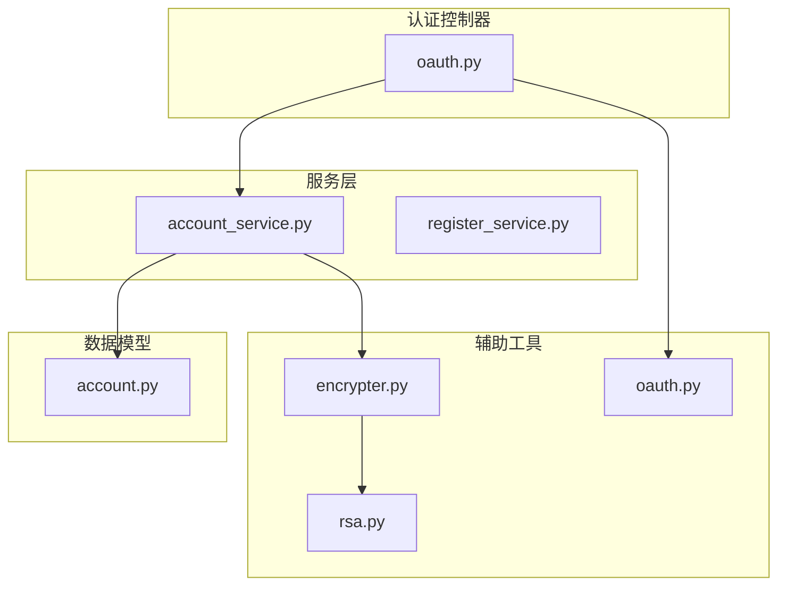
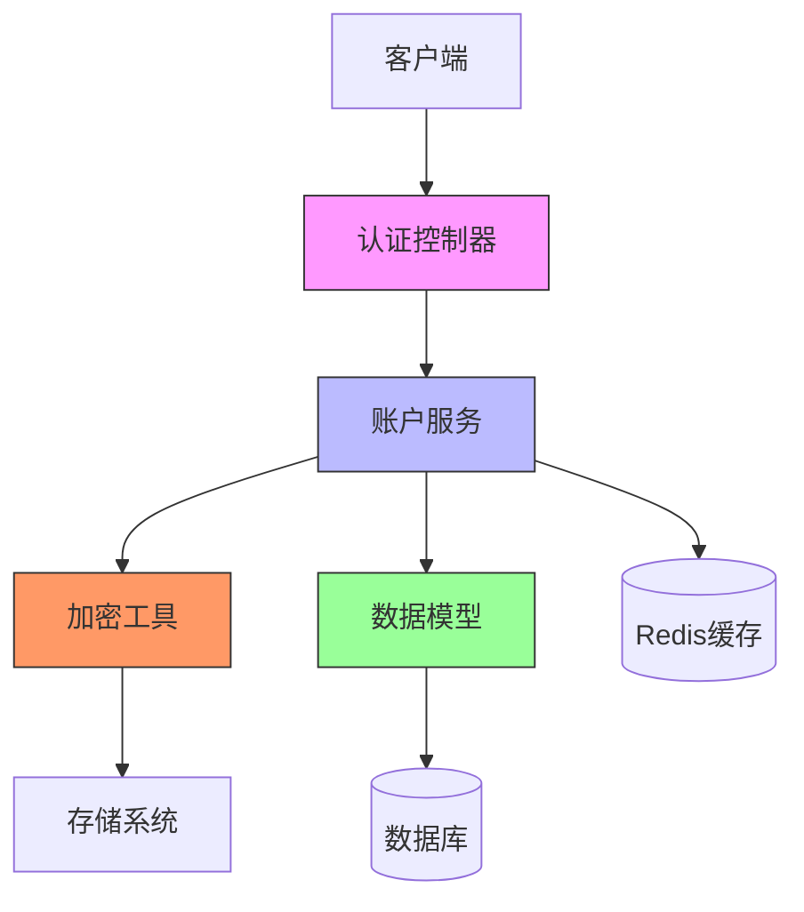
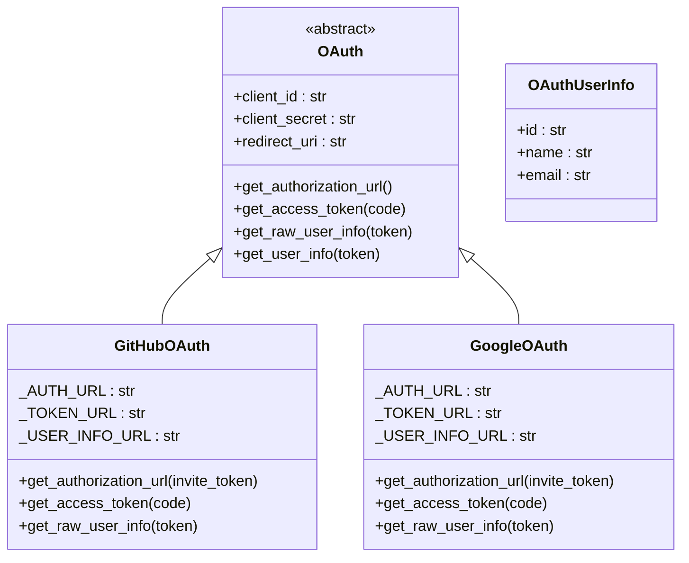
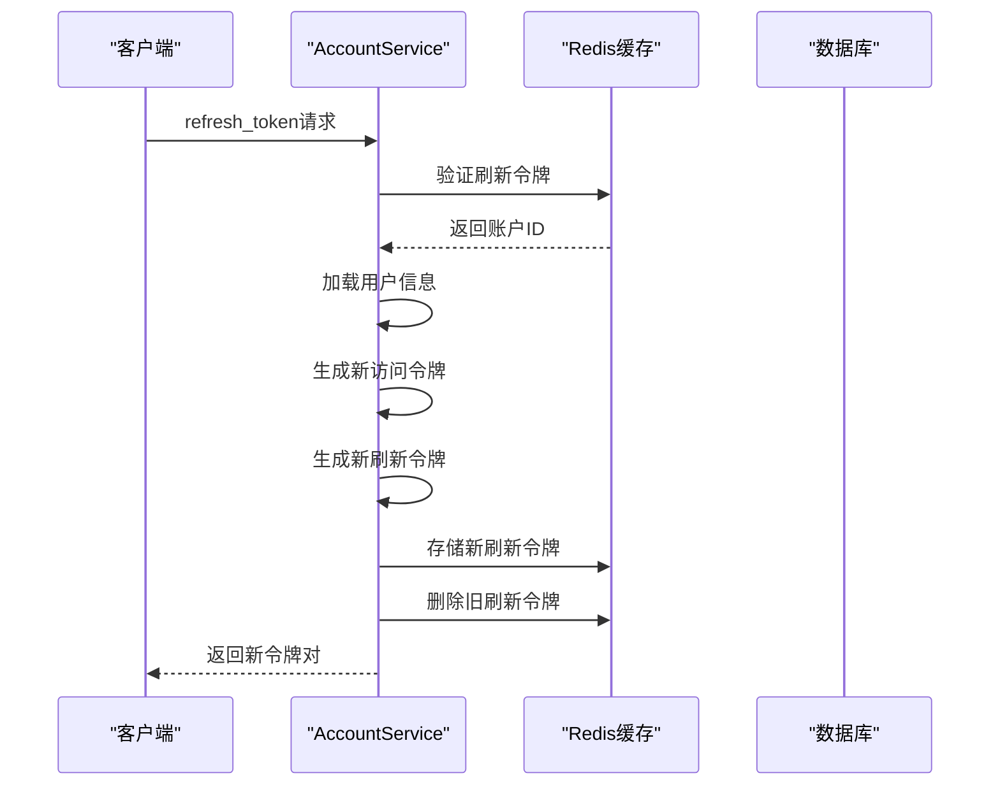
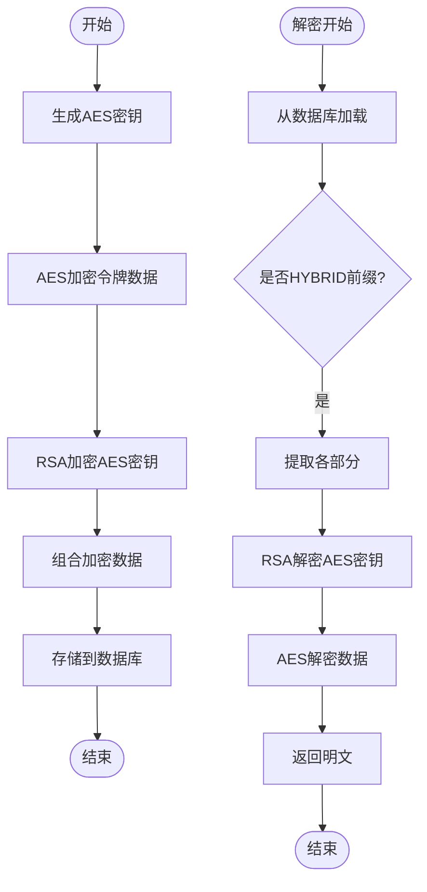
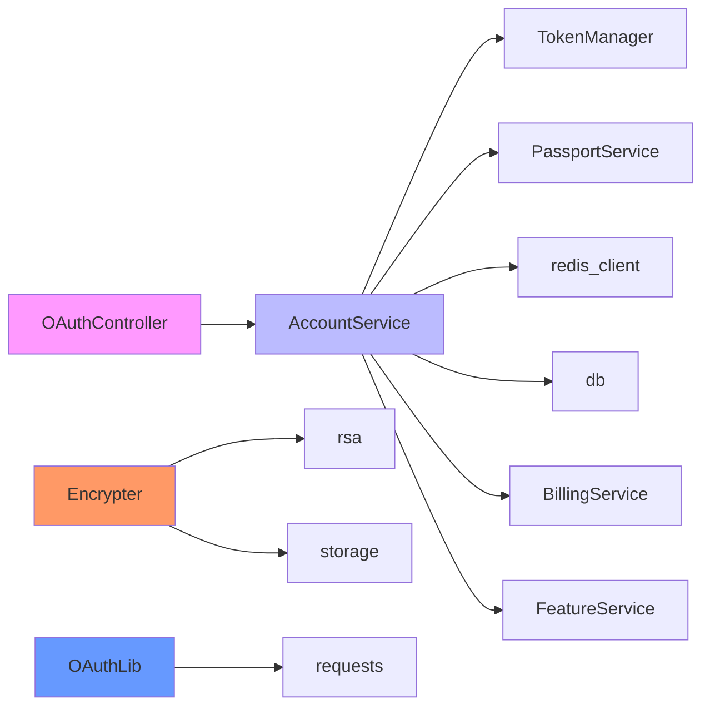

# 令牌管理

<cite>
**本文档中引用的文件**  
- [oauth.py](file://api/libs/oauth.py)
- [encrypter.py](file://api/core/helper/encrypter.py)
- [account.py](file://api/models/account.py)
- [account_service.py](file://api/services/account_service.py)
- [rsa.py](file://api/libs/rsa.py)
- [oauth.py](file://api/controllers/console/auth/oauth.py)
</cite>

## 目录
1. [引言](#引言)
2. [项目结构](#项目结构)
3. [核心组件](#核心组件)
4. [架构概述](#架构概述)
5. [详细组件分析](#详细组件分析)
6. [依赖分析](#依赖分析)
7. [性能考虑](#性能考虑)
8. [故障排除指南](#故障排除指南)
9. [结论](#结论)

## 引言
Dify平台实现了完整的第三方认证令牌管理机制，支持GitHub和Google等OAuth提供商的集成。系统通过安全的加密存储、自动刷新机制和会话管理，确保用户身份验证的安全性和可靠性。本文档详细描述了访问令牌和刷新令牌的生命周期管理、安全存储策略、与本地用户账户的绑定关系以及多提供商令牌的关联管理。

## 项目结构
Dify的令牌管理功能分布在多个模块中，主要包括认证控制器、账户服务、加密工具和模型定义。系统采用分层架构，将认证逻辑、业务逻辑和数据访问分离，确保代码的可维护性和安全性。

**Diagram sources**
- [oauth.py](file://api/controllers/console/auth/oauth.py)
- [account_service.py](file://api/services/account_service.py)
- [encrypter.py](file://api/core/helper/encrypter.py)
- [rsa.py](file://api/libs/rsa.py)
- [oauth.py](file://api/libs/oauth.py)
- [account.py](file://api/models/account.py)

**Section sources**
- [oauth.py](file://api/controllers/console/auth/oauth.py)
- [account_service.py](file://api/services/account_service.py)
- [encrypter.py](file://api/core/helper/encrypter.py)
- [rsa.py](file://api/libs/rsa.py)
- [oauth.py](file://api/libs/oauth.py)
- [account.py](file://api/models/account.py)

## 核心组件
Dify的令牌管理核心组件包括OAuth认证处理器、账户服务、加密工具和数据模型。系统通过`AccountService`类管理用户会话和令牌生命周期，使用RSA加密算法保护敏感信息，并通过Redis存储刷新令牌以实现无状态会话管理。

**Section sources**
- [account_service.py](file://api/services/account_service.py#L1-L100)
- [encrypter.py](file://api/core/helper/encrypter.py#L1-L20)
- [account.py](file://api/models/account.py#L1-L50)

## 架构概述
Dify的令牌管理架构采用分层设计，从上到下分为控制器层、服务层、工具层和数据层。控制器层处理HTTP请求，服务层实现业务逻辑，工具层提供加密和认证功能，数据层管理用户和令牌信息的持久化。

**Diagram sources**
- [oauth.py](file://api/controllers/console/auth/oauth.py#L1-L50)
- [account_service.py](file://api/services/account_service.py#L1-L100)
- [encrypter.py](file://api/core/helper/encrypter.py#L1-L10)
- [account.py](file://api/models/account.py#L1-L30)

## 详细组件分析

### OAuth认证分析
Dify实现了标准化的OAuth 2.0认证流程，支持GitHub和Google等第三方提供商。系统通过`OAuth`抽象基类定义通用接口，并为每个提供商实现具体类。

#### OAuth类图

**Diagram sources**
- [oauth.py](file://api/libs/oauth.py#L1-L133)

**Section sources**
- [oauth.py](file://api/libs/oauth.py#L1-L133)
- [oauth.py](file://api/controllers/console/auth/oauth.py#L1-L187)

### 令牌生命周期管理
Dify实现了完整的令牌生命周期管理，包括生成、刷新和注销。系统使用JWT作为访问令牌，Redis作为刷新令牌的存储介质。

#### 令牌刷新序列图

**Diagram sources**
- [account_service.py](file://api/services/account_service.py#L200-L300)

**Section sources**
- [account_service.py](file://api/services/account_service.py#L1-L800)

### 加密存储机制
Dify采用混合加密方案保护敏感信息，结合RSA公钥加密和AES对称加密的优势，确保令牌数据的安全存储。

#### 加密流程图

**Diagram sources**
- [rsa.py](file://api/libs/rsa.py#L50-L90)
- [encrypter.py](file://api/core/helper/encrypter.py#L10-L30)

**Section sources**
- [rsa.py](file://api/libs/rsa.py#L1-L95)
- [encrypter.py](file://api/core/helper/encrypter.py#L1-L45)

## 依赖分析
Dify的令牌管理系统依赖于多个外部库和内部模块，形成了复杂的依赖网络。系统通过清晰的接口定义和依赖注入，确保各组件之间的松耦合。

**Diagram sources**
- [account_service.py](file://api/services/account_service.py#L1-L50)
- [encrypter.py](file://api/core/helper/encrypter.py#L1-L10)
- [oauth.py](file://api/libs/oauth.py#L1-L10)
- [oauth.py](file://api/controllers/console/auth/oauth.py#L1-L20)

**Section sources**
- [account_service.py](file://api/services/account_service.py#L1-L100)
- [encrypter.py](file://api/core/helper/encrypter.py#L1-L20)
- [oauth.py](file://api/libs/oauth.py#L1-L20)
- [oauth.py](file://api/controllers/console/auth/oauth.py#L1-L30)

## 性能考虑
Dify的令牌管理系统在性能方面进行了多项优化。系统使用Redis缓存私钥，避免频繁的文件I/O操作；采用混合加密方案，平衡安全性和性能；通过连接池管理数据库连接，提高并发处理能力。

## 故障排除指南
当遇到令牌管理相关问题时，可以按照以下步骤进行排查：

1. **认证失败**：检查OAuth提供商的客户端ID和密钥配置
2. **令牌刷新失败**：验证Redis服务是否正常运行
3. **加密解密错误**：确认租户的私钥文件是否存在
4. **性能问题**：检查Redis和数据库的连接状态

**Section sources**
- [account_service.py](file://api/services/account_service.py#L500-L600)
- [rsa.py](file://api/libs/rsa.py#L70-L90)

## 结论
Dify的令牌管理系统提供了安全、可靠的身份验证机制。通过标准化的OAuth集成、安全的加密存储和高效的令牌管理，系统确保了用户数据的安全性和服务的高可用性。建议定期轮换加密密钥，监控令牌使用情况，并实施严格的访问控制策略。