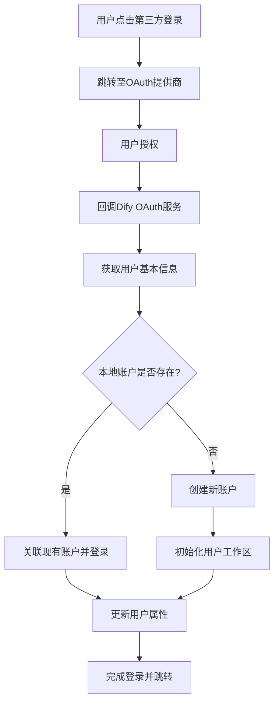
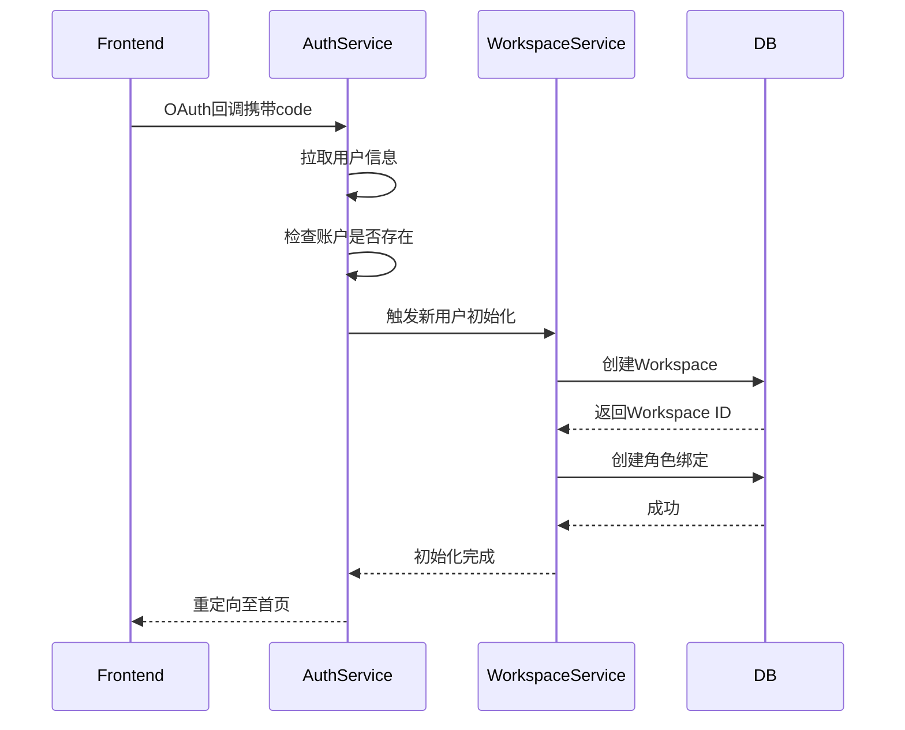
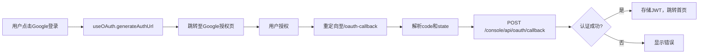

# 用户同步

<cite>
**本文档引用文件**  
- [oauth.py](file://api/libs/oauth.py)
- [webapp_auth_service.py](file://api/services/webapp_auth_service.py)
- [account.py](file://api/models/account.py)
- [passport.py](file://api/libs/passport.py)
- [login.py](file://api/controllers/web/login.py)
- [oauth-callback](file://web/app/oauth-callback)
- [use-oauth.ts](file://web/hooks/use-oauth.ts)
- [sso.ts](file://web/service/sso.ts)
- [user.ts](file://web/models/user.ts)
</cite>

## 目录
1. [简介](#简介)
2. [用户同步流程概览](#用户同步流程概览)
3. [第三方登录与用户信息拉取](#第三方登录与用户信息拉取)
4. [用户信息映射与本地化](#用户信息映射与本地化)
5. [用户账户匹配与创建机制](#用户账户匹配与创建机制)
6. [用户属性同步策略](#用户属性同步策略)
7. [冲突解决机制](#冲突解决机制)
8. [多身份关联管理](#多身份关联管理)
9. [工作区初始化流程](#工作区初始化流程)
10. [事件驱动的用户属性更新](#事件驱动的用户属性更新)
11. [前端OAuth集成](#前端oauth集成)
12. [总结](#总结)

## 简介
Dify支持通过OAuth协议实现第三方登录（如Google、GitHub等），并在用户首次登录或后续登录时自动完成用户信息的同步。该机制确保用户在不同身份提供商之间的身份能够与本地账户系统无缝集成，支持账户匹配、创建、属性同步及多身份绑定等功能。本文档详细描述该用户同步机制的技术实现与流程设计。

## 用户同步流程概览

**Diagram sources**
- [login.py](file://api/controllers/web/login.py#L45-L89)
- [webapp_auth_service.py](file://api/services/webapp_auth_service.py#L30-L75)
- [use-oauth.ts](file://web/hooks/use-oauth.ts#L12-L40)

## 第三方登录与用户信息拉取

Dify通过标准OAuth 2.0流程与第三方身份提供商（如Google、GitHub）集成。用户在前端点击登录按钮后，系统生成授权URL并重定向至提供商。用户完成授权后，Dify后端接收授权码，并使用该码向提供商请求访问令牌，进而拉取用户公开信息。

主要获取的用户信息包括：
- 唯一标识符（`sub` 或 `id`）
- 邮箱地址（`email`）
- 昵称或用户名（`name` 或 `login`）
- 头像URL（`avatar_url` 或 `picture`）

该流程由 `libs/oauth.py` 中的 `OAuthHelper` 类统一管理，支持多种提供商的配置化接入。

**Section sources**
- [oauth.py](file://api/libs/oauth.py#L15-L120)
- [sso.ts](file://web/service/sso.ts#L20-L60)

## 用户信息映射与本地化

获取的第三方用户信息需映射至Dify本地用户模型。映射规则如下：

| 第三方字段 | 本地字段 | 说明 |
|-----------|--------|------|
| `sub` / `id` | `provider_user_id` | 身份提供商的用户唯一ID |
| `email` | `email` | 用户邮箱，用于匹配或创建账户 |
| `name` / `login` | `name` | 用户显示名称 |
| `avatar_url` / `picture` | `avatar` | 用户头像链接 |

映射过程在 `webapp_auth_service.py` 的 `create_or_update_user_from_oauth` 方法中实现，确保字段标准化与数据清洗。

**Section sources**
- [webapp_auth_service.py](file://api/services/webapp_auth_service.py#L50-L90)
- [user.ts](file://web/models/user.ts#L10-L35)

## 用户账户匹配与创建机制

系统通过用户邮箱进行账户匹配。具体逻辑如下：

1. **邮箱匹配**：使用OAuth返回的邮箱查询本地 `Account` 模型。
2. **存在则关联**：若账户已存在，检查是否已绑定当前提供商。若未绑定，则将该OAuth身份添加为关联身份。
3. **不存在则创建**：若无匹配账户，则创建新 `Account` 记录，并绑定当前OAuth身份。
4. **首次登录初始化**：新用户创建后，触发工作区初始化流程。

该逻辑由 `webapp_auth_service.py` 中的 `authenticate_or_register` 方法驱动。

**Section sources**
- [webapp_auth_service.py](file://api/services/webapp_auth_service.py#L75-L110)
- [account.py](file://api/models/account.py#L25-L45)

## 用户属性同步策略

用户属性同步采用“登录时更新”策略，即每次OAuth登录成功后，系统自动拉取最新用户信息并更新本地记录。更新策略如下：

- **非空字段覆盖**：仅当第三方返回的字段非空时，才更新本地值。
- **头像更新**：每次登录均更新头像URL，确保显示最新头像。
- **用户名保留本地修改**：若用户曾手动修改过用户名，则不再自动覆盖。

此策略平衡了数据一致性与用户自定义需求。

**Section sources**
- [webapp_auth_service.py](file://api/services/webapp_auth_service.py#L95-L115)

## 冲突解决机制

当检测到邮箱已存在时，系统采用以下冲突解决策略：

1. **身份关联而非创建**：不创建新账户，而是将当前OAuth身份绑定到已有账户。
2. **多身份支持**：同一本地账户可绑定多个OAuth身份（如Google、GitHub）。
3. **登录入口统一**：用户可通过任一已绑定的身份登录，均指向同一本地账户。

此机制避免了账户分裂，提升了用户体验。

**Section sources**
- [webapp_auth_service.py](file://api/services/webapp_auth_service.py#L110-L130)

## 多身份关联管理

Dify通过 `Account` 模型中的 `linked_accounts` 关系管理多身份绑定。每个绑定记录包含：
- `provider`：身份提供商名称（如 google、github）
- `provider_user_id`：该提供商下的用户ID
- `access_token`：可选，用于后续API调用

用户可在账户设置中查看和管理已绑定的身份。

**Section sources**
- [account.py](file://api/models/account.py#L50-L70)

## 工作区初始化流程

新用户首次登录时，系统自动调用 `workspace_service.py` 中的初始化方法，执行以下操作：

1. 创建默认工作区（Workspace）
2. 设置默认角色（如所有者或成员）
3. 初始化默认应用模板
4. 记录用户首次登录时间

该流程确保新用户登录后即可使用完整功能。

**Diagram sources**
- [webapp_auth_service.py](file://api/services/webapp_auth_service.py#L100-L110)
- [workspace_service.py](file://api/services/workspace_service.py#L25-L60)

## 事件驱动的用户属性更新

用户属性更新采用事件驱动模式。当OAuth登录完成且用户信息有变更时，系统发布 `user.profile.updated` 事件，由事件处理器执行后续操作，如：

- 更新搜索引擎中的用户索引
- 同步至分析系统
- 触发通知服务

该模式解耦了核心登录逻辑与衍生业务逻辑，提升系统可维护性。

**Section sources**
- [webapp_auth_service.py](file://api/services/webapp_auth_service.py#L120-L135)
- [events/app_event.py](file://api/events/app_event.py#L10-L25)

## 前端OAuth集成

前端通过 `use-oauth.ts` Hook 管理OAuth流程。用户点击登录按钮后，Hook生成带状态参数的授权URL，并跳转至 `/oauth-callback` 页面处理回调。回调页面解析参数并提交至后端完成认证。

前端还支持登录状态持久化，使用JWT存储会话信息。

**Diagram sources**
- [use-oauth.ts](file://web/hooks/use-oauth.ts#L15-L50)
- [oauth-callback](file://web/app/oauth-callback#L1-L20)

## 总结

Dify的用户同步机制通过OAuth协议实现了安全、灵活的第三方登录集成。系统在用户登录时自动拉取、映射并同步用户信息，支持邮箱匹配、多身份绑定与冲突解决。新用户可自动完成工作区初始化，而属性更新采用事件驱动模式确保系统扩展性。整体设计兼顾用户体验与系统可维护性，为多身份管理提供了坚实基础。