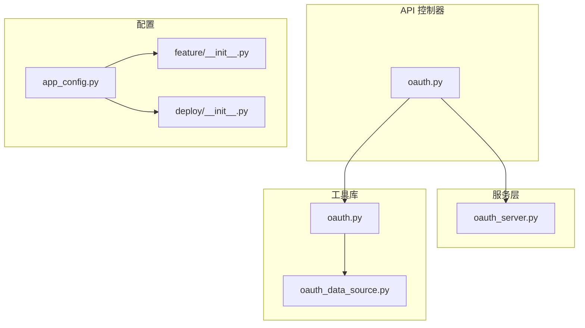
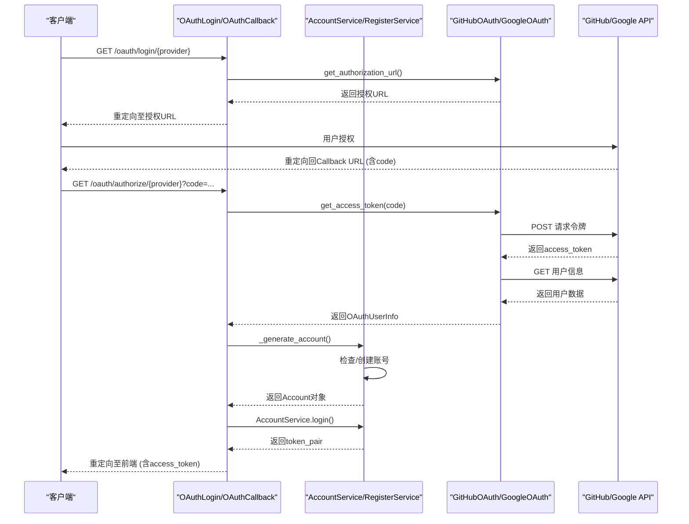
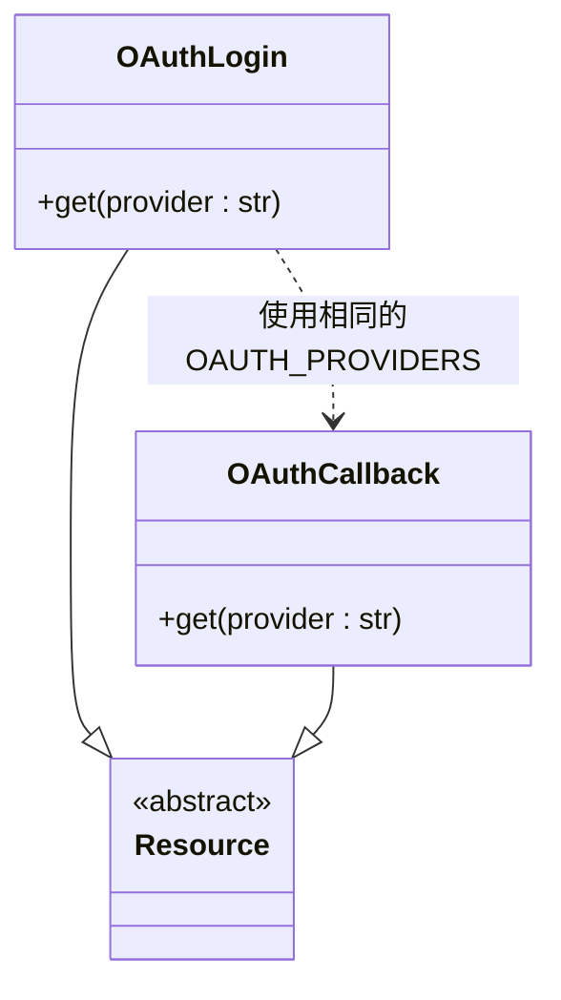
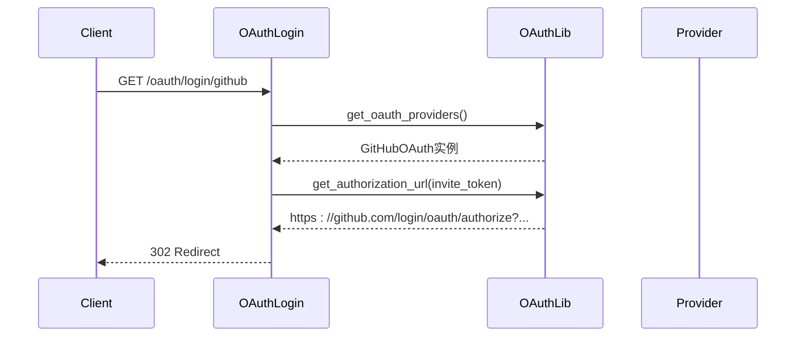
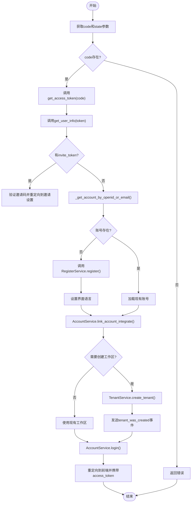
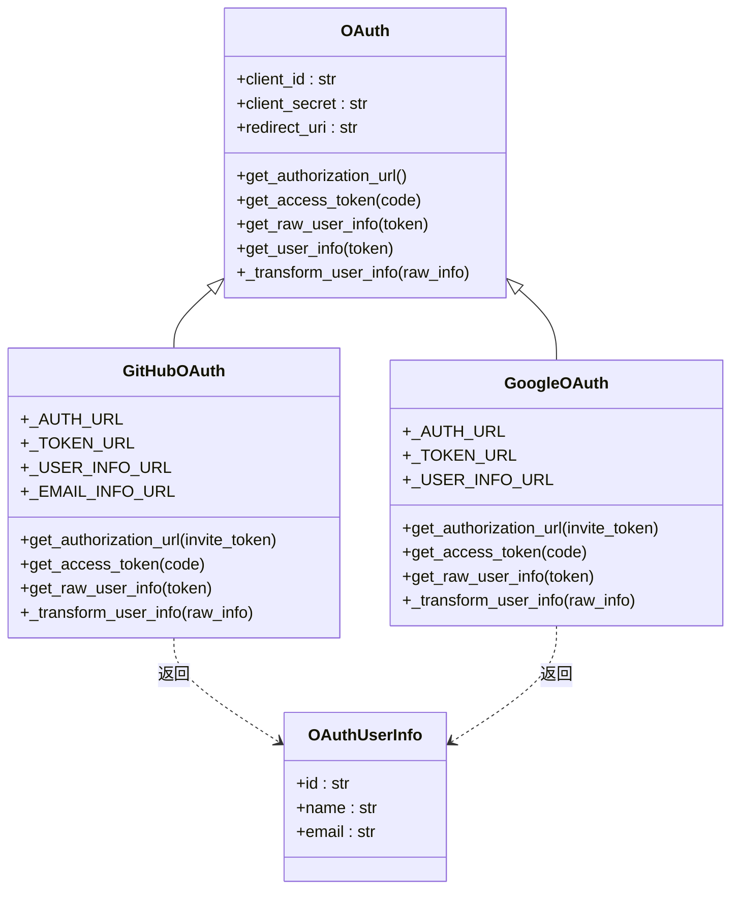
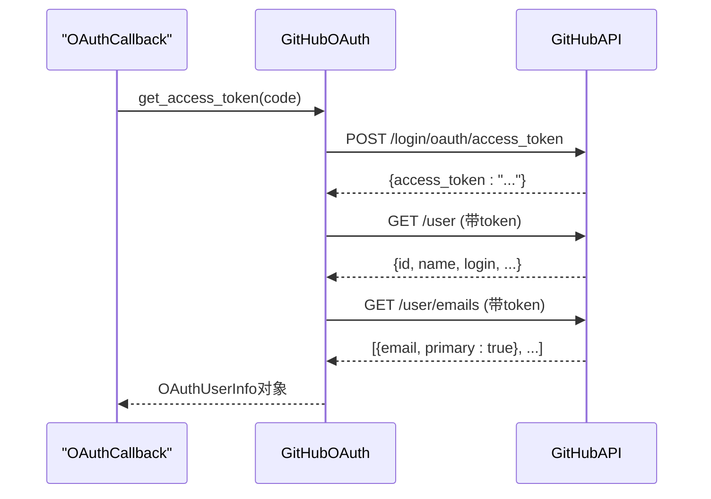
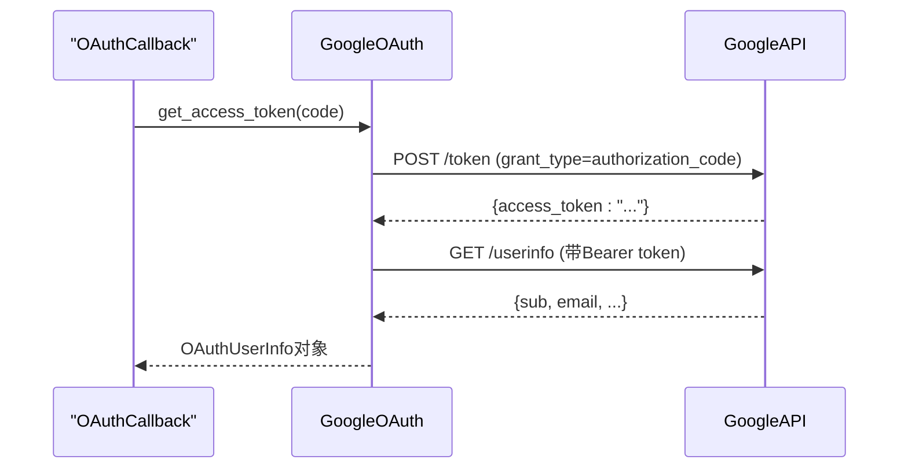
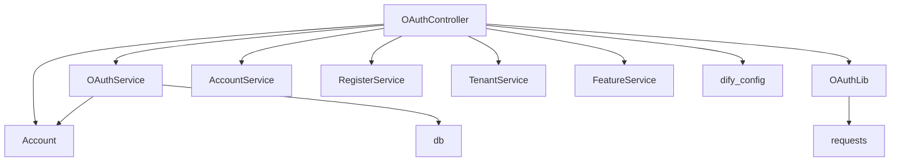

# 第三方登录

<cite>
**本文档中引用的文件**  
- [oauth.py](file://api/controllers/console/auth/oauth.py)
- [oauth_server.py](file://api/services/oauth_server.py)
- [oauth.py](file://api/libs/oauth.py)
- [oauth_data_source.py](file://api/libs/oauth_data_source.py)
- [app_config.py](file://api/configs/app_config.py)
- [feature/__init__.py](file://api/configs/feature/__init__.py)
- [deploy/__init__.py](file://api/configs/deploy/__init__.py)
</cite>

## 目录
1. [简介](#简介)
2. [项目结构](#项目结构)
3. [核心组件](#核心组件)
4. [架构概述](#架构概述)
5. [详细组件分析](#详细组件分析)
6. [依赖分析](#依赖分析)
7. [性能考虑](#性能考虑)
8. [故障排除指南](#故障排除指南)
9. [结论](#结论)

## 简介
本文档详细描述了Dify平台中第三方登录功能的实现机制，重点聚焦于OAuth 2.0协议的集成。文档涵盖了GitHub和Google等主流身份提供商的配置流程、授权码流程中的令牌获取、用户信息拉取与本地账号绑定的完整过程。同时，文档还解析了OAuth回调处理、state参数验证以防止CSRF攻击、错误处理机制以及支持多提供商的抽象设计模式和扩展方法。

## 项目结构
Dify的第三方登录功能主要分布在API控制器、服务层、配置模块和工具库中。核心逻辑位于`api/controllers/console/auth/`目录下的`oauth.py`文件，而OAuth协议的具体实现则封装在`api/libs/oauth.py`中。系统配置通过`api/configs/`下的多个模块进行管理，包括部署配置、功能开关和安全设置。

**Diagram sources**  
- [oauth.py](file://api/controllers/console/auth/oauth.py)
- [oauth_server.py](file://api/services/oauth_server.py)
- [oauth.py](file://api/libs/oauth.py)
- [oauth_data_source.py](file://api/libs/oauth_data_source.py)
- [app_config.py](file://api/configs/app_config.py)

## 核心组件
本节深入分析实现第三方登录的核心组件，包括OAuth控制器、OAuth服务、OAuth库以及相关的配置管理。

**Section sources**
- [oauth.py](file://api/controllers/console/auth/oauth.py)
- [oauth_server.py](file://api/services/oauth_server.py)
- [oauth.py](file://api/libs/oauth.py)
- [app_config.py](file://api/configs/app_config.py)

## 架构概述
Dify的第三方登录采用分层架构设计，确保了高内聚低耦合。用户请求首先由Flask RESTx框架的控制器接收，然后委托给服务层进行业务逻辑处理，最终通过工具库与外部OAuth提供商进行通信。配置系统贯穿整个流程，提供必要的客户端凭证和URL。

**Diagram sources**  
- [oauth.py](file://api/controllers/console/auth/oauth.py)
- [oauth.py](file://api/libs/oauth.py)
- [oauth_server.py](file://api/services/oauth_server.py)

## 详细组件分析
本节对每个关键组件进行彻底分析，包括其功能、交互和实现细节。

### OAuth控制器分析
`OAuthLogin`和`OAuthCallback`是处理第三方登录流程的核心Flask RESTx资源类。`OAuthLogin`负责生成并重定向到身份提供商的授权URL，而`OAuthCallback`则处理授权后的回调，完成令牌交换和用户登录。

#### 控制器类图

**Diagram sources**  
- [oauth.py](file://api/controllers/console/auth/oauth.py#L10-L187)

#### 授权码流程序列图

**Diagram sources**  
- [oauth.py](file://api/controllers/console/auth/oauth.py#L20-L40)

#### 回调处理流程图

**Diagram sources**  
- [oauth.py](file://api/controllers/console/auth/oauth.py#L45-L187)

**Section sources**
- [oauth.py](file://api/controllers/console/auth/oauth.py#L1-L187)

### OAuth库分析
`api/libs/oauth.py`文件定义了OAuth协议的抽象基类和针对GitHub、Google的具体实现，是整个第三方登录功能的技术核心。

#### OAuth类图

**Diagram sources**  
- [oauth.py](file://api/libs/oauth.py#L1-L133)

#### GitHub OAuth流程

**Diagram sources**  
- [oauth.py](file://api/libs/oauth.py#L55-L95)

#### Google OAuth流程

**Diagram sources**  
- [oauth.py](file://api/libs/oauth.py#L97-L133)

**Section sources**
- [oauth.py](file://api/libs/oauth.py#L1-L133)

## 依赖分析
第三方登录功能依赖于多个内部和外部组件。内部依赖包括账户服务、数据库模型和配置系统。外部依赖主要是GitHub和Google的OAuth API。

**Diagram sources**  
- [oauth.py](file://api/controllers/console/auth/oauth.py)
- [oauth.py](file://api/libs/oauth.py)

**Section sources**
- [oauth.py](file://api/controllers/console/auth/oauth.py)
- [oauth.py](file://api/libs/oauth.py)

## 性能考虑
第三方登录的性能主要受外部API调用延迟的影响。系统通过以下方式优化性能：
1.  **连接池**：`requests`库内部使用连接池，减少TCP握手开销。
2.  **配置超时**：在`HttpConfig`中配置了HTTP请求的连接、读取和写入超时，防止请求无限期挂起。
3.  **错误处理**：在回调中捕获`requests.RequestException`，确保网络问题不会导致服务崩溃。

## 故障排除指南
本节分析错误处理代码和调试工具。

**Section sources**
- [oauth.py](file://api/controllers/console/auth/oauth.py#L70-L85)
- [oauth.py](file://api/libs/oauth.py#L70-L75, L105-L110)

常见问题及解决方案：
- **"Invalid provider"错误**：检查URL中的提供商名称是否拼写正确（github/google），并确认在`.env`文件中正确配置了相应的`CLIENT_ID`和`CLIENT_SECRET`。
- **OAuth流程失败**：查看后端日志，`logger.exception`会记录详细的错误信息，通常是由于网络问题或提供商返回的错误响应。
- **账号未找到**：如果`is_allow_register`功能被禁用，新用户将无法注册，导致此错误。
- **工作区创建失败**：如果`is_allow_create_workspace`功能被禁用，且用户没有加入任何工作区，将无法登录。

## 结论
Dify的第三方登录功能通过清晰的分层架构和模块化设计，实现了对GitHub和Google等OAuth 2.0提供商的高效集成。系统利用抽象基类`OAuth`和具体实现`GitHubOAuth`、`GoogleOAuth`来统一处理不同提供商的差异，同时通过`get_oauth_providers`工厂函数动态管理可用的提供商。整个流程安全可靠，包含了state参数（通过invite_token传递）来防范CSRF攻击，并通过完善的错误处理和日志记录确保了系统的健壮性。该设计易于扩展，可以方便地添加对新OAuth提供商的支持。