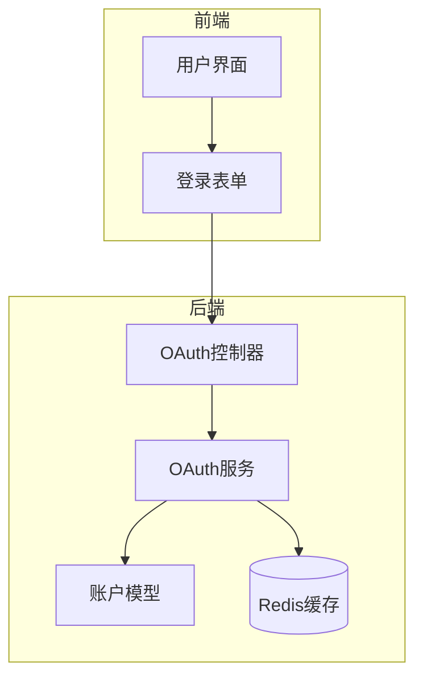
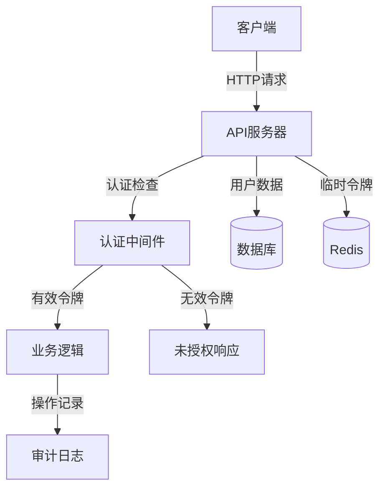
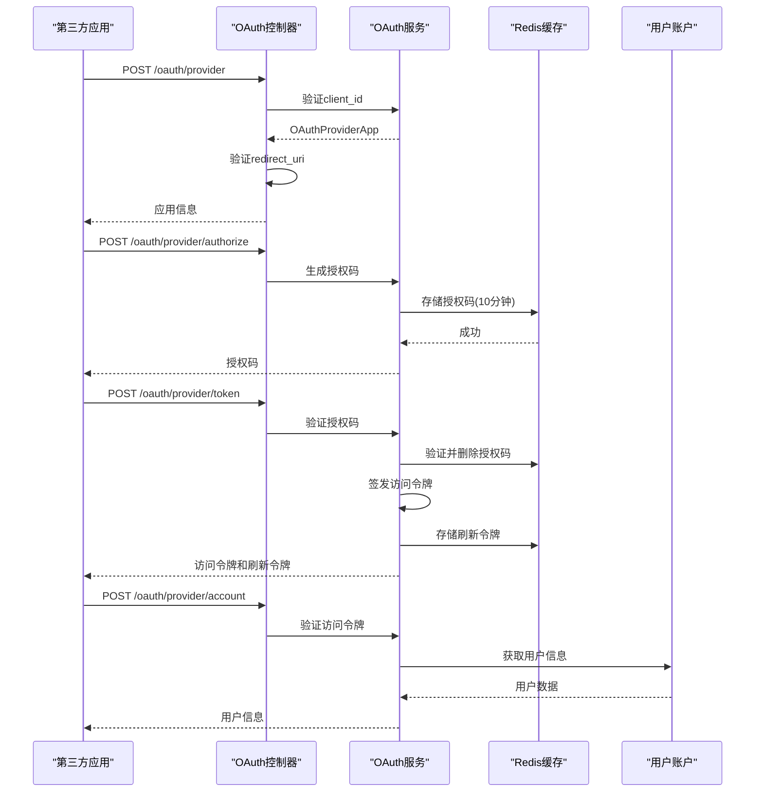
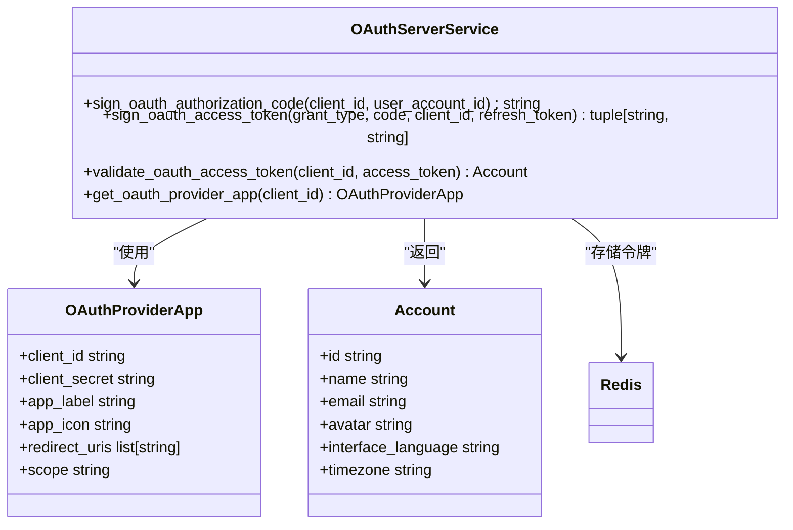
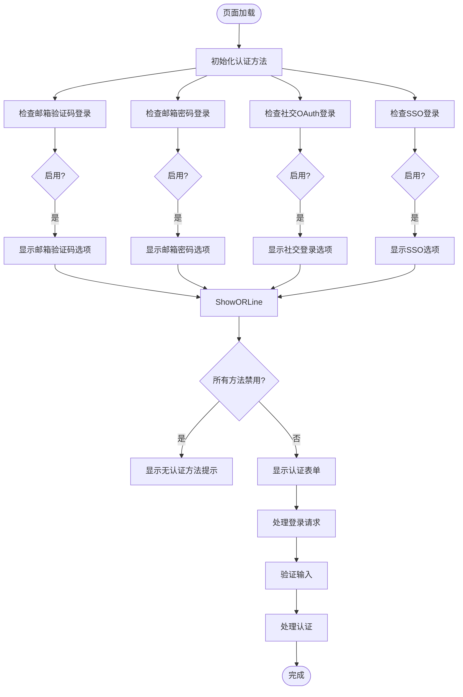
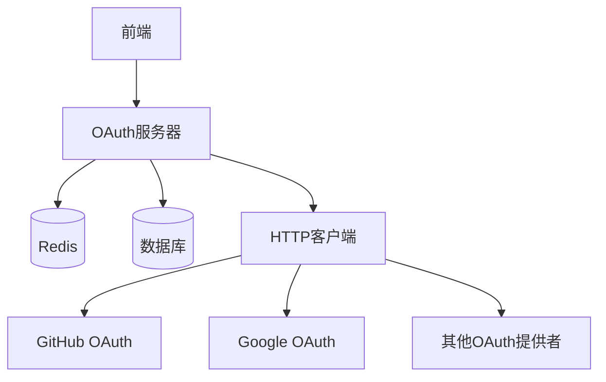

# 认证流程

<cite>
**本文档引用的文件**
- [oauth_server.py](file://api/controllers/console/auth/oauth_server.py)
- [oauth_server.py](file://api/services/oauth_server.py)
- [test_system_oauth_encryption.py](file://api/tests/unit_tests/utils/oauth_encryption/test_system_oauth_encryption.py)
- [auth_flow.py](file://api/core/mcp/auth/auth_flow.py)
- [normalForm.tsx](file://web/app/(shareLayout)/webapp-signin/normalForm.tsx)
- [login.ts](file://web/i18n/en-US/login.ts)
</cite>

## 目录
1. [简介](#简介)
2. [项目结构](#项目结构)
3. [核心组件](#核心组件)
4. [架构概述](#架构概述)
5. [详细组件分析](#详细组件分析)
6. [依赖分析](#依赖分析)
7. [性能考虑](#性能考虑)
8. [故障排除指南](#故障排除指南)
9. [结论](#结论)

## 简介
本文档详细描述了Dify平台的认证流程，涵盖基于OAuth 2.0的第三方登录集成、本地账户系统的密码存储机制、JWT令牌管理、多租户环境下的访问控制以及安全最佳实践。文档结合代码实现和系统设计，为开发者和安全工程师提供全面的技术参考。

## 项目结构
Dify的认证系统分布在API后端和Web前端两个主要部分。后端认证逻辑集中在`api/controllers/console/auth/`目录下，而前端交互组件位于`web/app/(shareLayout)/webapp-signin/`中。系统通过模块化设计分离关注点，确保认证流程的安全性和可扩展性。

**Diagram sources**
- [normalForm.tsx](file://web/app/(shareLayout)/webapp-signin/normalForm.tsx)
- [oauth_server.py](file://api/controllers/console/auth/oauth_server.py)

**Section sources**
- [oauth_server.py](file://api/controllers/console/auth/oauth_server.py)
- [normalForm.tsx](file://web/app/(shareLayout)/webapp-signin/normalForm.tsx)

## 核心组件
Dify认证系统的核心组件包括OAuth服务器实现、令牌管理服务、用户账户模型和前端登录界面。系统支持多种认证方式，包括邮箱验证码登录、密码登录和第三方OAuth集成。认证流程通过Redis缓存临时令牌，确保高并发场景下的性能和安全性。

**Section sources**
- [oauth_server.py](file://api/controllers/console/auth/oauth_server.py)
- [oauth_server.py](file://api/services/oauth_server.py)

## 架构概述
Dify的认证架构采用分层设计，前端负责用户交互，API层处理认证请求，服务层实现业务逻辑，数据层管理用户信息和会话状态。系统通过OAuth 2.0协议支持第三方应用集成，同时提供本地账户认证功能。所有敏感操作都经过严格的权限验证和安全检查。

**Diagram sources**
- [oauth_server.py](file://api/controllers/console/auth/oauth_server.py)
- [oauth_server.py](file://api/services/oauth_server.py)

## 详细组件分析

### OAuth服务器实现
Dify的OAuth服务器实现遵循OAuth 2.0标准，提供完整的授权码流程支持。系统通过`OAuthServerAppApi`、`OAuthServerUserAuthorizeApi`和`OAuthServerUserTokenApi`三个主要API端点处理OAuth请求。认证流程包括客户端验证、授权码生成、令牌签发和用户信息获取。

**Diagram sources**
- [oauth_server.py](file://api/controllers/console/auth/oauth_server.py)
- [oauth_server.py](file://api/services/oauth_server.py)

**Section sources**
- [oauth_server.py](file://api/controllers/console/auth/oauth_server.py)
- [oauth_server.py](file://api/services/oauth_server.py)

### 令牌管理机制
Dify使用基于Redis的令牌管理系统，确保令牌的安全存储和高效验证。系统为不同类型的令牌设置不同的过期策略，授权码有效期为10分钟，访问令牌和刷新令牌则根据安全策略配置。令牌签发过程采用UUID生成唯一标识，并通过Redis的过期机制自动清理。

**Diagram sources**
- [oauth_server.py](file://api/services/oauth_server.py)
- [oauth_server.py](file://api/controllers/console/auth/oauth_server.py)

**Section sources**
- [oauth_server.py](file://api/services/oauth_server.py)

### 前端认证流程
前端登录界面根据系统配置动态显示可用的认证方式。系统通过`systemFeatures`对象判断启用的认证方法，包括邮箱验证码登录、密码登录、社交OAuth登录和SSO登录。界面提供清晰的视觉反馈，当所有认证方法都被禁用时，显示相应的提示信息。

**Diagram sources**
- [normalForm.tsx](file://web/app/(shareLayout)/webapp-signin/normalForm.tsx)

**Section sources**
- [normalForm.tsx](file://web/app/(shareLayout)/webapp-signin/normalForm.tsx)

## 依赖分析
Dify认证系统依赖多个核心组件和外部服务。系统通过Redis存储临时令牌，利用数据库持久化用户账户信息，通过HTTP客户端与第三方OAuth提供者通信。前后端通过标准化的API接口交互，确保系统的可维护性和可扩展性。

**Diagram sources**
- [oauth_server.py](file://api/services/oauth_server.py)
- [auth_flow.py](file://api/core/mcp/auth/auth_flow.py)

**Section sources**
- [oauth_server.py](file://api/services/oauth_server.py)
- [auth_flow.py](file://api/core/mcp/auth/auth_flow.py)

## 性能考虑
Dify认证系统在设计时充分考虑了性能因素。通过Redis缓存临时令牌，系统避免了频繁的数据库查询，提高了响应速度。令牌验证过程采用内存操作，确保在高并发场景下的低延迟。系统还实现了合理的过期策略，自动清理无效令牌，减少存储开销。

## 故障排除指南
当认证流程出现问题时，应首先检查系统配置和网络连接。常见的问题包括无效的client_id、不匹配的redirect_uri、过期的授权码和无效的访问令牌。系统提供了详细的错误响应，帮助开发者快速定位问题。对于第三方OAuth集成，需要确保客户端密钥和重定向URI配置正确。

**Section sources**
- [oauth_server.py](file://api/controllers/console/auth/oauth_server.py)
- [oauth_server.py](file://api/services/oauth_server.py)

## 结论
Dify的认证系统提供了安全、灵活和可扩展的身份验证解决方案。通过遵循OAuth 2.0标准和最佳安全实践，系统能够满足现代应用的安全需求。模块化的设计使得新认证方式的集成变得简单，而详细的错误处理和日志记录则有助于系统的维护和调试。