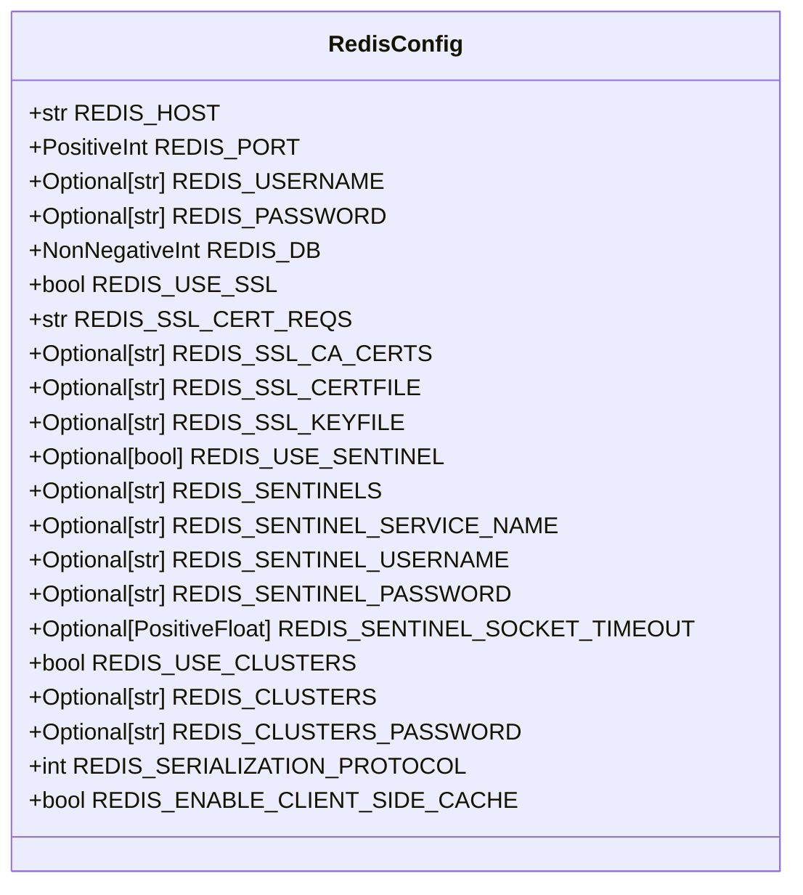
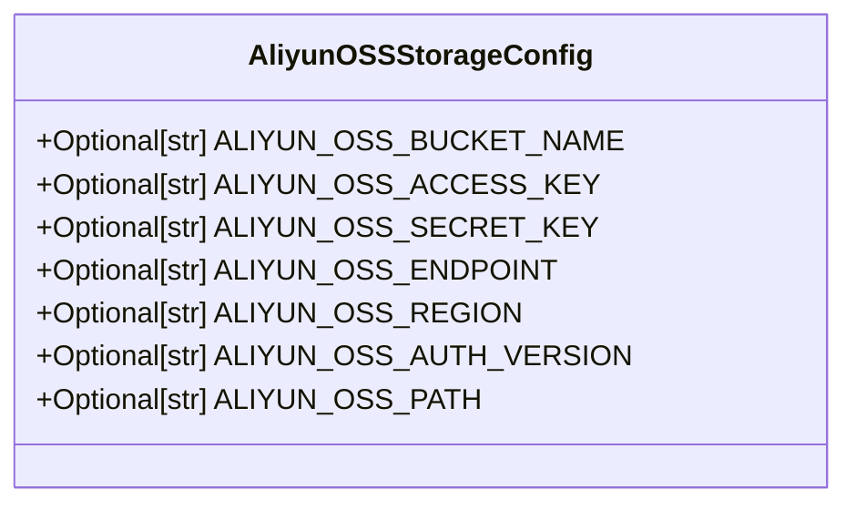
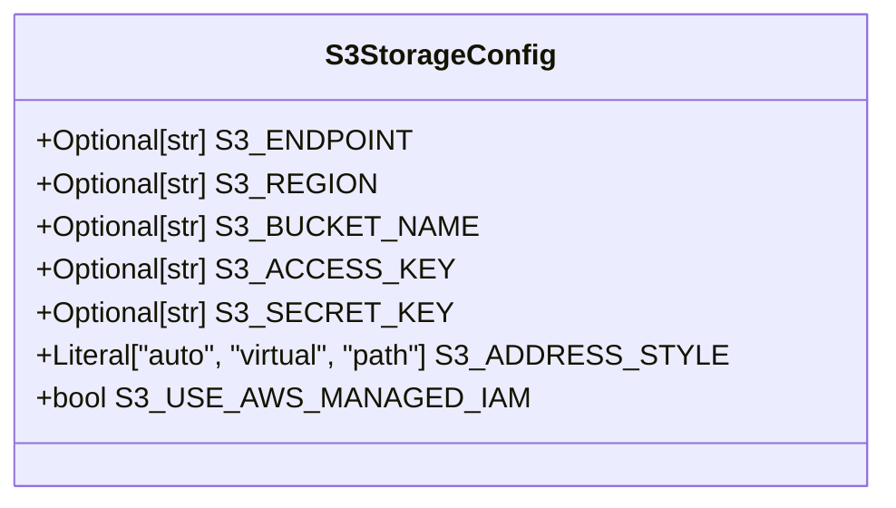
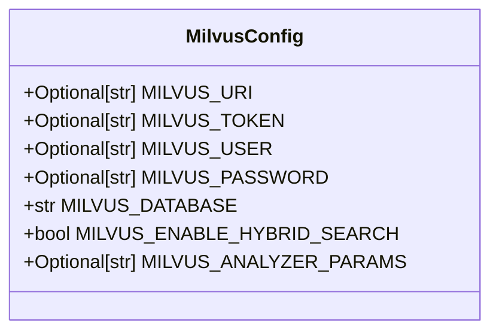
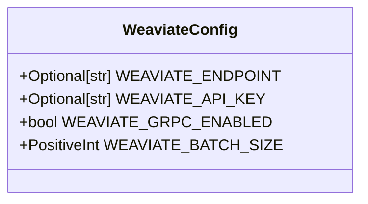

# 中间件配置

<cite>
**本文档中引用的文件**  
- [redis_config.py](file://api/configs/middleware/cache/redis_config.py)
- [aliyun_oss_storage_config.py](file://api/configs/middleware/storage/aliyun_oss_storage_config.py)
- [amazon_s3_storage_config.py](file://api/configs/middleware/storage/amazon_s3_storage_config.py)
- [milvus_config.py](file://api/configs/middleware/vdb/milvus_config.py)
- [weaviate_config.py](file://api/configs/middleware/vdb/weaviate_config.py)
</cite>

## 目录
1. [简介](#简介)
2. [缓存配置](#缓存配置)
3. [存储配置](#存储配置)
4. [向量数据库配置](#向量数据库配置)
5. [安全最佳实践](#安全最佳实践)
6. [性能调优建议](#性能调优建议)
7. [总结](#总结)

## 简介
本文档全面介绍 Dify 项目中 `middleware` 目录下的中间件配置，重点涵盖缓存、对象存储和向量数据库的配置方式。通过详细解析 Redis 缓存、各类对象存储（如 AWS S3、阿里云 OSS）以及向量数据库（如 Milvus、Weaviate）的配置参数与连接设置，帮助开发者正确配置和管理中间件服务。文档提供配置示例、安全实践和性能优化建议，确保系统稳定高效运行。

## 缓存配置

### Redis 缓存配置详解
Dify 使用 Redis 作为主要缓存中间件，其配置位于 `api/configs/middleware/cache/redis_config.py` 文件中。`RedisConfig` 类定义了完整的连接与安全参数，支持单节点、哨兵模式和集群模式。

#### 核心连接参数
- **REDIS_HOST**: Redis 服务器的主机名或 IP 地址，默认为 `localhost`
- **REDIS_PORT**: Redis 服务监听端口，默认为 `6379`
- **REDIS_DB**: 使用的数据库编号（0-15），默认为 `0`
- **REDIS_USERNAME** 和 **REDIS_PASSWORD**: 认证所需的用户名和密码（可选）

#### SSL 安全连接
- **REDIS_USE_SSL**: 是否启用 SSL/TLS 加密，默认为 `False`
- **REDIS_SSL_CERT_REQS**: SSL 证书验证级别（`CERT_NONE`, `CERT_OPTIONAL`, `CERT_REQUIRED`）
- **REDIS_SSL_CA_CERTS**: CA 证书文件路径，用于验证服务器证书
- **REDIS_SSL_CERTFILE** 和 **REDIS_SSL_KEYFILE**: 客户端证书和私钥文件路径，用于双向认证

#### 高可用模式支持
- **Redis Sentinel 模式**:
  - **REDIS_USE_SENTINEL**: 启用哨兵模式
  - **REDIS_SENTINELS**: 哨兵节点列表（格式：`host:port`，逗号分隔）
  - **REDIS_SENTINEL_SERVICE_NAME**: 要监控的主服务名称
  - **REDIS_SENTINEL_USERNAME** / **REDIS_SENTINEL_PASSWORD**: 哨兵认证凭据
  - **REDIS_SENTINEL_SOCKET_TIMEOUT**: 哨兵连接超时时间（秒）

- **Redis Cluster 模式**:
  - **REDIS_USE_CLUSTERS**: 启用集群模式
  - **REDIS_CLUSTERS**: 集群节点列表（`host:port`，逗号分隔）
  - **REDIS_CLUSTERS_PASSWORD**: 集群统一认证密码

#### 高级选项
- **REDIS_SERIALIZATION_PROTOCOL**: Redis 序列化协议版本（RESP），默认为 `3`
- **REDIS_ENABLE_CLIENT_SIDE_CACHE**: 是否启用客户端缓存，默认为 `False`

**图示来源**
- [redis_config.py](file://api/configs/middleware/cache/redis_config.py#L6-L114)

**节来源**
- [redis_config.py](file://api/configs/middleware/cache/redis_config.py#L1-L115)

## 存储配置

### 对象存储通用配置模式
Dify 支持多种 S3 兼容的对象存储服务，配置文件位于 `api/configs/middleware/storage/` 目录下，采用统一的 Pydantic 配置类模式。

#### 阿里云 OSS 配置
`AliyunOSSStorageConfig` 类用于配置阿里云对象存储服务。

- **ALIYUN_OSS_BUCKET_NAME**: 存储桶名称
- **ALIYUN_OSS_ACCESS_KEY** / **ALIYUN_OSS_SECRET_KEY**: 访问密钥对
- **ALIYUN_OSS_ENDPOINT**: 服务端点 URL
- **ALIYUN_OSS_REGION**: 区域标识（如 `oss-cn-hangzhou`）
- **ALIYUN_OSS_AUTH_VERSION**: 认证协议版本（如 `v4`）
- **ALIYUN_OSS_PATH**: 存储桶内的基础路径前缀

**图示来源**
- [aliyun_oss_storage_config.py](file://api/configs/middleware/storage/aliyun_oss_storage_config.py#L6-L45)

**节来源**
- [aliyun_oss_storage_config.py](file://api/configs/middleware/storage/aliyun_oss_storage_config.py#L1-L45)

#### AWS S3 及兼容存储配置
`S3StorageConfig` 类用于配置 AWS S3 或任何 S3 兼容存储。

- **S3_ENDPOINT**: S3 服务端点（如 `https://s3.amazonaws.com`）
- **S3_REGION**: 区域（如 `us-east-1`）
- **S3_BUCKET_NAME**: 存储桶名称
- **S3_ACCESS_KEY** / **S3_SECRET_KEY**: 访问密钥
- **S3_ADDRESS_STYLE**: 地址风格（`auto`, `virtual`, `path`）
- **S3_USE_AWS_MANAGED_IAM**: 是否使用 AWS IAM 角色进行认证（无需密钥）

**图示来源**
- [amazon_s3_storage_config.py](file://api/configs/middleware/storage/amazon_s3_storage_config.py#L8-L45)

**节来源**
- [amazon_s3_storage_config.py](file://api/configs/middleware/storage/amazon_s3_storage_config.py#L1-L45)

## 向量数据库配置

### Milvus 向量数据库配置
`MilvusConfig` 类用于配置 Milvus 向量数据库连接。

- **MILVUS_URI**: Milvus 服务地址（支持 HTTP/HTTPS）
- **MILVUS_TOKEN**: 认证令牌（用于 Token 认证）
- **MILVUS_USER** / **MILVUS_PASSWORD**: 用户名密码认证
- **MILVUS_DATABASE**: 连接的目标数据库名称，默认为 `default`
- **MILVUS_ENABLE_HYBRID_SEARCH**: 是否启用混合搜索功能（需 Milvus 2.5.0+）
- **MILVUS_ANALYZER_PARAMS**: 文本分析器参数（如中文分词配置）

**图示来源**
- [milvus_config.py](file://api/configs/middleware/vdb/milvus_config.py#L6-L46)

**节来源**
- [milvus_config.py](file://api/configs/middleware/vdb/milvus_config.py#L1-L46)

### Weaviate 向量数据库配置
`WeaviateConfig` 类用于配置 Weaviate 向量数据库。

- **WEAVIATE_ENDPOINT**: Weaviate 服务端点（HTTP/gRPC）
- **WEAVIATE_API_KEY**: API 密钥认证
- **WEAVIATE_GRPC_ENABLED**: 是否启用 gRPC 连接（推荐以提高性能）
- **WEAVIATE_BATCH_SIZE**: 批量操作的对象数量，默认为 `100`

**图示来源**
- [weaviate_config.py](file://api/configs/middleware/vdb/weaviate_config.py#L6-L30)

**节来源**
- [weaviate_config.py](file://api/configs/middleware/vdb/weaviate_config.py#L1-L30)

## 安全最佳实践

### 敏感信息保护
- 所有密码、密钥、令牌等敏感字段均应通过环境变量注入，避免硬编码
- 使用 `Optional[str]` 类型并设置 `default=None`，强制要求外部配置
- 在生产环境中，使用密钥管理服务（如 AWS Secrets Manager、Hashicorp Vault）管理凭证

### 网络与认证安全
- 对于公网暴露的 Redis、数据库等服务，必须启用 SSL/TLS 加密
- 配置合理的防火墙规则，限制中间件服务的访问来源 IP
- 优先使用 IAM 角色（如 `S3_USE_AWS_MANAGED_IAM`）而非长期密钥
- 定期轮换访问密钥和认证令牌

### 配置验证
- 利用 Pydantic 的类型检查和验证机制，确保配置值的合法性
- 在应用启动时进行中间件连接性测试，及时发现配置错误

## 性能调优建议

### Redis 性能优化
- 根据负载选择合适的部署模式：高并发场景使用 Cluster，高可用场景使用 Sentinel
- 启用 `REDIS_ENABLE_CLIENT_SIDE_CACHE` 以减少网络往返延迟
- 根据实际需求调整 `REDIS_DB` 编号，实现逻辑隔离
- 对于跨地域部署，考虑使用 Redis Proxy 或优化网络路径

### 对象存储性能
- 选择与应用服务器地理位置最近的存储区域，降低延迟
- 使用 `path` 地址风格（`S3_ADDRESS_STYLE="path"`）以兼容更多 S3 兼容服务
- 启用对象存储的 CDN 加速服务，提升文件访问速度
- 对于大文件上传，实现分块上传（Multipart Upload）

### 向量数据库性能
- **Milvus**: 启用 `MILVUS_ENABLE_HYBRID_SEARCH` 以利用最新版本的混合搜索优化
- **Weaviate**: 启用 gRPC（`WEAVIATE_GRPC_ENABLED=True`）显著提升数据传输效率
- 调整 `WEAVIATE_BATCH_SIZE` 以平衡吞吐量和内存使用
- 为文本字段配置合适的分析器（`MILVUS_ANALYZER_PARAMS`），提升检索准确性

## 总结
Dify 的中间件配置体系设计清晰、扩展性强，通过 Pydantic 模型实现了类型安全和文档化配置。开发者应根据实际部署环境，合理配置缓存、存储和向量数据库的各项参数，并遵循安全与性能最佳实践，以确保系统的稳定性、安全性和高效性。所有配置均支持环境变量覆盖，便于在不同环境（开发、测试、生产）间灵活切换。