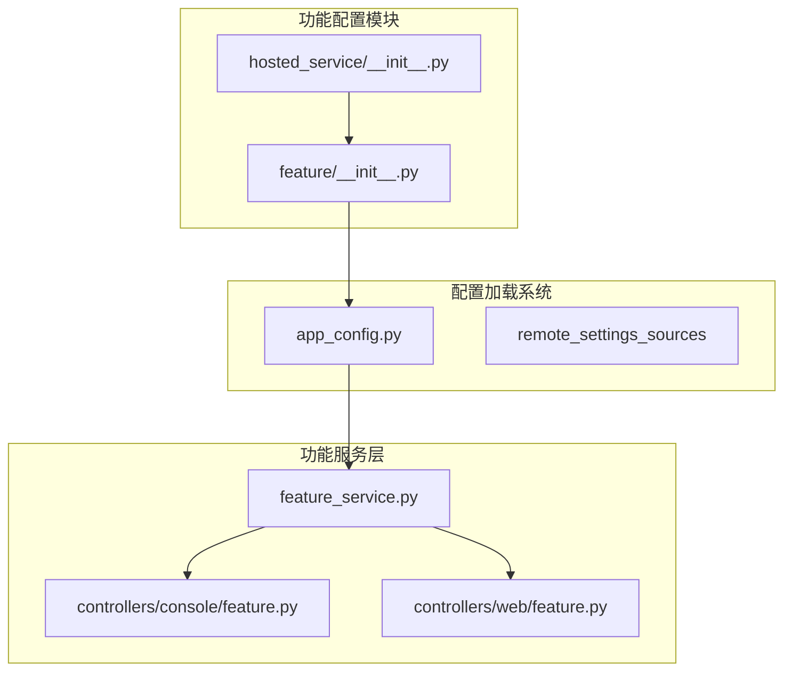
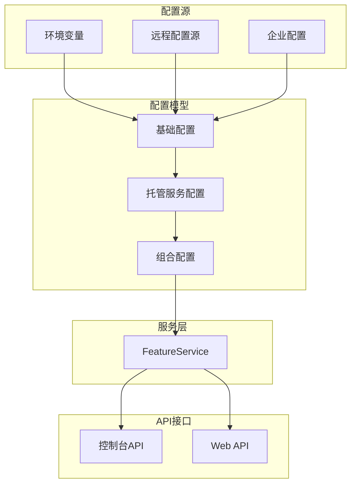
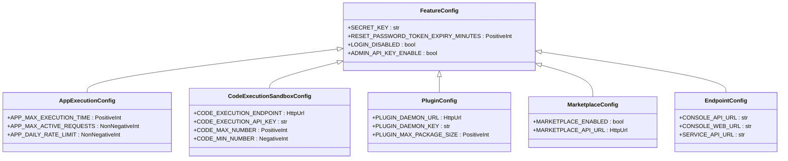
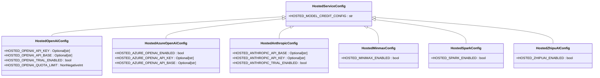
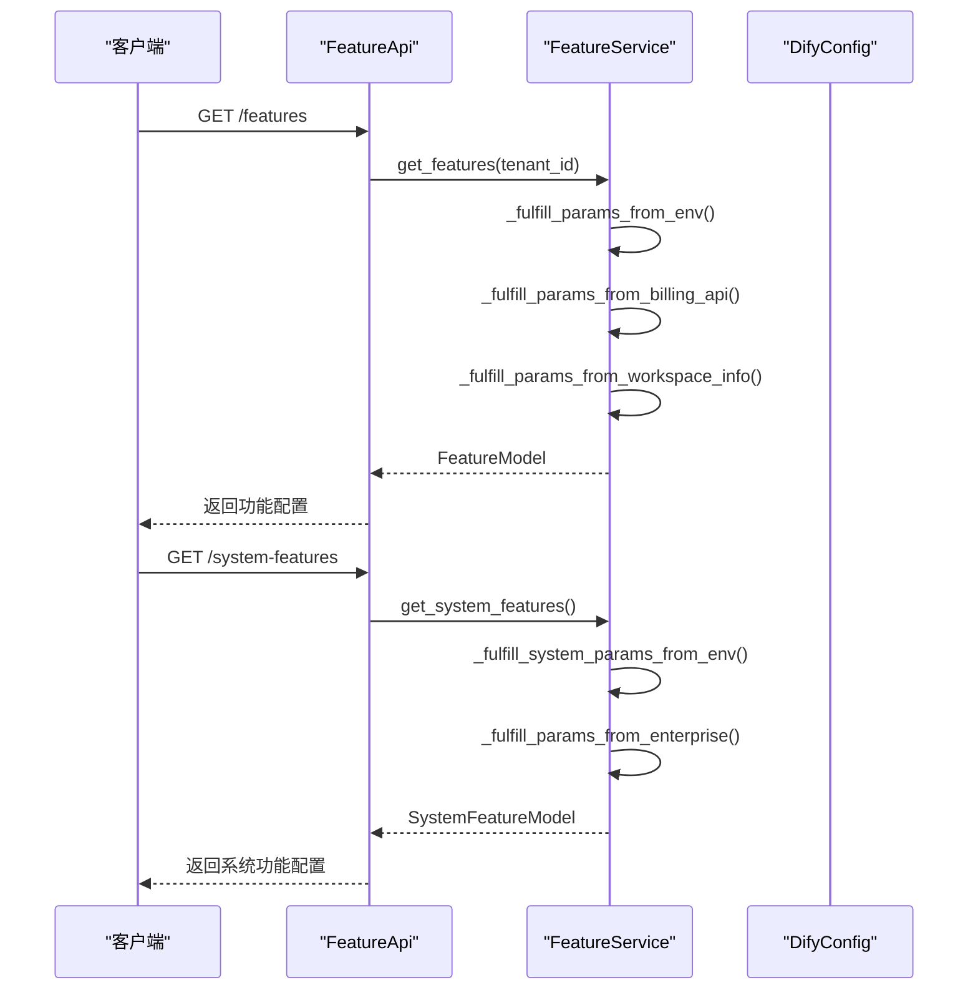

# 功能开关

<cite>
**本文档引用的文件**
- [feature/__init__.py](file://api/configs/feature/__init__.py)
- [hosted_service/__init__.py](file://api/configs/feature/hosted_service/__init__.py)
- [app_config.py](file://api/configs/app_config.py)
- [feature_service.py](file://api/services/feature_service.py)
- [console/feature.py](file://api/controllers/console/feature.py)
- [web/feature.py](file://api/controllers/web/feature.py)
</cite>

## 目录
1. [简介](#简介)
2. [项目结构](#项目结构)
3. [核心组件](#核心组件)
4. [架构概述](#架构概述)
5. [详细组件分析](#详细组件分析)
6. [依赖分析](#依赖分析)
7. [性能考虑](#性能考虑)
8. [故障排除指南](#故障排除指南)
9. [结论](#结论)
10. [附录](#附录)（如有必要）

## 简介
Dify功能开关系统是一个基于Python模块化设计的配置管理系统，用于控制平台各项功能的启用与禁用。该系统通过分层配置机制，实现了功能特性的动态控制和灵活管理。核心功能包括hosted_service等模块的配置模式，支持通过环境变量、远程配置源和企业级设置等多种方式加载功能开关。系统采用优先级规则来决定最终的功能状态，并提供运行时动态控制能力。功能开关不仅用于控制基础功能的开启关闭，还用于管理配额限制、访问权限和商业特性等复杂场景。

## 项目结构
Dify功能开关系统的配置文件主要位于`api/configs/feature`目录下，采用Python模块化组织结构。该系统通过分层继承和组合的方式构建复杂的配置模型，支持多种部署场景和企业级需求。

**图示来源**
- [feature/__init__.py](file://api/configs/feature/__init__.py)
- [hosted_service/__init__.py](file://api/configs/feature/hosted_service/__init__.py)
- [app_config.py](file://api/configs/app_config.py)

**本节来源**
- [feature/__init__.py](file://api/configs/feature/__init__.py)
- [app_config.py](file://api/configs/app_config.py)

## 核心组件
Dify功能开关系统的核心组件包括配置模型、服务层和控制器。配置模型定义了所有可配置的功能特性，服务层负责聚合和处理配置数据，控制器提供API接口供前端和其他服务调用。系统通过`FeatureConfig`基类继承多个具体配置类，如`SecurityConfig`、`AppExecutionConfig`等，实现了功能的模块化组织。`HostedServiceConfig`类通过多重继承整合了各个托管服务的配置，形成了完整的功能开关集合。

**本节来源**
- [feature/__init__.py](file://api/configs/feature/__init__.py#L0-L799)
- [hosted_service/__init__.py](file://api/configs/feature/hosted_service/__init__.py#L0-L239)
- [feature_service.py](file://api/services/feature_service.py#L110-L151)

## 架构概述
Dify功能开关系统采用分层架构设计，从配置定义到服务提供形成了完整的功能开关管理链条。系统通过Pydantic模型定义配置结构，利用SettingsConfigDict实现多源配置加载，并通过FeatureService进行配置聚合和处理。

**图示来源**
- [app_config.py](file://api/configs/app_config.py#L0-L113)
- [feature_service.py](file://api/services/feature_service.py#L136-L151)

## 详细组件分析

### 配置模型分析
Dify功能开关系统采用Pydantic BaseModel构建配置模型，通过继承和组合的方式实现功能的模块化管理。系统定义了多个配置类，如SecurityConfig、AppExecutionConfig等，每个类负责特定功能领域的配置。

**图示来源**
- [feature/__init__.py](file://api/configs/feature/__init__.py#L0-L799)

### 托管服务配置分析
托管服务配置模块通过多重继承的方式整合了各个云服务提供商的配置选项，实现了统一的托管服务管理接口。每个服务提供商都有独立的配置类，如HostedOpenAiConfig、HostedAnthropicConfig等。

**图示来源**
- [hosted_service/__init__.py](file://api/configs/feature/hosted_service/__init__.py#L0-L239)

### 功能服务分析
功能服务层负责聚合来自不同来源的配置信息，根据优先级规则生成最终的功能配置。系统通过_get_fulfill方法从环境变量、计费系统和企业配置等多个来源获取配置数据。

**图示来源**
- [feature_service.py](file://api/services/feature_service.py#L154-L326)
- [console/feature.py](file://api/controllers/console/feature.py#L0-L25)
- [web/feature.py](file://api/controllers/web/feature.py#L0-L20)

**本节来源**
- [feature_service.py](file://api/services/feature_service.py#L110-L151)
- [console/feature.py](file://api/controllers/console/feature.py#L0-L25)
- [web/feature.py](file://api/controllers/web/feature.py#L0-L20)

## 依赖分析
Dify功能开关系统依赖于Pydantic和Pydantic-settings库来实现配置模型的定义和验证。系统通过DifyConfig类整合了多个配置模块，包括部署配置、企业特性配置、中间件配置等。

```mermaid
graph TD
DifyConfig[DifyConfig] --> PackagingInfo[PackagingInfo]
DifyConfig --> DeploymentConfig[DeploymentConfig]
DifyConfig --> FeatureConfig[FeatureConfig]
DifyConfig --> MiddlewareConfig[MiddlewareConfig]
DifyConfig --> ExtraServiceConfig[ExtraServiceConfig]
DifyConfig --> ObservabilityConfig[ObservabilityConfig]
DifyConfig --> RemoteSettingsSourceConfig[RemoteSettingsSourceConfig]
DifyConfig --> EnterpriseFeatureConfig[EnterpriseFeatureConfig]
FeatureConfig --> SecurityConfig[SecurityConfig]
FeatureConfig --> AppExecutionConfig[AppExecutionConfig]
FeatureConfig --> CodeExecutionSandboxConfig[CodeExecutionSandboxConfig]
FeatureConfig --> PluginConfig[PluginConfig]
FeatureConfig --> MarketplaceConfig[MarketplaceConfig]
FeatureConfig --> EndpointConfig[EndpointConfig]
FeatureConfig --> FileAccessConfig[FileAccessConfig]
FeatureConfig --> FileUploadConfig[FileUploadConfig]
FeatureConfig --> HttpConfig[HttpConfig]
FeatureConfig --> InnerAPIConfig[InnerAPIConfig]
FeatureConfig --> LoggingConfig[LoggingConfig]
FeatureConfig --> ModelLoadBalanceConfig[ModelLoadBalanceConfig]
FeatureConfig --> BillingConfig[BillingConfig]
FeatureConfig --> UpdateConfig[UpdateConfig]
FeatureConfig --> WorkflowConfig[WorkflowConfig]
FeatureConfig --> WorkflowNodeExecutionConfig[WorkflowNodeExecutionConfig]
FeatureConfig --> RepositoryConfig[RepositoryConfig]
FeatureConfig --> AuthConfig[AuthConfig]
FeatureConfig --> ModerationConfig[ModerationConfig]
FeatureConfig --> ToolConfig[ToolConfig]
FeatureConfig --> MailConfig[MailConfig]
FeatureConfig --> RagEtlConfig[RagEtlConfig]
FeatureConfig --> DataSetConfig[DataSetConfig]
```

**图示来源**
- [app_config.py](file://api/configs/app_config.py#L0-L113)
- [feature/__init__.py](file://api/configs/feature/__init__.py#L0-L799)

**本节来源**
- [app_config.py](file://api/configs/app_config.py#L0-L113)

## 性能考虑
功能开关系统的性能主要体现在配置加载和处理的效率上。系统通过缓存机制和惰性加载策略优化性能，避免重复的配置读取和处理操作。在多租户环境下，系统会根据租户ID缓存相应的功能配置，减少数据库查询次数。对于频繁访问的功能开关，建议在应用启动时预加载并缓存，以提高运行时的访问速度。

## 故障排除指南
当功能开关系统出现问题时，首先检查环境变量配置是否正确，特别是与计费系统和企业配置相关的变量。如果功能开关状态不符合预期，需要检查配置优先级规则，确认不同来源的配置是否按预期合并。对于远程配置源问题，需要验证Apollo或Nacos等服务的连接状态和配置项是否存在。在调试过程中，可以通过日志查看配置加载的详细过程，定位问题根源。

**本节来源**
- [feature_service.py](file://api/services/feature_service.py#L154-L326)
- [app_config.py](file://api/configs/app_config.py#L0-L113)

## 结论
Dify功能开关系统通过模块化的Python配置设计，实现了灵活、可扩展的功能管理机制。系统支持多层级的配置来源和优先级规则，能够满足从开发环境到企业级部署的各种需求。通过合理的架构设计和依赖管理，系统保证了配置的一致性和可靠性。未来可以进一步优化配置热更新机制，提高系统的响应速度和用户体验。

## 附录

### 功能开关最佳实践
1. **命名规范**：使用清晰、一致的命名约定，如`HOSTED_[SERVICE]_[FEATURE]_ENABLED`
2. **默认值**：为所有配置项提供合理的默认值，确保系统在缺少配置时仍能正常运行
3. **文档化**：通过description字段详细说明每个配置项的用途和取值范围
4. **类型安全**：使用Pydantic提供的类型验证，确保配置值的正确性
5. **分层管理**：将相关功能的配置组织在同一个模块中，便于维护和理解

### 测试策略
1. **单元测试**：验证单个配置类的字段定义和默认值
2. **集成测试**：测试配置加载流程，确保多源配置能正确合并
3. **边界测试**：测试配置值的边界条件，如最大/最小值
4. **场景测试**：模拟不同部署场景下的配置行为
5. **性能测试**：评估配置加载和处理的性能表现

### 版本管理建议
1. **向后兼容**：在修改配置结构时保持向后兼容性
2. **变更日志**：记录重要的配置变更及其影响
3. **弃用策略**：对即将移除的配置项提供明确的弃用警告
4. **版本标记**：在配置模型中包含版本信息，便于追踪
5. **灰度发布**：通过功能开关控制新特性的逐步发布