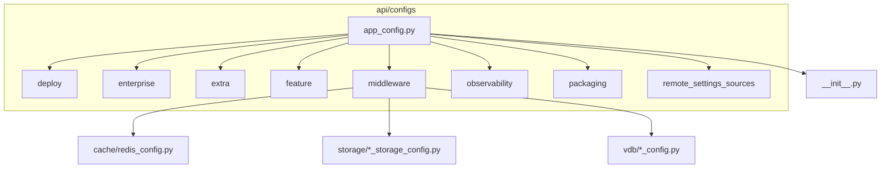
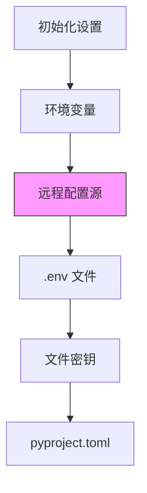
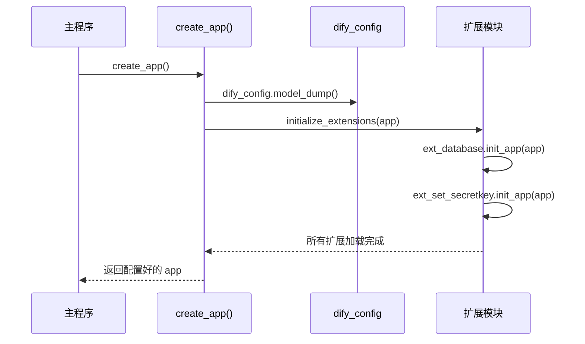

# 应用配置

<cite>
**本文档中引用的文件**  
- [app_config.py](file://api/configs/app_config.py)
- [middleware/__init__.py](file://api/configs/middleware/__init__.py)
- [middleware/cache/redis_config.py](file://api/configs/middleware/cache/redis_config.py)
- [__init__.py](file://api/configs/__init__.py)
- [app_factory.py](file://api/app_factory.py)
- [ext_set_secretkey.py](file://api/extensions/ext_set_secretkey.py)
- [ext_database.py](file://api/extensions/ext_database.py)
</cite>

## 目录
1. [简介](#简介)
2. [项目结构](#项目结构)
3. [核心配置项详解](#核心配置项详解)
4. [配置加载机制](#配置加载机制)
5. [环境管理与配置差异](#环境管理与配置差异)
6. [配置验证与错误处理](#配置验证与错误处理)
7. [最佳实践建议](#最佳实践建议)
8. [配置使用示例](#配置使用示例)
9. [结论](#结论)

## 简介
Dify 应用通过模块化的配置系统实现灵活的环境适配与功能扩展。本文档重点分析 `app_config.py` 中定义的核心配置结构，涵盖数据库、缓存、会话等关键参数的用途与配置方式。文档还将深入探讨配置的加载优先级、继承机制以及在不同部署环境中的实际应用。

## 项目结构
Dify 的配置系统采用分层设计，核心配置分散在 `api/configs` 目录下的多个子模块中，通过组合继承的方式构建最终的全局配置对象。

**图示来源**  
- [app_config.py](file://api/configs/app_config.py#L1-L113)
- [middleware/__init__.py](file://api/configs/middleware/__init__.py#L1-L353)

**本节来源**  
- [app_config.py](file://api/configs/app_config.py#L1-L113)
- [middleware/__init__.py](file://api/configs/middleware/__init__.py#L1-L353)

## 核心配置项详解
`DifyConfig` 类通过多重继承整合了多个配置模块，形成一个完整的应用配置对象。

### 数据库连接配置
数据库连接通过 `SQLALCHEMY_DATABASE_URI` 字符串进行配置，该字符串由 `DatabaseConfig` 类中的多个字段动态生成。

**: SQLALCHEMY_DATABASE_URI**
- **用途**: 定义 SQLAlchemy 使用的数据库连接字符串。
- **生成逻辑**: 由 `DB_HOST`, `DB_PORT`, `DB_USERNAME`, `DB_PASSWORD`, `DB_DATABASE` 等字段组合而成。
- **默认值**: `postgresql://postgres:@localhost:5432/dify`
- **配置文件**: [middleware/__init__.py](file://api/configs/middleware/__init__.py#L45-L95)

### 缓存配置
Redis 作为主要的缓存和消息代理，其配置由 `RedisConfig` 类定义。

**: REDIS_URL**
- **用途**: 提供 Redis 服务的连接信息。
- **关键参数**:
  - `REDIS_HOST`: Redis 服务器地址，默认 `localhost`
  - `REDIS_PORT`: 端口号，默认 `6379`
  - `REDIS_PASSWORD`: 认证密码，可选
  - `REDIS_USE_SSL`: 是否启用 SSL 连接
  - `REDIS_USE_SENTINEL`: 是否使用 Redis Sentinel 高可用模式
- **配置文件**: [middleware/cache/redis_config.py](file://api/configs/middleware/cache/redis_config.py#L1-L115)

### 会话设置
应用会话安全依赖于一个强密钥。

**: SECRET_KEY**
- **用途**: 用于 Flask 应用的会话加密和安全令牌生成。
- **重要性**: 必须在生产环境中设置一个长且随机的密钥，以防止会话劫持。
- **配置文件**: [app_config.py](file://api/configs/app_config.py#L113)

**本节来源**  
- [middleware/__init__.py](file://api/configs/middleware/__init__.py#L45-L95)
- [middleware/cache/redis_config.py](file://api/configs/middleware/cache/redis_config.py#L1-L115)
- [app_config.py](file://api/configs/app_config.py#L113)

## 配置加载机制
Dify 的配置系统遵循明确的加载优先级，确保环境变量可以覆盖默认值。

### 配置继承模式
`DifyConfig` 类通过继承多个配置类（如 `DeploymentConfig`, `FeatureConfig`, `MiddlewareConfig`）来聚合所有配置项。这是一种典型的组合模式，提高了配置的模块化和可维护性。

### 环境变量覆盖
配置系统支持从多种来源加载配置，其优先级顺序由 `settings_customise_sources` 方法定义。

**图示来源**  
- [app_config.py](file://api/configs/app_config.py#L105-L113)

**本节来源**  
- [app_config.py](file://api/configs/app_config.py#L105-L113)

## 环境管理与配置差异
Dify 通过 `.env` 文件和环境变量来区分不同环境的配置。

### 开发环境
- 数据库和 Redis 通常指向本地服务。
- `DEBUG` 模式开启，便于日志输出和调试。
- 可能使用内存数据库或模拟服务。

### 生产环境
- 所有服务（数据库、Redis、对象存储）均指向高可用的远程实例。
- `SECRET_KEY` 必须设置为强随机值。
- 启用监控和可观测性配置（如 Sentry、OpenTelemetry）。
- 关闭 `DEBUG` 模式。

### 配置差异管理
通过 `.env` 文件管理环境差异。例如，`.env.production` 文件包含生产环境的数据库密码和 API 密钥，而 `.env.development` 文件则使用测试凭据。

**本节来源**  
- [app_config.py](file://api/configs/app_config.py#L95-L98)
- [middleware/__init__.py](file://api/configs/middleware/__init__.py#L1-L353)

## 配置验证与错误处理
配置系统内置了基本的验证机制。

- **字段类型验证**: 使用 Pydantic 的类型系统确保配置值的正确性（如 `PositiveInt`, `NonNegativeFloat`）。
- **计算字段**: `SQLALCHEMY_DATABASE_URI` 是一个 `@computed_field`，它在运行时根据其他字段动态生成，避免了手动拼接错误。
- **错误处理**: 在 `RemoteSettingsSourceFactory` 中，对于不支持的远程配置源，系统会记录警告日志并安全地返回空字典，而不是抛出异常。

**本节来源**  
- [middleware/__init__.py](file://api/configs/middleware/__init__.py#L75-L95)
- [app_config.py](file://api/configs/app_config.py#L55-L65)

## 最佳实践建议
1. **密钥安全**: `SECRET_KEY` 和数据库密码等敏感信息绝不应硬编码在代码中，应通过环境变量或密钥管理服务提供。
2. **配置分离**: 利用 `.env` 文件将配置与代码分离，便于在不同环境中部署。
3. **默认值设计**: 为所有配置项提供合理的默认值，确保应用在最小配置下也能启动。
4. **文档化**: 为每个配置项提供清晰的 `description`，方便团队成员理解其用途。
5. **远程配置**: 在微服务架构中，考虑使用 Apollo 或 Nacos 等远程配置中心，实现配置的动态更新。

## 配置使用示例
配置对象在应用启动时被加载并注入到 Flask 应用实例中。

**图示来源**  
- [app_factory.py](file://api/app_factory.py#L15-L45)
- [ext_set_secretkey.py](file://api/extensions/ext_set_secretkey.py#L1-L7)
- [ext_database.py](file://api/extensions/ext_database.py#L1-L55)

**本节来源**  
- [app_factory.py](file://api/app_factory.py#L15-L45)
- [ext_set_secretkey.py](file://api/extensions/ext_set_secretkey.py#L1-L7)
- [ext_database.py](file://api/extensions/ext_database.py#L1-L55)

## 结论
Dify 的应用配置系统设计精良，通过 Pydantic Settings 和模块化继承，实现了配置的清晰、安全和灵活。理解其加载机制和各核心参数的用途，对于成功部署和运维 Dify 应用至关重要。遵循最佳实践，可以确保应用在各种环境中稳定、安全地运行。