# 本地配置

<cite>
**本文档中引用的文件**  
- [app_config.py](file://api/configs/app_config.py)
- [feature/__init__.py](file://api/configs/feature/__init__.py)
- [middleware/__init__.py](file://api/configs/middleware/__init__.py)
- [middleware/cache/redis_config.py](file://api/configs/middleware/cache/redis_config.py)
- [middleware/storage/aliyun_oss_storage_config.py](file://api/configs/middleware/storage/aliyun_oss_storage_config.py)
- [middleware/vdb/milvus_config.py](file://api/configs/middleware/vdb/milvus_config.py)
- [extra/sentry_config.py](file://api/configs/extra/sentry_config.py)
- [extra/notion_config.py](file://api/configs/extra/notion_config.py)
- [remote_settings_sources/__init__.py](file://api/configs/remote_settings_sources/__init__.py)
</cite>

## 目录
1. [简介](#简介)
2. [项目结构](#项目结构)
3. [核心组件](#核心组件)
4. [架构概述](#架构概述)
5. [详细组件分析](#详细组件分析)
6. [依赖分析](#依赖分析)
7. [性能考虑](#性能考虑)
8. [故障排除指南](#故障排除指南)
9. [结论](#结论)
10. [附录](#附录)（如有必要）

## 简介
本文档详细介绍了Dify本地配置系统的组织架构，重点阐述基于Python模块的配置管理机制。文档涵盖应用级配置结构设计、功能开关实现机制、中间件配置模式以及配置继承与环境变量覆盖的最佳实践。通过系统性分析`app_config.py`中的DifyConfig类及其继承体系，揭示了配置系统的模块化设计原则和灵活的扩展能力。同时，深入解析了feature目录下的功能特性配置、middleware目录中的缓存/存储/向量数据库配置，以及configs包内各子模块的职责划分，为开发者提供全面的配置系统理解和使用指导。

## 项目结构
Dify的配置系统采用模块化设计，所有配置文件集中存放在`api/configs`目录下，通过清晰的子目录划分实现功能分离。该结构支持配置的可维护性和可扩展性，允许按功能领域组织配置项。

**图示来源**  
- [app_config.py](file://api/configs/app_config.py#L1-L113)
- [feature/__init__.py](file://api/configs/feature/__init__.py#L1-L799)
- [middleware/__init__.py](file://api/configs/middleware/__init__.py#L1-L352)

**本节来源**  
- [api/configs](file://api/configs)

## 核心组件
Dify配置系统的核心是`DifyConfig`类，它通过多重继承机制整合了多个配置模块，实现了配置的模块化和可组合性。该类定义在`app_config.py`中，继承自PackagingInfo、DeploymentConfig、FeatureConfig、MiddlewareConfig等多个配置类，形成一个完整的应用配置集合。`DifyConfig`利用Pydantic的BaseSettings特性，支持从环境变量、.env文件、远程配置源（如Apollo、Nacos）等多种方式加载配置，并通过`settings_customise_sources`方法自定义配置源的优先级顺序，确保配置加载的灵活性和可靠性。

**本节来源**  
- [app_config.py](file://api/configs/app_config.py#L1-L113)

## 架构概述
Dify的配置系统采用分层架构设计，以`DifyConfig`为核心，通过继承机制整合各个功能领域的配置模块。系统支持多层级配置源，包括本地环境变量、.env文件、远程配置中心（Apollo/Nacos）和pyproject.toml文件，配置加载顺序决定了优先级。这种设计使得配置既可以在开发环境中通过环境变量快速调整，也可以在生产环境中通过远程配置中心进行集中管理。

**图示来源**  
- [app_config.py](file://api/configs/app_config.py#L1-L113)
- [feature/__init__.py](file://api/configs/feature/__init__.py#L1-L799)
- [middleware/__init__.py](file://api/configs/middleware/__init__.py#L1-L352)

## 详细组件分析
本节深入分析Dify配置系统的关键组件，包括应用级配置、功能开关、中间件配置等核心模块的实现机制和使用方式。

### 应用级配置分析
`app_config.py`中的`DifyConfig`类是整个配置系统的核心，它通过多重继承整合了所有配置模块。该类利用Pydantic Settings的特性，支持类型安全的配置定义和验证。`model_config`中定义了配置源的优先级：init_settings > env_settings > RemoteSettingsSourceFactory > dotenv_settings > file_secret_settings > TomlConfigSettingsSource，确保了配置的灵活性和可覆盖性。

**图示来源**  
- [app_config.py](file://api/configs/app_config.py#L1-L113)

**本节来源**  
- [app_config.py](file://api/configs/app_config.py#L1-L113)

### 功能开关实现机制
`feature`目录下的配置实现了Dify的功能开关机制，通过布尔类型的配置项控制特定功能的启用或禁用。这种设计使得系统功能可以灵活配置，支持不同部署场景的需求。例如，`MARKETPLACE_ENABLED`控制应用市场功能的开关，`BILLING_ENABLED`控制计费功能的启用状态。

```mermaid
classDiagram
class SecurityConfig {
+SECRET_KEY : str
+LOGIN_DISABLED : bool
+ADMIN_API_KEY_ENABLE : bool
}
class AppExecutionConfig {
+APP_MAX_EXECUTION_TIME : int
+APP_MAX_ACTIVE_REQUESTS : int
+APP_DAILY_RATE_LIMIT : int
}
class CodeExecutionSandboxConfig {
+CODE_EXECUTION_ENDPOINT : HttpUrl
+CODE_EXECUTION_API_KEY : str
}
class PluginConfig {
+PLUGIN_DAEMON_URL : HttpUrl
+PLUGIN_DAEMON_KEY : str
+PLUGIN_MAX_PACKAGE_SIZE : int
}
class MarketplaceConfig {
+MARKETPLACE_ENABLED : bool
+MARKETPLACE_API_URL : HttpUrl
}
class HttpConfig {
+API_COMPRESSION_ENABLED : bool
+CONSOLE_CORS_ALLOW_ORIGINS : list[str]
}
class InnerAPIConfig {
+INNER_API : bool
+INNER_API_KEY : str
}
class LoggingConfig {
+LOG_LEVEL : str
+LOG_FILE : str
}
class ModelLoadBalanceConfig {
+MODEL_LB_ENABLED : bool
+PLUGIN_BASED_TOKEN_COUNTING_ENABLED : bool
}
class BillingConfig {
+BILLING_ENABLED : bool
}
class UpdateConfig {
+CHECK_UPDATE_URL : str
}
SecurityConfig <|-- FeatureConfig
AppExecutionConfig <|-- FeatureConfig
CodeExecutionSandboxConfig <|-- FeatureConfig
PluginConfig <|-- FeatureConfig
MarketplaceConfig <|-- FeatureConfig
HttpConfig <|-- FeatureConfig
InnerAPIConfig <|-- FeatureConfig
LoggingConfig <|-- FeatureConfig
ModelLoadBalanceConfig <|-- FeatureConfig
BillingConfig <|-- FeatureConfig
UpdateConfig <|-- FeatureConfig
```

**图示来源**  
- [feature/__init__.py](file://api/configs/feature/__init__.py#L1-L799)

**本节来源**  
- [feature/__init__.py](file://api/configs/feature/__init__.py#L1-L799)

### 中间件配置模式
`middleware`目录下的配置定义了各类中间件的连接参数和行为设置，包括数据库、缓存、存储和向量数据库等。这些配置通过统一的`MiddlewareConfig`基类进行管理，支持多种实现方式的切换。

**图示来源**  
- [middleware/__init__.py](file://api/configs/middleware/__init__.py#L1-L352)
- [middleware/cache/redis_config.py](file://api/configs/middleware/cache/redis_config.py#L1-L115)
- [middleware/storage/aliyun_oss_storage_config.py](file://api/configs/middleware/storage/aliyun_oss_storage_config.py#L1-L45)
- [middleware/vdb/milvus_config.py](file://api/configs/middleware/vdb/milvus_config.py#L1-L46)

**本节来源**  
- [middleware/__init__.py](file://api/configs/middleware/__init__.py#L1-L352)
- [middleware/cache/redis_config.py](file://api/configs/middleware/cache/redis_config.py#L1-L115)
- [middleware/storage/aliyun_oss_storage_config.py](file://api/configs/middleware/storage/aliyun_oss_storage_config.py#L1-L45)
- [middleware/vdb/milvus_config.py](file://api/configs/middleware/vdb/milvus_config.py#L1-L46)

### 配置继承与覆盖机制
Dify配置系统通过Pydantic Settings的`settings_customise_sources`方法实现了灵活的配置继承和覆盖机制。系统支持多层级配置源，按照优先级顺序加载配置，后加载的配置会覆盖先加载的同名配置项。

**图示来源**  
- [app_config.py](file://api/configs/app_config.py#L1-L113)

**本节来源**  
- [app_config.py](file://api/configs/app_config.py#L1-L113)

## 依赖分析
Dify配置系统的依赖关系清晰，各配置模块通过明确的导入关系相互关联。`app_config.py`作为核心入口，依赖于所有其他配置模块，而各功能模块之间保持相对独立，降低了耦合度。

**图示来源**  
- [app_config.py](file://api/configs/app_config.py#L1-L113)
- [feature/__init__.py](file://api/configs/feature/__init__.py#L1-L799)
- [middleware/__init__.py](file://api/configs/middleware/__init__.py#L1-L352)

**本节来源**  
- [app_config.py](file://api/configs/app_config.py#L1-L113)
- [feature/__init__.py](file://api/configs/feature/__init__.py#L1-L799)
- [middleware/__init__.py](file://api/configs/middleware/__init__.py#L1-L352)

## 性能考虑
Dify配置系统在设计时考虑了性能因素，通过合理的配置缓存和延迟加载机制减少运行时开销。系统利用Pydantic的高效数据验证和转换能力，在配置加载时完成类型检查和默认值设置，避免了运行时的重复计算。对于复杂的配置项，如数据库连接字符串，系统采用`@computed_field`装饰器实现按需计算，减少不必要的字符串拼接操作。

## 故障排除指南
当遇到配置相关问题时，建议按照以下步骤进行排查：
1. 检查环境变量是否正确设置，环境变量具有较高的优先级
2. 验证`.env`文件是否存在且格式正确
3. 确认远程配置源（如Apollo/Nacos）是否可达且配置正确
4. 检查`pyproject.toml`文件中的配置项是否符合预期
5. 查看日志输出，特别是配置加载过程中的警告和错误信息

**本节来源**  
- [app_config.py](file://api/configs/app_config.py#L1-L113)
- [feature/__init__.py](file://api/configs/feature/__init__.py#L1-L799)
- [middleware/__init__.py](file://api/configs/middleware/__init__.py#L1-L352)

## 结论
Dify的本地配置系统通过模块化设计和多重继承机制，实现了配置的可维护性和灵活性。系统支持多层级配置源，允许通过环境变量、.env文件、远程配置中心等多种方式管理配置，满足不同部署场景的需求。各功能领域的配置被合理组织在独立的模块中，降低了耦合度，提高了代码的可读性和可维护性。通过Pydantic Settings的强大功能，系统实现了类型安全的配置管理、灵活的配置继承和覆盖机制，为应用的稳定运行提供了可靠保障。