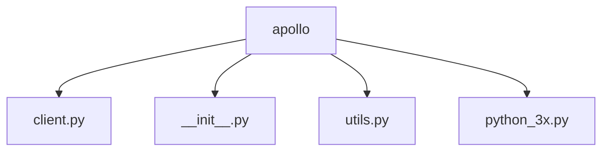
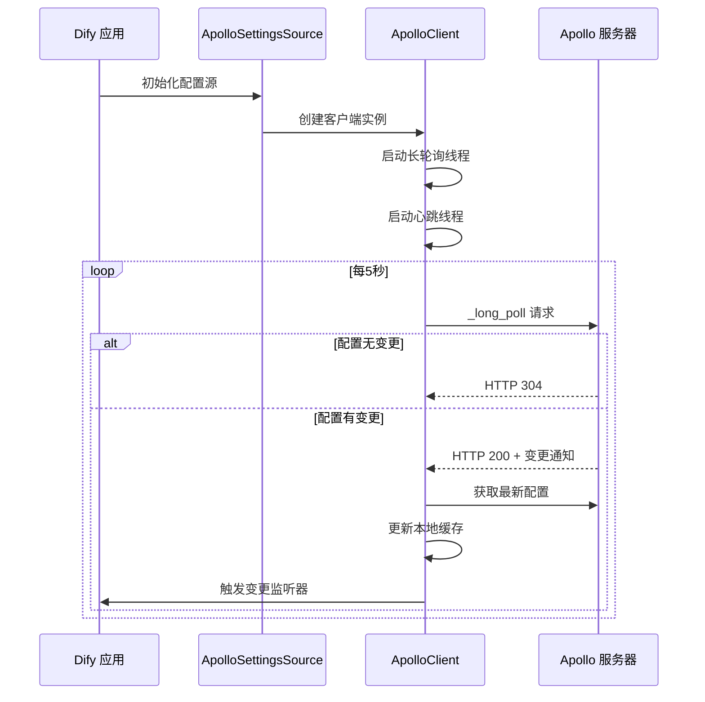
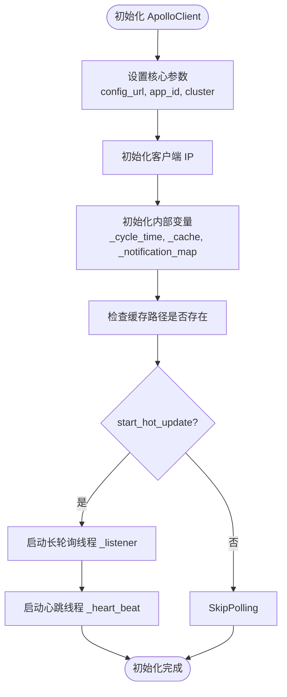
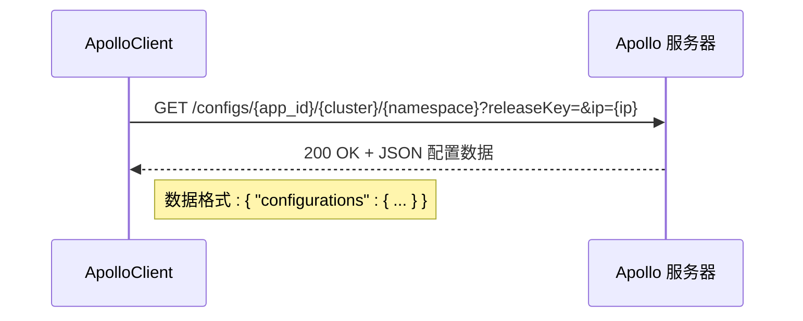
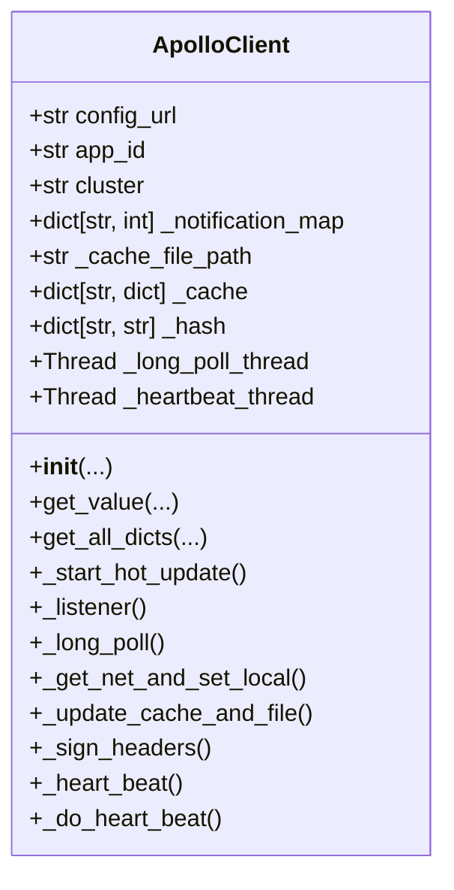
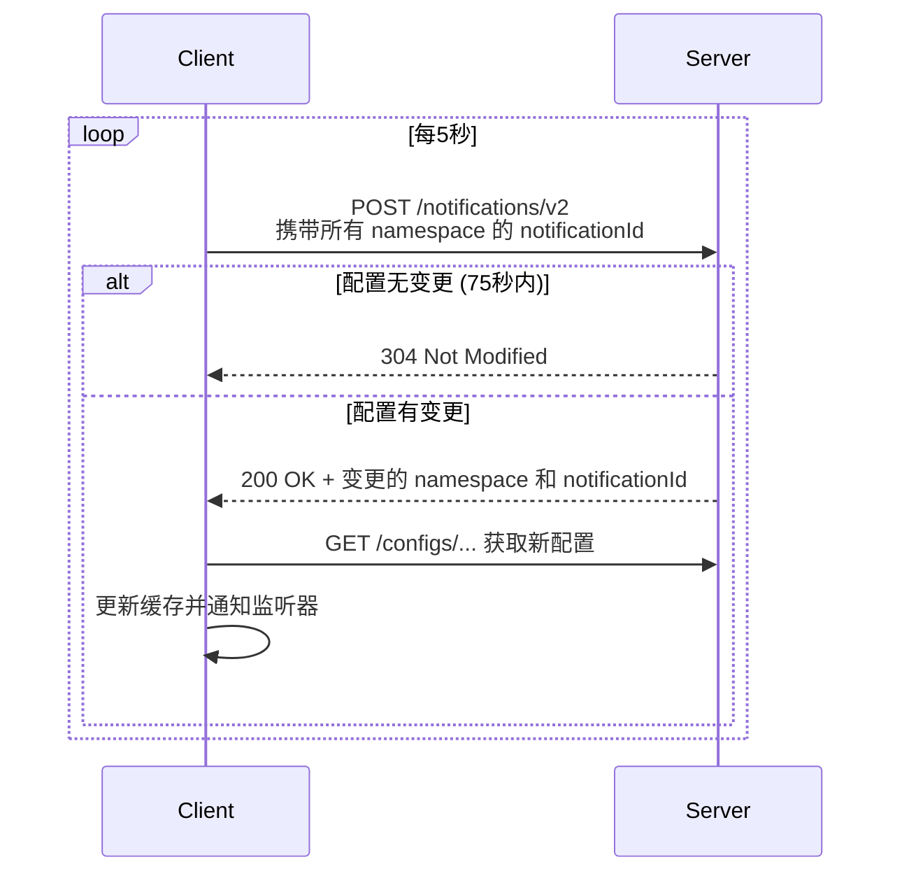
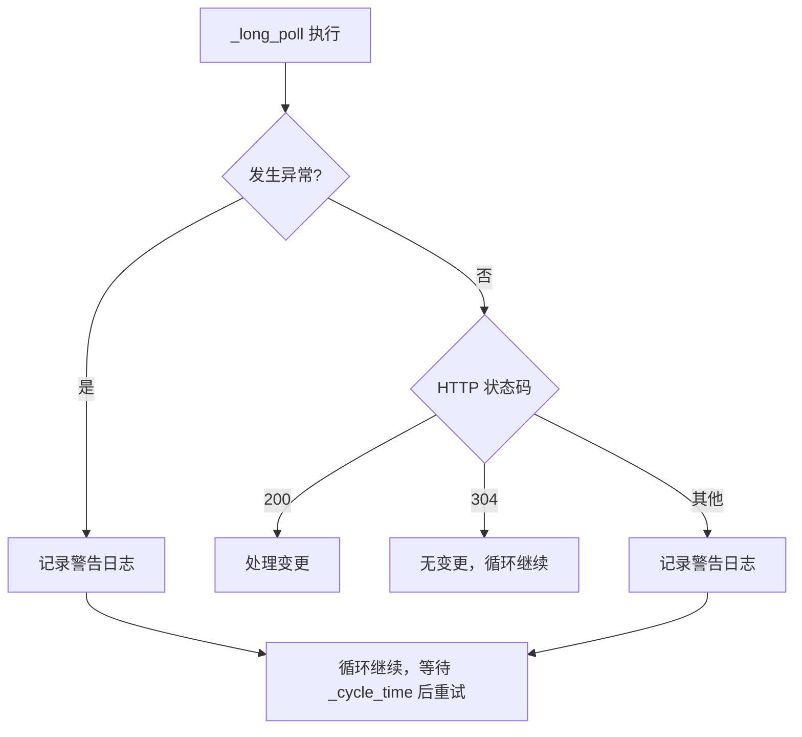
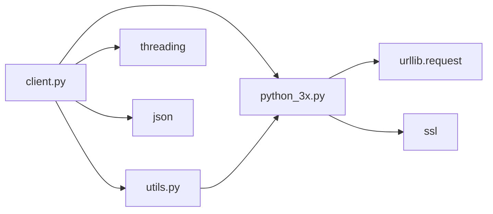

# Apollo 配置中心

<cite>
**本文档中引用的文件**  
- [client.py](file://api/configs/remote_settings_sources/apollo/client.py)
- [__init__.py](file://api/configs/remote_settings_sources/apollo/__init__.py)
- [utils.py](file://api/configs/remote_settings_sources/apollo/utils.py)
- [python_3x.py](file://api/configs/remote_settings_sources/apollo/python_3x.py)
</cite>

## 目录
1. [简介](#简介)
2. [项目结构](#项目结构)
3. [核心组件](#核心组件)
4. [架构概述](#架构概述)
5. [详细组件分析](#详细组件分析)
6. [依赖分析](#依赖分析)
7. [性能考虑](#性能考虑)
8. [故障排查指南](#故障排查指南)
9. [结论](#结论)

## 简介
本文档详细解析 Dify 与 Apollo 配置中心的集成机制。重点分析 Apollo 客户端的实现原理，包括初始化流程、服务发现、配置拉取、命名空间管理、配置格式解析、长轮询更新机制、错误处理与重试策略，以及配置热更新的最佳实践。

## 项目结构
Dify 的 Apollo 集成模块位于 `api/configs/remote_settings_sources/apollo` 目录下，包含客户端实现、工具函数和初始化逻辑。



**图示来源**  
- [client.py](file://api/configs/remote_settings_sources/apollo/client.py#L1-L307)
- [__init__.py](file://api/configs/remote_settings_sources/apollo/__init__.py#L1-L56)
- [utils.py](file://api/configs/remote_settings_sources/apollo/utils.py#L1-L53)
- [python_3x.py](file://api/configs/remote_settings_sources/apollo/python_3x.py#L1-L44)

**本节来源**  
- [client.py](file://api/configs/remote_settings_sources/apollo/client.py#L1-L307)
- [__init__.py](file://api/configs/remote_settings_sources/apollo/__init__.py#L1-L56)

## 核心组件
核心组件包括 `ApolloClient` 类，负责与 Apollo 服务器通信，实现配置的获取、缓存和热更新。`ApolloSettingsSource` 类作为适配层，将 Apollo 配置集成到 Dify 的配置系统中。

**本节来源**  
- [client.py](file://api/configs/remote_settings_sources/apollo/client.py#L1-L307)
- [__init__.py](file://api/configs/remote_settings_sources/apollo/__init__.py#L1-L56)

## 架构概述
Dify 通过 Apollo 客户端与 Apollo 配置中心进行交互，采用长轮询机制实现配置的实时更新。客户端在初始化时建立连接，并通过后台线程定期检查配置变更。



**图示来源**  
- [client.py](file://api/configs/remote_settings_sources/apollo/client.py#L150-L200)
- [__init__.py](file://api/configs/remote_settings_sources/apollo/__init__.py#L45-L54)

## 详细组件分析

### ApolloClient 初始化过程
`ApolloClient` 在初始化时接收 `config_url`、`app_id`、`cluster` 等核心参数，并设置默认值。同时初始化 IP 地址、缓存路径、通知映射等内部状态。若 `start_hot_update` 为真，则启动长轮询线程以监听配置变更。



**图示来源**  
- [client.py](file://api/configs/remote_settings_sources/apollo/client.py#L25-L81)

**本节来源**  
- [client.py](file://api/configs/remote_settings_sources/apollo/client.py#L25-L81)

### 服务发现与配置拉取
客户端通过 `get_json_from_net` 方法从 Apollo 服务器拉取配置。该方法构造包含 `app_id`、`cluster`、`namespace` 和客户端 IP 的 URL，发送 HTTP 请求获取配置数据。支持通过 `secret` 进行签名认证。



**图示来源**  
- [client.py](file://api/configs/remote_settings_sources/apollo/client.py#L83-L104)

**本节来源**  
- [client.py](file://api/configs/remote_settings_sources/apollo/client.py#L83-L104)

### 命名空间管理
Apollo 通过 `app_id`、`cluster` 和 `namespace` 实现多环境、多集群的配置隔离。`_notification_map` 字典记录每个命名空间的最新通知 ID，用于长轮询时判断配置是否变更。



**图示来源**  
- [client.py](file://api/configs/remote_settings_sources/apollo/client.py#L25-L307)

**本节来源**  
- [client.py](file://api/configs/remote_settings_sources/apollo/client.py#L25-L307)

### 配置格式解析
Apollo 服务器返回的配置数据为 JSON 格式，其中 `configurations` 字段包含实际的键值对。客户端通过 `get_value_from_dict` 工具函数从嵌套的字典结构中提取指定键的值。

```mermaid
flowchart TD
A[收到 JSON 响应] --> B{解析 JSON}
B --> C[提取 "configurations" 字段]
C --> D{是否包含目标 key?}
D --> |是| E[返回对应 value]
D --> |否| F[尝试从本地缓存获取]
F --> G{本地缓存存在?}
G --> |是| H[返回缓存值并更新内存]
G --> |否| I[返回默认值并标记为无此 key]
```

**图示来源**  
- [client.py](file://api/configs/remote_settings_sources/apollo/client.py#L106-L148)
- [utils.py](file://api/configs/remote_settings_sources/apollo/utils.py#L30-L45)

**本节来源**  
- [client.py](file://api/configs/remote_settings_sources/apollo/client.py#L106-L148)
- [utils.py](file://api/configs/remote_settings_sources/apollo/utils.py#L30-L45)

### 长轮询配置更新机制
客户端通过 `_long_poll` 方法实现长轮询。该方法向 `/notifications/v2` 端点发送请求，携带所有监听命名空间的当前通知 ID。服务器在配置变更时立即返回 200 响应，否则最长等待 75 秒后返回 304。



**图示来源**  
- [client.py](file://api/configs/remote_settings_sources/apollo/client.py#L199-L249)

**本节来源**  
- [client.py](file://api/configs/remote_settings_sources/apollo/client.py#L199-L249)

### 错误处理与重试策略
客户端在 HTTP 请求中设置超时时间（`_pull_timeout=75` 秒），并在异常时记录日志。长轮询循环在异常后会休眠 `_cycle_time=5` 秒后重试。心跳线程每 10 分钟发送一次请求，用于维持客户端状态。



**图示来源**  
- [client.py](file://api/configs/remote_settings_sources/apollo/client.py#L218-L249)

**本节来源**  
- [client.py](file://api/configs/remote_settings_sources/apollo/client.py#L218-L249)

### 配置热更新最佳实践
通过 `change_listener` 回调函数实现配置热更新。当 `_get_net_and_set_local` 检测到配置变更时，会调用 `_call_listener`，比较新旧配置的差异，并触发 "add"、"delete" 或 "update" 事件，确保配置变更实时生效。

```mermaid
flowchart TD
A[检测到配置变更] --> B[获取新旧配置字典]
B --> C[遍历旧配置]
C --> D{新配置中是否存在该 key?}
D --> |否| E[触发 "delete" 事件]
D --> |是| F{值是否改变?}
F --> |是| G[触发 "update" 事件]
F --> |否| H[无操作]
C --> I[遍历新配置]
I --> J{旧配置中是否存在该 key?}
J --> |否| K[触发 "add" 事件]
J --> |是| L[已处理]
```

**图示来源**  
- [client.py](file://api/configs/remote_settings_sources/apollo/client.py#L152-L189)

**本节来源**  
- [client.py](file://api/configs/remote_settings_sources/apollo/client.py#L152-L189)

## 依赖分析
Apollo 客户端模块依赖 Python 标准库（如 `threading`、`json`、`urllib`）和项目内部工具模块（`python_3x.py`、`utils.py`）。通过 `http_request` 封装网络请求，处理 SSL 证书验证。



**图示来源**  
- [client.py](file://api/configs/remote_settings_sources/apollo/client.py#L1-L30)
- [utils.py](file://api/configs/remote_settings_sources/apollo/utils.py#L1-L10)
- [python_3x.py](file://api/configs/remote_settings_sources/apollo/python_3x.py#L1-L44)

**本节来源**  
- [client.py](file://api/configs/remote_settings_sources/apollo/client.py#L1-L30)
- [utils.py](file://api/configs/remote_settings_sources/apollo/utils.py#L1-L10)
- [python_3x.py](file://api/configs/remote_settings_sources/apollo/python_3x.py#L1-L44)

## 性能考虑
- **缓存机制**：配置数据在内存（`_cache`）和本地文件（`_cache_file_path`）中双重缓存，通过 MD5 哈希值（`_hash`）避免重复写入。
- **长轮询优化**：使用 75 秒超时和 5 秒轮询间隔，在实时性和服务器负载间取得平衡。
- **异步线程**：长轮询和心跳在独立的守护线程中运行，不阻塞主应用。

## 故障排查指南
- **配置无法更新**：检查 `secret` 是否正确，`_sign_headers` 生成的签名是否有效。
- **网络连接失败**：确认 `config_url` 可访问，SSL 上下文（`ssl_context`）配置是否允许目标服务器证书。
- **长轮询无响应**：检查 `_notification_map` 初始化是否正确，确保监听的命名空间有变更。
- **缓存未生效**：验证 `_cache_file_path` 目录权限，确保可读写。

**本节来源**  
- [client.py](file://api/configs/remote_settings_sources/apollo/client.py#L1-L307)
- [python_3x.py](file://api/configs/remote_settings_sources/apollo/python_3x.py#L1-L44)

## 结论
Dify 的 Apollo 集成通过 `ApolloClient` 类实现了稳定、高效的配置管理。其核心机制包括基于长轮询的实时更新、多级缓存、安全认证和错误重试，确保了配置变更能够热更新且不影响系统稳定性。开发者应正确配置 `app_id`、`cluster`、`namespace` 和 `secret`，并合理使用 `change_listener` 来响应配置变化。