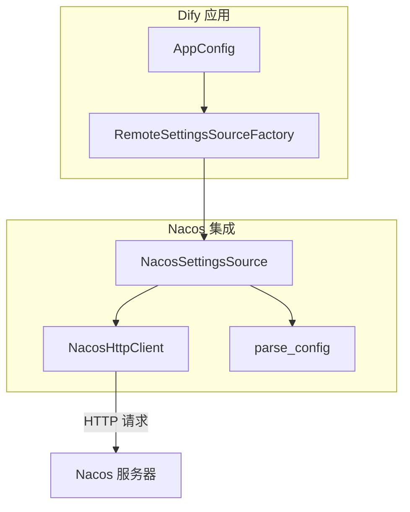
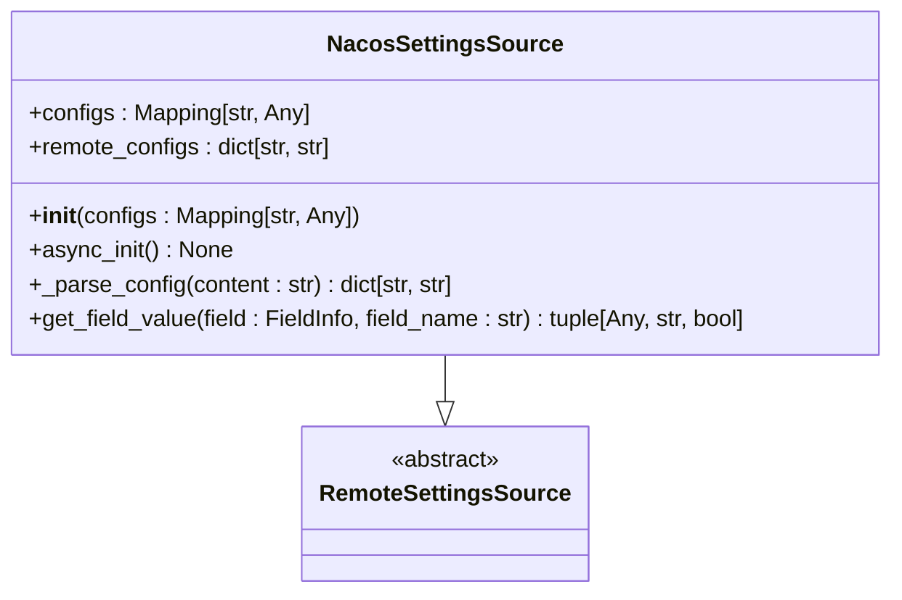
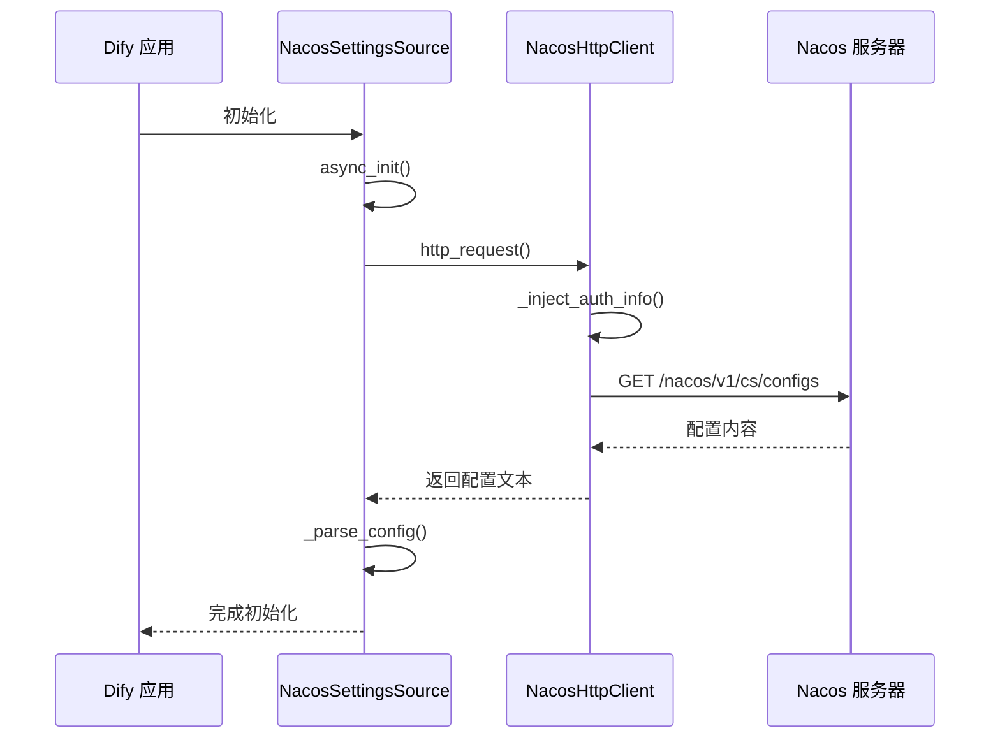
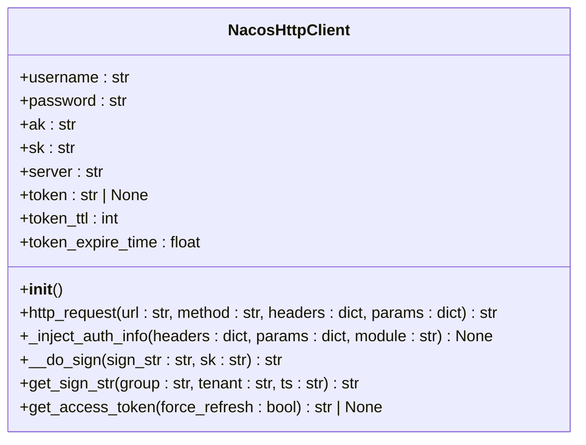
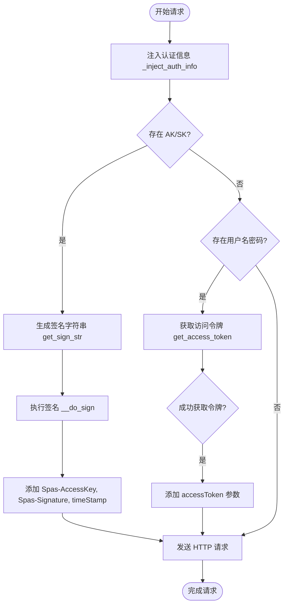
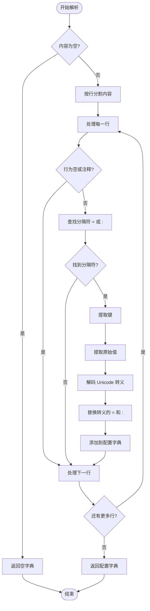
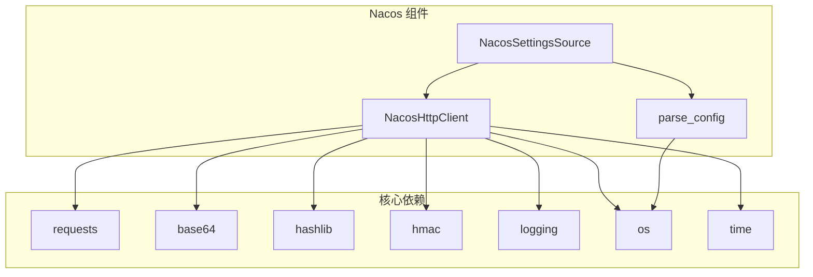

# Nacos 配置中心

<cite>
**本文档引用的文件**  
- [nacos/__init__.py](file://api/configs/remote_settings_sources/nacos/__init__.py)
- [nacos/http_request.py](file://api/configs/remote_settings_sources/nacos/http_request.py)
- [nacos/utils.py](file://api/configs/remote_settings_sources/nacos/utils.py)
</cite>

## 目录
1. [简介](#简介)
2. [项目结构](#项目结构)
3. [核心组件](#核心组件)
4. [架构概述](#架构概述)
5. [详细组件分析](#详细组件分析)
6. [依赖分析](#依赖分析)
7. [性能考虑](#性能考虑)
8. [故障排查指南](#故障排查指南)
9. [结论](#结论)

## 简介
本文档全面解析 Dify 与 Nacos 配置中心的集成实现。重点阐述 Nacos HTTP API 的调用机制，包括配置获取、监听和发布接口的封装设计。深入分析 NacosHttpRequest 类如何构建符合 Nacos API 规范的 HTTP 请求，处理认证、超时和重试逻辑。详细说明配置监听器的注册机制，通过长轮询实现配置变更的实时通知。解释 data_id、group 和 namespace 的组织方式，以及多环境配置管理的实现策略。描述配置缓存机制，本地缓存与远程配置的同步策略。最后提供 Nacos 配置中心的高可用部署建议，包括集群模式、健康检查和故障恢复的最佳实践。

## 项目结构
Dify 的 Nacos 集成模块位于 `api/configs/remote_settings_sources/nacos` 目录下，采用模块化设计，包含核心请求处理、配置解析和初始化逻辑。

```mermaid
graph TD
subgraph "Nacos 集成模块"
Init[nacos/__init__.py<br/>NacosSettingsSource]
HttpRequest[nacos/http_request.py<br/>NacosHttpClient]
Utils[nacos/utils.py<br/>parse_config]
end
Init --> HttpRequest : "使用"
Init --> Utils : "使用"
HttpRequest --> |发送请求| NacosServer[Nacos 服务器]
```

**Diagram sources**
- [nacos/__init__.py](file://api/configs/remote_settings_sources/nacos/__init__.py#L1-L50)
- [nacos/http_request.py](file://api/configs/remote_settings_sources/nacos/http_request.py#L1-L91)
- [nacos/utils.py](file://api/configs/remote_settings_sources/nacos/utils.py#L1-L32)

**Section sources**
- [nacos/__init__.py](file://api/configs/remote_settings_sources/nacos/__init__.py#L1-L50)
- [nacos/http_request.py](file://api/configs/remote_settings_sources/nacos/http_request.py#L1-L91)

## 核心组件
本模块的核心组件包括 `NacosSettingsSource` 类，负责与 Nacos 配置中心交互，以及 `NacosHttpClient` 类，封装了底层 HTTP 请求逻辑。`parse_config` 函数则负责将从 Nacos 获取的配置内容解析为字典格式。

**Section sources**
- [nacos/__init__.py](file://api/configs/remote_settings_sources/nacos/__init__.py#L16-L48)
- [nacos/http_request.py](file://api/configs/remote_settings_sources/nacos/http_request.py#L10-L35)
- [nacos/utils.py](file://api/configs/remote_settings_sources/nacos/utils.py#L1-L32)

## 架构概述
Dify 通过 `NacosSettingsSource` 类实现与 Nacos 配置中心的集成。该类在初始化时通过 `NacosHttpClient` 发起 HTTP 请求获取远程配置，并使用 `parse_config` 函数解析配置内容。整个架构采用分层设计，分离了配置获取、请求处理和配置解析的职责。



**Diagram sources**
- [nacos/__init__.py](file://api/configs/remote_settings_sources/nacos/__init__.py#L16-L48)
- [nacos/http_request.py](file://api/configs/remote_settings_sources/nacos/http_request.py#L10-L35)

## 详细组件分析

### NacosSettingsSource 分析
`NacosSettingsSource` 类是 Dify 与 Nacos 集成的核心，继承自 `RemoteSettingsSource` 基类。它在初始化时通过 `async_init` 方法从 Nacos 获取配置。



**Diagram sources**
- [nacos/__init__.py](file://api/configs/remote_settings_sources/nacos/__init__.py#L16-L48)

#### 配置获取流程


**Diagram sources**
- [nacos/__init__.py](file://api/configs/remote_settings_sources/nacos/__init__.py#L25-L48)
- [nacos/http_request.py](file://api/configs/remote_settings_sources/nacos/http_request.py#L37-L71)

### NacosHttpClient 分析
`NacosHttpClient` 类负责封装与 Nacos 服务器的 HTTP 通信，处理认证、签名和令牌管理。



**Diagram sources**
- [nacos/http_request.py](file://api/configs/remote_settings_sources/nacos/http_request.py#L10-L35)

#### 认证与签名流程


**Diagram sources**
- [nacos/http_request.py](file://api/configs/remote_settings_sources/nacos/http_request.py#L37-L71)

### 配置解析分析
`parse_config` 函数负责将从 Nacos 获取的配置文本解析为键值对字典，支持标准的 properties 文件格式。



**Diagram sources**
- [nacos/utils.py](file://api/configs/remote_settings_sources/nacos/utils.py#L1-L32)

## 依赖分析
Nacos 集成模块依赖于 Python 标准库和第三方库，构建了一个完整的配置管理解决方案。



**Diagram sources**
- [nacos/http_request.py](file://api/configs/remote_settings_sources/nacos/http_request.py#L1-L15)
- [nacos/__init__.py](file://api/configs/remote_settings_sources/nacos/__init__.py#L1-L15)

## 性能考虑
Nacos 集成模块在设计时考虑了性能优化，包括令牌缓存、签名计算优化和异常处理机制。`NacosHttpClient` 类缓存了访问令牌，避免了频繁的认证请求。签名计算采用高效的 HMAC-SHA1 算法，并在需要时才重新生成。异常处理机制确保了在网络问题或服务器错误时的优雅降级。

## 故障排查指南
当 Nacos 集成出现问题时，可以检查以下方面：
- 环境变量配置是否正确（DIFY_ENV_NACOS_SERVER_ADDR, DIFY_ENV_NACOS_USERNAME 等）
- 网络连接是否正常，Nacos 服务器是否可达
- 认证信息（用户名/密码或 AK/SK）是否正确
- data_id、group 和 namespace 配置是否匹配 Nacos 中的实际配置
- 日志中是否有相关的错误信息

**Section sources**
- [nacos/http_request.py](file://api/configs/remote_settings_sources/nacos/http_request.py#L70-L89)
- [nacos/__init__.py](file://api/configs/remote_settings_sources/nacos/__init__.py#L25-L48)

## 结论
Dify 与 Nacos 配置中心的集成实现了灵活、安全的远程配置管理。通过 `NacosSettingsSource` 和 `NacosHttpClient` 类的协同工作，系统能够可靠地从 Nacos 获取配置，支持多种认证方式，并具有良好的错误处理机制。该集成方案为 Dify 提供了强大的配置管理能力，支持多环境部署和动态配置更新。