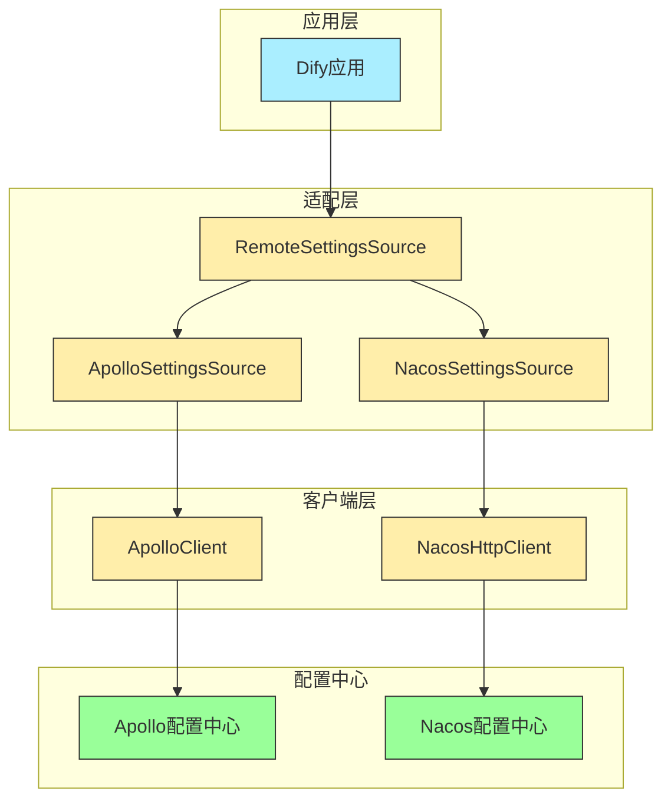
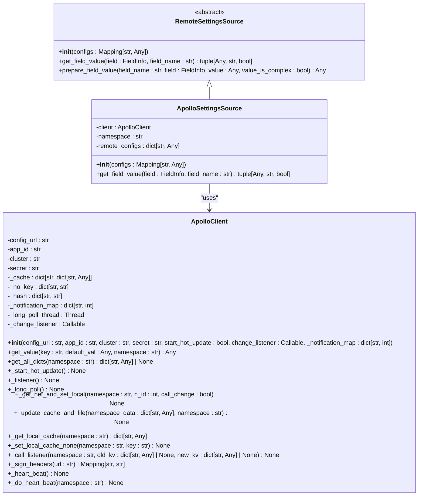
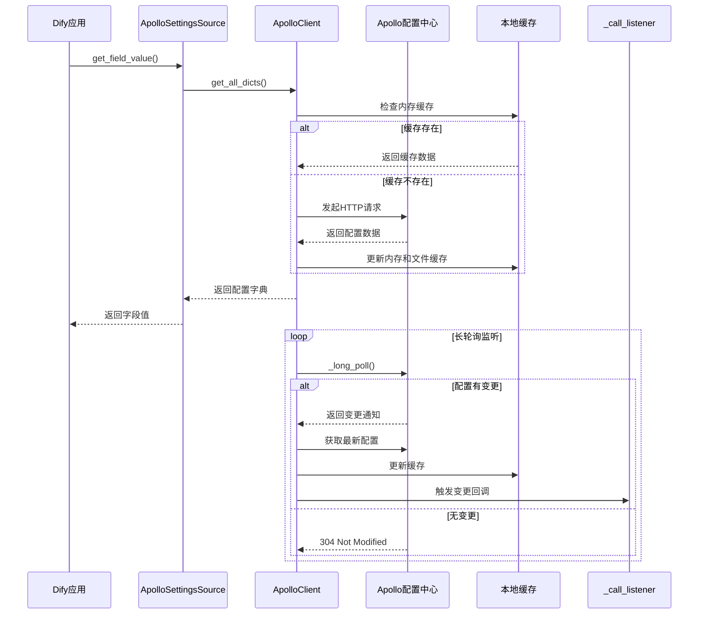
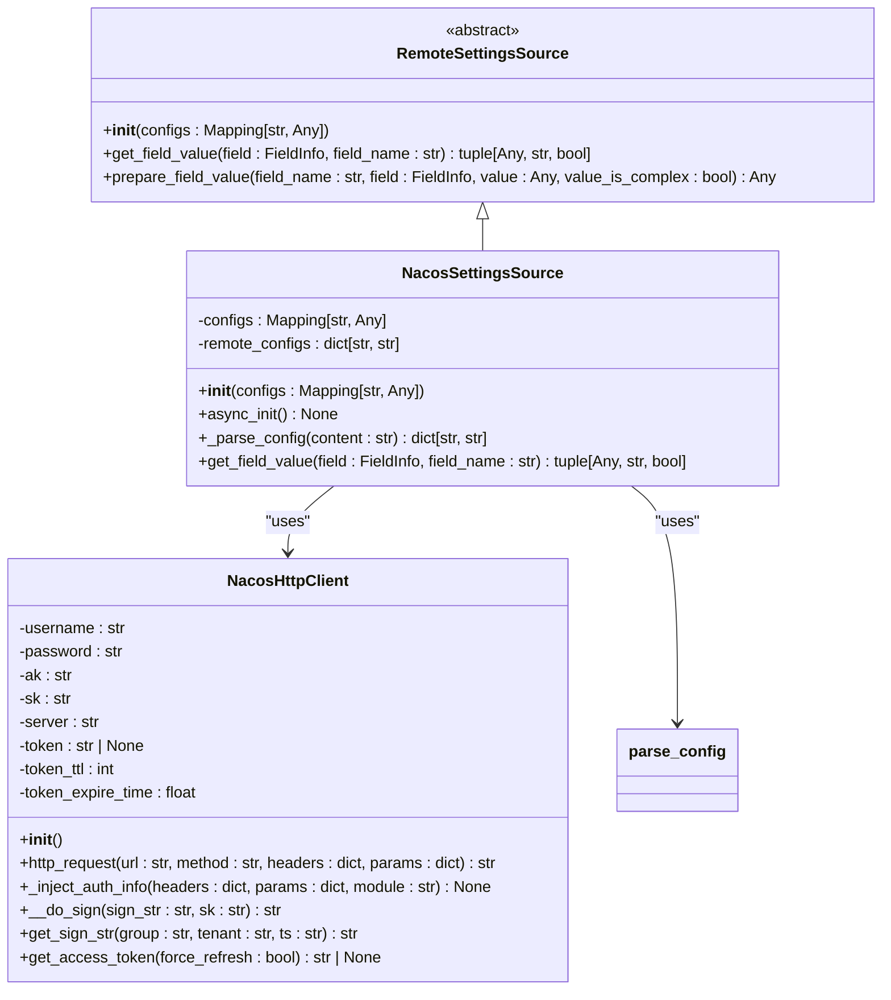
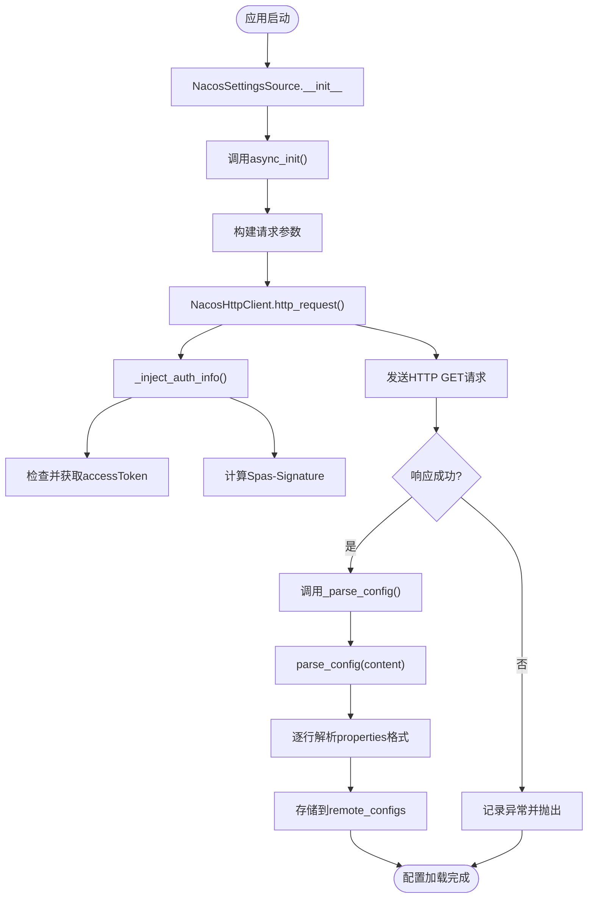
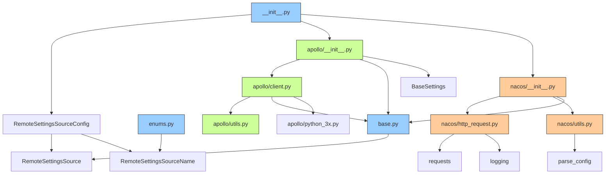

# 远程配置

<cite>
**本文档引用的文件**
- [base.py](file://api/configs/remote_settings_sources/base.py)
- [enums.py](file://api/configs/remote_settings_sources/enums.py)
- [__init__.py](file://api/configs/remote_settings_sources/__init__.py)
- [apollo/client.py](file://api/configs/remote_settings_sources/apollo/client.py)
- [apollo/utils.py](file://api/configs/remote_settings_sources/apollo/utils.py)
- [apollo/__init__.py](file://api/configs/remote_settings_sources/apollo/__init__.py)
- [nacos/http_request.py](file://api/configs/remote_settings_sources/nacos/http_request.py)
- [nacos/utils.py](file://api/configs/remote_settings_sources/nacos/utils.py)
- [nacos/__init__.py](file://api/configs/remote_settings_sources/nacos/__init__.py)
</cite>

## 目录
1. [简介](#简介)
2. [项目结构](#项目结构)
3. [核心组件](#核心组件)
4. [架构概述](#架构概述)
5. [详细组件分析](#详细组件分析)
6. [依赖分析](#依赖分析)
7. [性能考虑](#性能考虑)
8. [故障排除指南](#故障排除指南)
9. [结论](#结论)

## 简介
Dify远程配置系统支持通过Apollo和Nacos配置中心实现动态配置管理。该系统允许在不重启服务的情况下更新应用配置，提升系统的灵活性和可维护性。`remote_settings_sources`包是该功能的核心，提供了与主流配置中心集成的能力，支持配置拉取、监听变更、本地缓存等关键特性。

## 项目结构
`remote_settings_sources`模块位于`api/configs/remote_settings_sources`目录下，采用分层设计，分别实现了对Apollo和Nacos的支持，并通过统一的基类进行抽象。

```mermaid
graph TD
remote_settings_sources[remote_settings_sources] --> base[base.py]
remote_settings_sources --> enums[enums.py]
remote_settings_sources --> apollo[apollo/]
remote_settings_sources --> nacos[nacos/]
remote_settings_sources --> __init__[__init__.py]
apollo --> client[client.py]
apollo --> utils[utils.py]
apollo --> __init__[__init__.py]
nacos --> http_request[http_request.py]
nacos --> utils[utils.py]
nacos --> __init__[__init__.py]
base --> RemoteSettingsSource[RemoteSettingsSource]
enums --> RemoteSettingsSourceName[RemoteSettingsSourceName]
__init__ --> RemoteSettingsSourceConfig[RemoteSettingsSourceConfig]
class RemoteSettingsSource:::abstract
class RemoteSettingsSourceName:::enum
class RemoteSettingsSourceConfig:::config
style RemoteSettingsSource fill:#f9f,stroke:#333
style RemoteSettingsSourceName fill:#bbf,stroke:#333
style RemoteSettingsSourceConfig fill:#f96,stroke:#333
```

**图示来源**
- [base.py](file://api/configs/remote_settings_sources/base.py#L1-L15)
- [enums.py](file://api/configs/remote_settings_sources/enums.py#L1-L6)
- [__init__.py](file://api/configs/remote_settings_sources/__init__.py#L1-L15)

**本节来源**
- [api/configs/remote_settings_sources](file://api/configs/remote_settings_sources)

## 核心组件
`remote_settings_sources`包的核心组件包括抽象基类`RemoteSettingsSource`、枚举类型`RemoteSettingsSourceName`以及针对Apollo和Nacos的具体实现。系统通过`RemoteSettingsSourceConfig`配置类统一管理远程配置源的类型和参数，实现了配置源的可插拔设计。

**本节来源**
- [base.py](file://api/configs/remote_settings_sources/base.py#L1-L15)
- [enums.py](file://api/configs/remote_settings_sources/enums.py#L1-L6)
- [__init__.py](file://api/configs/remote_settings_sources/__init__.py#L1-L15)

## 架构概述
Dify远程配置系统采用适配器模式，通过统一的接口抽象不同配置中心的差异。系统启动时根据配置初始化对应的客户端（Apollo或Nacos），并建立长连接或轮询机制监听配置变更。所有远程配置在本地缓存，确保即使配置中心不可用，系统仍能正常运行。



**图示来源**
- [base.py](file://api/configs/remote_settings_sources/base.py#L1-L15)
- [apollo/__init__.py](file://api/configs/remote_settings_sources/apollo/__init__.py#L1-L55)
- [nacos/__init__.py](file://api/configs/remote_settings_sources/nacos/__init__.py#L1-L49)

## 详细组件分析

### Apollo配置源分析
Apollo配置源通过`ApolloSettingsSource`类实现，封装了Apollo客户端的初始化、配置拉取和变更监听功能。系统采用长轮询机制实现配置的实时更新，同时在本地维护缓存以提高访问性能。

#### 类结构分析


**图示来源**
- [base.py](file://api/configs/remote_settings_sources/base.py#L1-L15)
- [apollo/__init__.py](file://api/configs/remote_settings_sources/apollo/__init__.py#L1-L55)
- [apollo/client.py](file://api/configs/remote_settings_sources/apollo/client.py#L1-L306)

#### 配置拉取与监听流程


**图示来源**
- [apollo/client.py](file://api/configs/remote_settings_sources/apollo/client.py#L1-L306)
- [apollo/__init__.py](file://api/configs/remote_settings_sources/apollo/__init__.py#L1-L55)

**本节来源**
- [apollo/client.py](file://api/configs/remote_settings_sources/apollo/client.py#L1-L306)
- [apollo/utils.py](file://api/configs/remote_settings_sources/apollo/utils.py#L1-L52)
- [apollo/__init__.py](file://api/configs/remote_settings_sources/apollo/__init__.py#L1-L55)

### Nacos配置源分析
Nacos配置源通过`NacosSettingsSource`类实现，利用Nacos HTTP API进行配置的获取和监听。系统通过定时请求Nacos服务器获取最新配置，并在本地缓存解析后的键值对。

#### 类结构分析


**图示来源**
- [base.py](file://api/configs/remote_settings_sources/base.py#L1-L15)
- [nacos/__init__.py](file://api/configs/remote_settings_sources/nacos/__init__.py#L1-L49)
- [nacos/http_request.py](file://api/configs/remote_settings_sources/nacos/http_request.py#L1-L90)

#### 配置获取流程


**图示来源**
- [nacos/__init__.py](file://api/configs/remote_settings_sources/nacos/__init__.py#L1-L49)
- [nacos/http_request.py](file://api/configs/remote_settings_sources/nacos/http_request.py#L1-L90)
- [nacos/utils.py](file://api/configs/remote_settings_sources/nacos/utils.py#L1-L31)

**本节来源**
- [nacos/http_request.py](file://api/configs/remote_settings_sources/nacos/http_request.py#L1-L90)
- [nacos/utils.py](file://api/configs/remote_settings_sources/nacos/utils.py#L1-L31)
- [nacos/__init__.py](file://api/configs/remote_settings_sources/nacos/__init__.py#L1-L49)

## 依赖分析
远程配置系统各组件之间的依赖关系清晰，采用分层架构确保模块间的低耦合。



**图示来源**
- [base.py](file://api/configs/remote_settings_sources/base.py#L1-L15)
- [enums.py](file://api/configs/remote_settings_sources/enums.py#L1-L6)
- [__init__.py](file://api/configs/remote_settings_sources/__init__.py#L1-L15)
- [apollo/client.py](file://api/configs/remote_settings_sources/apollo/client.py#L1-L306)
- [apollo/utils.py](file://api/configs/remote_settings_sources/apollo/utils.py#L1-L52)
- [nacos/http_request.py](file://api/configs/remote_settings_sources/nacos/http_request.py#L1-L90)
- [nacos/utils.py](file://api/configs/remote_settings_sources/nacos/utils.py#L1-L31)

**本节来源**
- [api/configs/remote_settings_sources](file://api/configs/remote_settings_sources)

## 性能考虑
远程配置系统在设计时充分考虑了性能因素，通过多级缓存机制确保配置访问的高效性。系统首先检查内存缓存，若不存在则尝试从本地文件缓存读取，最后才发起网络请求。这种设计显著降低了对配置中心的依赖和网络开销。

对于Apollo集成，系统采用长轮询机制而非定时轮询，有效减少了无效的HTTP请求。当配置无变更时，服务器会保持连接直到超时（默认75秒），这大大降低了请求频率。同时，客户端实现了心跳机制，每10分钟发送一次心跳请求，确保客户端状态在服务端的活跃性。

Nacos集成虽然没有实现长轮询，但通过合理的缓存策略和异常重试机制，确保了配置获取的可靠性和性能。系统在启动时一次性加载所有配置到内存，并在应用生命周期内重复使用，避免了频繁的网络交互。

## 故障排除指南
当远程配置系统出现问题时，可按照以下步骤进行排查：

1. **检查环境变量**：确保Apollo或Nacos所需的环境变量已正确设置，如`APOLLO_CONFIG_URL`、`DIFY_ENV_NACOS_SERVER_ADDR`等。
2. **查看日志输出**：系统在`apollo/client.py`和`nacos/http_request.py`中使用了详细的日志记录，可通过日志定位具体错误。
3. **验证网络连接**：确认应用服务器能够访问配置中心的地址和端口。
4. **检查认证信息**：对于需要认证的配置中心，确保用户名、密码或AK/SK正确无误。
5. **验证配置格式**：Nacos配置需为properties格式，确保配置内容符合规范。
6. **检查本地缓存**：查看`~/.dify/config/remote-settings/apollo/cache/`目录下的缓存文件，确认本地缓存是否正常生成。

**本节来源**
- [apollo/client.py](file://api/configs/remote_settings_sources/apollo/client.py#L1-L306)
- [nacos/http_request.py](file://api/configs/remote_settings_sources/nacos/http_request.py#L1-L90)
- [apollo/utils.py](file://api/configs/remote_settings_sources/apollo/utils.py#L1-L52)

## 结论
Dify远程配置系统通过精心设计的架构，实现了与Apollo和Nacos配置中心的无缝集成。系统采用适配器模式，提供了统一的接口抽象，使得配置源的切换变得简单可靠。通过本地缓存、长轮询、心跳机制等技术手段，确保了配置管理的高可用性和实时性。该系统不仅提升了Dify的可维护性，也为多环境配置管理提供了坚实的基础。