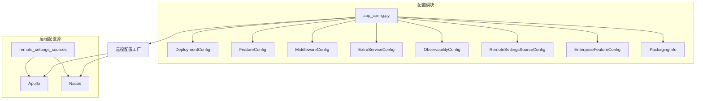
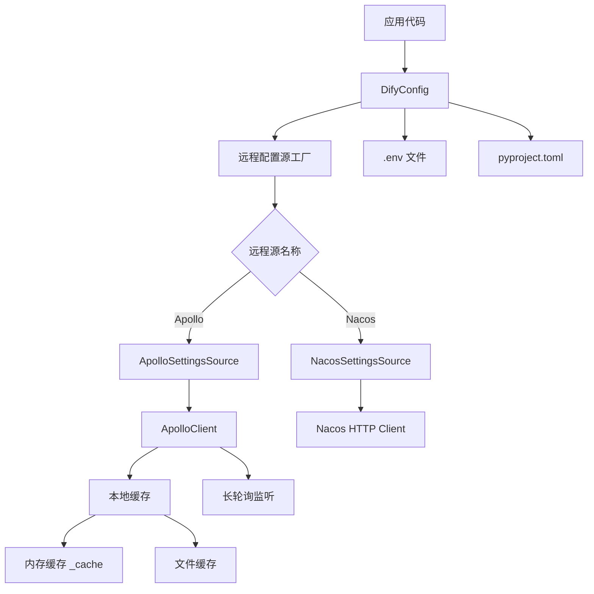
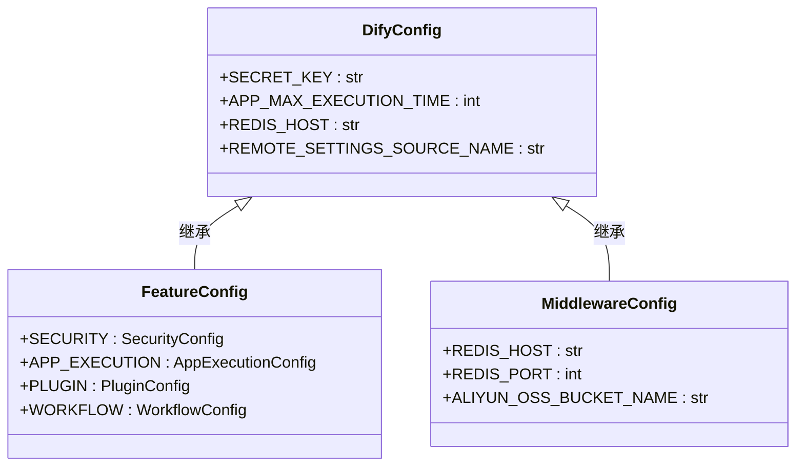
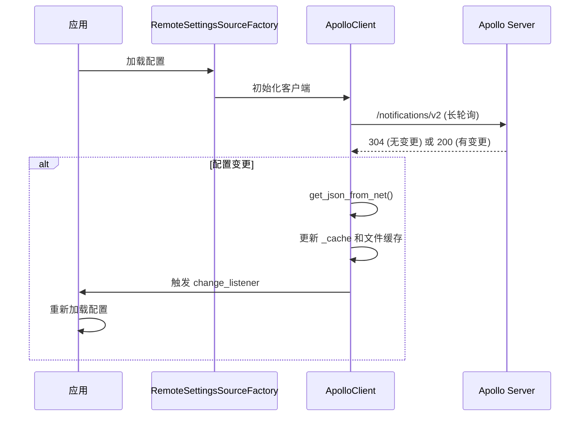
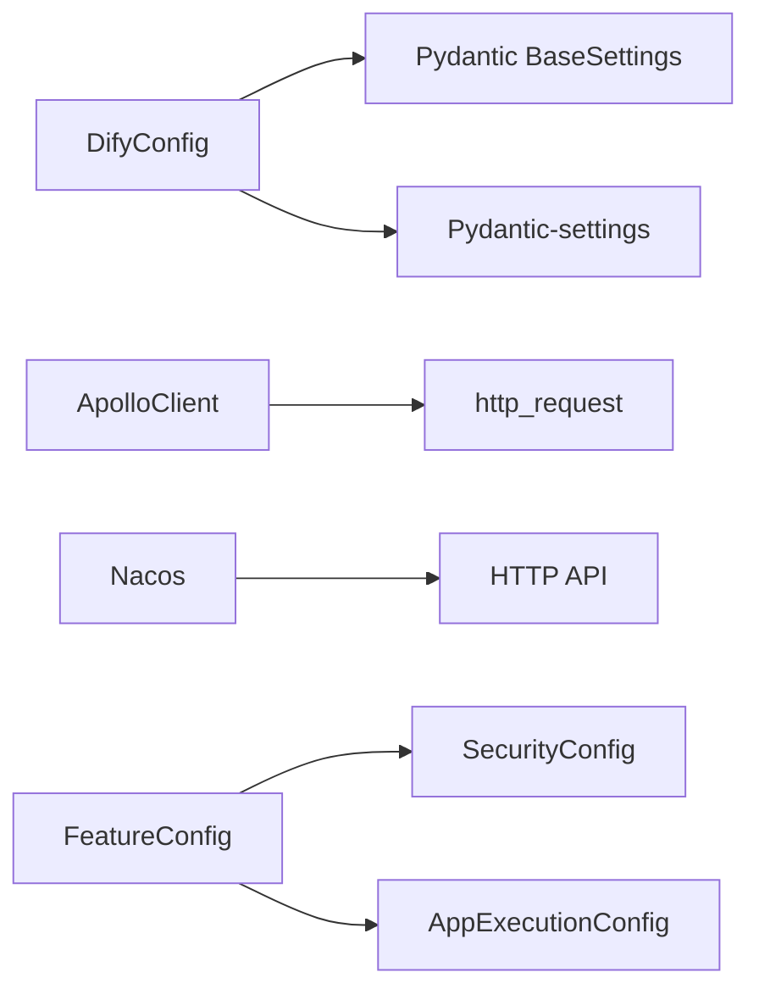

# 配置管理

<cite>
**本文档中引用的文件**  
- [app_config.py](file://api/configs/app_config.py)
- [remote_settings_sources/base.py](file://api/configs/remote_settings_sources/base.py)
- [remote_settings_sources/enums.py](file://api/configs/remote_settings_sources/enums.py)
- [remote_settings_sources/__init__.py](file://api/configs/remote_settings_sources/__init__.py)
- [remote_settings_sources/apollo/client.py](file://api/configs/remote_settings_sources/apollo/client.py)
- [remote_settings_sources/nacos/utils.py](file://api/configs/remote_settings_sources/nacos/utils.py)
- [feature/__init__.py](file://api/configs/feature/__init__.py)
- [middleware/cache/redis_config.py](file://api/configs/middleware/cache/redis_config.py)
- [middleware/storage/aliyun_oss_storage_config.py](file://api/configs/middleware/storage/aliyun_oss_storage_config.py)
</cite>

## 目录
1. [简介](#简介)
2. [项目结构](#项目结构)
3. [核心组件](#核心组件)
4. [架构概述](#架构概述)
5. [详细组件分析](#详细组件分析)
6. [依赖分析](#依赖分析)
7. [性能考虑](#性能考虑)
8. [故障排除指南](#故障排除指南)
9. [结论](#结论)

## 简介
Dify 配置管理系统提供了一套完整的静态与动态配置管理机制，支持基于 Python 模块的配置组织方式、环境特定配置、功能开关管理以及远程配置源（如 Apollo、Nacos）的集成。系统通过分层配置加载策略和缓存机制确保高性能访问，并实现了敏感配置的安全存储与访问控制。本文档详细说明其设计原理、实现机制及最佳实践。

## 项目结构
Dify 的配置系统采用模块化设计，位于 `api/configs` 目录下，按功能划分多个子模块：

- `deploy`: 部署相关配置
- `enterprise`: 企业版功能配置
- `extra`: 第三方服务扩展配置（如 Sentry、Notion）
- `feature`: 核心功能开关与参数配置
- `middleware`: 中间件配置（缓存、存储、向量数据库等）
- `observability`: 可观测性配置（如 OpenTelemetry）
- `packaging`: 打包信息
- `remote_settings_sources`: 远程配置源集成（Apollo、Nacos）
- `app_config.py`: 主配置类定义与加载逻辑

该结构支持配置的逻辑分离与按需加载，便于维护和扩展。



**图示来源**  
- [app_config.py](file://api/configs/app_config.py#L1-L113)
- [remote_settings_sources/__init__.py](file://api/configs/remote_settings_sources/__init__.py#L1-L15)

**本节来源**  
- [api/configs](file://api/configs)

## 核心组件
Dify 配置系统的核心是 `DifyConfig` 类，它通过继承多个配置模块（如 `FeatureConfig`, `MiddlewareConfig`）实现配置的聚合。配置加载遵循优先级顺序：初始化设置 → 环境变量 → 远程配置源 → `.env` 文件 → TOML 文件。远程配置源通过 `RemoteSettingsSourceFactory` 动态注入，支持运行时热更新。

**本节来源**  
- [app_config.py](file://api/configs/app_config.py#L25-L100)
- [feature/__init__.py](file://api/configs/feature/__init__.py#L1-L100)

## 架构概述
Dify 配置系统采用分层架构，结合本地与远程配置源，实现灵活、安全、高性能的配置管理。



**图示来源**  
- [app_config.py](file://api/configs/app_config.py#L1-L113)
- [remote_settings_sources/base.py](file://api/configs/remote_settings_sources/base.py#L1-L15)
- [remote_settings_sources/apollo/client.py](file://api/configs/remote_settings_sources/apollo/client.py#L1-L306)

## 详细组件分析

### 静态与动态配置管理
Dify 将配置分为静态（如数据库连接、中间件配置）和动态（如功能开关、限流参数）。静态配置通常在启动时加载，而动态配置可通过远程源实时更新。

#### 配置组织方式
基于 Python 模块的配置组织通过继承实现。例如，`FeatureConfig` 定义了所有功能相关的配置项，`DifyConfig` 通过多重继承将其纳入主配置类。



**图示来源**  
- [app_config.py](file://api/configs/app_config.py#L25-L100)
- [feature/__init__.py](file://api/configs/feature/__init__.py#L1-L100)
- [middleware/cache/redis_config.py](file://api/configs/middleware/cache/redis_config.py#L1-L115)

### 远程配置源集成
Dify 支持 Apollo 和 Nacos 作为远程配置源，实现配置的实时更新而无需重启服务。

#### Apollo 集成原理
Apollo 集成通过 `ApolloClient` 实现长轮询（Long Polling）机制。客户端启动时会启动一个后台线程 `_listener`，周期性地向 Apollo 服务器发起 `/notifications/v2` 请求。若配置无变化，服务器保持连接直到超时（75秒），实现“伪实时”通知。一旦检测到变更，客户端立即拉取新配置，更新内存和本地缓存，并通过 `change_listener` 回调通知应用。



**图示来源**  
- [app_config.py](file://api/configs/app_config.py#L1-L113)
- [remote_settings_sources/apollo/client.py](file://api/configs/remote_settings_sources/apollo/client.py#L1-L306)

#### Nacos 集成原理
Nacos 集成通过 HTTP API 获取配置。`parse_config` 函数负责解析 Nacos 返回的文本格式配置（如 properties 或 yaml），将其转换为字典结构。虽然当前代码未展示完整的长轮询逻辑，但其设计模式与 Apollo 类似，通过定期轮询或监听机制实现配置同步。

```mermaid
flowchart TD
A[启动 Nacos 客户端] --> B[定时请求 /nacos/v1/cs/configs]
B --> C{响应内容变更?}
C --> |是| D[解析新配置 parse_config()]
C --> |否| E[等待下次轮询]
D --> F[更新本地缓存]
F --> G[通知应用重新加载]
```

**图示来源**  
- [remote_settings_sources/nacos/utils.py](file://api/configs/remote_settings_sources/nacos/utils.py#L1-L31)
- [remote_settings_sources/enums.py](file://api/configs/remote_settings_sources/enums.py#L1-L6)

### 配置缓存策略与失效机制
Dify 实现了多级缓存策略以确保高性能访问：
1. **内存缓存**：`ApolloClient._cache` 字典存储当前配置，读取时优先访问。
2. **文件缓存**：配置持久化到 `~/.dify/config/remote-settings/apollo/cache/` 目录，服务重启后可快速恢复。
3. **失效机制**：通过 MD5 哈希值比对检测配置变化，仅当内容真正变更时才更新文件缓存。长轮询机制确保变更在秒级内被感知。

**本节来源**  
- [remote_settings_sources/apollo/client.py](file://api/configs/remote_settings_sources/apollo/client.py#L1-L306)

### 敏感配置的安全存储与访问控制
敏感配置（如 API 密钥、数据库密码）通过以下方式保障安全：
- **环境变量注入**：推荐通过 `.env` 文件或环境变量传入，避免硬编码。
- **字段默认值为空**：如 `SECRET_KEY`、`SMTP_PASSWORD` 等字段默认为空字符串或 `None`，强制用户自行配置。
- **传输安全**：与远程配置源（Apollo/Nacos）通信时支持 SSL 和签名认证（如 Apollo 的 `Authorization` 头）。

**本节来源**  
- [feature/__init__.py](file://api/configs/feature/__init__.py#L1-L100)
- [remote_settings_sources/apollo/client.py](file://api/configs/remote_settings_sources/apollo/client.py#L1-L306)

## 依赖分析
Dify 配置系统依赖于 Pydantic 和 Pydantic-settings 库进行配置模型定义和验证。远程配置源依赖 HTTP 客户端进行通信。各配置模块之间低耦合，通过主配置类聚合。



**图示来源**  
- [app_config.py](file://api/configs/app_config.py#L1-L113)
- [remote_settings_sources/base.py](file://api/configs/remote_settings_sources/base.py#L1-L15)

**本节来源**  
- [app_config.py](file://api/configs/app_config.py#L1-L113)
- [remote_settings_sources/base.py](file://api/configs/remote_settings_sources/base.py#L1-L15)

## 性能考虑
- **缓存优先**：配置读取优先从内存缓存获取，避免频繁网络或文件 I/O。
- **长轮询优化**：Apollo 的长轮询机制在保持连接的同时，将轮询间隔从传统短轮询的几秒延长至75秒，大幅减少无效请求。
- **懒加载**：部分配置（如 `get_value`）采用按需加载，减少启动时的初始化开销。

## 故障排除指南
- **配置未生效**：检查 `REMOTE_SETTINGS_SOURCE_NAME` 环境变量是否正确设置，确认远程服务可达。
- **缓存问题**：删除 `~/.dify/config/remote-settings/apollo/cache/` 目录下的缓存文件，强制重新拉取。
- **连接失败**：验证 `config_url`、`app_id`、`cluster` 等连接参数，检查网络和防火墙设置。
- **权限错误**：确保 Apollo/Nacos 的 `secret` 或 API Key 配置正确。

**本节来源**  
- [remote_settings_sources/apollo/client.py](file://api/configs/remote_settings_sources/apollo/client.py#L1-L306)
- [remote_settings_sources/nacos/utils.py](file://api/configs/remote_settings_sources/nacos/utils.py#L1-L31)

## 结论
Dify 的配置管理系统设计精良，通过模块化组织、远程热更新、多级缓存和安全机制，为应用提供了灵活、可靠、高性能的配置管理能力。开发者应充分利用其特性，遵循最佳实践，确保配置的安全性与可维护性。