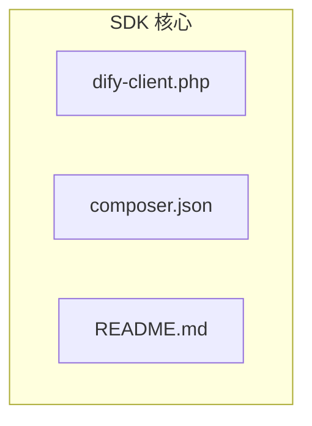
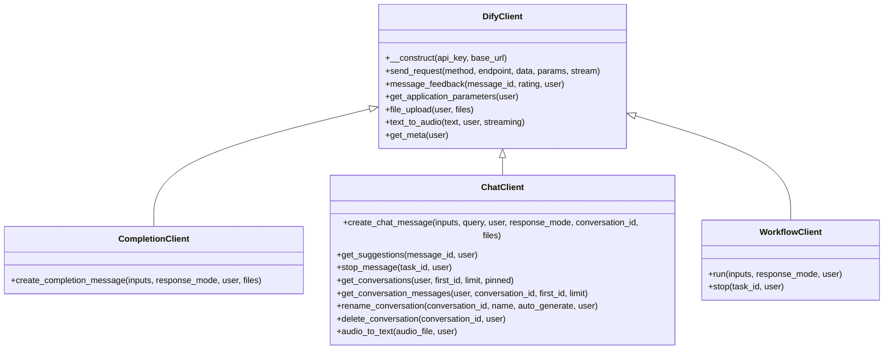
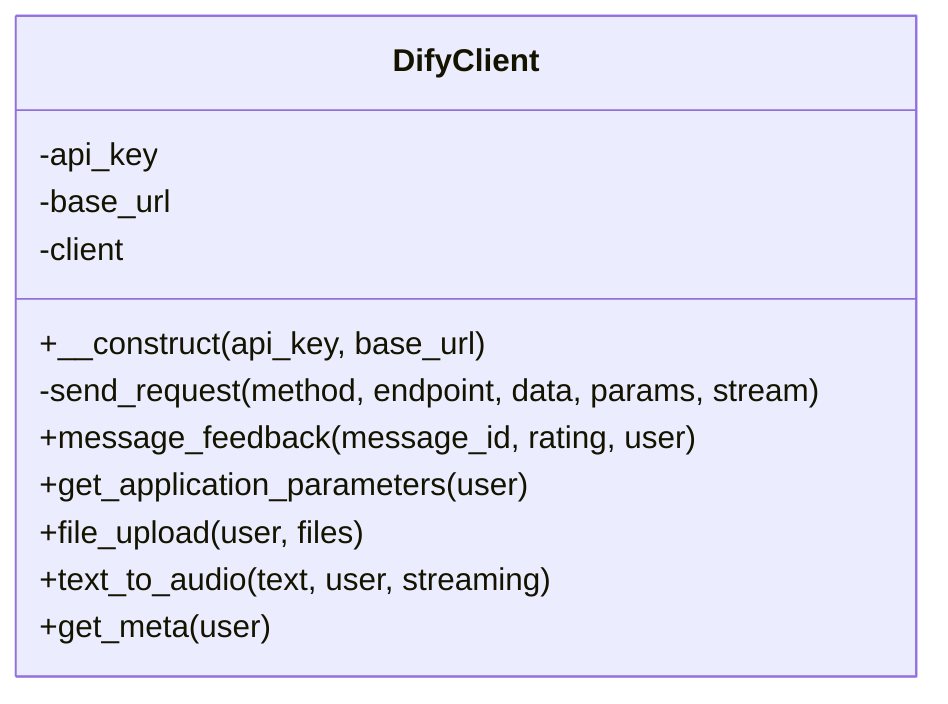
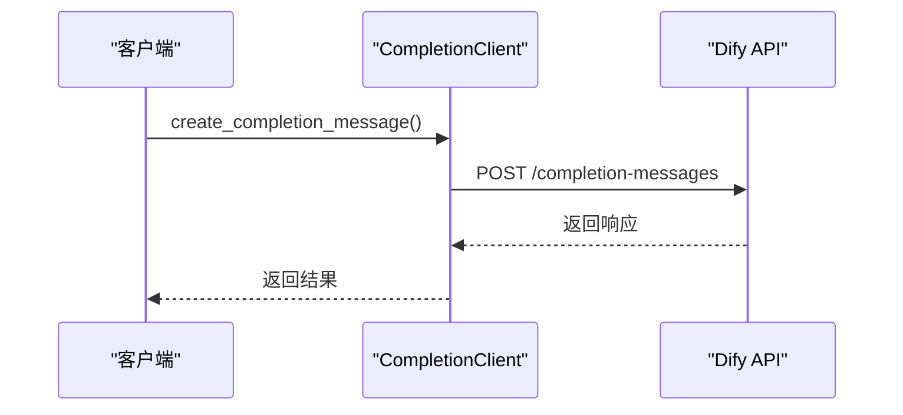
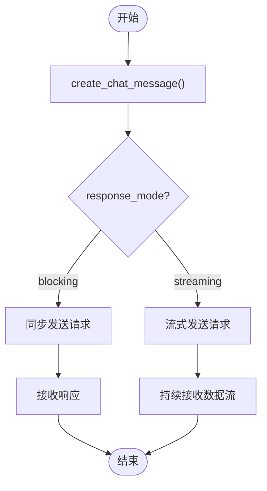
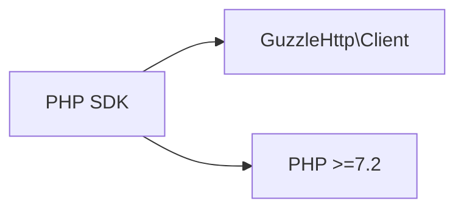

# PHP SDK

<cite>
**本文档中引用的文件**
- [dify-client.php](file://sdks/php-client/dify-client.php)
- [composer.json](file://sdks/php-client/composer.json)
- [README.md](file://sdks/php-client/README.md)
</cite>

## 目录
1. [简介](#简介)
2. [项目结构](#项目结构)
3. [核心组件](#核心组件)
4. [架构概述](#架构概述)
5. [详细组件分析](#详细组件分析)
6. [依赖分析](#依赖分析)
7. [性能考虑](#性能考虑)
8. [故障排除指南](#故障排除指南)
9. [结论](#结论)

## 简介
Dify PHP SDK 是一个用于集成 Dify API 的工具，使开发者能够轻松地在 PHP 项目中调用 Dify 的各项功能。该 SDK 提供了简洁的接口来实现用户认证、应用调用、消息发送和结果解析等核心功能。通过 Composer 安装依赖后，开发者可以快速实例化 DifyClient 并配置 API 密钥与基础连接参数。此外，SDK 支持 Laravel 和 Symfony 框架的服务容器集成，并提供门面模式建议，同时涵盖 HTTP 客户端配置、响应数据解析、错误码处理机制和会话管理策略的最佳实践。

## 项目结构
PHP SDK 的项目结构位于 `sdks/php-client` 目录下，包含三个主要文件：`dify-client.php`（核心类文件）、`composer.json`（依赖管理配置）和 `README.md`（使用说明文档）。整个 SDK 设计简洁，专注于提供对 Dify API 的封装，便于开发者快速集成到现有项目中。

**Diagram sources**
- [dify-client.php](file://sdks/php-client/dify-client.php#L1-L207)
- [composer.json](file://sdks/php-client/composer.json#L1-L10)
- [README.md](file://sdks/php-client/README.md#L1-L96)

**Section sources**
- [dify-client.php](file://sdks/php-client/dify-client.php#L1-L207)
- [composer.json](file://sdks/php-client/composer.json#L1-L10)
- [README.md](file://sdks/php-client/README.md#L1-L96)

## 核心组件
Dify PHP SDK 的核心组件包括 `DifyClient` 基类及其派生类 `CompletionClient`、`ChatClient` 和 `WorkflowClient`。这些类分别封装了不同类型的 API 调用逻辑，如完成消息生成、聊天交互和工作流执行。`DifyClient` 负责初始化 HTTP 客户端并处理通用请求，而子类则针对特定场景扩展功能。

**Section sources**
- [dify-client.php](file://sdks/php-client/dify-client.php#L1-L207)

## 架构概述
SDK 的架构基于面向对象设计，采用继承机制实现功能分离。`DifyClient` 作为基类，封装了 API 密钥认证、HTTP 请求发送等通用逻辑；`CompletionClient`、`ChatClient` 和 `WorkflowClient` 继承自 `DifyClient`，各自实现特定业务场景下的方法调用。所有请求均通过 Guzzle HTTP 客户端发送，确保高效稳定的网络通信。

**Diagram sources**
- [dify-client.php](file://sdks/php-client/dify-client.php#L1-L207)

## 详细组件分析

### DifyClient 分析
`DifyClient` 是 SDK 的基础类，负责初始化 API 客户端并处理所有 HTTP 请求。它使用 Guzzle 库作为底层 HTTP 客户端，自动添加认证头信息（Bearer Token），并支持 JSON 和 multipart 表单数据的发送。

#### 类图

**Diagram sources**
- [dify-client.php](file://sdks/php-client/dify-client.php#L1-L207)

### CompletionClient 分析
`CompletionClient` 用于调用 Dify 的补全接口，支持阻塞式和流式响应模式。通过 `create_completion_message` 方法，开发者可以提交输入参数并获取模型生成的结果。

#### 序列图

**Diagram sources**
- [dify-client.php](file://sdks/php-client/dify-client.php#L1-L207)

### ChatClient 分析
`ChatClient` 提供了完整的聊天功能支持，包括创建会话、获取历史消息、重命名和删除会话等操作。它还支持上传文件进行视觉理解任务。

#### 流程图

**Diagram sources**
- [dify-client.php](file://sdks/php-client/dify-client.php#L1-L207)

## 依赖分析
SDK 的依赖关系清晰明了，主要依赖 Guzzle HTTP 客户端库（版本 ^7.9）和 PHP 7.2+ 环境。`composer.json` 文件中定义了自动加载规则，确保 `dify-client.php` 可以被正确引入。

**Diagram sources**
- [composer.json](file://sdks/php-client/composer.json#L1-L10)

**Section sources**
- [composer.json](file://sdks/php-client/composer.json#L1-L10)

## 性能考虑
SDK 使用 Guzzle 作为 HTTP 客户端，具备连接池、异步请求等高性能特性。对于大文件上传或流式响应场景，建议启用流式传输以减少内存占用。同时，合理设置超时时间和重试机制有助于提升稳定性。

## 故障排除指南
当遇到 API 调用失败时，应首先检查 API 密钥是否正确、网络连接是否正常。若返回错误码，可根据 Dify API 文档中的错误码说明进行排查。对于文件上传问题，需确认文件路径和权限设置正确。

**Section sources**
- [dify-client.php](file://sdks/php-client/dify-client.php#L1-L207)
- [README.md](file://sdks/php-client/README.md#L1-L96)

## 结论
Dify PHP SDK 提供了一套完整且易于使用的接口，帮助开发者快速集成 Dify 的 AI 功能。通过合理的类设计和依赖管理，SDK 在保持轻量的同时实现了丰富的功能覆盖。结合 Laravel 或 Symfony 框架使用时，可通过服务容器进一步优化集成体验。